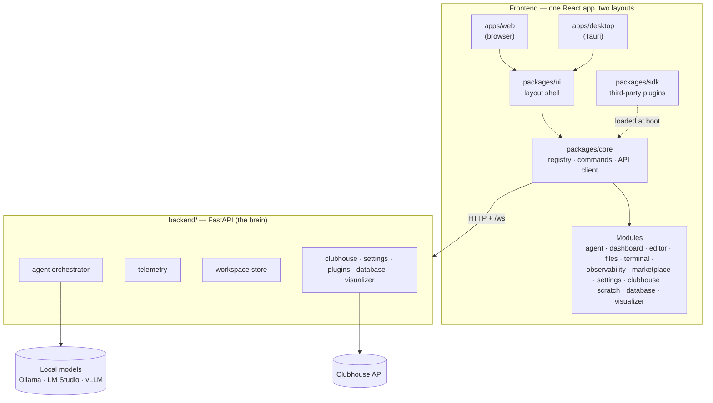

# horrible-dashboard documentation

A unified one-stop app for everything — "emacs for the agentic era". One web UI
serves two layouts: a browser app and a cross-platform desktop app (a Tauri shell
wrapping the same frontend).

These pages are the contract between the code and anyone (human or agent) working
on it — they describe the codebase as it is, not as it once was.

## The big picture

## Contents

**Getting started**

- [Setup & running](setup.mdx) — prerequisites, install, and how to bring up the
  browser and desktop layouts; mirrors the `package.json` scripts.

**Architecture**

- [Layout shell](architecture/layout-shell.mdx) — the shared frontend layout
  (workspace, panels, command palette) and how the browser and desktop (Tauri)
  versions differ.
- [Windowing](architecture/windowing.mdx) — the dockable workspace: how views
  (panels and widgets) open as tabbed/split/floating panes, views vs pane
  instances, and layout persistence.
- [Plugin SDK](architecture/plugin-sdk.mdx) — the public **frontend** plugin
  contract (`@horribledashboard/sdk`): package format, authoring guide, runtime
  shims, versioning, trust model, catalog/install lifecycle.
- [Backend plugin SDK](architecture/backend-plugin-sdk.mdx) — its **server-side**
  counterpart (`backend.sdk`): plugins contribute HTTP routes, agent tools, `/ws`
  channels, lifespan hooks, and `dash` facades; discovered from bundled dirs,
  `HORRIBLE_PLUGINS_DIR`, and pip entry points.
- [Python SDK (`dash`)](architecture/python-sdk.mdx) — the in-REPL handle for
  scripting the running app (panes, workspaces, layout, I/O telemetry, settings).
- [Agent tools & permissions](architecture/agent-tools.mdx) — the generalized
  agent tool surface (`agentTools`, agent-exposed commands, pull-based
  `getAgentContext()`), the capability-manifest protocol, and the Claude
  Code–style permission system that gates side effects. (Implemented; the editor,
  file explorer, and terminal modules are layered onto it.)
- [Agent ⇄ editor trajectories](architecture/agent-editor-trajectories.mdx) —
  sequence diagrams of how the agent reaches the editor's language intelligence:
  the thread-based LSP transport (the Windows `--reload` spawn fix), agent-driven
  rename/diagnostics, LSP-grounded ghost text, workspace-relative file paths,
  stale-buffer resolution, and the tool-calling reliability work (temperature,
  forced retry) with the measured A/B results.
- [Future pane types (ideas)](architecture/future-pane-types.mdx) — **brainstorm,
  not committed.** Parked ideas for new view/pane/window kinds (companion, ambient,
  ephemeral, PiP, portal…) and where each would hook into the windowing seams.
- [Distributed peer fabric](architecture/distributed.mdx) — how nodes connect to
  other users' nodes over TCP/IP: Ed25519 node identity, the signed `PeerEnvelope`
  wire protocol + handshake, the hybrid transport abstraction (direct, relay, LAN),
  trust modes, and the process-global `PeerHub` vs the per-browser `/ws`.
- [Network protocol & scenarios](architecture/network-protocol.mdx) — mermaid
  sequence diagrams of the websocket protocols across situations (one user/two tabs,
  two users direct, via a relay intermediary, collaborative panes, agent-to-agent,
  peer chat) and the proposed **lobby** (P2P + intermediary + discovery) design.
- [Game server hosting](architecture/game-server-hosting.mdx) — deploying the central
  game server as a hosted service: the always-on/single-instance/persistent-disk
  constraints, config + secrets, the **Fly.io** path (root `fly.toml` +
  `deploy/game-server/Dockerfile`), and a
  comparison of hosting options (VPS + Caddy, Render/Railway) with a scaling path.
- [Agent commons (design)](architecture/agent-commons.mdx) — **proposed, not
  implemented.** A public square for nodes that don't already know each other to
  discover, meet, and collaborate safely: signed profiles, vector matchmaking, a
  two-sided consent + progressive-trust ladder, and reputation — built on the lobby,
  Ed25519 identity, and read-only agent-to-agent gating. Includes a BitTorrent-style
  hybrid discovery plan (DHT/gossip + bootstrap/relay) that demotes any single server
  from a SPOF to one node among many, an interop analysis (A2A/MCP/AP2/A2UI — adopt
  A2A Agent Cards + tasks over the peer wire; the fabric is the layer no standard
  covers), and a phased v1 implementation plan.

**Modules** — one page per feature module, each describing how it plugs into the
layout shell and how it behaves in the browser vs the desktop app:

- [Agent chat](modules/agent-chat.mdx)
- [Dashboard](modules/dashboard.mdx)
- [Observability](modules/observability.mdx)
- [Marketplace](modules/marketplace.mdx)
- [Settings](modules/settings.mdx)
- [Clubhouse](modules/clubhouse.mdx)
- [Scratch](modules/scratch.mdx)
- [Editor](modules/editor.mdx)
- [Terminal](modules/terminal.mdx)
- [File explorer](modules/file-explorer.mdx)
- [Database](modules/database.mdx)
- [Library](modules/library.mdx) — **Web + notes slice implemented.** Ingest blog
  URLs and notes into the vector store as sources + chunks, watch them ingest live,
  and semantic-search them for RAG.
- [Visualizer](modules/visualizer.mdx)
- [Flow canvas](modules/flow-canvas.mdx) — **Phase 0/1 implemented.** A node-graph
  canvas (n8n-style) for composing runnable multi-agent orchestrations over the
  existing orchestrator loop, tool surface, and permission gate.
- [Network](modules/network.mdx)
- [Commons](modules/commons.mdx) — **Phase 4 implemented.** The agent commons: browse and
  search strangers' public, signed profiles (vector matchmaking), meet via a two-sided
  consent handshake, and a reputation floor (blocklist, signed vouches, reports, trust
  tiers) with a profile editor and requests inbox.

## Sync policy (enforced)

Docs live next to the code on purpose, and changes that affect them must update
them **in the same change**:

- New module → new `docs/modules/<name>.mdx` page following the existing template
  (purpose, panels/commands contributed, backend surface, browser vs desktop
  behavior).
- New panel, command, capability, or backend route on an existing module → update
  that module's page.
- Changes to the workspace/docking system, command palette, keybindings, platform
  capability service, or either app entry → update
  `docs/architecture/layout-shell.mdx`.
- Renaming or removing any of the above → same rule, including deleting docs for
  removed features.
- Adding, renaming, or changing a script in the repo-root `package.json` (or the
  backend run/test commands) → update [`docs/setup.mdx`](setup.mdx).

A Stop hook (`.claude/hooks/docs_check.py`) flags any change set that touches
`apps/`, `packages/`, `backend/`, or `package.json` without touching `docs/`, as a
safety net. Pure refactors with no behavioral or interface change don't need doc
edits — say so when the hook asks.

## This documentation site

These pages render as a [Docusaurus](https://docusaurus.io) site whose source of
truth is this `docs/` directory — the site config lives in `website/` and reads
`../docs` directly, so editing a page here is editing the site. Diagrams use
[Mermaid](https://mermaid.js.org) fenced code blocks.

- `pnpm --filter @horrible/docs start` — local dev server with live reload.
- `pnpm --filter @horrible/docs build` — production build (run before pushing to
  catch broken links and MDX errors).
- Pushing to `main` deploys to GitHub Pages via
  `.github/workflows/docs.yml`.

## Status

The monorepo (apps/web, apps/desktop, packages/core, packages/ui, backend/) is
scaffolded and verified. Implemented modules: **dashboard**, **agent**,
**observability**, **clubhouse**, **marketplace**, **settings**, **editor**
(note/file buffers + recent-notes widget), **file explorer**, **terminal**
(PTY), **database** (psql-like inspector + SQLite vector store), **visualizer**
(HTML5 Canvas, Three.js, Babylon.js scripts, and headless Pygame subprocess frame streaming), and **network** (the distributed peer fabric — node identity, hybrid direct/relay/LAN transports, agent-to-agent, and collaborative shared panes). The **agent tool & permission surface**
([agent-tools.mdx](architecture/agent-tools.mdx)) is in place and the editor,
files, and terminal modules are layered onto it (read tools + gated side-effecting
tools behind the Claude Code–style permission engine). The **flow canvas**
([flow-canvas.mdx](modules/flow-canvas.mdx)) ships its Phase-0/1 spine: an
n8n-style canvas whose Agent nodes reuse the shared orchestrator loop, runnable end
to end (Phase 2+ — Tool/Router nodes, run history — is design).

What still needs doing:

- **Editor:** desktop-only `osfile:` source (arbitrary OS files via Tauri native
  dialogs) — designed in [editor.mdx](modules/editor.mdx), not yet implemented.
- **File explorer:** live `files.*` WS watch events (clients currently re-list to
  refresh) — see [file-explorer.mdx](modules/file-explorer.mdx).
- **Full chat cockpit:** the agent's conversational workspace view beyond the
  `home` ask bar — still design.
- An experimental **Electron shell** lives on the `electron-shell` branch
  (`docs/architecture/electron-shell.md` there).

Each module page carries its own phase markers (e.g. editor C1–C5, files B3/B4,
terminal D2/D3) — those are the source of truth for per-module progress.
