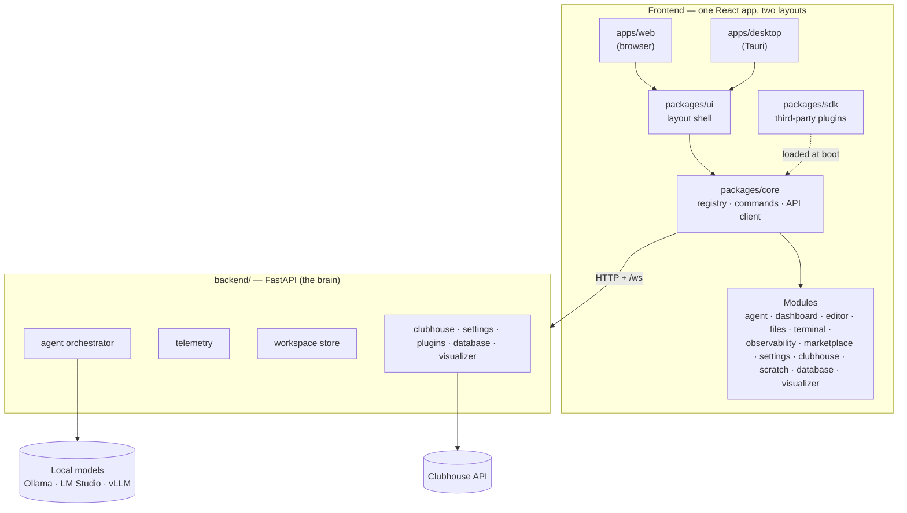

# horrible-dashboard documentation

A unified one-stop app for everything — "emacs for the agentic era". One web UI
serves two layouts: a browser app and a cross-platform desktop app (a Tauri shell
wrapping the same frontend).

These pages are the contract between the code and anyone (human or agent) working
on it — they describe the codebase as it is, not as it once was.

## The big picture

## Contents

**Getting started**

- [Setup & running](setup.mdx) — prerequisites, install, and how to bring up the
  browser and desktop layouts; mirrors the `package.json` scripts.

**Architecture**

- [Layout shell](architecture/layout-shell.mdx) — the shared frontend layout
  (workspace, panels, command palette) and how the browser and desktop (Tauri)
  versions differ.
- [Windowing](architecture/windowing.mdx) — the dockable workspace: how views
  (panels and widgets) open as tabbed/split/floating panes, views vs pane
  instances, and layout persistence.
- [Keybindings](architecture/keybindings.mdx) — the keyboard authority: key specs,
  `when` conditions, precedence, which pane has focus, **input capture** (a game
  or terminal taking the keyboard and giving it back), the Escape ladder, and the
  chords the browser/OS steal before we see them.
- [Context menus](architecture/context-menus.mdx) — one right-click menu assembled
  per target from module-declared providers, plus the measure-then-place layer that
  keeps it on screen at a window edge (it replaces four hand-rolled menus, two of
  which positioned themselves against hardcoded guesses at their own size).
- [Plugin SDK](architecture/plugin-sdk.mdx) — the public **frontend** plugin
  contract (`@horribledashboard/sdk`): package format, authoring guide, runtime
  shims, versioning, trust model, catalog/install lifecycle.
- [Backend plugin SDK](architecture/backend-plugin-sdk.mdx) — its **server-side**
  counterpart (`backend.sdk`): plugins contribute HTTP routes, agent tools, `/ws`
  channels, lifespan hooks, and `dash` facades; discovered from bundled dirs,
  `HORRIBLE_PLUGINS_DIR`, and pip entry points.
- [Python SDK (`dash`)](architecture/python-sdk.mdx) — the in-REPL handle for
  scripting the running app (panes, workspaces, layout, I/O telemetry, settings).
- [Agent tools & permissions](architecture/agent-tools.mdx) — the generalized
  agent tool surface (`agentTools`, agent-exposed commands, pull-based
  `getAgentContext()`), the capability-manifest protocol, and the Claude
  Code–style permission system that gates side effects. (Implemented; the editor,
  file explorer, and terminal modules are layered onto it.)
- [Agent ⇄ editor trajectories](architecture/agent-editor-trajectories.mdx) —
  sequence diagrams of how the agent reaches the editor's language intelligence:
  the thread-based LSP transport (the Windows `--reload` spawn fix), agent-driven
  rename/diagnostics, LSP-grounded ghost text, workspace-relative file paths,
  stale-buffer resolution, and the tool-calling reliability work (temperature,
  forced retry) with the measured A/B results.
- [Future pane types (ideas)](architecture/future-pane-types.mdx) — **brainstorm,
  not committed.** Parked ideas for new view/pane/window kinds (companion, ambient,
  ephemeral, PiP, portal…) and where each would hook into the windowing seams.
- [Distributed peer fabric](architecture/distributed.mdx) — how nodes connect to
  other users' nodes over TCP/IP: Ed25519 node identity, the signed `PeerEnvelope`
  wire protocol + handshake, the hybrid transport abstraction (direct, relay, LAN),
  trust modes, and the process-global `PeerHub` vs the per-browser `/ws`.
- [Network protocol & scenarios](architecture/network-protocol.mdx) — mermaid
  sequence diagrams of the websocket protocols across situations (one user/two tabs,
  two users direct, via a relay intermediary, collaborative panes, agent-to-agent,
  peer chat) and the proposed **lobby** (P2P + intermediary + discovery) design.
- [Game server hosting](architecture/game-server-hosting.mdx) — deploying the central
  game server as a hosted service: the always-on/single-instance/persistent-disk
  constraints, config + secrets, the **Fly.io** path (root `fly.toml` +
  `deploy/game-server/Dockerfile`), and a
  comparison of hosting options (VPS + Caddy, Render/Railway) with a scaling path.
- [Agent commons (design)](architecture/agent-commons.mdx) — **proposed, not
  implemented.** A public square for nodes that don't already know each other to
  discover, meet, and collaborate safely: signed profiles, vector matchmaking, a
  two-sided consent + progressive-trust ladder, and reputation — built on the lobby,
  Ed25519 identity, and read-only agent-to-agent gating. Includes a BitTorrent-style
  hybrid discovery plan (DHT/gossip + bootstrap/relay) that demotes any single server
  from a SPOF to one node among many, an interop analysis (A2A/MCP/AP2/A2UI — adopt
  A2A Agent Cards + tasks over the peer wire; the fabric is the layer no standard
  covers), and a phased v1 implementation plan.

**Modules** — one page per feature module, each describing how it plugs into the
layout shell and how it behaves in the browser vs the desktop app:

- [Agent chat](modules/agent-chat.mdx)
- [Dashboard](modules/dashboard.mdx)
- [Observability](modules/observability.mdx)
- [Interpretability](modules/interpretability.mdx) — **Implemented.** The exact context
  each agent round was handed: prompt composition in real tokens, per-tool schema cost,
  and the tool-budget truncation that was previously silent. Plus the model explorer —
  a selectable structure tree backed by the model's own GGUF tensor directory, so the
  shape shown is measured rather than described. Ships its own "Interpretability"
  workspace (inspector centre, agent chat docked right).
- [Lab](modules/lab.mdx) — **Implemented.** The umbrella workspace for building and
  studying models: the notebook and editor beside the model explorer, the context
  inspector, and a Hugging Face browser. Composes the other modules' panes at the
  frame rather than merging their manifests.
- [Marketplace](modules/marketplace.mdx)
- [Settings](modules/settings.mdx)
- [Keyboard](modules/keymap.mdx) — the Keyboard Shortcuts pane and the `keymap.*`
  agent tools, so "I don't like this shortcut, change it" is one turn.
- [Onboarding](modules/onboarding.mdx) — the intro page's "Get set up" flow (local
  model → account → connectors), the one shared `SignInCard`, the shared account and
  connector stores, and the failure ladder under every "open this page" in the app.
- [Connectors](modules/connectors.mdx) — **GitHub + Google implemented.** External
  accounts the node holds credentials for, surfaced as tiles on the home page; each
  connector owns its connect flow, its encrypted server-side credential, and the agent
  tools it unlocks. Includes the Google Drive → library sync.
- [Clubhouse](modules/clubhouse.mdx)
- [Scratch](modules/scratch.mdx)
- [Editor](modules/editor.mdx)
- [Terminal](modules/terminal.mdx)
- [File explorer](modules/file-explorer.mdx)
- [Explorer](modules/explorer.mdx) — **Implemented.** One left-dock pane whose
  sections are *contributed by other modules* (`explorerSources`), replacing five
  near-identical browsers — files, notebooks, training projects, flows, tables —
  that each had their own pane and rail glyph only because a module had no way to
  add a tab to a pane it does not own.
- [Code intelligence](modules/code.mdx) — an app-owned tree-sitter index, a shared
  code-locus bus (the emacs `point`), a symbol Outline, and name + semantic
  cross-repo search that emit loci so every coding pane cross-jumps.
- [Git](modules/git.mdx) — provenance-first source control: `git.commit` stamps the
  active agent conversation onto commits, so blame attributes each line to the
  session that wrote it (click through to the conversation), plus an agent-commit
  history/diff review.
- [Database](modules/database.mdx)
- [MCP](modules/mcp.mdx) — **Client phase implemented.** Connect third-party
  [Model Context Protocol](https://modelcontextprotocol.io) servers over stdio/http/sse;
  each becomes an `mcp-<id>` agent tool group, so its tools inherit progressive
  disclosure and the permission gate, and its prompts become the group's guide.
- [Skills](modules/skills.mdx) — **Implemented.** Reusable instructions in Anthropic's
  SKILL.md format, read from `$HORRIBLE_DATA_DIR/skills/` and the repo's
  `.claude/skills/`. Each skill's description rides every turn (and is counted as its
  own block in the interpretability pane); the body arrives only when the agent calls
  `use_skill`, which also loads the tool groups the skill declared.
- [Symdex](modules/symdex.mdx) — the shared symbol/docs embedding index: package
  APIs, database schemas, and project docs, feeding both the `symbols.*` agent
  tools and the editor's completion doc snippets.
- [Library](modules/library.mdx) — **Web + notes slice implemented.** Ingest blog
  URLs and notes into the vector store as sources + chunks, watch them ingest live,
  and semantic-search them for RAG.
- [Records](modules/records.mdx) — **Implemented.** User-defined tables (rows,
  review, board, table setup) stored as real `rec_*` tables in the app database,
  with an agent write path that **proposes** field values with provenance for
  per-field review instead of committing. Backs the Data Entry workspace and docks
  its review surface into Research and Web Ops.
- [Research](modules/research.mdx) — **Phase 1 implemented.** The artifact blob
  store, SingleFile-style page capture (native inliner, AGPL-free), PDF
  pipeline + pdf.js viewer, sandboxed saved-page viewer, and Obsidian export;
  ArXiv browser and the durable deep-research engine follow.
- [Search](modules/search.mdx) — **Implemented.** Pluggable web-search engines
  (Tavily/Brave/Exa/Serper, self-hosted SearXNG, a keyless fallback) behind one
  provider interface, an AI layer of our own on top (query fan-out, canonical
  dedupe, rank fusion, fetch + rerank), and a **focused crawler** that indexes a
  curated set of ML sites and API docs into the node's own vector collection —
  queried as just another engine, so local hits fuse with live web hits. The crawl is
  **llms.txt-first** (a publisher's own corpus or link index beats following links)
  and **versioned**: a seed declares its package, the release is resolved from PyPI /
  npm / GitHub, and docs for a version you don't have installed rank below ones you do.
- [Documentation popup](modules/docs-popup.mdx) — hover and <kbd>Shift</kbd>+<kbd>Tab</kbd>
  documentation in the editor and in notebook cells, resolved through a configurable
  chain: the **live kernel** (Jupyter `inspect_request`), the language server, the
  offline package/stdlib index, and a guarded web search.
- [Notebook](modules/notebook.mdx) — **Phases 0–3 implemented.** A domain-neutral reactive
  `.ipynb` notebook (JupyterLab cells + a marimo-style reactive dataflow mode with cascade
  re-execution and stale-variable deletion) with **interactive ipywidgets** (native
  controls), **custom `anywidget` (`_esm`/`_css`) views**, **widget reattach-resync**, and
  **agent tools** on the shared `notebook_core` kernel engine; the opt-in widget→reactive
  bridge is the deferred tail.
- [Visualizer](modules/visualizer.mdx)
- [Karaoke](modules/karaoke.mdx) — **Implemented.** A PiKaraoke-shaped karaoke
  machine: yt-dlp search/download into a local song library, a per-singer queue, a
  stage pane, and ffmpeg pitch shift. The session is process-global and broadcast,
  so every pane (and any phone on the LAN) is a renderer and the agent can run the
  room with no pane open.
- [Flow canvas](modules/flow-canvas.mdx) — **Phase 0/1 implemented.** A node-graph
  canvas (n8n-style) for composing runnable multi-agent orchestrations over the
  existing orchestrator loop, tool surface, and permission gate.
- [People](modules/people.mdx) — **Implemented.** One pane for everyone you know,
  replacing nine across three modules. Introduces `@callsign` as a person's single
  name — the game server's unique handle bound to their fabric `person_id` — so
  finding and adding someone no longer means reading a 25-character code aloud.
  "Peers" and the other infrastructure readouts stop being destinations;
  `network`, `social` and `commons` now contribute services and settings but no panes.
- [Network](modules/network.mdx)
- [Social (Friends)](modules/social.mdx) — **Implemented.** A friends roster keyed by
  **person** rather than by machine: a person keypair spanning your devices, a
  checksummed friend code you share, and device certificates binding each machine to
  you. Accepting a friend grants their devices fabric trust, which is what makes peer
  chat, shared panes, and agent-to-agent questions work with no second pairing step.
- [Notifications](modules/notifications.mdx) — **Implemented.** Proactive messages,
  and the rules that decide which of them reach you. Presence is diffed once in the
  roster so "came online" is a real signal; a mute is checked at the **producer**, so
  a silenced notification never crosses the socket; and `agent_watches` is the first
  thing in the app that can hold an instruction past the end of a chat turn — which is
  what makes "let me know when Andrew logs in, and mute any messages except for him
  for a bit" a sentence the agent can carry out rather than acknowledge and forget.
- [HorribleAssault](modules/hassault.mdx) — **Map pipeline, renderer, netcode and friends
  integration implemented.** An AssaultCube remix as a dashboard pane, with our own client
  and netcode replacing its ENet/master-server stack. Reads the `.cgz` map format (a port
  of `load_world`), serves it to the browser — metadata as JSON, the 65 536-cube grid as
  raw byte planes — walks it in first person in WebGL, and runs multiplayer matches
  against an authoritative match server on your own backend, with client prediction,
  reconciliation and remote-player interpolation. Invite someone from the
  [Friends roster](modules/social.mdx) and they play in your match across the peer fabric,
  their own backend proxying for them — the host never learns some of its players are not
  browsers. The server simulates, so the physics exists twice; a shared vector fixture
  replayed by both test suites is what stops the two drifting. Game content is
  **supported, never bundled**: AssaultCube's media is copyright, so maps are read from
  your own local install.
- [Mobile (Android)](modules/mobile-android.mdx) — **Implemented.** A native Android
  companion that pairs by QR and joins the peer fabric as an ordinary node: remote
  control of panes/media, streaming agent chat, and `mobile.*` tools pointing back at
  the phone. Reimplements the signed-envelope wire in Kotlin, so it documents the
  byte-exact canonicalization contract both sides must honour.
- [Commons](modules/commons.mdx) — **Phase 4 implemented.** The agent commons: browse and
  search strangers' public, signed profiles (vector matchmaking), meet via a two-sided
  consent handshake, and a reputation floor (blocklist, signed vouches, reports, trust
  tiers) with a profile editor and requests inbox.

## Sync policy (enforced)

Docs live next to the code on purpose, and changes that affect them must update
them **in the same change**:

- New module → new `docs/modules/<name>.mdx` page following the existing template
  (purpose, panels/commands contributed, backend surface, browser vs desktop
  behavior).
- New panel, command, capability, or backend route on an existing module → update
  that module's page.
- Changes to the workspace/docking system, command palette, keybindings, platform
  capability service, or either app entry → update
  `docs/architecture/layout-shell.mdx`.
- Renaming or removing any of the above → same rule, including deleting docs for
  removed features.
- Adding, renaming, or changing a script in the repo-root `package.json` (or the
  backend run/test commands) → update [`docs/setup.mdx`](setup.mdx).

A Stop hook (`.claude/hooks/docs_check.py`) flags any change set that touches
`apps/`, `packages/`, `backend/`, or `package.json` without touching `docs/`, as a
safety net. Pure refactors with no behavioral or interface change don't need doc
edits — say so when the hook asks.

## This documentation site

These pages render as a [Docusaurus](https://docusaurus.io) site whose source of
truth is this `docs/` directory — the site config lives in `website/` and reads
`../docs` directly, so editing a page here is editing the site. Diagrams use
[Mermaid](https://mermaid.js.org) fenced code blocks.

- `pnpm --filter @horrible/docs start` — local dev server with live reload.
- `pnpm --filter @horrible/docs build` — production build (run before pushing to
  catch broken links and MDX errors).
- Pushing to `main` deploys to GitHub Pages via
  `.github/workflows/docs.yml`.

## Status

The monorepo (apps/web, apps/desktop, packages/core, packages/ui, backend/) is
scaffolded and verified. Implemented modules: **dashboard**, **agent**,
**observability**, **clubhouse**, **marketplace**, **settings**, **editor**
(note/file buffers + recent-notes widget), **file explorer**, **terminal**
(PTY), **database** (psql-like inspector + SQLite vector store), **visualizer**
(HTML5 Canvas, Three.js, Babylon.js scripts, and headless Pygame subprocess frame streaming), and **network** (the distributed peer fabric — node identity, hybrid direct/relay/LAN transports, agent-to-agent, and collaborative shared panes). The **agent tool & permission surface**
([agent-tools.mdx](architecture/agent-tools.mdx)) is in place and the editor,
files, and terminal modules are layered onto it (read tools + gated side-effecting
tools behind the Claude Code–style permission engine). The **flow canvas**
([flow-canvas.mdx](modules/flow-canvas.mdx)) ships its Phase-0/1 spine: an
n8n-style canvas whose Agent nodes reuse the shared orchestrator loop, runnable end
to end (Phase 2+ — Tool/Router nodes, run history — is design).

What still needs doing:

- **Editor:** desktop-only `osfile:` source (arbitrary OS files via Tauri native
  dialogs) — designed in [editor.mdx](modules/editor.mdx), not yet implemented.
- **File explorer:** live `files.*` WS watch events (clients currently re-list to
  refresh) — see [file-explorer.mdx](modules/file-explorer.mdx).
- **Full chat cockpit:** the agent's conversational workspace view beyond the
  `home` ask bar — still design.
- An experimental **Electron shell** lives on the `electron-shell` branch
  (`docs/architecture/electron-shell.md` there).

Each module page carries its own phase markers (e.g. editor C1–C5, files B3/B4,
terminal D2/D3) — those are the source of truth for per-module progress.
