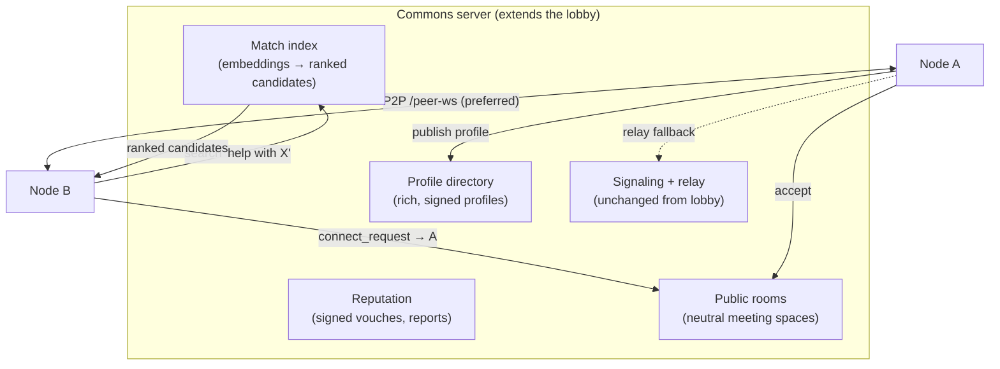
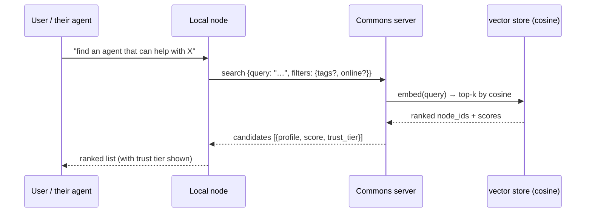
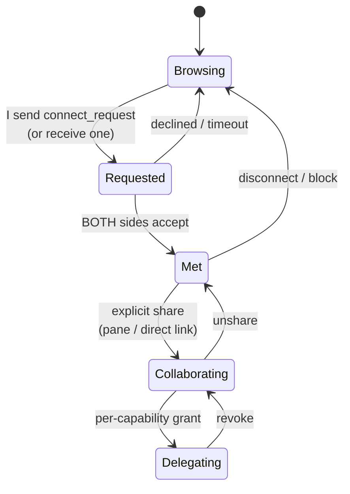
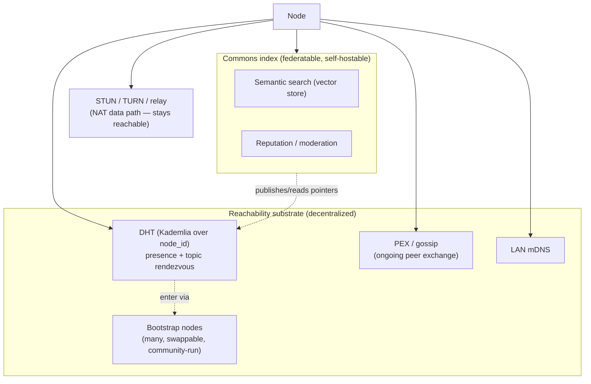
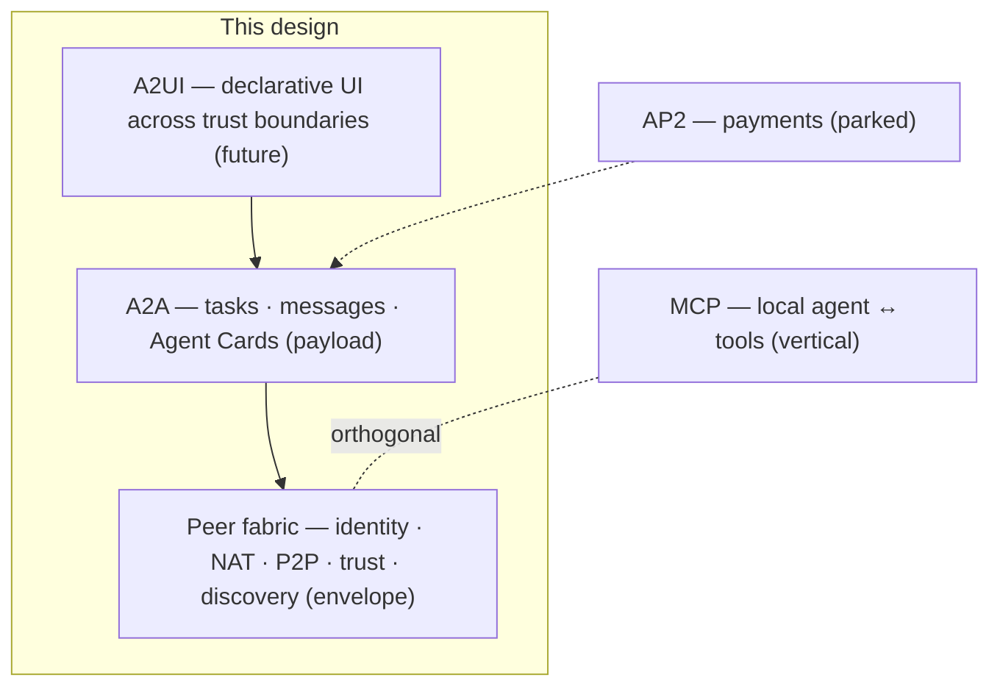

# Agent commons (design)

A public square where nodes that **don't already know each other** can discover one
another, get acquainted, and collaborate — safely, with trust earned in steps rather
than assumed up front.

**Status: design, with Phases 1–4 landed.** Implemented: the standalone index server
(signed profiles + vector store matchmaking — `backend/modules/network/commons_server.py`,
`backend/tests/test_commons_server.py`), discovery end to end (the node-side
`backend/modules/network/commons.py`, the `/ws` `commons` channel, the
`commons.directory` widget), the two-sided consent handshake (request-to-meet →
accept/decline → `connected` → peer dial), and the full reputation floor — a local
blocklist, signed vouches, moderation reports, and per-profile trust tiers
(`known` / `vouched` / `unknown` / `blocked`) — plus a profile editor and a dedicated
requests inbox (see [Module: commons](../modules/commons.mdx)). Still design (v2):
DHT/PEX decentralized discovery and index federation. It builds entirely on shipped
primitives — the
[lobby](network-protocol.mdx#the-lobby-system) (directory + rooms + signaling),
[Ed25519 node identity](distributed.mdx#identity), the signed
[`PeerEnvelope`](distributed.mdx#wire-protocol) wire, and the read-only
[agent-to-agent gating](../modules/agent-chat.mdx#agent-to-agent-talking-to-a-peers-agent) — and adds the
layers a *stranger-facing* directory needs that a private one does not.

## Why this is not just "the lobby"

Pairing and the existing lobby both assume **prior trust**: you share an invite code,
or you join a room someone told you about. A commons inverts that assumption.

| | Pairing / today's lobby | Agent commons |
|---|---|---|
| Prior trust | assumed (you have the code / URL) | **none** |
| Discovery | you already know who | **search the directory by interest/capability** |
| First contact | immediate (you opted in by having the code) | **two-sided consent handshake** |
| Trust | binary (paired or not) | **progressive ladder, elevated per resource** |
| Self-description | `node_name` + capabilities | **a profile** (storefront) |

So the commons = the lobby directory grown into a **public profile registry**, plus a
**consent-gated progressive-trust state machine**, plus **matchmaking**.

:::note Naming
The existing `marketplace` module is the **frontend plugin catalog**
(`@horribledashboard/sdk` plugins). This is a *people/agent* meeting space and must
not reuse that name. Working name: **`commons`** (module `commons`, the "Agent
Commons" / "Agora"). Throughout this doc "marketplace" refers to the concept the user
asked for; the artifact is `commons`.
:::

## The shape



The commons server sees **metadata only** (profiles, who's online, room membership,
vouches). Once two nodes are talking, collab/chat/agent traffic is P2P or
signed-opaque relay — the commons never brokers content. This is the same property the
lobby already guarantees; the commons must not weaken it.

## 1. Profiles (the storefront)

A node opts into the commons (`commons.enabled`) and publishes a profile — a richer,
**self-signed** extension of the lobby `register` payload. Because it's signed by the
node's Ed25519 key and the `node_id` is `fingerprint(public_key)`, a profile cannot be
spoofed onto someone else's identity.

```python
class CommonsProfile(BaseModel):
    node_id: str            # = fingerprint(public_key); self-certifying
    public_key: str
    display_name: str
    headline: str           # one-line "what I/my agent do"
    bio: str | None         # longer free text
    avatar_url: str | None
    tags: list[str]         # skills/interests, e.g. ["rust", "data-viz", "trading"]
    seeking: str | None     # what collaboration I'm looking for
    agent_capabilities: list[str]   # what my agent can answer about (advertised, not granted)
    links: list[ProfileLink]
    visibility: Literal["public", "unlisted"]   # listed in directory vs link-only
    sig: str                # Ed25519 over the canonical profile bytes
```

`agent_capabilities` is **advertising, not authorization** — it tells others what your
agent is willing to talk about; it grants a stranger nothing (see the trust ladder).

## 2. Matchmaking (the vector store seam)

Keyword filtering on `tags` is the floor. The real win reuses the
[database module](../modules/database.mdx)'s vector store: the commons server embeds each profile
(`headline` + `bio` + `tags` + `seeking`) into a collection and answers discovery as a
**cosine-similarity** query.



This makes discovery **agent-native**: the local agent can state a need in natural
language and get ranked peers back, instead of the human eyeballing a list. It's a
clean seam — the commons server owns one vector store collection of profiles; nothing
about the existing module changes.

## 3. The consent + progressive-trust ladder (the heart of "safely")

Nothing is trusted by default; each rung is an **explicit, revocable** elevation. A
stranger never silently gains access to anything on your node.



| Rung | What's unlocked | Gate | Default |
|---|---|---|---|
| **Browsing** | See a profile in the directory | public — read-only | always on |
| **Requested → Met** | 1:1 chat + agent Q&A in a neutral room | **two-sided consent** (friend-request) | off until accepted |
| **Collaborating** | Shared `collab` panes, direct P2P link | explicit share, per resource | off |
| **Delegating** | Their agent acts beyond read-only on yours | **per-capability** grant | off, and capped |

Key invariants:

- **Consent is two-sided and explicit.** A `connect_request` does nothing on your node
  until you accept — no auto-join of your rooms, no peer link, no chat, no presence
  leak beyond the public profile. This is the single most important addition over the
  lobby (whose `join_room` can be open).
- **Read-only is the ceiling for strangers, not a relaxable default.** A met stranger's
  agent may *ask* yours; it runs under the existing forced
  [`network.remoteAgentMode=plan`](../modules/network.mdx#settings) (read-only, no
  actuating tools, `origin_chain` cycle guard, hop cap). Elevating to **Delegating** is
  a deliberate, per-capability act — never granted by "meeting."
- **Meeting happens in a neutral room.** Strangers interact in a sandboxed commons room
  where only what's *explicitly shared into the room* is visible. Your workspaces,
  files, and other panes are not exposed by being "met."
- **Everything is revocable and one block ends it.** Block drops the peer, removes
  shares, and (optionally) files a report.

## 4. Reputation (making "stranger" safer over time)

Stable identity (you can't change your `node_id` without changing your key) lets trust
accrete:

- **Block — ✅ implemented.** Blocking a node sets `blocked` in the local
  `network-peers.json` (via `trust.save_known_peer`), so the commons **auto-declines its
  meet requests silently** *and* the peer fabric's `trust.evaluate` refuses it at the
  handshake — one block ends contact, and because the `node_id` is a key fingerprint it
  can't slip back under a new name. Surfaced node-side; never trusted to the index.
- **Trust tier — ✅ implemented (`known` / `unknown` / `blocked`).** Computed node-side
  (viewer-relative) and annotated onto each profile before it reaches the browser:
  `known` = already trusted in `network-peers.json`, `blocked` = blocked, else
  `unknown`. The directory shows the tier; the user decides.
- **Vouches — ✅ implemented.** A node publishes a **signed attestation** for another
  (`vouch {subject_node_id, sig}`, signed over `canonical_vouch_bytes`); the index stores
  attributable vouches and lists them per profile. Weighting is **viewer-relative** — a
  profile reaches the `vouched` tier only when a node *you already trust* vouched for it
  (your trust graph, not a global count → Sybil-resistant). Tier order:
  `blocked` > `known` > `vouched` > `unknown`.
- **Reports — ✅ implemented (record-only).** `report {subject_node_id, reason}` is logged
  and appended to `commons-reports.json` at the index. There is **no automatic de-listing**
  yet — that's gameable without a moderation authority (an open question below); the local
  block above is the floor that works without any index cooperation.
- **The commons advises; it never auto-connects.** (Contrast `open-lan` trust, which is
  demo-only for exactly this reason.)

## 5. Protocol additions (over `/lobby-ws`)

The commons extends the lobby wire rather than inventing a new socket. New frames:

| Direction | message | data | purpose |
|---|---|---|---|
| node→commons | `publish_profile` | `{profile: CommonsProfile}` | list / update the storefront |
| node→commons | `search` | `{query, filters?, limit}` | semantic + filtered discovery |
| commons→node | `candidates` | `{results: [{profile, score, trust_tier}]}` | ranked matches |
| node→commons | `connect_request` | `{to_node_id, note?}` | ask to meet (relayed to target) |
| commons→node | `connect_request` | `{from: profile, note?, request_id}` | inbound request to accept/decline |
| node→commons | `connect_response` | `{request_id, accept: bool}` | two-sided consent |
| commons→node | `connected` | `{peer: {node_id, public_key, addresses[]}}` | hand off to the normal P2P join (then [Scenario 2](network-protocol.mdx#scenario-2--two-users-direct-p2p)) |
| node→commons | `vouch` | `{subject_node_id, sig}` | signed attestation |
| node→commons | `report` | `{subject_node_id, reason}` | moderation signal |

After `connected`, the link is an ordinary peer connection — the existing handshake,
transports (direct → WebRTC → relay), `collab`, `peerchat`, and `agent.ask_peer` all
apply unchanged. The commons is **discovery + consent + reputation**; it adds no new
data path.

## 6. Frontend surface (sketch)

A `commons` module, sibling to `network`:

- **Widget** `commons.directory` — browse/search profiles; each card shows trust tier
  and a **Request to meet** button. The search box is agent-fillable (so the agent can
  drive discovery via `getAgentContext`).
- **Widget** `commons.profile` — edit your own storefront (the `publish_profile`
  payload), toggle `public`/`unlisted`.
- **Widget** `commons.requests` — inbound `connect_request`s to accept/decline; the
  consent gate's UI.
- **Reuses** the existing `network.chat`, `collab` panes, and `network.relay` once
  two nodes are **Met** — no duplication.
- **Settings** — `commons.enabled`, `commons.serverUrl`, `commons.autoPublish`,
  `commons.minTrustToRequest` (e.g. ignore requests from `unknown` tier).

## Decentralizing discovery: hybrid, like BitTorrent

The naïve commons has one always-up server as a single point of failure and a single
point of control. BitTorrent solves the same problem **without** ever achieving "zero
server" — it stays reachable by being *hybrid*. Two lessons apply directly.

**Lesson 1 — "pure P2P" is a myth at exactly two edges: bootstrap and NAT.** Even
trackerless BitTorrent hardcodes **bootstrap nodes** to enter the DHT, and relies on a
fraction of **publicly reachable peers** to relay/hole-punch for NAT'd ones. The win
isn't *no* server — it's *no single, mandatory, special* server: many, swappable,
community-run.

**Lesson 2 — BitTorrent layers four discovery mechanisms by decentralization:**

| Mechanism | What it does | Needs a server? | Our equivalent |
|---|---|---|---|
| **Tracker** | per-swarm peer list (announce → peers) | yes, but thin (discovery only) | the **lobby** today |
| **DHT (Kademlia)** | trackerless lookup: node IDs share the keyspace with content keys; hop by XOR distance | only **bootstrap** nodes to enter | **missing** |
| **PEX (gossip)** | connected peers gossip the peers they know | no (but needs a first peer) | **missing** |
| **LSD** | LAN multicast | no | the `lan` transport (mDNS) ✅ |

### Mapping onto our fabric

We already have most of the substrate; the gaps are DHT and gossip.

| BitTorrent piece | Our equivalent | Gap |
|---|---|---|
| Node ID (XOR routing) | **Ed25519 `node_id` = fingerprint(pubkey)** — *better*: cryptographic, self-certifying | DHT routing logic |
| LSD | `lan` transport (mDNS) | ✅ |
| Tracker | the lobby (directory) | it's the *only* way in (SPOF) |
| STUN / hole-punch | ICE-lite + WebRTC | ✅ |
| TURN | `relay_broker.py` + WebRTC TURN | ✅ |
| DHT | — | **missing** |
| PEX (gossip) | — | **missing** |

A neat fit: **BEP 44** (mutable, signed DHT items) maps onto our identity directly — a
node's Ed25519 key signs a DHT entry pointing at its current reachability (advertised
address + ICE candidates). That's **decentralized, self-certifying presence**: "how do
I reach node X" needs no central directory.

### The catch — DHT is great for *reachability*, bad for *marketplace*

A DHT/gossip layer answers **"find peers for known key X"** and **"how do I reach node
X."** It is poor at exactly what makes a commons a commons:

- **Semantic search** (the vector store matchmaking) — DHTs do exact-key lookup, not ranked
  similarity.
- **Reputation aggregation** — vouch tiers want a consistent view; gossip is eventual,
  partial, and game-able.
- **Moderation / de-listing** — there's no one to de-list a bad actor in a pure DHT
  (immutability is a feature there, a liability here).

### Recommended split

Decentralize the plumbing; keep a *federatable* brain for the marketplace features.



1. **Reachability & rendezvous → DHT + gossip + LAN.** "Is node X online / how do I
   reach it / who's in topic T" goes serverless. The lobby **demotes** from *the*
   directory to *a* bootstrap/tracker — one of many. **PEX is the cheapest first win:**
   once you've met anyone, gossip peer lists and stop depending on a server for ongoing
   discovery.
2. **Profiles, search, reputation, moderation → an index server** — but federatable and
   self-hostable, *one of potentially many* (Mastodon-style instances), publishing and
   reading pointers via the DHT so it's never the *only* way in.
3. **NAT data path → keep STUN/TURN/relay** unchanged — this is the part that genuinely
   must stay reachable.

Net effect on the "reachable server" worry: not "one always-up server or nothing
works," but **"any of several community bootstrap/relay nodes gets you in; the
marketplace index is federated like email; and once you've met people, gossip + cached
peers keep you connected even if a server blinks."**

## Open questions (decide before building)

1. **Bootstrap & relay topology (resolves the "reachable server" worry).** Per
   [Decentralizing discovery](#decentralizing-discovery-hybrid-like-bittorrent): ship a
   small set of swappable bootstrap/relay defaults (community-run) rather than one
   mandatory commons server, and federate the index. Open sub-question: do we build the
   DHT first (bigger lift) or ship a single hosted `commons_server.py` (extending
   `lobby_server.py`) as v1 and layer DHT/PEX in later? (Recommend: hosted index v1 for
   the marketplace features, DHT/PEX as the v2 decentralization pass — the wire is
   designed so the index becomes one node among many, not a rewrite.)
2. **Where do embeddings run** — on the commons server (central index, server sees
   profile text) or client-side (nodes submit vectors)? Central is simpler; client-side
   leaks less. Profiles are *public* text, so central is probably fine.
3. **Sybil resistance** for vouches — N vouches is gameable by one actor spinning up
   keys. Tie weight to *your* trust graph (vouches only count from nodes you already
   trust), not a global count.
4. **Moderation authority** — who de-lists on the hosted commons? Start with local
   blocklists + de-list-on-report; formal moderation is later.

## Interop & standards (A2A / MCP / AP2 / A2UI)

A fair question: why build a bespoke agent-to-agent layer when open standards exist?
The answer is that **they solve different layers**, and the one that genuinely overlaps
(A2A) we should *adopt at a seam* rather than keep reinventing. The decisive fact:
**MCP, A2A, AP2, and A2UI all assume an agent is an HTTP-reachable endpoint at a known
URL.** That assumption is exactly what this design does *not* have — personal nodes
behind NAT, mutually distrusting, with no published URL. So no standard replaces the
**fabric** (identity, NAT traversal, P2P, stranger-trust); the standards layer *on top*
of it.

> Spec details below were checked against the official sites (June 2026). These move
> fast — re-verify versions before implementing.

| Standard | Layer | Status (as checked) | Our stance |
|---|---|---|---|
| **MCP** (Anthropic) | agent ↔ tools/context (*vertical*) | widely adopted | **Keep** as the local tool surface — orthogonal to peering |
| **A2A** (Linux Foundation) | agent ↔ agent (*horizontal*) | **v1.0**, Apache-2.0, TSC: AWS/Cisco/Google/IBM/Microsoft/Salesforce/SAP/ServiceNow | **Adopt at the seam** — Agent Cards + tasks/messages, carried over our peer wire |
| **A2UI** (Google + CopilotKit) | agent → UI (*declarative, cross-trust*) | v0.9.1 (1.0 candidate), Apache-2.0; an A2A extension | **Strong future fit** for remote/collaborative panes |
| **AP2** (Google + FIDO Alliance) | payment authorization | **v0.2** (Sept 2025); extends A2A | **Park** until collaboration is paid |

### MCP — different axis, keep it

MCP ("a USB-C port for AI") connects *one* agent to tools, resources, and prompts —
host ↔ client ↔ server, vertical. It says nothing about two *users'* nodes finding or
talking to each other. It's already the project's local tool-integration story; the
peer fabric is orthogonal. No change.

### A2A — the real overlap; adopt at the seam

A2A standardizes precisely what this design currently hand-rolls:

- **Agent Card** — a JSON "digital identity" served at the RFC-8615 well-known path
  **`/.well-known/agent-card.json`**, with fields `name`, `description`, `provider`,
  `url`, `capabilities` (`streaming`, `pushNotifications`), authentication `schemes`,
  and `skills` (`AgentSkill`: `id`, `name`, `description`, `inputModes`, `outputModes`,
  `examples`). **This is what our `CommonsProfile` is reinventing.**
- **Tasks / messages / artifacts / streaming** — the agent-conversation lifecycle our
  bespoke `agent_request`/`agent_result` envelope + `agent.ask_peer` reinvents.
- **Curated registries** — A2A explicitly names registries (publish cards, query by
  skills/tags) as a discovery method alongside the well-known URI. **Our commons index
  *is* an A2A curated registry.**

**Decisions:**

1. **Make `CommonsProfile` a superset of an A2A Agent Card** (same field names; add our
   `node_id`/`sig`/`tags`/`seeking`/trust extensions). Optionally serve it at
   `/.well-known/agent-card.json` so off-fabric A2A clients can read it.
2. **Re-express the agent-to-agent relay as A2A tasks/messages carried over the signed
   `PeerEnvelope`** ("A2A-over-PeerEnvelope") — drop bespoke semantics, gain interop
   with off-fabric A2A agents (a peer with a public A2A endpoint, or a cloud agent).
3. **Treat the commons index as an A2A curated registry** — same vocabulary, plus our
   consent gate and vector store ranking.

What A2A still can't do — and why the fabric stays: NAT traversal / P2P, self-certifying
identity + trust between strangers, and discovery of people who never published a URL.
A2A is the *payload*; the fabric is the *envelope*.

### A2UI — the safe cross-trust-boundary UI layer (future fit)

A2UI is "a protocol for agent-driven interfaces": an agent emits **declarative** UI
(flat JSON — surfaces, components, data binding) that a client renders with native
widgets **without executing arbitrary code**, explicitly to send UI *across trust
boundaries* safely, with progressive streaming. That maps almost exactly onto this
app's situation: the orchestrator already drives layout, and a **remote peer's agent
rendering something into a shared pane** is a cross-trust-boundary UI problem. A2UI
(itself an A2A extension, and runnable over MCP) is the standardized, sandboxed way to
do that — a natural successor to ad-hoc layout-control tool calls for *remote* panes.
Not a v1 dependency; flagged as the right direction for collaborative-pane rendering.

### AP2 — parked until money is involved

AP2 extends A2A for agent-initiated payments: **verifiable digital credentials (VDCs)**
and **mandates** — a **Checkout Mandate** (purchase details + user constraints, shared
with merchants) and a **Payment Mandate** (authorizes a payment instrument, shared with
credential providers/processors) — under a role-separated architecture (merchant /
credentials provider / network / processor), standardized via the FIDO Alliance. Our
"marketplace" is a *meeting place*, not commerce, so AP2 is out of scope now; it's the
clean path *if* collaboration ever becomes paid, and it composes on top of the A2A seam
above.

### Net architecture



## v1 implementation plan

**Scope of v1:** a hosted, federatable index (profiles + vector store matchmaking) + the
two-sided consent handshake + a local-first reputation floor (block/report).
**Explicitly deferred to v2:** the DHT/PEX decentralization pass (see
[Decentralizing discovery](#decentralizing-discovery-hybrid-like-bittorrent)) and
signed cross-node vouches. v1 is wired so the index becomes "one node among many"
later without a rewrite.

The plan mirrors the existing **lobby** end-to-end (`lobby_server.py` ↔
`LobbyClient` ↔ `/ws` `lobby` channel ↔ `LobbyPanel`), because the commons is the
same shape with a richer payload and a consent gate. Reuse, don't reinvent.

### Server: `commons_server.py` (the federatable index) — ✅ Phase 1 implemented

A standalone app, bundling the lobby + relay the way `lobby_server.py` already mounts
the relay broker (`app.add_api_websocket_route("/relay-ws", …)`). It adds a
`/commons-ws` endpoint and an in-process profile index. **As built:** it mounts
`/relay-ws` *and* `/lobby-ws`, persists the registry to
`$HORRIBLE_DATA_DIR/commons-profiles.json` (embeddings live in the vector store SQLite
store), and speaks `publish_profile` / `search` / `directory` / `unpublish`. Run it
with `uv run uvicorn backend.modules.network.commons_server:app --port 9100`.

- **Identity reuse** — gate every frame with the existing
  `identity.fingerprint(public_key) == node_id` + `identity.verify(...)` check
  (lift `_verify_register` from `lobby_server.py:118`). No new auth.
- **Profile store** — `CommonsProfile` (see schema above; build it as a **superset of an
  A2A Agent Card** per [Interop & standards](#interop--standards-a2a--mcp--ap2--a2ui))
  kept in memory + persisted to a JSON file; `node_id` is the key. `publish_profile`
  upserts; disconnect marks offline (mirrors `_drop_node`).
- **Match index → vector store, reused directly.** The server process imports
  `backend.modules.database.vectorstore` and `embeddings`:
  - on `publish_profile`: `emb, _ = await get_embedding(headline + bio + tags + seeking)`
    then `upsert_document(node_id, "commons-profiles", profile_text, metadata, emb)`.
  - on `search`: `q, _ = await get_embedding(query)` then
    `search_documents("commons-profiles", q, limit)` → ranked `node_id`s.
  - **Consistency note:** indexing and querying both go through the *same*
    `get_embedding`, so even the 384-dim local fallback (when the index host has no
    embedding model) stays self-consistent — weak semantically, but correct. It
    sharpens automatically when the host has a real embedding model. This is the only
    correctness subtlety; call it out in code.
  - On disconnect/unpublish: `delete_document(node_id)`.
- **Consent relay** — `connect_request` / `connect_response` are forwarded to the
  target by `node_id`, tagging `from` (exactly the `signal`/`relay` forwarding at
  `lobby_server.py:244`). On a mutual accept, send `connected` (with each side's
  reachability `addresses`) to *both* — identical to the `room_info` / `peer_joining`
  handoff.
- **Moderation** — `report` increments a per-profile counter; de-list past a
  threshold. (Authoritative reputation is v2; this is the floor.)

Run: `uv run uvicorn backend.modules.network.commons_server:app --port 9100`.

### Node: `CommonsClient` (`backend/modules/network/commons.py`)

A process-global singleton modeled on `LobbyClient` — same outbound WebSocket,
`_register`-style profile publish, `/ws` fanout, and the **reuse of
`LobbyClient._connect_to_host`'s dial ladder** (direct → webrtc → relay) on a
`connected` frame. Concretely:

- `publish_profile()`, `search(query, filters, limit)`, `request_connect(node_id, note)`,
  `respond(request_id, accept)`, `block(node_id)`, `report(node_id, reason)`.
- Holds the directory/search-results/pending-requests snapshot the browser renders.
- **Local blocklist** persisted to `$HORRIBLE_DATA_DIR/commons-blocks.json` —
  survives re-discovery because `node_id` is stable; a blocked node can't slip back
  under a new name. Inbound `connect_request` from a blocked or below-`minTrust` node
  is auto-declined.
- On a `connected` frame: hand off to `peer_hub.connect(...)`. ⚠️ Run the dial via
  `asyncio.create_task` so the read loop isn't blocked awaiting the handshake (a `/ws`
  handler that awaits a relayed result deadlocks the receive loop otherwise).
- **Trust tier** is computed *client-side*: `known` (in `network-peers.json`) /
  `vouched` (v1.1) / `unknown`.

### `/ws` `commons` channel + lifecycle

- Add `commons.py` bridge functions `subscribe_commons_conn` / `handle_commons_message`
  (mirror `subscribe_lobby_conn` / `handle_lobby_message`).
- Wire them in `backend/app.py` next to the lobby wiring (`app.py:159` subscribe,
  `app.py:184` dispatch).
- Start/stop `commons_client` in `backend/modules/network/setup.py` alongside
  `lobby_client.start()` (`setup.py:62`), gated on `commons.enabled`.
- Export from `backend/modules/network/__init__.py` (add the symbol and its use in the
  same edit, or the ruff autofix hook deletes the "unused" import).

| Direction | message | data |
|---|---|---|
| client→commons-ws | `register` / `publish_profile` | `{profile, sig}` |
| client→commons-ws | `search` | `{query, filters?, limit}` |
| commons-ws→client | `candidates` | `{results:[{profile, score, trust_tier}]}` |
| client→commons-ws | `connect_request` / `connect_response` | `{to_node_id,note}` / `{request_id,accept}` |
| commons-ws→client | `connect_request` / `connected` | `{from,request_id}` / `{peer}` |
| client→commons-ws | `report` | `{subject_node_id, reason}` |

### Frontend: `packages/core/src/modules/commons/`

A new module mirroring `modules/network/index.ts`:

- **Widgets** `commons.directory` (search + cards with trust tier + **Request to
  meet**; search box agent-fillable via `getAgentContext`), `commons.profile` (edit
  your storefront), `commons.requests` (accept/decline inbound — the consent UI).
- **Reuse** `network.chat`, `useCollab`, and `network.relay` once two nodes are
  **Met** — no new chat/collab code.
- **Commands** `commons.open`, `commons.editProfile`, `commons.requests`.
- **Settings** `commons.enabled` (bool), `commons.serverUrl` (string),
  `commons.autoPublish` (bool), `commons.minTrustToRequest` (enum
  `unknown`/`vouched`/`known`).
- Register the module wherever `networkModule` is registered.

### Tests

Follow the loopback pattern ([distributed.mdx](distributed.mdx#safety) — two hubs in
one process with explicit signers): construct an in-process commons index + two
`CommonsClient`s and assert:

- `publish_profile` → `search` returns the matching node ranked first.
- `connect_request` → **decline** yields no peer link; **accept** yields a
  `peer_hub` peer on both sides.
- a below-`minTrust` / blocked requester is auto-declined.
- blocklist persists across a client restart.
- identity guard: a profile whose `sig`/fingerprint doesn't match `node_id` is
  rejected (reuse the lobby's `_verify_register` test shape).

### Docs & verification

- Flip the relevant sections of this page from "proposed" to "implemented" as each
  phase lands; add a `docs/modules/commons.mdx` user-facing page (the Stop hook
  requires a docs touch for the new module).
- Verify against a real `commons_server` on `:9100`; start the dev backend with
  `--reload` or new routes 404 during checks.

### Suggested phase order (each independently shippable)

1. **Server profiles + search** (`commons_server.py` + vector store index) — testable via
   `wscat`/pytest with no UI. **✅ implemented** (`commons_server.py`,
   `test_commons_server.py`).
2. **`CommonsClient` + `/ws` channel + directory widget** — browse/search end to end.
   **✅ implemented** (`commons.py`, `/ws` `commons` channel, `commons.directory`
   widget; see [Module: commons](../modules/commons.mdx)).
3. **Consent handshake** (request/respond → `connected` → dial ladder) — the safety core.
   **✅ implemented** (`connect_request`/`connect_response`/`connected` on the index;
   `commons` channel `request`/`respond` + inbound `requests`/`met`/`declined`; the
   directory widget's Meet button + Accept/Decline. Verified live across two nodes.)
4. **Reputation floor** (block/report, trust-tier display) + profile editor + requests UI.
   **✅ implemented** — blocklist, signed vouches, record-only reports, trust-tier badges
   (`known`/`vouched`/`unknown`/`blocked`); the `commons.profile` editor and the
   `commons.requests` inbox; node-side `trust`-backed and viewer-relative. Verified live
   across two nodes (block auto-decline, vouch in directory, profile edit → republish).
5. **v2 (separate effort):** DHT/PEX, federation between indexes, index-side moderation.

## Relationship to existing pages

- Identity, envelope, transports: [Distributed peer fabric](distributed.mdx).
- Lobby (directory + rooms + signaling this extends): [Network protocol &
  scenarios](network-protocol.mdx#the-lobby-system).
- Read-only remote-agent gating (the safety floor): [Agent
  chat](../modules/agent-chat.mdx#agent-to-agent-talking-to-a-peers-agent).
- Matchmaking engine: [Database](../modules/database.mdx).
- User-facing network surface this sits beside: [Module: network](../modules/network.mdx).
