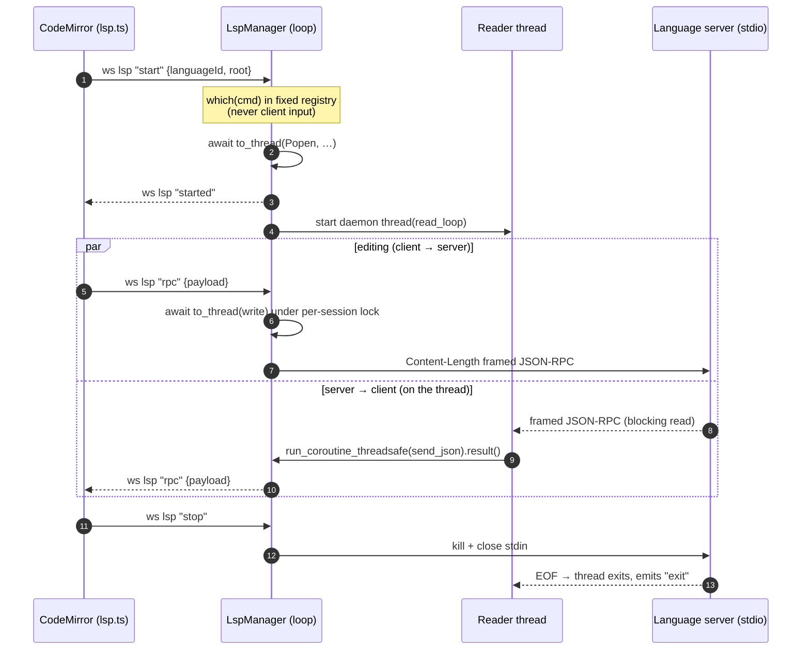
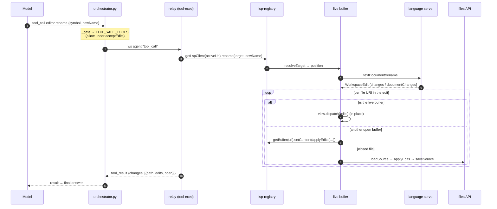
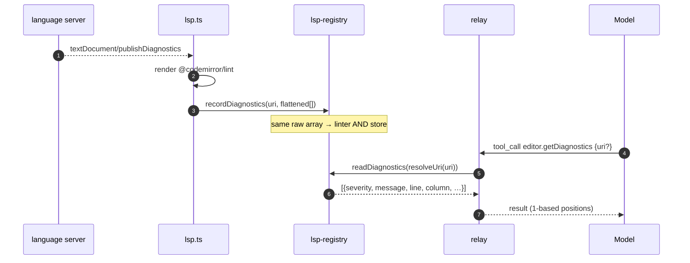
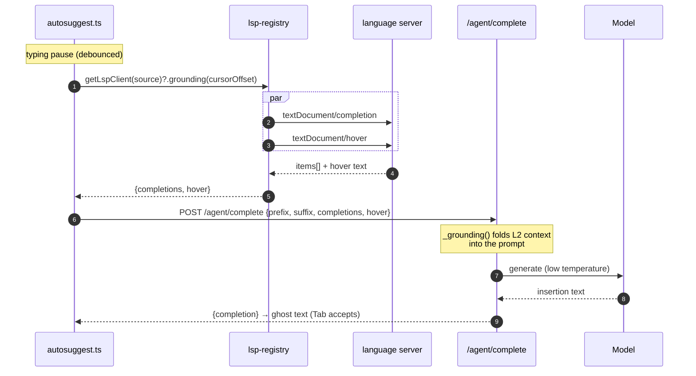
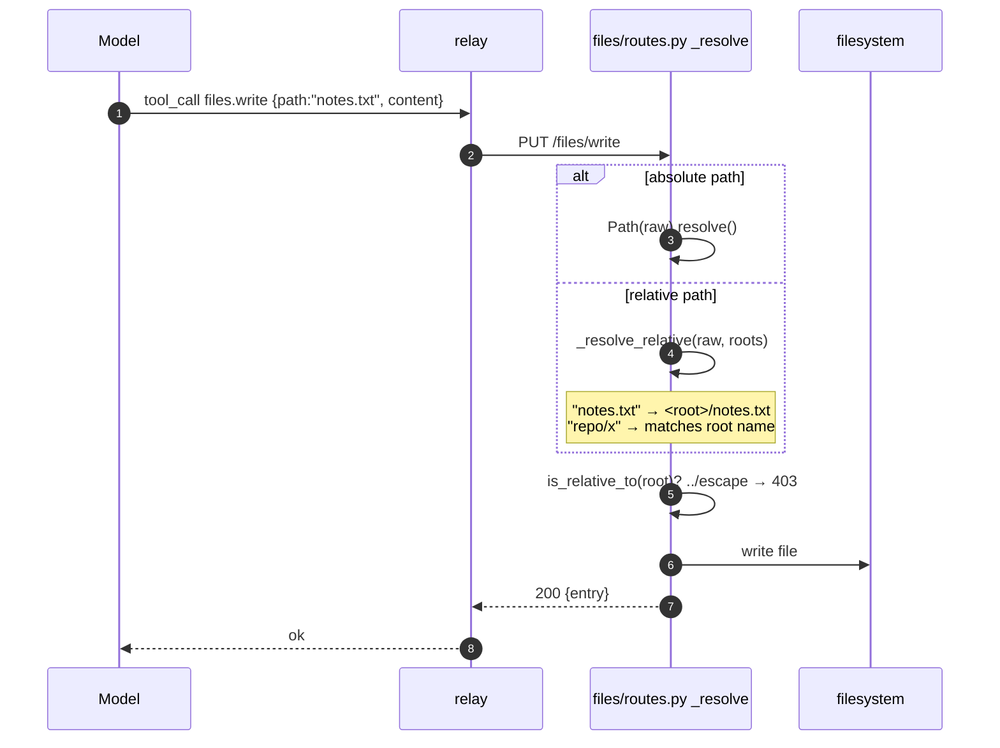
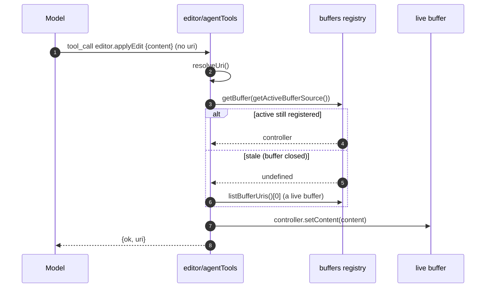
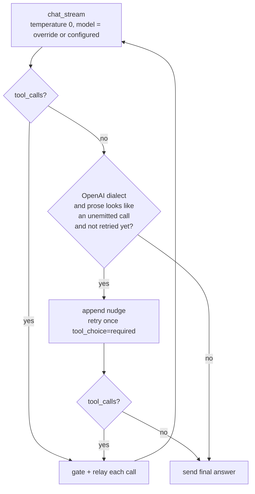
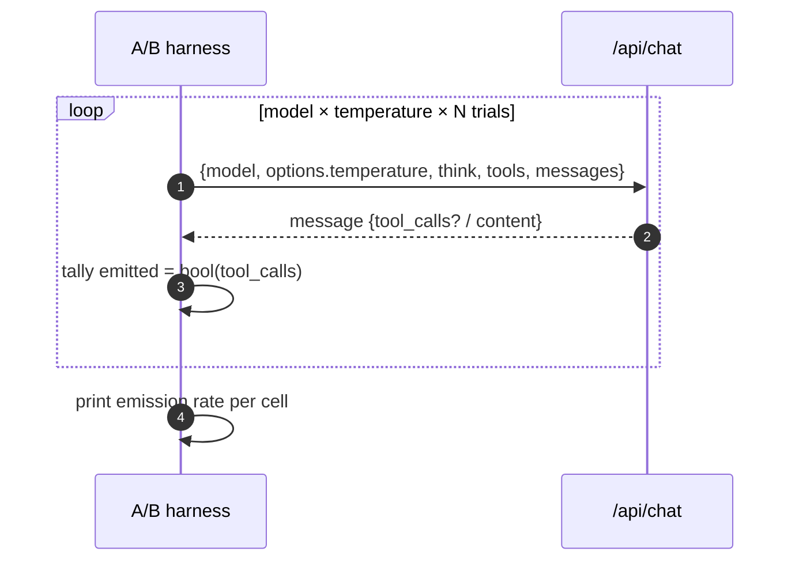

# Agent ⇄ editor trajectories

How the agent reaches the editor's language intelligence, how the LSP transport
spawns servers, and the reliability work behind tool-calling — each as a sequence
diagram of the actual flow, with the problem it solves. This is the "why it looks
like this" companion to [editor](../modules/editor.mdx),
[agent chat](../modules/agent-chat.mdx), and
[agent tools](agent-tools.mdx).

Participants used below:

- **CM** — the CodeMirror buffer (`editor/lsp.ts`, `BufferView.tsx`)
- **Reg** — the by-URI registries (`editor/lsp-registry.ts`, `editor/buffers.ts`)
- **FE** — the frontend agent relay (`agent/orchestrator-client.ts`, `tool-exec.ts`)
- **BE** — the backend orchestrator (`agent/orchestrator.py`)
- **LspMgr** — the LSP transport (`lsp/manager.py`)
- **LS** — the language server process (`pylsp` / `typescript-language-server`)
- **Model** — the local model (Ollama / LM Studio / vLLM via `agent/providers.py`)

---

## 1. LSP transport — spawn on a thread, not the asyncio loop

**Problem.** `asyncio.create_subprocess_exec` only works on Windows'
`ProactorEventLoop`, but uvicorn runs the app on the `SelectorEventLoop` whenever
`--reload` is set (its loop factory returns Selector when `use_subprocess=True`). On
the Selector loop the spawn raises `NotImplementedError` — so under the documented
dev command (`uvicorn … --reload`) the language server **silently never started**,
and every LSP capability was dead.

**Fix.** `LspManager` spawns with blocking `subprocess.Popen` and pumps stdio on a
per-session **daemon thread**, scheduling WS sends back onto the loop with
`run_coroutine_threadsafe(...).result()` (blocking the reader thread preserves
message order and applies backpressure). Loop-agnostic — works on either loop.

The terminal PTY (`terminal/manager.py`) is unaffected — it already spawns via
`pywinpty`/`ptyprocess` on a thread, not asyncio subprocess.

---

## 2. Agent-driven rename — `textDocument/rename` → WorkspaceEdit applied across files

**Problem.** Regex rename is wrong across scopes/files. **Fix.** `editor.rename`
(gated like `applyEdit`, auto-allow under `acceptEdits`) drives the LSP rename and
applies the returned `WorkspaceEdit`: the live buffer is edited in place, other open
buffers update through their controller, closed files are loaded/edited/saved.

---

## 3. `get_diagnostics` read path + diagnostics in `getAgentContext`

**Problem.** The agent edited blind — it couldn't see the errors it caused.
**Fix.** The LSP client records each `publishDiagnostics` into `lsp-registry`
(keyed by the buffer's `workspace-file:` source URI). The agent reads them two ways:
the ungated `editor.getDiagnostics(uri)` tool, and the buffer's `getAgentContext`
snapshot (`BufferSnapshot.diagnostics`), so they ride along with `get_pane_context`.

---

## 4. LSP-grounded ghost text — L2 grounds L3

**Problem.** The ghost-text prompt was just `prefix<CURSOR>suffix`, so a small model
hallucinated symbols. **Fix.** Before each completion the buffer pulls
`grounding(offset)` (a parallel `completion` + `hover` round-trip) and threads the
in-scope symbols + cursor type into the prompt. **LSP drives the dropdown; the LLM
drives inline ghost text, now grounded.**

---

## 5. Agent file paths — anchor relative to a workspace root

**Problem.** A model passes a bare path (`notes.txt`, "assuming the workspace
root"); the API resolved it against the backend CWD → outside every root → `403`,
so file creation failed *even after the user accepted the permission*. The model has
no way to know absolute root paths. **Fix.** `_resolve` anchors a relative path to a
root first (a leading segment matching a root name selects it, else the first root);
the `is_relative_to(root)` boundary check runs **after** anchoring, so `../` escapes
are still `403`.

---

## 6. Editor injection — don't trust a stale active buffer

**Problem.** `editor.applyEdit` with no `uri` fell back to `getActiveBufferSource()`,
which is sticky and never reset when a buffer closes → pointed at a dead URI →
`getBuffer()` returned nothing → "no open buffer" (and the model hallucinated
success over the error). **Fix.** `resolveUri` trusts the active source only if it's
still a registered buffer; otherwise it falls back to any open buffer.

---

## 7. Tool-calling reliability — greedy decoding + one bounded forced retry

The orchestrator sent no sampling options, so Ollama ran at its default temperature
(0.8). The loop now decodes **greedily** (temp 0, settings-overridable via
`agent.orchestrator.temperature`) and a **separate model override**
(`agent.orchestrator.model`) can drive tool-calling with a stronger model than
chat/autosuggest use — both adjustable in **Settings → Agent orchestrator**. It does
**not** force a tool unconditionally; a conversational reply must stay a reply. Only
when the prose reads like an *unemitted* call does it retry once with
`tool_choice:"required"` — and only on the OpenAI dialect (Ollama has no reliable
`tool_choice`).

---

## 8. The reliability experiment — measuring tool emission

To separate cause from coincidence, the A/B hit Ollama's `/api/chat` **directly**
(bypassing the UI, the frame, and chat history), varying only one knob at a time and
tallying whether `message.tool_calls` came back.

**Results (2026-06-20, this machine):**

| Model | Setup | temp 0.8 | temp 0.0 |
| --- | --- | --- | --- |
| `gemma4:e2b` | 1 tool, plain prompt | 6/6 | 6/6 |
| `gemma4:e2b` | full prompt, 6 tools, `think:true` | 8/8 | 8/8 |
| `gemma4:12b` | any | — | — |

**Findings.**

- **Temperature was not the cause** of the "can't create files / inject code"
  failures — `gemma4:e2b` emits the call reliably at both temperatures, even with
  thinking on and a multi-tool catalog. The real causes were §5 (path `403`) and §6
  (stale buffer); the temp-0 change is harmless hardening, not the fix.
- **`gemma4:12b` can't run on this machine** — every request `500`s with
  `cudaMalloc failed: out of memory` (GPU OOM, even after CPU-offload retry; gemma4's
  vision projector adds VRAM pressure). The model-override **setting** works, but
  point it at a model that fits VRAM, not 12b here.
