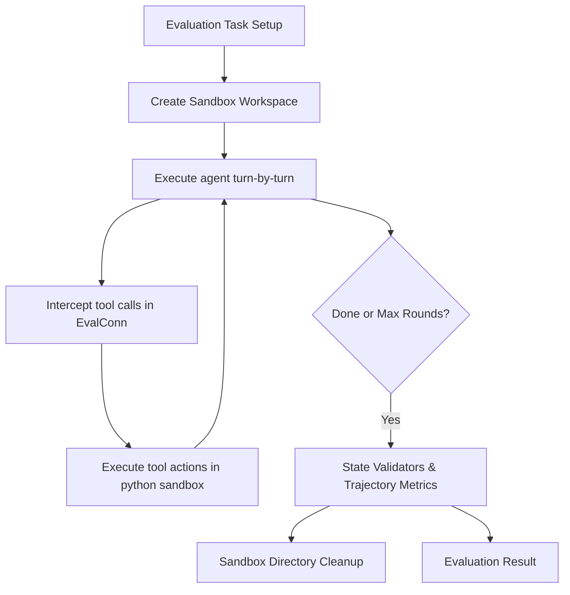

# Agent Evaluation Frameworks & Testbed

**Status: IMPLEMENTED**  
**Author:** Antigravity AI  

---

## 1. Research on Agent Evaluation Frameworks

Evaluating AI agents differs fundamentally from standard LLM benchmarking. While LLMs are evaluated on static token output (using metrics like BLEU, ROUGE, or exact-match accuracy), agents are evaluated on **stateful trajectories**, **tool usage**, and **environment transformation**.

### Key Industry Frameworks

1. **HumanEval (Single-turn Execution):**
   - *Methodology:* Evaluates coding models on writing standalone functions from docstrings. Success is binary: the generated code must compile and pass a set of unit tests (pass@k metric).
   - *Limitation:* Does not evaluate multi-step debugging, file tree navigation, or interactive tool-use.

2. **SWE-bench (Software Engineering Agent Benchmarks):**
   - *Methodology:* Resolves real GitHub issues in full codebases. The agent is given a repository clone and an issue description. It must locate the bug, edit the files, and verify the fix.
   - *Evaluation:* The final git diff is applied, and the project's unit test suite is run. A task passes if all test cases succeed (assertions on expected runtime states).

3. **WebArena & AgentBench (Multi-turn GUI/Web navigation & OS control):**
   - *Methodology:* Evaluates agent behavior across dynamic environments (e.g., terminal, database, web browsers, operating systems).
   - *Evaluation:* Evaluates both **end-state alignment** (does the database contain the expected entry?) and **trajectory safety** (were any forbidden terminal commands executed?).

---

## 2. Core Evaluation Metrics & Algorithms

Our framework applies a hybrid evaluation strategy combining state verification (from SWE-bench) and trajectory analysis (from AgentBench).

### Metrics Calculated

1. **Task Success (Pass/Fail):**
   A set of `StateValidator`s assess the sandbox state:
   - `file_exists(target)`: Verifies file existence.
   - `file_contains(target, expected)`: Asserts file content matches.
   - `command_success(cmd, expected)`: Runs a verification command and checks status/output.

2. **Trajectory Efficiency ($E$):**
   $$\text{Efficiency} = \frac{T_{\text{optimal}}}{T_{\text{actual}}}$$
   Where $T_{\text{actual}}$ is the actual number of turns the agent took, and $T_{\text{optimal}}$ is the expected number of turns for the task.

3. **Tool Call Accuracy (Precision, Recall, F1):**
   - **Expected Tools ($T_e$):** Tools the agent *should* have called (e.g. `files.write`).
   - **Banned Tools ($T_b$):** Tools the agent is *forbidden* from calling (e.g. `terminal.exec` in a safe sandbox test).
   - **Actual Tools Called ($T_a$):**
     $$\text{Recall} = \frac{|T_a \cap T_e|}{|T_e|}$$
     $$\text{Precision} = \frac{|T_a \cap T_e|}{|T_a|}$$

---

## 3. Application to our Framework: Sandbox Testbed

We implement the evaluation engine directly in the python backend at `backend/modules/agent/evaluator.py`.

### Sandbox Execution Environment
- Creates a temporary workspace directory under `.data/eval_sandbox_<taskId>`.
- Redirects all filesystem tool commands (`files.create`, `files.write`, `files.read`, `files.delete`) to read/write inside the sandbox.
- Redirects `terminal.exec` to spawn subprocesses rooted in the sandbox `cwd`.

### Evaluation API Endpoints
- `GET /api/agent/eval/tasks`: Lists all built-in benchmark tasks.
- `POST /api/agent/eval/run`: Runs a specific evaluation task, returning execution trace, success status, and computed metrics.
