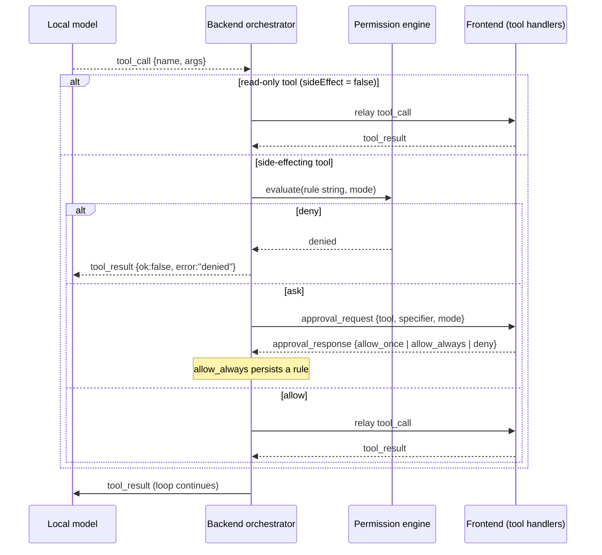

# Agent tools & permissions

**Status: implemented.** This page specifies the generalized **agent
tool surface** of the [agent orchestrator](../modules/agent-chat.mdx) (per-widget
`agentTools`, agent-exposed commands, pull-based `getAgentContext()`) and the
**permission system** that gates side effects. It is the shared foundation the
[file explorer](../modules/file-explorer.mdx), [editor](../modules/editor.mdx),
and [terminal](../modules/terminal.mdx) modules are built on; the surface was built
first, validated against a stub, then those modules were layered onto it. Slice 1
(the static `LAYOUT_TOOLS` catalog) is in [agent-chat.mdx](../modules/agent-chat.mdx).

Landed: the SDK declaration contract (`AgentToolDecl`, `CommandDecl.agent`,
`getAgentContext`/`AgentContextSnapshot`); the capability-manifest protocol
(below); the per-instance **`getAgentContext` registry** with the
`list_open_panes` / `get_pane_context` read tools; the **permission engine
core** (`backend/modules/agent/permissions.py` — rule parsing, `deny → ask →
allow` precedence, the four modes, circuit breakers) including **shell-aware
specifier matching** (`shell.py`); the **gate + approval round-trip** in the
orchestrator (`_gate`, `approval_request`/`approval_response`, rule persistence via
`permission_store`); and the **approval UI** (`ApprovalPrompts` + `useApprovals`)
with the settings-page **permissions section** (mode picker + rule lists). The
whole permission system (Epic A) is in place, the **stub validation** ran green
across all four modes, and all three real modules now declare their tools on the
surface: the **file explorer** (`files.list`/`read` reads, gated
`files.create`/`write`/`rename`/`delete`), the **editor** (`getAgentContext`
buffer reads, gated `editor.proposeEdit` [accept/decline diff] /
`editor.applyEdit`/`save`), and the **terminal**
(`terminal.list`/`read` reads, gated shell-matched `terminal.exec`). Content widgets
add their own: **observability** (`getAgentContext` I/O snapshot + gated
`observability.clear`) and **clubhouse** (`clubhouse.status`/`listRooms` reads, gated
`clubhouse.disconnect`) — illustrating that any widget gets agent tools just by
declaring `agentTools` on its decl. The chat widget's **`/tools`** command lists the
full catalog via a `list_tools`→`tools` WS round-trip, labeled by group. The model
itself doesn't see the whole catalog at once: tools are grouped by prefix and
disclosed **progressively** — a small core plus `list_tool_groups`/`load_tools`
meta-tools, with each turn's list recomputed and groups injected on demand (see
[Hierarchical tools & progressive disclosure](../modules/agent-chat.mdx#hierarchical-tools--progressive-disclosure)).
Remaining work is incremental per-module polish (e.g. the editor's desktop-only
`osfile:` source), not foundational.

## The model: one tool path, one gate

Every agent tool call flows through the **frontend relay** over the shared `/ws`
`agent` channel — there is no separate backend-direct tool path, even for tools
whose resource (a PTY, the filesystem) lives in the backend. Those tools' handlers
run in the frontend and call the backend's existing HTTP/WS API, so the agent has
exactly **one** tool model to reason about.

The consequence that shapes everything: because all calls pass through the
orchestrator loop, the **permission gate sits in the backend orchestrator, before
the relay**. Permissions are enforced by the orchestrator, **not by the model** —
the system prompt shapes what the agent *tries*, but the engine decides what runs.
This mirrors Claude Code, where rules are enforced by the harness rather than the
LLM.



A read-only tool never reaches the engine — the same read-only tier Claude Code
uses for file reads and `grep`.

## Declaring agent tools

Two surfaces, by design (the "hybrid" decision in
[[agent-orchestrator-architecture]]):

1. **App-wide verbs are commands.** `CommandDecl` gains an optional `agent`
   field so a command opts into being model-callable:

   ```ts
   export interface CommandDecl {
     id: string;
     title: string;
     run: () => void | Promise<void>;
     agent?: { description: string; params?: JSONSchema; sideEffect?: boolean };
   }
   ```

   Layout/navigation verbs (open pane, switch workspace) are exposed this way and
   are read-only or harmless, so they stay ungated.

2. **Widget/panel-specific actions are `agentTools`.** `WidgetDecl` and
   `PanelDecl` gain an optional `agentTools?: AgentToolDecl[]` (MCP-style):

   ```ts
   export interface AgentToolDecl {
     name: string;              // namespaced like a command id, e.g. "terminal.exec"
     description: string;       // natural language, for the model
     params?: JSONSchema;       // JSON-schema object for the arguments
     sideEffect?: boolean;      // falsy = read-only, never gated
     /**
      * Template rendered into the permission *specifier* the engine matches
      * rule specifiers against. `{name}` placeholders are filled from args; the
      * tool name is implicit. e.g. "{command}" → specifier `npm run build`,
      * matched by rule `terminal.exec(npm run *)`. Declarative so the backend
      * builds the specifier itself, keeping the gate fully server-side.
      */
     specifierTemplate?: string;
     handler: (args: Record<string, unknown>) => unknown | Promise<unknown>;
   }
   ```

   `handler` and the live arguments stay frontend-owned; only the serialized
   schema and `specifierTemplate` reach the backend.

## Giving the agent a new tool (recipe)

There are **three** ways a tool reaches the model. Pick by what the tool *is*, not
by where it's convenient to write:

| If the tool is…                                              | Declare it as…                                     | Lives in                                                  | Gated? |
| ----------------------------------------------------------- | -------------------------------------------------- | -------------------------------------------------------- | ------ |
| An app-level **layout/navigation verb** (open/split a pane) | a static entry in `LAYOUT_TOOLS`                   | `backend/modules/agent/orchestrator.py`                  | no (layout-only) |
| An app-wide **command** the user could also run from the palette | `CommandDecl.agent` on the command                 | the module's manifest (frontend)                         | optional (`sideEffect`) |
| A **widget/panel-specific action** tied to a pane instance  | an `AgentToolDecl` in the decl's `agentTools`      | the widget/panel decl (frontend)                         | optional (`sideEffect`) |

Only `LAYOUT_TOOLS` is authored on the backend; it is the one catalog the backend
owns because layout verbs have no frontend handler to serialize — they execute
directly in [`tool-exec.ts`](../modules/agent-chat.mdx#the-orchestrator)'s
`executeTool` switch. **Everything else is frontend-owned and pushed** to the
backend in the capability manifest, so a runtime-loaded plugin's tools appear with
no backend change.

### Steps for a frontend tool (command or `agentTools`)

1. **Declare it.** Add `agent: { description, params?, sideEffect? }` to a
   `CommandDecl`, or push an `AgentToolDecl` onto a `WidgetDecl`/`PanelDecl`'s
   `agentTools`. The `description` is the model's only guidance — write it like an
   API doc, name the args, and say when *not* to call it (see the editor's
   `proposeEdit`-vs-`applyEdit` note in `SYSTEM_PROMPT`).
2. **Write a precise `params` JSON-schema.** Local models follow `enum`s and
   `required` far better than prose. Keep ids out of enums — the model discovers
   live ids with the read tools, so the catalog stays frontend-owned.
3. **Mark side effects.** A tool that mutates anything sets `sideEffect: true` and
   passes through the [gate](#the-permission-system); a read-only tool omits it and
   is relayed without a prompt. For a gated tool, add a `specifierTemplate` (e.g.
   `"{command}"`) so the engine can match scoped rules like `terminal.exec(npm run *)`.
4. **Implement the `handler` (frontend) — or the `executeTool` case (layout verb).**
   The handler runs in the browser and may call backend HTTP/WS APIs; it never
   crosses the wire. Unknown relayed names fall through `executeTool`'s `default`
   to `executeDynamicTool`, which dispatches to the registered handler.
5. **It's already wired.** `initAgentManifestSync` pushes the manifest on connect,
   reconnect, and every registry change, and the backend merges it into the model's
   tool list each turn (`_tools_for`). No registration step beyond the decl.
6. **Verify.** Open the chat widget and run **`/tools`** — the live catalog (exactly
   what `_tools_for` feeds the model) should list your tool with the right `source`.
   Then ask the agent to use it and watch the per-turn action log.

### Backend layout verbs

A new `LAYOUT_TOOLS` entry needs three edits kept in lockstep: the `_tool(...)`
schema in `orchestrator.py`, a `case` in `executeTool` (`tool-exec.ts`), and — if
it drives the docking engine — a method on the `LayoutController` seam
(`registry.ts`, installed by `Workspace.tsx`). Argument **aliasing** belongs at the
`tool-exec.ts` boundary, not in the engine: `split_area` accepts
`vertical`/`horizontal` there and resolves them to a concrete side before calling
`LayoutController.splitPane`, so the model gets the simpler vocabulary while the
seam and the UI grip stay four-way.

## Reading widget state: `getAgentContext()`

State the agent needs to read — the active buffer's text, the tree selection, a
terminal's recent output — lives in a live pane **instance**, not in a static
declaration. It is read on a **pull** basis (not a push bus):

- A pane component registers a snapshot provider via the `useAgentContext(() =>
  snapshot)` hook (`packages/core/src/agent-context.ts`). The provider registry
  lives in **core** so feature modules (which live in core) can import the hook
  without a core→ui cycle; `packages/ui`'s `PanelHost` only supplies the live
  instance id through `PaneInstanceContext`, keyed per pane instance.
- Two built-in read tools (ungated) expose it: `list_open_panes()` (the
  `listOpenPanes` seam, which now reports each pane's `instanceId` and a
  `hasContext` flag) and `get_pane_context(instanceId)`, which invokes the
  registered provider and returns its JSON snapshot.

This is how the agent "reads widget A to act on widget B": pull A's context with a
read tool, then call a gated action tool on B. It forces per-pane-instance state
(a known windowing gap — instances currently share a store), which these modules
need anyway.

Beyond the read/write modules above, the **content widgets expose snapshots too**,
so the agent can reason about what's on screen even where it has no write tools:
the **backend-status** widget reports reachability and version; the
**observability** widget and panel report the data-flow summary (total calls,
errors) and the most recent calls; the **Clubhouse** account widget reports the
connection state and the **live-rooms** panel reports the rooms currently listed.
These are read-only `getAgentContext` providers — no `agentTools`.

## Capability manifest protocol

The frontend owns the tool catalog and **pushes** it to the backend so the
manifest reflects runtime-loaded plugins and the current registry. New
`agent`-channel events extend the
[slice-1 protocol](../modules/agent-chat.mdx#the-orchestrator):

| Direction     | event              | data                                                            |
| ------------- | ------------------ | --------------------------------------------------------------- |
| client→server | `manifest`         | `{tools: SerializedTool[]}` — on connect **and** on registry change |
| server→client | `approval_request` | `{turnId, callId, tool, specifier, mode}`                       |
| client→server | `approval_response`| `{callId, decision: 'allow_once'\|'allow_always'\|'deny', rule?}` |

`SerializedTool` = `{name, description, params, sideEffect, specifierTemplate, kind}`
where `kind` is `'agentTool' | 'command' | 'layout'`. Each turn the backend merges
the pushed manifest with the static `LAYOUT_TOOLS` into the model's tool list. The
`handler` is never serialized; the backend learns *which* tools to gate from
`sideEffect` and renders the rule string from `specifierTemplate` + the call args
before consulting the engine.

## The permission system

A direct port of Claude Code's model
(`backend/modules/agent/permissions.py`), scoped to this app's tools.

### Rules

Three lists — `allow`, `ask`, `deny` — of `Tool` or `Tool(specifier)` strings,
with `*` glob support. **Precedence is `deny → ask → allow`; first match wins, and
specificity does not reorder.** A matching `ask` prompts even when a more specific
`allow` also matches. A bare tool name (`terminal.exec`) matches all uses; a scoped
rule (`terminal.exec(rm -rf *)`) matches only matching calls.

### Modes

A `defaultMode` setting (overridable per session), mirroring Claude Code:

| Mode         | Behavior                                                                                 |
| ------------ | ---------------------------------------------------------------------------------------- |
| `default`    | Prompt (`ask`) on every side-effecting tool not already covered by an `allow` rule.      |
| `plan`       | Read-only: every `sideEffect` tool is auto-denied; the agent can explore but not mutate. |
| `acceptEdits`| Auto-allow editor saves and safe FS creation (`files.create`, mkdir-equivalents); still `ask` on `files.delete`/`files.rename`/`terminal.exec`. |
| `autonomous` | Allow everything except explicit `ask`/`deny` rules — the `bypassPermissions` analog.    |

**Circuit breakers** apply even in `autonomous`: destructive roots
(`files.delete` at a workspace root, `terminal.exec(rm -rf /*)` and equivalents)
always prompt, as a guard against model error.

### Terminal & filesystem specifiers

The terminal carries most of the engine's complexity, because matching a shell
command safely is the hard part. Implemented in `backend/modules/agent/shell.py`
(tools listed in `permissions.SHELL_TOOLS`), porting Claude Code's Bash/PowerShell
rule logic:

- `*` globs with word-boundary semantics (`terminal.exec(npm run *)` matches
  `npm run build`, not `npm runner`);
- compound-command splitting on `&& || ; | &` — for an **allow** every subcommand
  must be covered; a **deny**/**ask** fires if **any** subcommand matches (so a
  dangerous part can't hide behind a safe one);
- wrapper stripping (`sudo`, `timeout N`, `nice -n N`, `env VAR=…`, …) before
  matching;
- a built-in **read-only command allowlist** (`ls`, `cat`, `pwd`, …) that runs
  without a prompt in every mode (a command with an output redirect is not
  treated as read-only);
- shell **circuit breakers** (`mkfs`, `dd of=/dev/…`, fork bombs, `rm -rf` of a
  root) that always prompt, even in `autonomous`.

Filesystem rules use gitignore-style path anchors against the workspace roots,
matching Claude Code's `Read`/`Edit` patterns (`//abs`, `~/home`, `/projectRoot`,
`./cwd`), so a rule like `deny files.delete(**)` or `allow files.write(/src/**)`
behaves as expected. See [file-explorer.mdx](../modules/file-explorer.mdx).

### Where rules live

Rules and the default mode are persisted server-side in the existing settings
store (`$HORRIBLE_DATA_DIR`) under `agent.permissions.{mode,allow,ask,deny}`, read
through `permission_store` and surfaced in the
[settings module](../modules/settings.mdx). Precedence, lightest to heaviest:
shipped defaults → user settings → session override. "Always allow" from an
approval prompt appends a rule to `agent.permissions.allow`.

### Out of scope for v1

OS-level **sandboxing** (Claude Code's complementary enforcement layer) is not part
of v1 — permissions are the only boundary. As the terminal page notes, exposing the
backend beyond localhost exposes shell execution on that host; that is an auth
problem at the backend boundary, not something the permission engine solves.

## Approval UI

`approval_request` renders a global surface (`packages/ui/ApprovalPrompts.tsx`,
fed by the `useApprovals` store in `packages/core/.../agent/approvals.ts`) — and,
on desktop, an OS notification via `notifications.system` — showing the tool, the
rendered specifier, and **Allow once / Always allow / Deny**. "Always allow" sends
an `approval_response` carrying an editable `rule` (prefilled with the exact call,
broadenable to e.g. `terminal.exec(npm run *)`) that the backend persists.

The mode and rule lists are editable on the settings page: the agent module
contributes a `settingsSections` entry (`PermissionsSettings`) — a registry seam
for configuration too rich for the declarative `SettingDecl` controls — that
reads/writes `agent.permissions.{mode,allow,ask,deny}` through `/api/settings`.

## Build order

1. Extend the SDK decl types (`CommandDecl.agent`, `AgentToolDecl`,
   `getAgentContext` host hook) and the manifest protocol. ✅
2. Build the permission engine and the approval UI. ✅
3. Validate end to end against a **stub** module — one read tool, one gated tool —
   exercising every mode before any real module exists. ✅
4. Layer the file explorer, editor, and terminal onto the surface. ✅ — all three
   ship with their `agentTools`/`getAgentContext` on the gate. Incremental
   per-module follow-ups remain (e.g. the editor's desktop `osfile:` source, live
   `files.*` watch events), but the foundation is fully in use.

### Validation stub

`packages/core/src/modules/stub/` is a dev-only reference module
(`import.meta.env.DEV`) — the minimal exercise of the whole surface: a read tool
(`stub.getValue`), a gated tool (`stub.setValue`, `specifierTemplate: "{command}"`
style `"{value}"`), and a `getAgentContext` snapshot. It validated the full path
live (gemma4:e2b) across all four modes: `default` prompts then relays on _allow
once_; `plan` hard-denies with no prompt; `autonomous` relays with no prompt;
`acceptEdits` still prompts (the tool isn't edit-safe) and _deny_ blocks the
relay; and _always allow_ persists a rule (broadenable to `stub.setValue(*)`) that
the next call honors without prompting. New real modules can copy its shape.
