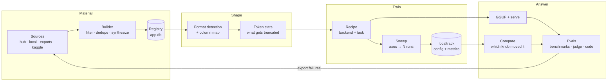

# The AI-research pipeline

This node had most of the *organs* of an AI-research workstation before this
document existed — a notebook with a per-project venv, a typed recipe form, a
metrics store, an eval runner, a local inference server, interpretability tooling,
and an LSP that resolves against a project's own interpreter. What it did not have
was the **connective tissue between them**, and that is where research actually
happens.

This page is the map of that tissue, and of the four seams an outside contributor
can extend.

## The loop

The arrow that closes the loop is `EV → S`: `evals.export` writes an SFT `.jsonl` of
the cases a model got wrong, the `exports` dataset source surfaces it, and a recipe
can train on it. Every piece of that existed before; the joins are what was missing.

## What each stage answers

| Stage | The question | Where |
| --- | --- | --- |
| Material | what could I train on? | [datasets](../modules/datasets.mdx) |
| Shape | can this task actually eat it? | `datasets/formats.py` |
| Shape | what will silently get truncated? | `datasets/tokens.py` |
| Train | which framework, which task, which knobs? | `training/backends/`, `training/recipes.py` |
| Train | what happens if I change *this*? | `training/sweeps.py` |
| Answer | which knob caused the difference? | `localtrack.compare_runs` |
| Answer | is it actually better? | [evals](../modules/evals.mdx) |

## The four contribution seams

Every one of them is a `host.add_*` call on the
[backend plugin SDK](./backend-plugin-sdk.mdx), registering into the same
process-global registry the built-ins write to — so a plugin's contribution is
indistinguishable from a first-party one. Built-ins win id conflicts.

### `add_dataset_source(source)`

One place training material lives. Implement `search`, `splits`, `peek`, `locate`
(`backend/modules/datasets/sources.py`). It appears in the browser beside the Hub,
and a recipe can point at it like any other.

### `add_recipe_backend(backend)`

One training framework: which tasks it can train, which knobs each takes, and the
notebook cells those knobs become
(`backend/modules/training/backends/base.py`).

**The safety net is inherited, not reimplemented.** `recipes.introspect()` asks a
backend for `probe_classes(task)` and interrogates *those* classes in the project
venv, so a new framework gets the whole `ok | renamed | unsupported | unvalidated`
resolution for free — a field the installed library does not accept is dropped from
the emitted code and shown as dropped, never emitted hopefully. A backend that wrote
its own validation would be a backend whose "dropped field" report drifts from every
other one's.

Four ship: `trl` (sft/cpt/dpo/kto/reward/grpo), `unsloth`, `torchtitan`, `nanotron`.

### `add_eval_runner(runner)`

One way of executing a suite. Results land in the same tables as every other
runner's, so a mixed suite still adds up.

### `add_search_provider(provider)`

Pre-existing, and part of the same story: a crawled corpus of ML documentation joins
the same rank fusion as live web results, so the recipe form's doc links point at a
page this node actually has.

## Decisions worth not re-litigating

**A registered dataset carries its shape.** Not just a name. The format and column
map travel with it into the generated code, which is why the recipe emits an
explicit `formatting_func` rather than renaming a column invisibly.

**A sweep's runs are processes, not kernel cells.** A kernel is single and serial;
twelve points on one would take twelve times as long and could not be stopped
individually. The generated script is a *flattening* of the same `materialize()` the
notebook uses (`recipes.materialize_script`), so a sweep and a manual run cannot
disagree about what a recipe means.

**A run's `config_json` is the resolved values dict.** localtrack has stored that
field since it was written and never had a producer that filled it with anything
comparable. It is the entire mechanism behind "which knob caused this".

**One run at a time by default.** Two fine-tunes on one GPU is an out-of-memory
error at an unpredictable point in the second, not double the throughput.

**Sweeps and builds do not ride the shared task queue.** It is serial across the
whole app; a twelve-point sweep would park every library ingest behind it for an
afternoon. Both run detached under their own semaphore — the `karaoke` download and
`evals.sweep` precedent.

**A grade nothing scores is worse than no grade.** `judge` spent its early life
declared-but-unrouted and rejected at authoring time for exactly that reason: it
failed every run, and the failure read as the *model* being wrong. It is authorable
now because `evals/judge.py` routes it — and a judge that cannot be reached returns
an **error**, never a zero.

**Pre-training is a different execution model, and says so.** torchtitan and
nanotron emit a config file plus a `torchrun` launch, single-node, because that is
what they are. A launcher that appeared to support a cluster and quietly ran on one
box would be worse than the honest limitation.

## The workspace

The `ai-research` frame (`packages/core/src/modules/training/index.ts`) lays the loop
out left to right: datasets, then the recipe over its sweep, then localtrack and
evals. Deliberately **not** called `research` — the `layouts` module already owns
that frame id for reading papers, and two frames with one id collide in the tab
strip.

## Related

- [datasets](../modules/datasets.mdx)
- [training](../modules/training.mdx)
- [evals](../modules/evals.mdx)
- [localtrack](../modules/localtrack.mdx)
- [backend plugin SDK](./backend-plugin-sdk.mdx)
