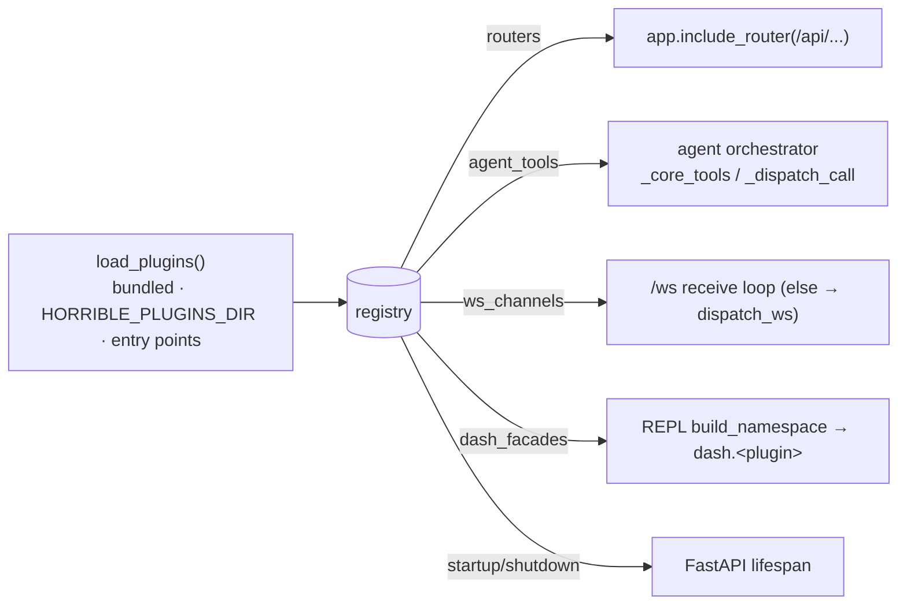

# Backend plugin SDK (`backend.sdk`)

The [frontend plugin SDK](plugin-sdk.mdx) lets third parties add **frontend**
contributions (panels, widgets, commands). The **backend plugin SDK** is its
server-side counterpart: a Python package, `backend.sdk`, that lets a plugin
contribute **server-side** capabilities — HTTP routes, agent tools, `/ws` channels,
lifespan hooks, and `dash` REPL facades — the same way a built-in backend module
does.

:::warning Trust model (v1)
Backend plugins are **trusted and unsandboxed**: their code runs in-process with
full backend access (filesystem, network, the registry). v1 is for localhost use,
mirroring the frontend SDK's v1 trust model. Only load plugins you trust.
:::

## Writing a plugin

A plugin is a module that exposes a module-level `PLUGIN` — a `BackendPlugin` whose
`setup(host)` registers capabilities via the `host`:

```python
from fastapi import APIRouter
from backend.sdk import AgentTool, BackendPlugin, PluginHost, PluginManifest

router = APIRouter()

@router.get("")              # mounts at /api/plugins/ping
def ping():
    return {"pong": True}

class PingPlugin(BackendPlugin):
    manifest = PluginManifest(id="ping", name="Ping", version="1.0.0")

    def setup(self, host: PluginHost) -> None:
        host.add_router(router)
        host.add_agent_tool(AgentTool(
            name="ping.echo",
            description="Echo back the given text.",
            handler=lambda args: {"echo": args.get("text", "")},
            parameters={"text": {"type": "string", "description": "text to echo"}},
            required=["text"],
        ))
        host.add_ws_channel("ping", ping_channel)        # async (conn, message)
        host.add_dash_facade("ping", PingFacade)         # → dash.ping in the REPL
        host.on_startup(lambda: ...)                     # lifespan hooks
        host.on_shutdown(lambda: ...)

PLUGIN = PingPlugin()
```

The runnable reference is `examples/backend-plugins/ping/` — it registers one of
every capability and doubles as the integration test fixture.

## The host API

`PluginHost` (passed to `setup`) is the only surface a plugin needs:

| Method | Registers |
| --- | --- |
| `host.add_router(router, prefix=None)` | a FastAPI `APIRouter`. Default prefix `/api/plugins/<id>`; pass `prefix` (joined under `/api`) to override |
| `host.add_agent_tool(AgentTool(...))` | a **server-side** agent tool — its handler runs in the backend (works with no browser). `side_effect=True` routes it through the agent permission gate |
| `host.add_connector(Connector(...))` | an external account the user can connect from the home page, whose credential the node holds server-side. See [connectors](../modules/connectors.mdx) |
| `host.add_ws_channel(name, handler)` | an `async (conn, message)` handler for a new channel on the shared `/ws` socket |
| `host.add_dash_facade(name, factory)` | an object bound to `dash.<name>` in every REPL session (also shows in `dash.help()`) |
| `host.on_startup(hook)` / `host.on_shutdown(hook)` | lifespan hooks (sync or async) |
| `host.log` | a logger namespaced to the plugin |

`AgentTool` carries its own JSON-schema `parameters`/`required`, a `handler` (sync
or async, returns a JSON-able value), and gate metadata (`side_effect`,
`specifier_template`).

`Connector` carries a `kind` (`oauth` | `api-key` | `custom`), the `begin`/`submit`/
`poll`/`disconnect` callbacks that drive its flow, a `status` reader, the `scopes` it
asks for, and an optional agent `guide`. Name its agent tools `<connector.id>.*` — the
orchestrator groups tools by name prefix, so a mismatch splits a connector's tools off
from its blurb and guide.

## How it's discovered and wired

`backend.sdk.loader.load_plugins()` runs once at app import. It discovers plugins
from **three** sources, then calls each plugin's `setup(host)`:

1. **Bundled** — packages under `backend/plugins/` (ships empty; drop a package in
   to bundle a first-party plugin).
2. **`HORRIBLE_PLUGINS_DIR`** — an `os.pathsep`-separated list of directories of
   local plugin packages/modules (no install needed).
3. **Entry points** — pip-installed packages declaring a `horrible.plugins`
   [entry point](https://packaging.python.org/en/latest/specifications/entry-points/).

Everything lands in one process-global `registry` (`backend/sdk/registry.py`), which
the rest of the app reads where each capability is used:



A plugin that fails to import or set up is recorded in `registry.errors` and
skipped — **one bad plugin never takes the app down**.

### Agent tools execute backend-side

Plugin agent tools join the always-present `_core_tools()`, so the model sees them
every turn. When the model calls one, `_dispatch_call` runs it **in the backend**
via `registry.invoke_agent_tool` (after the permission gate) rather than relaying it
to the browser — the same path the peer-fabric tools use. A `side_effect=True` tool
is gated like any other; read-only tools pass straight through.

## Relationship to the other SDKs

- **Frontend plugin SDK** (`@horribledashboard/sdk`) — UI contributions, loaded in
  the browser. A rich plugin may ship both halves (a backend plugin for server
  logic + a frontend plugin for its UI); they are independent in v1.
- **`dash`** (the [Python REPL SDK](python-sdk.mdx)) — the *scripting* handle. A
  backend plugin can extend it (`host.add_dash_facade`) so the REPL can drive the
  plugin too.

## Source map

| Concern | File |
| --- | --- |
| Public contract (`BackendPlugin`, `PluginHost`, `AgentTool`, …) | `backend/sdk/` |
| Discovery + load | `backend/sdk/loader.py` |
| Process-global registry | `backend/sdk/registry.py` |
| App wiring (router mount, lifespan, `/ws` fallback) | `backend/app.py` |
| Agent-tool dispatch | `backend/modules/agent/orchestrator.py` |
| `dash` facade attach | `backend/modules/repl/sdk.py` |
| Reference plugin | `examples/backend-plugins/ping/` |
