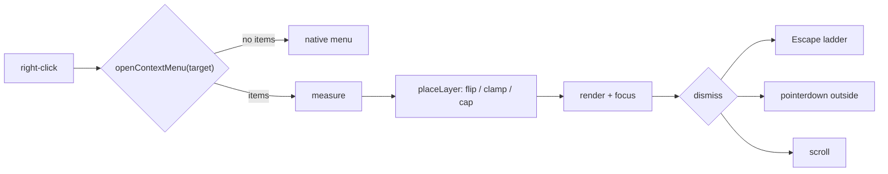

# Context menus

One menu, assembled per right-click from whoever has something to say about the
thing under the cursor.

## The problem it replaces

There were four hand-rolled menus — the file tree, the activity rail, the
workspace tabs, the game panel — and each one owned all three of the hard parts
itself:

- **Its own dismissal.** Three separate `window` keydown listeners, each closing
  on Escape (and one on *any* key), racing the shell's Escape ladder.
- **Its own positioning.** The activity rail rendered at the raw `clientX`/
  `clientY` with no clamp at all, so a right-click near the bottom-right corner
  put the menu off-screen entirely. The file tree clamped against **hardcoded
  guesses** at its own size (`window.innerWidth - 200`, `window.innerHeight - 260`)
  — correct only while that menu had exactly the items it had the day the numbers
  were written.
- **Its own item list**, baked into the component that owned the pixels. That
  makes "the menu depends on what was clicked" something every component
  reimplements, and it makes a cross-module action impossible: the file tree
  cannot know that the notebook module would like an **Open as Notebook** entry on
  a `.ipynb`.

## The model

A right-click reports a **target** — a `kind` plus that kind's payload — and the
menu is built from every provider registered for that kind.

```ts
onContextMenu={(e) => {
  if (openContextMenu(e, { kind: 'files.node', path: row.path, nodeKind: row.kind })) {
    e.preventDefault();
  }
}}
```

`openContextMenu` returns `false` when no provider offered an item, and the caller
should then **let the event through** to the browser's own menu rather than
swallowing the gesture to show an empty box.

Providers are declared on the module manifest, next to commands and panels:

```ts
contextMenu: [{ kind: 'files.node', order: 0, items: filesNodeItems }],
```

or registered imperatively with `addContextMenuProvider` for shell chrome, which
has no manifest.

### Groups, not a flat list

`itemsForTarget` returns **one group per provider**, ordered by `order` then
registration. Each group is drawn with a separator above it. Grouping is preserved
rather than flattened because the separator is the only cue that two items came
from different places — flattened, another module's *Delete* sits flush against
the owner's *Open* as though they belonged together.

A provider that returns `[]` is dropped entirely, so declining a target costs
nothing and never leaves a stray divider. A provider that **throws** is logged and
skipped: one module's bad provider must not take down the whole menu.

### Absent, not disabled

A virtual root in the file tree (a mounted Drive) is read-only and has no local
directory behind it, so every write action is **omitted** rather than greyed out.
There is no state in which they become available, and a permanently disabled row
only invites the user to keep trying it. The same rule picks *Reset to preset* or
*Delete* — never both — on a workspace tab.

## Placement

`placeLayer` (`packages/core/src/overlay/placement.ts`) is pure and unit-tested.
The component measures itself first and then positions, so the arithmetic runs
against the menu's **real** size rather than a guess:

1. Choose a side: the preferred one if it fits, else the opposite if that fits,
   else **whichever has more room**. Keeping the preference when neither fits
   pushes items off the edge where they cannot be clicked at all.
2. Clamp on both axes to the padded viewport.
3. With `shrink`, cap the height so the tail scrolls instead of being drawn past
   the edge.

A menu taller than the window is capped to the space on the side it was placed
on, not expanded to the full viewport — growing it past its own anchor would move
it away from the thing it acts on, and the anchor is the only cue about what the
menu applies to.



## Escape and the keyboard

The menu registers on the shared **transient stack** (`registerTransient`), so
Escape closes it through the shell's one ordered ladder instead of a fifth
`window` keydown listener racing the other four. See
[Keybindings](keybindings.mdx).

Arrows, Home/End, and Enter are handled on the focused menu element — not on
`window` — with ArrowRight/ArrowLeft opening and closing submenus. Hover and
keyboard focus set the same `activeIndex`, so a menu driven by both never shows
two highlighted rows.

Scrolling the surface under an open menu closes it: a menu left anchored to a
row that has moved is pointing at the wrong thing.

## Built-in target kinds

| kind             | payload                                  | contributors        |
| ---------------- | ---------------------------------------- | ------------------- |
| `files.node`     | `path`, `nodeKind`, `name`               | files, **notebook** |
| `rail`           | `side`, `entries[]`, `hidden[]`          | shell               |
| `rail.glyph`     | `viewId`, `title`, `dockSide`            | shell               |
| `workspace.tab`  | `workspaceId`, `workspaceName`, `isPreset` | shell             |

`files.node` is the one to copy: the **notebook** module contributes *Open as
Notebook* for a `.ipynb` without the files module knowing anything about it, and
deliberately *in addition to* **Open** rather than instead of it — a notebook is
still a JSON file, and opening the raw text is how you fix one the editor cannot
load.

## Adding a surface

1. Call `openContextMenu(event, target)` from `onContextMenu`, and
   `preventDefault()` only when it returns `true`.
2. Retarget any selection first if the click landed outside it — acting on a row
   the user cannot see highlighted is how *Delete* hits the wrong thing.
3. Declare a provider in the owning module's manifest with `order: 0`.
4. Put the actions somewhere a provider can reach. They must not live in a
   component closure; the file tree's `deleteSelection` moved to
   `modules/files/actions.ts` for exactly this reason, which also collapsed a
   second, drifting copy that the command palette had been using.
