# Data directories

**Status: implemented.** One module — `backend/paths.py` — answers where every
file this node owns lives, and every other module asks it. The **Storage** section
of the settings page shows the resolved roots.

- **Resolver:** `backend/paths.py` (`data_dir`, `config_dir`, `cache_dir`, `log_dir`)
- **Route:** `GET /api/paths` (`describe_roots`)
- **UI:** `packages/core/src/modules/storage/` — a settings section, no pane
- **Shell:** `open_path` in `apps/desktop/src-tauri/src/window.rs`
- **Tests:** `backend/tests/test_paths.py`

## The bug this replaces

Every module used to spell the answer out inline:

```python
Path(os.environ.get("HORRIBLE_DATA_DIR", ".data"))
```

That default is **relative to the process's working directory**, and the working
directory belongs to whichever launcher started the backend — `pnpm dev` runs it
from the repo, the Tauri shell runs it from `find_repo_root()`, a packaged app
would run it from wherever the shortcut points. So "the data dir" quietly meant a
different directory per launcher.

The failure is silent and looks like data loss, not like a crash: install a
300 MB llama.cpp build through the UI, reopen the app from a different launcher,
and the module reports nothing installed — the build is still on disk, in a
`.data` folder nobody is looking at any more. It is the same class of bug as
`.env` being loaded by one launcher and not another, and it gets the same fix:
resolve from the *source tree's* location, never from the cwd.

## The rules

```mermaid
flowchart TD
    A[data_dir&#40;&#41;] --> B{HORRIBLE_DATA_DIR set?}
    B -- yes --> C[use it verbatim<br/>Docker, Fly, tests]
    B -- no --> D{loaded from a git checkout?}
    D -- yes --> E["&lt;repo&gt;/.data"]
    D -- no --> F{platform}
    F -- Windows --> G["%LOCALAPPDATA%\HorribleDashboard"]
    F -- macOS --> H["~/Library/Application Support/HorribleDashboard"]
    F -- Linux --> I["$XDG_DATA_HOME/horrible-dashboard"]
```



1. **The environment always wins.** `HORRIBLE_DATA_DIR` (and `HORRIBLE_CONFIG_DIR`
   / `HORRIBLE_CACHE_DIR` / `HORRIBLE_LOG_DIR`) is taken verbatim. `Dockerfile.lobby`
   and `fly.toml` set it to `/data`; the test conftest points it at a tmpdir. A
   blank value is *not* an override — an empty `.env` line would otherwise put the
   data dir at the cwd, reintroducing the original bug.
2. **A checkout keeps its data in the tree**, at `<repo>/.data` and `<repo>/logs`.
   Not because a checkout is special, but because a developer's node identity,
   settings, workspaces and traces are already there, and silently relocating them
   is indistinguishable from losing them. The repo is detected from
   `backend/paths.py`'s own location (a `pyproject.toml` plus a `.git` — tested with
   `exists()`, since in a worktree `.git` is a file), which is the entire point:
   the answer must not depend on the cwd.
3. **Otherwise, the platform convention.**

## The roots

| Root | Windows | macOS | Linux (XDG) | In a checkout |
| --- | --- | --- | --- | --- |
| `data_dir()` | `%LOCALAPPDATA%\HorribleDashboard` | `~/Library/Application Support/HorribleDashboard` | `$XDG_DATA_HOME/horrible-dashboard` | `<repo>/.data` |
| `cache_dir()` | `…\HorribleDashboard\cache` | `~/Library/Caches/HorribleDashboard` | `$XDG_CACHE_HOME/horrible-dashboard` | `<repo>/.cache` |
| `log_dir()` | `…\HorribleDashboard\logs` | `~/Library/Logs/HorribleDashboard` | `$XDG_STATE_HOME/horrible-dashboard/logs` | `<repo>/logs` |
| `config_dir()` | `~/.horrible` | `~/.horrible` | `~/.horrible` | `~/.horrible` |

An XDG variable is honoured **only when absolute**, which is what the spec says: a
relative value is defined to be ignored, not resolved against the cwd.

### What lives under `data_dir()`

Among others: `app.db`, `secrets.db` (the key is deliberately *not* here — see
below), `lancedb/`, `llamacpp/`, `karaoke/`, `geoip/`, `workspaces.json`, and
**`wallpapers/`** — the images a user uploads for the `image` desktop backdrop. No
imagery ships with the app, so that directory is empty on a fresh install; see
[desktop-shell.mdx](desktop-shell.mdx#wallpapers) for the upload rules.

### Why `%LOCALAPPDATA%` and not `%APPDATA%`

Tauri's own `app_data_dir` picks roaming `%APPDATA%`, and this deliberately
differs. Roaming profiles are copied to the domain server at logon and logoff, and
this directory holds multi-gigabyte GGUFs, llama.cpp builds and karaoke media. The
size of what we store makes roaming the wrong shelf.

### Why `config_dir()` ignores the convention

It is the one root that is identical on every platform, because its requirement is
stronger than the convention. It holds the Fernet **master key**, and `data_dir()`
holds the `secrets.db` that key decrypts. The threat the encryption actually covers
is the data dir being copied somewhere it shouldn't — a synced folder, a backup,
`git add .data`, a screen share — so the key must never be *inside* it.

Every conventional config location for this app fails that test:
`%LOCALAPPDATA%\HorribleDashboard\config` and
`~/Library/Application Support/HorribleDashboard/config` are both **children** of
the data dir, one directory away from the database they unlock. `~/.horrible` is a
sibling of nothing we store, is where every existing install already keeps its key
(moving it would strand their encrypted credentials), and is a shape users already
have a dozen of — `~/.ssh`, `~/.aws`, `~/.kaggle`, `~/.ollama`.

`test_config_dir_is_never_inside_the_data_dir` asserts the nesting invariant on all
three platforms *and* in a checkout. The test conftest therefore isolates config to
a **sibling** of `tmp_path`, never a child: isolation that broke the invariant would
make `test_default_key_path_is_not_beside_the_database` pass on a lie.

### `cache_dir()` is for new caches only

Nothing is routed there yet. The existing regenerable data (the GeoIP database, the
browser profile) sits under `data_dir()`, and moving live files buys nothing. But a
*new* cache belongs in `cache_dir()` — deleting that root must never lose user data.

## What this does not change

Nothing moves. In a checkout every path resolves to exactly where it did before,
only absolute instead of relative — which is what `mcp/author.py` already had to
work around, since a project's venv is used from a process with a different cwd.

The per-OS branch is currently **unreachable in practice**: `backend.rs` reports
`"packaged builds don't bundle the backend yet"` and refuses to start without a
checkout, so today the backend either runs from a repo or from Docker with the env
set. This is the groundwork for packaging, not a migration — which also means there
is no migration code, and none is owed. If data ever *does* need to move, that is a
one-time step to write then, with both locations known.

## The settings section

`storage` is a module with **no pane and no settings of its own**, the same shape
as `hardware` and for the same reason: these locations are a *reading*, not a form.
The overrides are environment variables rather than settings because they must be
resolvable before anything is read — and because `settings.json` itself lives in
the data dir whose location they decide.

Each root renders with **why it resolved there** (`environment` / `checkout` /
`platform`), not just its path. That distinction is the useful half: an override
the user set is something they can change, a system default is a property of the
install, and a bare path tells them neither.

Two states the section is careful about:

- **"Not created yet" is normal, not an error.** A root appears on first write. But
  the Open button is disabled for one, because the shell refuses a path that is not
  a directory and the click would otherwise do nothing at all.
- **Open is desktop-only.** A web page cannot show a folder in a file manager, so
  in the browser layout the button is absent rather than present and dead. Copy is
  offered on both, and reports a clipboard refusal (no secure context) rather than
  claiming success.

### `open_path` refuses anything that is not a directory

The shell command behind Open canonicalizes its argument and requires
`is_dir()`. That is the security boundary, not tidiness: `open::that_detached` asks
the OS to open a path the way a double-click would, which for an executable, a
`.desktop` file or a script means *running* it. A directory has no such
interpretation on any platform. Canonicalizing first means `…/data/../../x.exe`
cannot smuggle a file past a textual check, and resolves the symlink whose target —
not whose name — the OS will act on. Like every custom command it needs an ACL
entry in `permissions/window.toml` **and** `capabilities/default.json`; `acl_coverage`
in `main.rs` is the test that catches a missing one.

## Adding a path

Ask `paths`; never re-derive. A new module that needs storage writes:

```python
from backend import paths

def _store() -> Path:
    return paths.data_dir() / "my-module.json"
```

Resolution is pure and re-read per call, so a test that monkeypatches
`HORRIBLE_DATA_DIR` between calls is answered honestly. Nothing in `paths` creates
directories — the caller `mkdir(parents=True, exist_ok=True)`s what it writes.

## Writing a JSON store

`paths` says *where* a store lives; **`backend/jsonstore.py`** says how to write it.
Roughly half the backend's state is a file that is read, changed in memory and
written back whole — `settings.json`, `workspaces.json`, `notes.json`, `flows.json`,
`chat-sessions.json`, `connections.json`, the plugin registry, the peer and invite
tables. Every one of those is a **read-modify-write of the entire document**, and
the routes that perform it are sync `def`, which FastAPI runs on the threadpool. Two
overlapping requests therefore run at the same time, each reads the pre-change
document, and the second writes it back missing the first one's change. Nothing
fails: both answer 200 and one edit never happened.

So a store needs **two** things, and neither substitutes for the other:

```python
from backend import jsonstore

def _state_path() -> Path:
    return paths.data_dir() / "my-module.json"

def _read() -> State:
    text = jsonstore.read_text(_state_path())      # None if genuinely absent
    return State.model_validate_json(text) if text else State()

def _write(state: State) -> None:
    jsonstore.write_text(_state_path(), state.model_dump_json())   # atomic

@router.post("")
@jsonstore.serialized(_state_path)                 # the read is inside the lock
def create_thing(...): ...
```

- **`serialized` / `locked`** order this process's writers. Take it across the read
  *and* the write — a lock around the write alone guards nothing, because the stale
  read already happened. It is re-entrant, so a helper that takes it may be called
  from a route already holding it, and it is keyed by resolved path, so one file has
  exactly one lock. The decorator takes a *callable*, not a path, because the data
  directory is resolved per call.
- **`write_text`** (`backend/atomic_write.py` underneath) means no reader ever sees
  a partial file. A plain `write_text` truncates first, so a reader landing mid-write
  — or a crash — leaves a document that fails to parse, and the usual
  `except ValueError: return {}` turns that into *every setting the user ever chose,
  gone*. The Windows half matters too: `os.replace` fails with `PermissionError`
  while a reader holds the destination open, so both the replace and the read retry
  past it.

A store whose in-memory state is the source of truth and which rewrites the whole of
it (the commons directory, the Clubhouse people memory) needs the atomic write but
**not** the lock — a concurrent save cannot lose an edit, because neither writer read
the file to begin with. Say so in a comment when you skip it; the default is both.

The lock is process-local. It orders this backend's threads; two *processes* sharing
a data directory (a stray second uvicorn) are outside what it can promise, and there
the atomic write keeps the failure to a lost update rather than a corrupt file.
