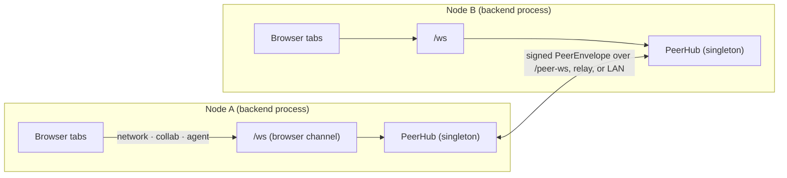
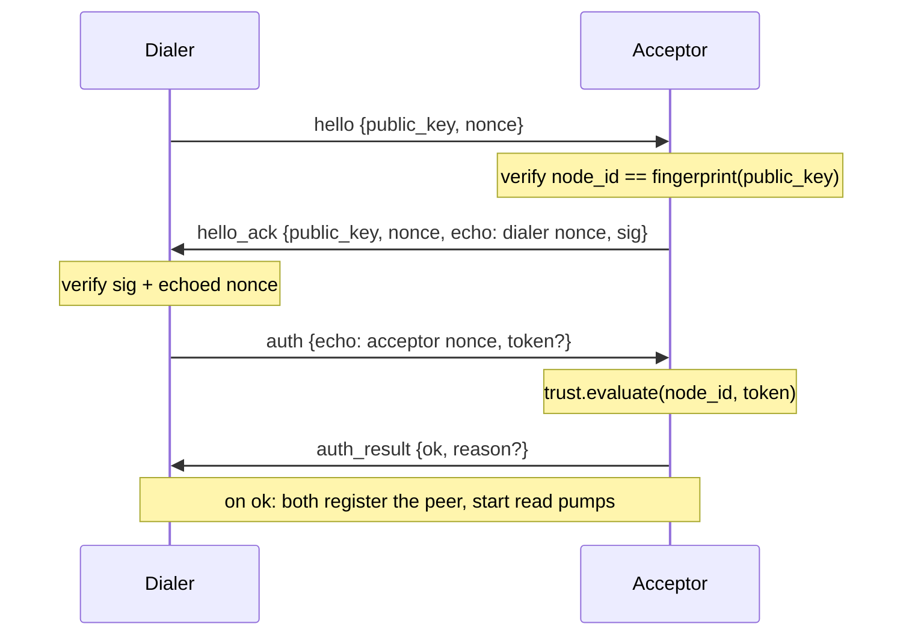

# Distributed peer fabric

horrible-dashboard is a single-user app per install — one FastAPI backend (the
"brain") with a per-browser `/ws` socket. The **peer fabric** lets one node connect
to other users' nodes over TCP/IP so users on different computers can collaborate:
share panes live and have their personal agents talk to each other.

**Status: implemented (groundwork).** Backend in
`backend/modules/network/`, frontend in `packages/core/src/modules/network/`. See
also [Module: network](../modules/network.mdx) for the user-facing surface and
[Agent chat](../modules/agent-chat.mdx) for agent-to-agent.

## The core idea: a process-global hub

The existing `/ws` is **per-browser**, but a peer connection is **per-node** (shared
by all of a node's browser tabs). So the fabric lives in a process-global singleton
`PeerHub` (`hub.py`), constructed at import like `visualizer_manager`. The
user-facing `/ws` `network` channel is just a live view/control surface onto it; the
peer wire is a **separate** endpoint, `/peer-ws`, speaking a different protocol.



## Identity

Each node has a stable **Ed25519 keypair** (`identity.py`), persisted as
`$HORRIBLE_DATA_DIR/network-identity.key` (PEM, `0600`) — never exposed by any API.
The `node_id` is `base32(sha256(public_key))[:16]`: **self-certifying**, so a peer
presenting a public key whose fingerprint doesn't match the `node_id` it claims is
rejected during the handshake. `node_name` is a separate, cosmetic setting
(`network.nodeName`).

## Wire protocol

The peer wire frame is `PeerEnvelope` (`models.py`), deliberately distinct from the
browser's `WsMessage` so the two never collide:

```
{ v, type, msg_id, re?, src, dst?, ts, ttl=8, data, sig }
```

- `sig` is an Ed25519 signature (`protocol.canonical_bytes` + `verify_envelope`).
  It authenticates the **payload** fields (`type`, `msg_id`, `re`, `src`, `ts`,
  `data`) and deliberately **excludes the routing headers** `dst` and `ttl`, so a
  relay can address and hop-count a frame without breaking the signature.
- `re` correlates a reply to a request (`PeerHub.request` awaits a future keyed by
  the request `msg_id`, mirroring the orchestrator's `conn.pending[callId]`).
- Loop/replay guard: a `SeenGuard` LRU drops a repeated `msg_id`; `ttl` bounds relay
  hops.

### Handshake



Every post-handshake envelope is signed and verified against the peer's established
public key in `PeerHub._dispatch`.

## Transports (hybrid)

The `Transport` abstraction (`transport/base.py`) has interchangeable backends,
selected from settings by `setup.build_transports`:

| Transport | When | How |
|---|---|---|
| **direct** (`direct.py`) | default | Outbound `websockets` client dials `ws://host/peer-ws`; inbound via the `/peer-ws` endpoint wrapped in a `ServerPeerLink`. |
| **relay** (`relay.py`) | `network.relayUrl` set | One WebSocket to a rendezvous broker carries traffic for all relayed peers, demultiplexed by `src` into a virtual link per peer. NAT traversal via store-and-forward; envelopes stay end-to-end signed so the broker can route but not forge. |
| **lan** (`lan.py`) | `network.enableLanDiscovery` | Advertises/browses `_horrible-peer._tcp` via zeroconf (mDNS); discovered peers are dialed through the **direct** transport. Auto-connects only under `open-lan` trust. |
| **loopback** (`loopback.py`) | tests | Two hubs talk through paired queues, no sockets. |

The standalone broker is `relay_broker.py`
(`uv run uvicorn backend.modules.network.relay_broker:app --port 9000`): a stateless
forwarder mapping `node_id → connection`, routing frames by `dst`.

## Trust

`trust.py` gates who may pair, per `network.trustMode`:

- **manual** — a peer must present a valid, unredeemed single-use invite token
  (minted by `POST /api/network/invite`, redeemed via `/pair`). Known/trusted peers
  persist in `$HORRIBLE_DATA_DIR/network-peers.json`; tokens in `network-invites.json`.
- **directory** — reserved for a directory service (stubbed: rejects until configured).
- **open-lan** — accept any reachable peer (demo / trusted LAN only).

## Safety

- **Identity**: self-certifying node ids + per-envelope signatures.
- **Loops/replay**: `SeenGuard` + `ttl`.
- **Agent-to-agent**: a remote turn runs under a forced, read-only-by-default mode
  and with no actuating tools, plus an `origin_chain` cycle guard and a hop cap —
  see [Agent chat](../modules/agent-chat.mdx).
- **Lifecycle**: the hub is started/stopped by the app lifespan; tests construct
  fresh hubs (with an explicit signer) rather than importing the global so two nodes
  can coexist in one process.
