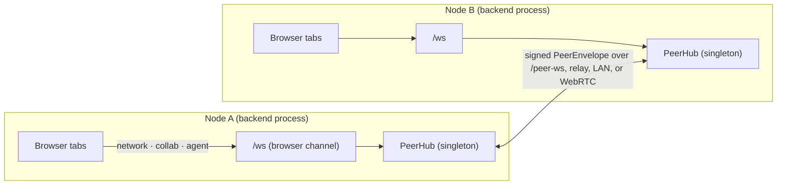
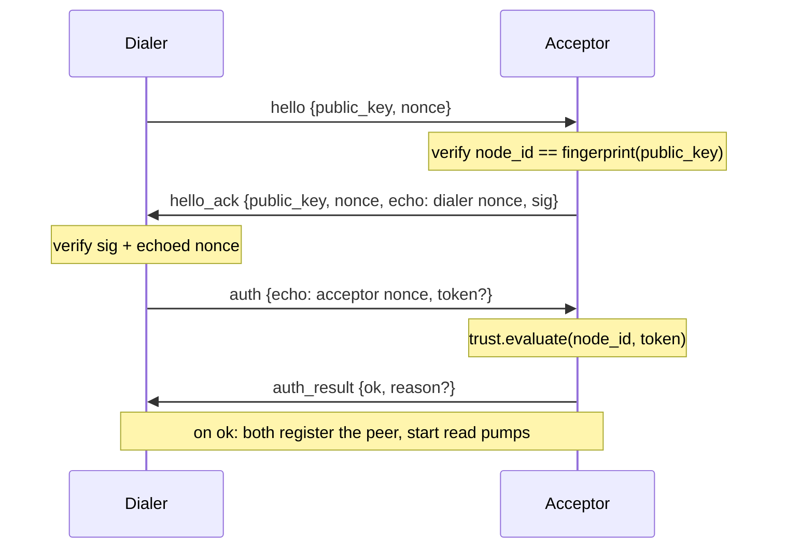
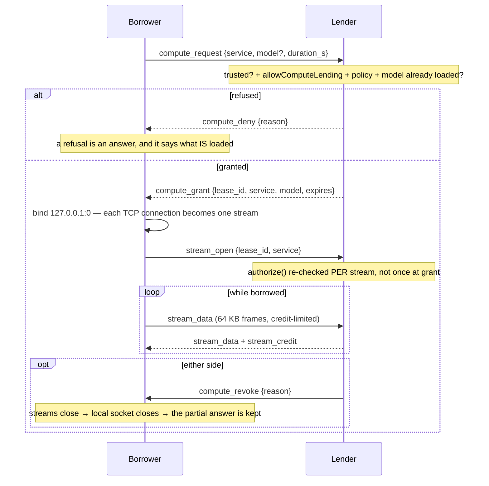

# Distributed peer fabric

horrible-dashboard is a single-user app per install — one FastAPI backend (the
"brain") with a per-browser `/ws` socket. The **peer fabric** lets one node connect
to other users' nodes over TCP/IP so users on different computers can collaborate:
share panes live and have their personal agents talk to each other.

**Status: implemented (groundwork).** Backend in
`backend/modules/network/`, frontend in `packages/core/src/modules/network/`. See
also [Module: network](../modules/network.mdx) for the user-facing surface,
[Agent chat](../modules/agent-chat.mdx) for agent-to-agent, and
[Network protocol & scenarios](network-protocol.mdx) for mermaid sequence diagrams
of each situation plus the proposed lobby design.

## The core idea: a process-global hub

The existing `/ws` is **per-browser**, but a peer connection is **per-node** (shared
by all of a node's browser tabs). So the fabric lives in a process-global singleton
`PeerHub` (`hub.py`), constructed at import like `visualizer_manager`. The
user-facing `/ws` `network` channel is just a live view/control surface onto it; the
peer wire is a **separate** endpoint, `/peer-ws`, speaking a different protocol.



## Identity

Each node has a stable **Ed25519 keypair** (`identity.py`), persisted as
`$HORRIBLE_DATA_DIR/network-identity.key` (PEM, `0600`) — never exposed by any API.
The `node_id` is `base32(sha256(public_key))[:16]`: **self-certifying**, so a peer
presenting a public key whose fingerprint doesn't match the `node_id` it claims is
rejected during the handshake. `node_name` is a separate, cosmetic setting
(`network.nodeName`).

## Wire protocol

The peer wire frame is `PeerEnvelope` (`models.py`), deliberately distinct from the
browser's `WsMessage` so the two never collide:

```
{ v, type, msg_id, re?, src, dst?, ts, ttl=8, data, sig }
```

- `sig` is an Ed25519 signature (`protocol.canonical_bytes` + `verify_envelope`).
  It authenticates the **payload** fields (`type`, `msg_id`, `re`, `src`, `ts`,
  `data`) and deliberately **excludes the routing headers** `dst` and `ttl`, so a
  relay can address and hop-count a frame without breaking the signature.
- `re` correlates a reply to a request (`PeerHub.request` awaits a future keyed by
  the request `msg_id`, mirroring the orchestrator's `conn.pending[callId]`).
- Loop/replay guard: a `SeenGuard` LRU drops a repeated `msg_id`; `ttl` bounds relay
  hops.

### Handshake



Every post-handshake envelope is signed and verified against the peer's established
public key in `PeerHub._dispatch`.

## Transports (hybrid)

The `Transport` abstraction (`transport/base.py`) has interchangeable backends,
selected from settings by `setup.build_transports`:

| Transport | When | How |
|---|---|---|
| **direct** (`direct.py`) | default | Outbound `websockets` client dials `ws://host/peer-ws`; inbound via the `/peer-ws` endpoint wrapped in a `ServerPeerLink`. |
| **relay** (`relay.py`) | `network.relayUrl` set | One WebSocket to a rendezvous broker carries traffic for all relayed peers, demultiplexed by `src` into a virtual link per peer. NAT traversal via store-and-forward; envelopes stay end-to-end signed so the broker can route but not forge. |
| **lan** (`lan.py`) | `network.enableLanDiscovery` | Advertises/browses `_horrible-peer._tcp` via zeroconf (mDNS); discovered peers are dialed through the **direct** transport. Auto-connects only under `open-lan` trust. |
| **webrtc** (`webrtc.py`) | `network.enableWebRtc` + `webrtc` extra | Peer links over an aiortc `RTCDataChannel`. ICE (STUN, optional TURN) punches cone NATs a TCP dial can't reach; the full SDP carries the candidates (aiortc is non-trickle), so signaling is a single offer/answer over the lobby's `signal` frames. Once open, it carries the same signed `PeerEnvelope`s — handshake/trust unchanged. `dial(node_id)` offers; an inbound offer is answered and handed to the hub's acceptor. The relay stays the fallback for paths ICE can't punch (symmetric NAT without TURN). |
| **loopback** (`loopback.py`) | tests | Two hubs talk through paired queues, no sockets. |

The standalone broker is `relay_broker.py`
(`uv run uvicorn backend.modules.network.relay_broker:app --port 9000`): a stateless
forwarder mapping `node_id → connection`, routing frames by `dst`.

## What belongs on this fabric

Every envelope is **signed**, and Ed25519 hashes the whole message — so signing
costs roughly 525 MB/s per core, *linear in payload*. Measured on loopback (the CPU
floor, no wire at all), one 1 MB frame occupies the pump for **19 ms**, and a
sustained 64 KB bulk stream tops out near **57 MiB/s** while pushing a competing
20 Hz stream's latency from 0.29 ms to 1.81 ms p50.

That one number decides what may live here, and the rule generalizes past any
particular feature:

| Tier | Budget | Work | Verdict |
|---|---|---|---|
| **A** | seconds–minutes | eval sweeps, embedding batches, research subagent waves, crawls | **Best fit.** WAN-tolerant; unaffected by the throughput ceiling |
| **B** | tens of ms, streaming | borrowed-model chat (SSE), Whisper/TTS, browser frames | **Works.** Needs the tunnel; degrades gracefully |
| **C** | sub-frame | remote speculative drafting, ggml RPC tensor traffic | **Not worth it.** Per-message crypto dominates |

The tiers are why the compute work landed the way it did: borrowing a peer's
*whole model* (Tier B) rather than reimplementing speculative decoding across the
wire (Tier C), and why ggml `--rpc` is deliberately not wired even though the
official builds do ship the flag — tensor traffic is gigabytes against a ~57 MiB/s
signed pipe. The honest version of Tier C is a binary side-channel authenticated
**once at open** instead of per frame, which is a different and larger project.

Two consequences are already in the code. Handlers declare a **dispatch mode**
(`inline` / `detach` / `serial`) so one slow handler cannot head-of-line-block
every other window on a link — and a handler that calls `hub.request` *must* be
`detach`, since its reply arrives on the very pump it would otherwise be blocking.
And bulk traffic is **rate-limited below saturation** rather than merely split into
64 KB frames: a frame cap alone still leaves a game sharing the link paying 6×.
Both are detailed in [network](../modules/network.mdx#dispatch-policy).

## Borrowing compute

A node can lend another node its GPU, its installed extras, or its embedding
provider. Two pieces: a **lease** (the consent) and a **tunnel** (the pipe).



Four things that are load-bearing:

- **Consent is three gates, not one**: `session.info.trusted`, the default-off
  `network.allowComputeLending`, and `network.computeLeasePolicy`, which **fails
  closed** on an unrecognised value. `ask` currently denies, because treating it as
  "yes" would grant access the user believes they still have to approve.
- **Authorization is re-checked per `stream_open`.** A lease can expire or be
  revoked between two sockets, and a borrower holding an old id must not keep
  getting service.
- **The lease is service-generic** (`llama`, `embed`, `voice`, `clip`, `trace`,
  `browser`), which is why one protocol covers a borrowed GPU, a borrowed Whisper
  and a borrowed embedding batch. Holding one service does **not** grant another.
- **A raw byte tunnel, not an HTTP proxy.** SSE *is* bytes on a socket, so httpx
  against the tunnel port is byte-identical to httpx against a local server — and
  an HTTP proxy would mean reimplementing chunked transfer and preserving SSE
  chunk boundaries by hand.

Because a borrowed endpoint is `127.0.0.1`, **nothing may infer locality from an
address**. Provenance is recorded explicitly instead: an eval run stores `node`, a
peer-embedded batch returns `method: "peer:<node>/<model>"`, a remote research
subagent stores `ran_on`. See
[network](../modules/network.mdx#compute-lending).

## Trust

`trust.py` gates who may pair, per `network.trustMode`:

- **manual** — a peer must present a valid, unredeemed single-use invite token
  (minted by `POST /api/network/invite`, redeemed via `/pair`). Known/trusted peers
  persist in `$HORRIBLE_DATA_DIR/network-peers.json`; tokens in `network-invites.json`.
- **directory** — reserved for a directory service (stubbed: rejects until configured).
- **open-lan** — accept any reachable peer (demo / trusted LAN only).

## Safety

- **Identity**: self-certifying node ids + per-envelope signatures.
- **Loops/replay**: `SeenGuard` + `ttl`.
- **Agent-to-agent**: a remote turn runs under a forced, read-only-by-default mode
  and with no actuating tools, plus an `origin_chain` cycle guard and a hop cap —
  see [Agent chat](../modules/agent-chat.mdx).
- **Shared sessions**: trust is only the *first* gate. A friend reaching this node
  says nothing about what they may do inside a session on it, so every guest action
  passes a per-participant grant ladder — see [Module: share](../modules/share.mdx).
- **Lifecycle**: the hub is started/stopped by the app lifespan; tests construct
  fresh hubs (with an explicit signer) rather than importing the global so two nodes
  can coexist in one process.
