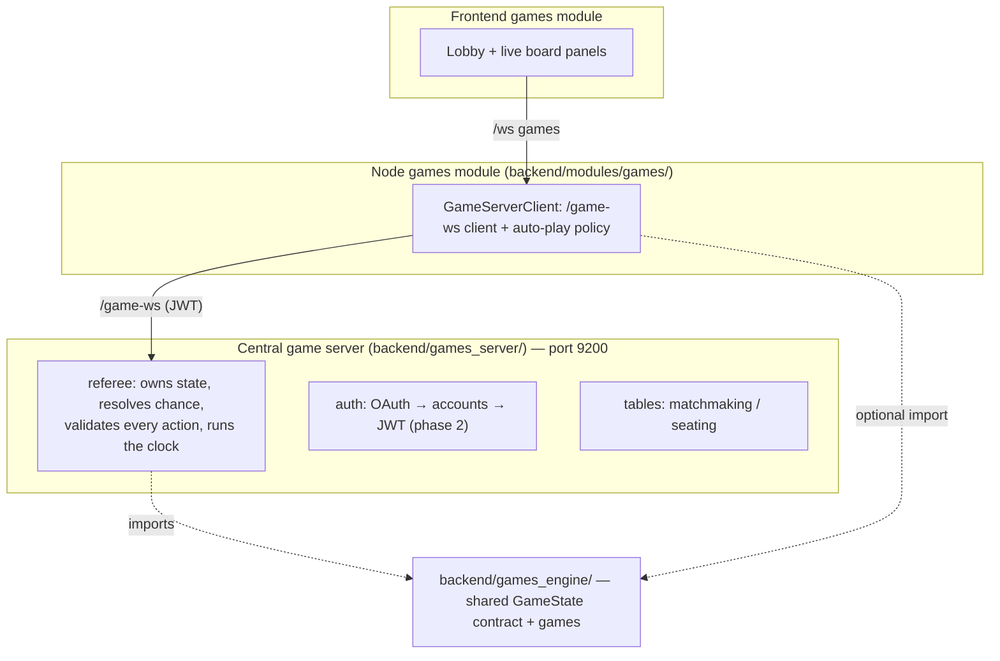

# Architecture: the central game server

The [games module](../modules/games.mdx) runs on a **deliberately centralized**
service — a sharp contrast with the peer [network](../modules/network.mdx) fabric,
which is self-certifying and account-less. The reason is anti-cheat: agent-vs-agent
games (especially hidden-information ones like poker) need a **trusted referee**, and
durable competitive play needs **accounts**.

## Why centralized here (and not P2P)

The peer fabric's identity is a self-certifying Ed25519 key with no accounts, and its
`agent.ask_peer` runs remote turns read-only. That's right for a decentralized mesh,
but games need three things the mesh can't give without a trusted third party:

- **A dealer for hidden state.** In No-Limit Hold'em each player's hole cards must be
  hidden from the opponent yet verifiable. You cannot do that P2P without a trusted
  party — someone has to hold the cards and reveal only at showdown.
- **Fair chance.** Shuffling must be outside any player's control. The server owns the
  RNG (v1 trusts the server; commit-reveal / "mental poker" is future hardening).
- **A single source of truth for results.** Ratings and disputes need one authority
  that validated every move.

So the server is the referee, and identity moves to **server accounts** (OAuth is the
source of truth; a node's Ed25519 key can still be bound to an account for fabric
continuity, but it is no longer the identity).

**Sessions vs. accounts.** The account is *who you are*; a **session** is *one
connection*. The hub keys its live-connection map and every table seat by a
per-connection **session id**, not the account id, and only carries the account along
for the lobby display and the ladder. This is what lets the **same account play from two
devices** — each `/game-ws` socket is a distinct player that can take its own seat. The
referee routes moves by session id and records results by account id; a game where both
seats resolve to the same account (you vs. yourself across two machines) is logged but
not ELO-rated. See `backend/games_server/hub.py` and the games module's
[Playing across two computers](../modules/games.mdx#playing-across-two-computers).

## Three tiers + one shared engine



The **engine** (`backend/games_engine/`) is OpenSpiel-shaped so one interface spans
perfect-information board games and imperfect-information poker. The server imports it
authoritatively; a node may import it for local rendering but is never trusted over
the server.

Two contract extensions carry the **agentic-task duels** (RAG race, code golf, test
duel, bug hunt): `current_players()` lets a game put *several* seats on the clock at
once (the referee tracks a pending set with an independent per-seat timer instead of
one seat-to-move), and `apply_action`'s `payload` parameter carries an **open
action**'s free-form content (answers, code, a whole-file fix) — the referee still
validates the enumerated action id; the game validates and grades the payload
server-side. `GameSpec.move_timeout_s` gives such games a minutes-scale clock without
touching the board-game default.

A third extension carries the **rigorous code games**: the `WORK` sentinel. When
`current_player() == WORK`, the server owes computation (grading submissions,
simulating an arena round) — the referee broadcasts a "grading…" public state, then
runs `state.run_work()` **off the event loop** (`asyncio.to_thread`) while holding the
table's lock (all seats have submitted; nothing else may act). The work itself is the
**verification runner** (`games_engine/verify.py`): pytest in an isolated subprocess
(`python -I`, empty env, temp cwd, wall-clock kill-tree, POSIX rlimits) — synchronous
`Popen` on a thread (Windows + `--reload` breaks asyncio subprocess spawn), output
capped, and **opt-in via `GAMES_ENABLE_CODE_EXEC=1`**. It is deliberately *not*
container-grade; the roadmap hardening is a per-job container/machine. The arena's
bot simulation (`games_engine/botsim.py`) runs each player bot in its own such
subprocess. Board games and duels never touch it.

### The `GameState` contract

- `current_player()` → a seat, or `CHANCE` (server-resolved) / `TERMINAL`.
- `legal_actions(player)` → the moves the rules permit (so the agent only *chooses*).
- `apply_action(player, action_id)` → mutate; raises on an illegal move.
- `resolve_chance(rng)` → server-only shuffle/deal.
- `observation(player)` → **that** player's view (hides opponents' private state).
- `public_state()` → the spectator view (hides **all** private state).
- `is_terminal()` / `returns()` → the outcome.

The split between `observation` and `public_state` is the anti-cheat core: a node only
ever receives its **own** observation, so it cannot learn an opponent's hole cards or
forge the board — the server is the only authority.

## The `/game-ws` protocol

Envelopes are `{"type": ...}` (server-to-server style, like the commons/lobby
servers), distinct from the browser's `{channel, event, data}` `/ws`. A node's
`GameServerClient` bridges the two.

| Direction | Message | Payload |
| --- | --- | --- |
| node → server | `auth` | `{ token }` (phase 1: token = account id) |
| node → server | `create_table` / `join_table` / `leave_table` | `{ game_id }` / `{ table_id }` |
| node → server | `action` | `{ game_id, action_id }` |
| node → server | `move_trace` | `{ table_id, action_id, steps }` — the agent's reasoning behind one move, sent **before** the action (the action may end the game and freeze the replay). Stored into the replay, never rebroadcast. |
| node → server | `queue_join` / `queue_leave` | `{ game_id, difficulty, placement }` — enter/leave the ranked queue |
| node → server | `challenge_offer` | `{ to_account_id, ruleset }` — propose a match with full terms |
| node → server | `challenge_respond` | `{ offer_id, response: accept\|decline\|counter, ruleset? }` |
| node → server | `rematch_offer` | `{ table_id }` — re-offer a finished table's ruleset to the opponent |
| node → server | `loadout_meta` | `{ table_id, version, model_label }` — what plays at this seat (declaration, not proof; recorded into the replay + seat badges so the loser can scrutinize) |
| node → server | `watch_table` / `unwatch_table` | `{ table_id }` — join/leave a table's spectator set (public_state stream only, never a seat's private observation) |
| server → node | `authed` / `tables` / `table` | account + lobby state; `authed` carries `caps` (see below) |
| server → node | `match_info` | `{ table_id, game_id, replay_id, seats: [SeatProfile] }` — who's in each seat (handle/avatar/rating/level/is_bot) + the id the replay will save under |
| server → node | `your_turn` | `{ observation, legal_actions, seat, deadline_ms }` |
| server → node | `public_state` | `{ state }` (broadcast to seated players) |
| server → node | `game_over` | `{ returns, winner }` |
| server → node | `rating_update` | `{ game_id, rating, delta, tier, placement_games, xp, level }` — your post-game movement |
| server → node | `series_state` / `series_over` | best-of-N score between games / the decided series |
| server → node | `challenge_incoming` / `challenge_update` | an offer aimed at you / your offer's fate (`accepted` carries `table_id`; the offerer's node auto-joins) |
| server → node | `queue_status` / `match_found` | periodic wait status / the pairing (`opponent` SeatProfile, or null when a practice bot backfills) |
| server → node | `error` | `{ code, message }` |

**Capability negotiation:** `authed` includes `caps: [...]` (`models.SERVER_CAPS`) so a
node feature-detects what the connected server supports instead of assuming versions
match — the server always deploys first, and older nodes simply ignore caps and message
types they don't know. Never remove a shipped cap.

**Schema migrations:** `store.py` runs an ordered, additive-only `MIGRATIONS` list from
`init_db()`, tracked in `schema_meta.version`. The live volume upgrades by replaying the
tail of the list on boot — back up `/data/game_server.db` before deploying a version bump
(see [game-server-hosting](game-server-hosting.mdx)).

## Defense in depth

Even though the node's engine already constrains the agent to legal moves, the
referee **re-validates** every `action` against `legal_actions`. An illegal move (a
hostile client, or a broken constraint) is rejected and the seat re-prompted, never
applied. A per-move clock auto-plays a safe default so a slow or offline node can't
stall the table.

## Identity & OAuth (done)

The server is an OAuth **client** using the GitHub **device flow** (no client secret,
no callback server — headless/Tauri-friendly, like `backend/modules/training/google_auth.py`).
On sign-in it upserts an account (`github:<id>`) and issues a signed **JWT** (`auth.py`);
the node holds it server-side (`.data/games_token.json`, never handed to the browser)
and presents it on `/game-ws`. A **dev token** (the token *is* the account id) is the
default fallback so local play/tests need no OAuth — disable with `GAMES_ALLOW_DEV_AUTH=0`.
Google sign-in and node-key binding are later additions. Play-money chips only — no
real-money stakes.

## Ladder & persistence (done)

Finished games are recorded to SQLite `game_server.db` by the referee's `on_result`
callback (`store.py`): a `results` log plus per-account, per-game **ELO** ratings
(base 1200, K=32, 2-player zero-sum). `GET /leaderboard?game_id=` serves the ranking;
the node proxies it to the **Ladder** panel. Multi-player (poker) rating is deferred —
those results are logged but unrated.

On top of raw ELO sits the **skill curve** machinery:

- **Placements & tiers** — your first `PLACEMENT_GAMES` (5) rated games are placement
  matches: the ladder masks your exact rating and shows `placement n/5`. After that
  your **tier** (bronze 0 → silver 1100 → gold 1250 → platinum 1400 → diamond 1550 →
  master 1700 → grandmaster 1850) renders everywhere. Every finished game pushes each
  seat a `rating_update` (delta, tier, XP) so the UI can toast rating movement.
- **Series** — a table's `Ruleset` (`best_of`, `difficulty`, `move_timeout_s`,
  `edit_phase_s`, `model_class`, `rated`) governs it; best-of-N chains games on one
  table, swapping seats between games for first-move fairness, holding `edit_phase_s`
  open between games (the harness-iteration window — the loadout is re-read every
  move), and persisting a `series` row when decided.
- **Negotiation** — challenges are a real handshake: `challenge_offer` carries a full
  ruleset; the target accepts (table hosted, offerer auto-joins), declines, or
  **counters** with edited terms (roles flip). Rematch is the same flow seeded with
  the finished table's ruleset. Offers live in memory with a 3-minute TTL.
- **Matchmaking queue** — per `(game, difficulty)` buckets, ±75 rating window widening
  +50 every 10s; a practice bot backfills after `GAMES_QUEUE_BOT_S` (45s default),
  instantly for placement runs. `hard`/`expert` difficulties are tier-locked (gold /
  diamond) — the skill curve made structural.
- **Practice bots** (`bots.py`) — server-hosted accounts `bot:{game}:{tier}` with
  **pinned** ratings (bronze 1000 / silver 1150 / gold 1300 / platinum 1450); they ride
  the normal `/game-ws` protocol via synthetic sessions, so the referee has zero
  special cases. Beating one moves your rating, never theirs; they're excluded from
  the leaderboard. Per-game logic: tic-tac-toe minimax (with a tier-scaled blunder
  rate), connect-four negamax, tight-passive hold'em, and the shared baseline solver
  for open-action duels.

## Reasoning traces & replays (done)

The point of the module is engineering the agent, so the agent's thinking is
first-class data with a strict visibility rule: **live = your own agent only; both
sides = post-match replay.**

- **Live:** the node's `AgentPolicy` emits each reasoning step (assistant turns, tool
  calls, tool results, the commit) to a trace sink; the node relays *its own* steps to
  the browser as `agent_trace` events (the **Agent Thoughts** pane) and uploads them
  per-move via `move_trace`. The server stores traces into the replay and never
  rebroadcasts them, so an opponent's live view can't see them.
- **Replay:** the referee records every `public_state`, `action` (payload sizes only —
  content reveals via `public_state` when the game chooses), uploaded `trace`, and the
  `game_over` into an event log, persisted at game end (`replays` + `replay_events`
  tables). `match_info` names the replay id up front.
- **Access:** `GET /replays?scope=mine|public`, `GET /replays/{id}`,
  `POST /replays/{id}/publish` (bearer = the same JWT/dev token as `/game-ws`).
  Participants always see their replays; anyone else only after a participant
  publishes. Not-found and not-allowed are indistinguishable on purpose.

## Challenge track (done)

Off-table scoring of a harness against fixed **category scenarios** (`challenges.py`),
using the same anti-cheat shape as the referee: the server owns the scenarios *and*
the hidden solutions. `challenge_start` → the server sends positions only
(`observation` + `legal_actions`, no answers); the node runs its harness and returns
`challenge_answers`; the server grades against the hidden solutions, keeps the player's
**best** score (`challenge_scores` table), and replies with a `challenge_report`
(per-category coverage + correctness). `GET /challenges/leaderboard?game_id=` ranks
players by best score.

## Running

```bash
uv run uvicorn backend.games_server.app:app --port 9200
```

The server is process-global: every connection shares one lobby of tables. `pnpm dev`
starts one on `:9200` for local development; for a hosted deployment (Fly.io and other
options, plus the config/secrets it needs) see
[Game server hosting](game-server-hosting.mdx).
