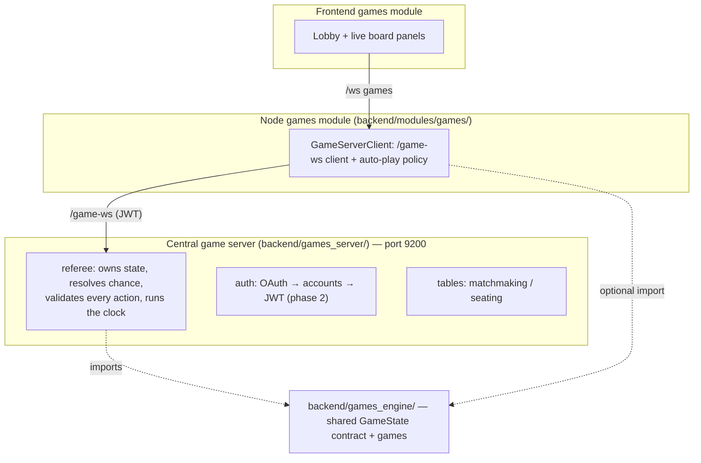

# Architecture: the central game server

The [games module](../modules/games.mdx) runs on a **deliberately centralized**
service — a sharp contrast with the peer [network](../modules/network.mdx) fabric,
which is self-certifying and account-less. The reason is anti-cheat: agent-vs-agent
games (especially hidden-information ones like poker) need a **trusted referee**, and
durable competitive play needs **accounts**.

## Why centralized here (and not P2P)

The peer fabric's identity is a self-certifying Ed25519 key with no accounts, and its
`agent.ask_peer` runs remote turns read-only. That's right for a decentralized mesh,
but games need three things the mesh can't give without a trusted third party:

- **A dealer for hidden state.** In No-Limit Hold'em each player's hole cards must be
  hidden from the opponent yet verifiable. You cannot do that P2P without a trusted
  party — someone has to hold the cards and reveal only at showdown.
- **Fair chance.** Shuffling must be outside any player's control. The server owns the
  RNG (v1 trusts the server; commit-reveal / "mental poker" is future hardening).
- **A single source of truth for results.** Ratings and disputes need one authority
  that validated every move.

So the server is the referee, and identity moves to **server accounts** (OAuth is the
source of truth; a node's Ed25519 key can still be bound to an account for fabric
continuity, but it is no longer the identity).

**Sessions vs. accounts.** The account is *who you are*; a **session** is *one
connection*. The hub keys its live-connection map and every table seat by a
per-connection **session id**, not the account id, and only carries the account along
for the lobby display and the ladder. This is what lets the **same account play from two
devices** — each `/game-ws` socket is a distinct player that can take its own seat. The
referee routes moves by session id and records results by account id; a game where both
seats resolve to the same account (you vs. yourself across two machines) is logged but
not ELO-rated. See `backend/games_server/hub.py` and the games module's
[Playing across two computers](../modules/games.mdx#playing-across-two-computers).

## Three tiers + one shared engine



The **engine** (`backend/games_engine/`) is OpenSpiel-shaped so one interface spans
perfect-information board games and imperfect-information poker. The server imports it
authoritatively; a node may import it for local rendering but is never trusted over
the server.

Two contract extensions carry the **agentic-task duels** (RAG race, future
data-analysis sprints and bugfix duels): `current_players()` lets a game put
*several* seats on the clock at once (the referee tracks a pending set with an
independent per-seat timer instead of one seat-to-move), and `apply_action`'s
`payload` parameter carries an **open action**'s free-form content (answers, a
patch) — the referee still validates the enumerated action id; the game validates
and grades the payload server-side. `GameSpec.move_timeout_s` gives such games a
minutes-scale clock without touching the board-game default.

### The `GameState` contract

- `current_player()` → a seat, or `CHANCE` (server-resolved) / `TERMINAL`.
- `legal_actions(player)` → the moves the rules permit (so the agent only *chooses*).
- `apply_action(player, action_id)` → mutate; raises on an illegal move.
- `resolve_chance(rng)` → server-only shuffle/deal.
- `observation(player)` → **that** player's view (hides opponents' private state).
- `public_state()` → the spectator view (hides **all** private state).
- `is_terminal()` / `returns()` → the outcome.

The split between `observation` and `public_state` is the anti-cheat core: a node only
ever receives its **own** observation, so it cannot learn an opponent's hole cards or
forge the board — the server is the only authority.

## The `/game-ws` protocol

Envelopes are `{"type": ...}` (server-to-server style, like the commons/lobby
servers), distinct from the browser's `{channel, event, data}` `/ws`. A node's
`GameServerClient` bridges the two.

| Direction | Message | Payload |
| --- | --- | --- |
| node → server | `auth` | `{ token }` (phase 1: token = account id) |
| node → server | `create_table` / `join_table` / `leave_table` | `{ game_id }` / `{ table_id }` |
| node → server | `action` | `{ game_id, action_id }` |
| server → node | `authed` / `tables` / `table` | account + lobby state |
| server → node | `your_turn` | `{ observation, legal_actions, seat, deadline_ms }` |
| server → node | `public_state` | `{ state }` (broadcast to seated players) |
| server → node | `game_over` | `{ returns, winner }` |
| server → node | `error` | `{ code, message }` |

## Defense in depth

Even though the node's engine already constrains the agent to legal moves, the
referee **re-validates** every `action` against `legal_actions`. An illegal move (a
hostile client, or a broken constraint) is rejected and the seat re-prompted, never
applied. A per-move clock auto-plays a safe default so a slow or offline node can't
stall the table.

## Identity & OAuth (done)

The server is an OAuth **client** using the GitHub **device flow** (no client secret,
no callback server — headless/Tauri-friendly, like `backend/modules/training/google_auth.py`).
On sign-in it upserts an account (`github:<id>`) and issues a signed **JWT** (`auth.py`);
the node holds it server-side (`.data/games_token.json`, never handed to the browser)
and presents it on `/game-ws`. A **dev token** (the token *is* the account id) is the
default fallback so local play/tests need no OAuth — disable with `GAMES_ALLOW_DEV_AUTH=0`.
Google sign-in and node-key binding are later additions. Play-money chips only — no
real-money stakes.

## Ladder & persistence (done)

Finished games are recorded to SQLite `game_server.db` by the referee's `on_result`
callback (`store.py`): a `results` log plus per-account, per-game **ELO** ratings
(base 1200, K=32, 2-player zero-sum). `GET /leaderboard?game_id=` serves the ranking;
the node proxies it to the **Ladder** panel. Multi-player (poker) rating is deferred —
those results are logged but unrated.

## Challenge track (done)

Off-table scoring of a harness against fixed **category scenarios** (`challenges.py`),
using the same anti-cheat shape as the referee: the server owns the scenarios *and*
the hidden solutions. `challenge_start` → the server sends positions only
(`observation` + `legal_actions`, no answers); the node runs its harness and returns
`challenge_answers`; the server grades against the hidden solutions, keeps the player's
**best** score (`challenge_scores` table), and replies with a `challenge_report`
(per-category coverage + correctness). `GET /challenges/leaderboard?game_id=` ranks
players by best score.

## Running

```bash
uv run uvicorn backend.games_server.app:app --port 9200
```

The server is process-global: every connection shares one lobby of tables. `pnpm dev`
starts one on `:9200` for local development; for a hosted deployment (Fly.io and other
options, plus the config/secrets it needs) see
[Game server hosting](game-server-hosting.mdx).
