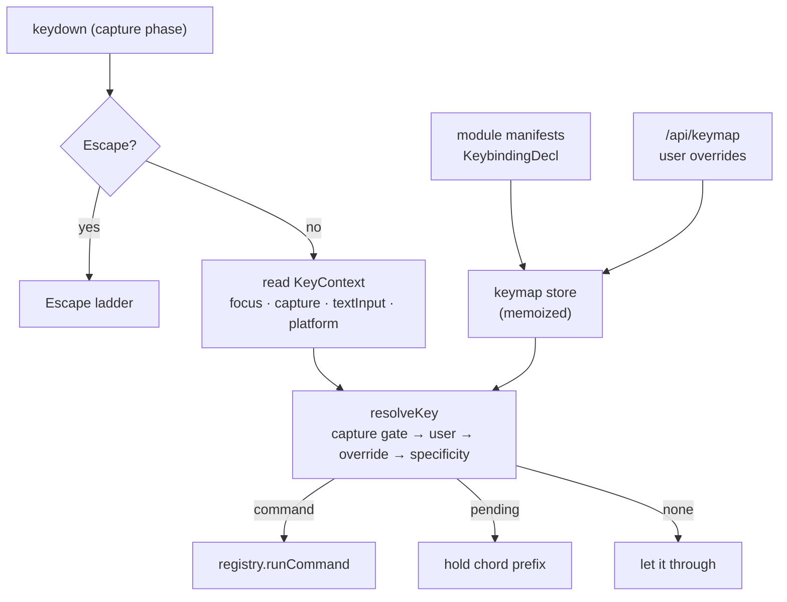

# Keybindings, focus, and input capture

One service owns the keyboard: `packages/core/src/keymap/`. It resolves a
keystroke to a command, knows which pane is focused, lets a pane take the keyboard
outright and give it back, ships defaults that work on each host, and exposes the
whole map to the user and to the agent.



## Key specs

A spec is one or more `+`-separated **strokes**, separated by spaces. Modifier
tokens are `mod` (ctrl, or cmd on macOS), `ctrl`, `meta`, `alt`, `shift`; the last
token is the key. Modifiers match **exactly** — a spec that doesn't name `alt`
rejects an alt-chord, so `mod+b` and `mod+alt+b` bind independently.

| Spec | Meaning |
| --- | --- |
| `mod+k` | Ctrl+K, or ⌘K on macOS |
| `alt+shift+left` | arrow aliases: `left`/`right`/`up`/`down`, plus `space`, `esc` |
| `mod+k mod+s` | a **sequence** — press one stroke, then the next |
| `code:KeyW` | the **physical** key, whatever character it produces |
| `mod++` | the `+` key |

### Two key identities, and why

A bare token matches the **character** the key produces (`e.key`). A `code:`
prefix matches the **physical position** (`e.code`).

Use `code:` for anything positional. `w` is the character W wherever it lives, so
a WASD binding written as characters scatters across an AZERTY keyboard; `code:KeyW`
stays under the same finger. Use the character form for mnemonic bindings (`mod+s`
for save), which should follow the user's layout.

One promotion is automatic: a **digit or ASCII punctuation key combined with
`shift`** resolves positionally, because `e.key` reports the *shifted glyph*.
`shift+1` arrives as `!`, so a character spec for it could never match — this is
why `mod+shift+1` silently never fired before.

`labelSpec` renders a spec for display (`⌘K` on macOS, `Ctrl+K` elsewhere),
resolving `code:` specs through `navigator.keyboard.getLayoutMap()` when available
so the label matches what is printed on the user's keys.

:::note
`formatSpec` writes the space key back as `space`, never as a literal `' '`.
Strokes are space-separated, so `ctrl+ ` would re-parse as `ctrl++` — a stored
override for `ctrl+space` would corrupt on reload.
:::

## Conditions: the `when` clause

A binding may carry a `when` string over a **closed** vocabulary of context keys,
combined with `&&`, `||`, `!`, `==`, `!=` and parentheses. The vocabulary is
closed on purpose: it fits on one screen, the Shortcuts pane can explain any
clause, and `keymap.context` can hand the agent the complete list so it cannot
invent a key that silently never matches.

| Key | Type | Meaning |
| --- | --- | --- |
| `paneFocus` | string | View id of the focused pane, e.g. `editor.buffer` |
| `paneInstance` | string | Instance id of the focused pane (`editor.buffer#3`) |
| `capture` | string | `keyboard` / `pointer` / `full`, or null |
| `captureView` | string | View id holding capture |
| `textInput` | boolean | An input/textarea/contenteditable holds DOM focus |
| `dialogOpen` | boolean | A modal dialog is open |
| `fullscreenArea` | boolean | An area is fullscreened in-window |
| `windowFocused` | boolean | A desktop window (not a tiled area) holds focus |
| `desktopMode` | string | `floating` or `tiling` — the active desktop's paradigm |
| `shellView` | string | `boot`, `oobe` or `desktop` |
| `platform` | string | `mac` / `win` / `linux` |
| `host` | string | `browser` or `desktop` |

The legacy `scope: '<viewId>'` field is shorthand for
`when: "paneFocus == '<viewId>'"` and is normalized to it at merge time.

## Precedence

`resolveKey` picks a winner in this order:

0. **The capture gate.** If a pane holds the keyboard, the candidate set is
   filtered before anything else is considered (see below).
1. **`source: 'user'`** beats a shipped default.
2. **`override: true`** — for shortcuts that must never be shadowed. `alt+x`
   (the minibuffer) is the one that ships with it. The spotlight's `mod+k`
   deliberately does **not**: a focused terminal shadowing it with
   `terminal.clear` is the iTerm/VS Code convention and is intended.
3. **The more specific satisfied `when`** — naming `paneInstance` beats naming
   `paneFocus` beats naming nothing. `priority` is an explicit thumb.
4. **Registration order**, earlier first.

## Desktop and window bindings

Every chord below was checked against `reserved.ts` before it was chosen. The
conventional ones are unavailable: `alt+tab` never reaches the page on Windows or
Linux, `meta+m` is macOS minimize, and `meta+space` / `ctrl+space` are Spotlight and
the IME toggle. **A binding that silently never fires is worse than a less familiar
one that does**, which is the whole reason that table exists.

| Action | Binding | Why not the convention |
| --- | --- | --- |
| Spotlight (ask / run / open) | `mod+k` | `mod+space` is macOS Spotlight and the Windows IME switch |
| Cycle windows | ``alt+` `` / ``alt+shift+` `` | `alt+tab` is OS-level and unpreventable |
| Directional window focus | `alt+←↑↓→` | — |
| Snap half / maximize | `mod+shift+←↑↓→` | `mod+alt+arrow` is already the frame's split |
| Minimize / maximize | `mod+alt+↓` / `mod+alt+↑` | `meta+m` is macOS minimize |
| Toggle tiling / floating | `mod+alt+t` | — |
| Switch desktop | `mod+alt+1..9` | plain `mod+1..9` is browser tab switching |

The directional four are the interesting case. `alt+←` is *already* the frame's
`area.focus:left`, and both are live at once on a tiling desktop — a tiling desktop
can hold floating windows. So the window bindings carry `when: "windowFocused"`,
and precedence rule 3 resolves it: a binding naming a context key beats one naming
nothing, so `area.focus:left` owns the chord normally and `window.focus:left` takes
it the moment a window has focus. No mode flag, no second dispatcher.

## Presets

`keymap.preset` selects a named alternative default set — today `default` and `i3`.

A preset is expressed as **ordinary overrides**, the same shape the Shortcuts pane
writes, and applied through the same resolver. There is deliberately no second
dispatcher and no second notion of "a default". It layers *between* the shipped
defaults and the user's own edits, so:

- a preset's `disabled` entry suppresses a shipped default (that is how the i3 set
  takes `mod+k` away from the spotlight, with no special case in the resolver);
- a hand rebind still beats the preset it was layered over;
- switching back to `default` removes the set cleanly, because it was never *saved*
  as if the user had typed it.

The i3 set makes two forced deviations, both worth stating because they look like
mistakes. The i3 modifier is the **Super key**, which a web page never receives as a
chord on its own, so `mod` here is ctrl/cmd. And workspace switching stays on
`mod+alt+<n>`: plain `mod+<n>` is browser tab switching and is not cancellable.

## Input capture

A pane that needs the keyboard takes **capture**. While it is held, the resolver
only considers bindings belonging to that pane, plus anything marked
`capturePassthrough`.

| Mode | Swallows |
| --- | --- |
| `pointer` | the mouse only; every shortcut still works |
| `keyboard` | unmodified keys only — an editor gets `t`, the shell keeps `mod+s` |
| `full` | every shortcut but the capturing pane's own — a pointer-locked game |

Two invariants are enforced by the store, not by each pane:

- **Only the focused pane may hold capture**, and losing focus releases it. Before
  this, `hassault.play` kept `window`-level listeners alive whether or not it was
  the pane you were in.
- **Release runs `onRelease` exactly once**, whoever triggered it — the Escape
  ladder, a focus change, or unmount.

Declaring `capture` in a view's manifest grants it on focus and drops it on blur
(what editors and terminals want). The deprecated `editor: true` flag is exactly
`capture: { mode: 'keyboard', escape: 'passthrough' }`. A pane that captures only
*sometimes* — a game, and only once pointer-locked — declares nothing and calls
`useCapture().request()` at the moment it needs the keyboard.

## The Escape ladder

Escape used to be claimed independently by the dialog layer (capture phase), the
frame's area-fullscreen exit (bubble phase), and the browser's own pointer-lock
release, with no ordering — pressing it in a fullscreened area with a dialog open
did two things at once. It is now one ordered ladder in
`keymap/dispatch.ts`; the first rung that applies wins.

1. A half-typed chord → abandon it.
2. A modal dialog → dismiss it.
3. Capture held with `escape: 'release'` → release.
4. Capture held with `escape: 'passthrough'` → **deliver Escape to the pane**, and
   release only if it is *held* past `keymap.escapeHoldMs` (default 400 ms).
5. An in-window fullscreened area → exit.
6. A popover or context menu → close the most recent.
7. Otherwise → let it through.

:::warning The hold gesture is not always available
Keeping Escape away from the browser needs `navigator.keyboard.lock(['Escape'])`,
which is **Chromium-only and only in document fullscreen**. Everywhere else the
browser exits pointer lock on the first Escape whatever the page does, and rung 4
degrades to rung 3.

This is surfaced, not hidden: the capture badge reads "Hold Esc to release" or
"Esc to release" based on `canHoldEscape()` at that moment. Promising a gesture
that silently doesn't work is worse than offering the tap.
:::

## Host reservations

Some chords never reach the page. `keymap/reserved.ts` is a table of them per
host and platform, with `preventable` marking the ones `preventDefault()` can
reclaim (browser Back on `alt+left`) versus the ones that never arrive at all
(`mod+1..9` tab switching).

It is consumed three ways: the Shortcuts pane badges a conflicting binding live,
`auditKeymap()` logs unreachable defaults in dev, and `keymap.set` **refuses** to
write a binding the host would swallow — otherwise the user "successfully" rebinds
and then finds nothing happens.

This is why defaults split by host. `KeybindingDecl` takes `hosts` and
`platforms`, so one command can ship two:

```ts
// mod+1..9 is browser tab switching and is NOT cancellable — in a tab these
// bindings never once fired. The browser build gets alt+N instead.
{ key: 'mod+1', command: 'workspace.switch:1', hosts: ['desktop'] },
{ key: 'alt+1', command: 'workspace.switch:1', hosts: ['browser'] },
```

`ctrl+space` gets the same treatment: it is the IME toggle on Windows and the
input-source switch on macOS, so `area.fullscreen` ships as `mod+alt+f` there.

## Global shortcuts (desktop)

A binding marked `global: true` is registered with the OS so it fires while the
app is unfocused. Gated on the `shortcuts.global` capability, so it is a no-op in
the browser. The frontend owns which command each accelerator runs
(`keymap/global.ts`); the Rust side (`apps/desktop/src-tauri/src/shortcuts.rs`) is
a dumb registrar that emits a `global-shortcut` event, so a rebind never needs a
Rust change. Sequences are ineligible — the OS grabs one chord, not a prefix — and
`code:` specs are rejected rather than registered as the wrong key.

## Focus

Focus is one field: `frame.focusedInstanceId`. The view id and location are
derived from it (`findPaneAnywhere`) rather than stored, so they cannot drift.

`focusedAreaId` still exists and still names a **center area** — area verbs
(split, join, `alt+arrow` navigation) need one — but it is written *from* the focus
dispatch. Focusing a docked or floating pane sets the instance and leaves the area
alone; focusing a center pane sets both. Before this split, clicking a docked tool
left every pane-scoped command pointed at whatever center area was focused last.

A `sanitizeFocus` pass runs after every action, so a closed pane can never leave
focus dangling.

Pane containers carry `data-pane-instance` and `tabIndex={-1}`, and
`focusInstance` / `focusAreaDirection` call `focusPaneDom` — so `alt+arrow` moves
the real caret, not just the accent border. A pane can nominate a better target
with `data-autofocus`.

## User customization

Overrides live in their own document, `$HORRIBLE_DATA_DIR/keymap.json`, behind
`GET/PUT/DELETE /api/keymap`. **Deliberately not a setting**: `SettingValue` is
`string | number | boolean`, and `GET /api/settings` hands the whole bag to the
browser on every boot.

An entry either **adds** a binding, or **disables** one (`disabled: true`). A
rebind is both — add the new, disable the default — and the two must land
together, which is why the endpoint is whole-document rather than per-binding.
Omitting the disable half is the "I changed it but the old key still works" bug.

A corrupt keymap file falls back to defaults rather than raising: a bad keymap must
never lock the user out of the UI that would fix it.

The [Shortcuts pane](../modules/keymap.mdx) is the UI. The command palette shows
each command's live shortcut in place of its id.

## Agent tools

| Tool | Purpose |
| --- | --- |
| `keymap.list` | commands, bindings, conditions, source, reserved status |
| `keymap.describe` | what a key does / what binds a command, **and why a binding is not firing** |
| `keymap.set` | write a user override (gated — persistent user-visible state) |
| `keymap.reset` | clear overrides for a command, or all |
| `keymap.context` | the `when` vocabulary and its current values |

`keymap.describe` reporting the *reason* a binding lost — shadowed, condition
false, swallowed by a capturing pane, taken by the host — is what makes "I don't
like this, change Tab so it does X" resolvable in one turn.

## Adding a binding

```ts
export const myModule: ModuleManifest = {
  id: 'my',
  title: 'My module',
  commands: [{ id: 'my.thing', title: 'My: Do the thing', run: doThing }],
  keybindings: [
    { key: 'mod+alt+t', command: 'my.thing' },
    // Only while my pane is focused, and shadowing any global on the same key.
    { key: 'n', command: 'my.next', when: "paneFocus == 'my.pane'" },
  ],
};
```

Never install a `keydown` listener in a component. The one exception is a pane
that captures input, and it takes capture so the shell knows.
