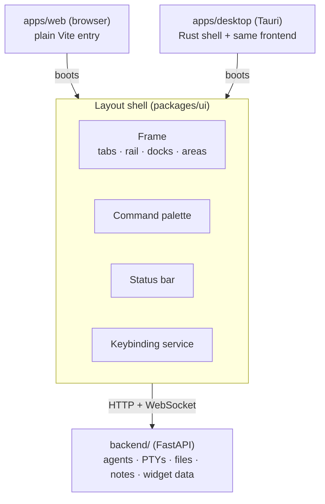

# Layout shell: one frontend, two layouts

The browser app and the desktop app render the **same React frontend**. There is
no per-platform fork of the UI. The differences between the two are confined to
(a) the app entry that boots the shell and (b) the platform capabilities exposed
to modules.



## Implementation status

Implemented: module registry, command palette (Ctrl+K), keybinding service
(`mod+` prefix), capability service, and both entries (`apps/web` on port 5173
proxying `/api` and `/ws` to the backend on port 8000; `apps/desktop` Tauri shell
loading the same dev server). The shared `/ws` socket is consumed via a single
multiplexed client (`packages/core/src/ws.ts`, channel subscriptions + `sendChannel`)
— its users are the observability `telemetry` channel (see
[../modules/observability.md](../modules/observability.mdx)) and the `agent`
channel that drives the agent orchestrator (see
[../modules/agent-chat.md](../modules/agent-chat.mdx)). The backend `/ws` handler
is a bidirectional router: telemetry pushes outbound while one receive loop
dispatches inbound channel messages.

The shell has two top-level **views** (switched by the shell's own
`shell.home` / `shell.workspace` commands):

- **`home`** — the default on open: a minimal centered surface (3D
  dashboard-friend avatar, greeting, ask bar streaming from the local model) that
  hosts agent onboarding until a local model is configured (see
  `docs/modules/agent-chat.md`). Modeled on chat-first launchers, deliberately
  free of workspace chrome. The avatar (`packages/core/src/Avatar3D.tsx` — moved
  to core so feature modules like the agent chat pane can use it too) is a
  rigged glTF character (`/my-avatar.glb`) loaded with three's `GLTFLoader`,
  with pointer-tracking. It expresses the agent's **emotional mood** as a looping
  animation: the `moods` prop maps mood names to animation clips
  (`DEFAULT_AVATAR_MOODS` — `happy → /dancing.glb`, `flair → /flair.glb`,
  `error → /falling-over.glb`, all in `apps/web/public/`) and the `mood` prop
  selects the active one, cross-fading on change. Adding a mood is one `.glb`
  plus one line in the map. Orbiting the avatar is **Dashy**, the dashboard
  mascot — a cute glowing orb with eyes that face the viewer, whose glow doubles
  as the agent status light. three is dynamically imported so the workspace view
  never loads it.
- **`workspace`** — the **frame**: a hybrid VS Code/Blender layout engine.
  Documents tab into a Blender-style center grid of splittable **areas**, tools
  live in three fixed **docks** behind VS Code-style **activity rails**, and
  widgets take areas of their own. Several **workflow workspaces** exist —
  predefined frame presets like **Dashboard**, **Scripting**, and **Coding
  Harnesses** plus any custom ones; each persists its complete frame (docks +
  center + regions + floating). A custom engine — no third-party docking
  library — wrapped so the registry stays the public API. See
  [windowing.mdx](windowing.mdx) for the model, roles, pane types vs instances,
  presets, and persistence.

A persistent **workspace tab strip** across the top (home/logo at its left, one
tab per workspace preset + a `＋` for custom ones) is the only chrome shared by
both views — the single workspace switcher (Blender-style). Clicking a tab
enters the workspace view and activates that workspace. Inside the workspace
view, the frame adds an **activity rail down each side**, each driving the dock
on that side (click opens a tool in its dock, click again hides the dock; the
left rail also carries the bottom dock's tools and the command palette), and a
**minibuffer** along the very bottom — status line when idle, `alt+x` for slash
commands, and where `dialogs.prompt()` renders (see
[windowing.mdx](windowing.mdx#the-minibuffer)).
Individual panes are opened from the palette, a rail (tools), or each area's
type switcher. The Frame stays mounted across view switches so its layout
survives a trip home.

Branding: source art lives in `assets/` (`logo.svg`, `banner.svg`) —
`pnpm build:icons` regenerates the web favicon (`apps/web/public/favicon.ico`,
16/32/48), the SVG favicon copy, and the Tauri app icons (full size set) from
`assets/logo.svg`. The shell header shows the logo; `assets/banner.svg` is the
README banner.

## The workspace

The shell owns a dockable workspace: panels arranged in split panes and tab
groups, persisted per layout profile. Modules never render themselves into the
DOM directly — they **register panels** with the module registry
(`packages/core`), and the workspace decides where panels live (default
placement comes from the panel declaration; the user can rearrange freely).

Everything user-facing routes through two shell services:

- **Command palette** — every module capability is a registered command
  (`module.verb` ids, e.g. `terminal.new`, `chat.focusInput`). Panels' buttons
  invoke commands; the palette and keybindings invoke the same commands. This is
  what keeps both layouts behaviorally identical.
- **Keybinding service** — maps keys to command ids, conditioned on the focused
  pane and on whether a pane has captured the keyboard. Modules declare defaults,
  the user can rebind anything, and on desktop it registers OS global shortcuts.
  Fully documented in [keybindings.mdx](keybindings.mdx); the summary below is
  just the frame's own defaults.

### Keybindings

A `KeybindingDecl` is `{ key, command }` plus optional `when` (a condition over a
closed context-key vocabulary), `override`, `hosts`/`platforms`, and `global`.
Precedence is **capture gate → user override → `override: true` → most specific
`when` → registration order**. Key specs are `+`-separated modifier tokens plus
the key (`mod+k`, `alt+shift+left`, `mod+k mod+s` for a sequence, `code:KeyW` for
a physical key).

Focus lives in `frame.focusedInstanceId`; a pane that needs the whole keyboard
takes **capture**, and Escape unwinds through one ordered ladder. All of that,
plus host-reserved chords and the `keymap.*` agent tools, is in
[keybindings.mdx](keybindings.mdx). (CodeMirror/xterm keep their own internal
keymaps; this service is for registry command bindings.)

### Default frame keybindings

| Key | Action |
| --- | --- |
| `t` / `n` / `b` | toggle the focused pane's left / right / bottom **region** strip |
| declared letters (`o`, `s`, `g`, …) | reveal that region view on the focused pane |
| `ctrl+space` (Linux) · `mod+alt+f` (mac/Windows) | fullscreen the focused area (in-window) |
| `f11` (desktop only) | toggle native OS-window fullscreen (`window.fullscreen`) |
| `alt+arrows` | move focus between areas |
| `alt+shift+arrows` | move the active pane to the neighboring area |
| `mod+alt+arrows` | split the focused area in that direction |
| `mod+alt+j` | join the focused area with a neighbor |
| `mod+b` / `mod+alt+b` / `mod+j` | toggle the left / right / bottom dock |
| `mod+1..9` (desktop) · `alt+1..9` (browser) | switch workspace by position |
| `mod+k` | command palette (a focused pane may shadow it — the terminal binds it to `terminal.clear`) |
| `alt+x` | minibuffer / M-x — slash commands (`override`, never shadowable) |
| `mod+k mod+s` | Keyboard Shortcuts pane |

Two of those rows split by host or platform for a reason. `mod+1..9` is browser
tab switching and is **not** cancellable, so in a tab those bindings never fired
at all; `ctrl+space` is the IME toggle on Windows and the input-source switch on
macOS. Both are in the reserved table, and the Shortcuts pane flags any binding
that lands on one.

## Platform capability service

Modules must never check `window.__TAURI__` or user-agent sniff. `packages/core`
exposes a capability service; feature code branches on capabilities and degrades
gracefully:

| Capability             | Browser                            | Desktop (Tauri)                  |
| ---------------------- | ---------------------------------- | -------------------------------- |
| `fs.nativeDialogs`     | no (backend workspace roots only)  | yes (native open/save dialogs)   |
| `shell.revealInOS`     | no                                 | yes                              |
| `notifications.system` | Web Notifications (tab-scoped)     | OS notifications                 |
| `window.multi`         | no (single tab, pop-out = new tab) | yes (panel pop-out to OS window) |
| `window.perWorkspace`  | no                                 | **yes** (open a workspace in its own OS window) |
| `window.fullscreen`    | no (in-window fullscreen-area only) | **yes** (F11 toggles native OS-window fullscreen) |
| `chrome.workspaceTabs` | no (the frame renders its own tab strip) | **yes** (undecorated window; the tab strip is the titlebar) |
| `shortcuts.global`     | no                                 | **yes** (`global: true` bindings registered with the OS) |
| `tray`                 | no                                 | yes                              |

The `window.*`/`chrome.*` **phase-2** rows are the contract for the native
shell (workspace-per-OS-window, native chrome hosting the workspace tab strip,
OS fullscreen). They exist in the `Capability` union so the frame can branch on
them. The Tauri shell grants these through `DESKTOP_CAPABILITIES`, and the
desktop entry wires a `WindowControl` seam (`packages/core/src/window.ts`) to
the shell's `window_*` commands (`apps/desktop/src-tauri/src/window.rs`).
Shipped so far:

- **`window.fullscreen`** — `F11` (command `shell.toggleFullscreen`) toggles
  native OS-window fullscreen, distinct from the frame's in-window
  `area.fullscreen` (`ctrl+space`).
- **`chrome.workspaceTabs`** — the desktop window is **undecorated**
  (`decorations: false`) and the workspace tab strip is its titlebar: the strip's
  empty space is a native `data-tauri-drag-region` (moves the window, maximizes
  on double-click, handled in the webview), it hosts the min/maximize/close
  controls (`WindowControls`), and invisible edge grips (`WindowResizeHandles`)
  drive OS edge-resize since the frame has no native borders.
- **`window.perWorkspace`** — a workspace tab's context menu gains **Open in new
  window**, which opens (or focuses) a second OS window via `window_open_workspace`.
  The new window is labelled `ws-<id>` and opens **detached**: `AppShell` drops the
  workspace-switcher strip and home view for a slim draggable titlebar
  (`DetachedTitlebar` — workspace name + window controls) over that one workspace's
  frame (rail + docks + center), Blender detached-area style. Its target workspace
  arrives via a Tauri **initialization-script** global
  (`window.__HORRIBLE_WORKSPACE__`) that `main.tsx` reads to boot straight into it
  (the `?workspace=` query is a browser-testing fallback). Two things the command
  gets right the hard way: it's **`async`** (a sync command runs on the main thread,
  where `WebviewWindowBuilder::build()` deadlocks the whole app), and in dev it
  loads **`build.devUrl` via `WebviewUrl::External`** (a runtime-created
  `WebviewUrl::App` resolves to the production asset protocol, which has no built
  `dist` → a blank webview). All windows share one backend and persist their own
  workspace server-side, so no per-platform fork; the `ws-*` capability glob grants
  secondary windows the same titlebar permissions as `main`. (v1 caveat: opening
  the *same* workspace in two windows is last-write-wins on autosave, and the
  server "active" flag tracks the most recently switched workspace in any window.)

Phase 2 is complete; all three native-shell capabilities ship.

The `window_*` custom commands are ACL-gated like any command here: each needs a
permission in `apps/desktop/src-tauri/permissions/` listed in
`capabilities/default.json` (the `data-tauri-drag-region` additionally needs the
core `window:allow-start-dragging` / `window:allow-internal-toggle-maximize`
permissions). Wiring a new native capability follows this same path: grant it in
`DESKTOP_CAPABILITIES`, add the Tauri command(s) + their permission, extend the
relevant host seam,
and gate the feature on `hasCapability(...)` so the browser degrades cleanly.
The desktop build claims `DESKTOP_CAPABILITIES` (vs the browser's
`BROWSER_CAPABILITIES`) via the `isTauri()` branch in `apps/web/src/main.tsx`.

## Backend connection

Both layouts talk to the same FastAPI backend over HTTP + WebSocket, through one
origin switch (`packages/core/src/origin.ts`, set once at boot via
`initBackendOrigin`):

- **Browser:** origin stays `null` — paths are relative (`/api`, `/ws`) and the
  Vite dev server proxies them to `localhost:8000`. Start the backend yourself
  (`scripts/dev-backend.ps1` or `uv run uvicorn backend.app:app --port 8000`).
  Anything that executes on the backend (terminals, file access, agents) runs
  **where the backend runs**, not where the browser runs. Module docs call this
  out where it matters.
- **Desktop:** the Tauri shell **spawns and supervises the backend itself**
  (`apps/desktop/src-tauri/src/backend.rs`). On launch it locates the repo
  checkout, reuses an already-running backend on `:8000` if there is one
  (dev-backend.ps1 coexistence), otherwise picks a port (8000 preferred,
  ephemeral fallback) and spawns uvicorn bound to `127.0.0.1` — via the repo's
  `.venv` python when present, else `uv run` — with MinGW dirs stripped from the
  child PATH (the `no OPENSSL_Applink` crash). It restarts the process with
  backoff if it dies (3 fast failures → `failed` with the stderr tail) and kills
  it on app exit. The frontend polls the `backend_status` Tauri command at boot
  and uses **absolute** http/ws URLs from then on — no Vite proxy in the loop,
  so dev and packaged builds exercise the same path. If the backend never comes
  up, boot proceeds pluginless and the home view shows the backend-down hint.

A packaged desktop build has no repo checkout: the supervisor reports
`unavailable`, which is the plug point for a future bundled/downloaded runtime
(python-build-standalone). A per-session auth token between shell and backend is
a planned follow-up — today anything on localhost can reach the API.

The shell owns a single multiplexed WebSocket connection with reconnect/backoff;
modules subscribe to channels on it rather than opening their own sockets.

## Toast notifications

The layout shell contributes a global **Toast Notification System** for displaying non-blocking, transient visual alerts (success, info, warning, error) that slide in from the top-right corner. It is designed to be usable by any module or plugin to announce background events (such as peer connections, file exports, or network status changes).

* **Store (`toastsStore`)** — lives in `packages/core/src/toasts.ts` (exported as `toastsStore` and type `Toast` from `@horrible/core`). Operates as a simple pub/sub store with React `useSyncExternalStore` support:
  * `toastsStore.add(type, title, message, duration?)` — triggers a new notification. Default duration is 4 seconds (`4000`ms); set to `0` or negative to keep it persistent until closed.
  * `toastsStore.remove(id)` — clears a notification by its unique ID.
* **Component (`Toasts`)** — lives in `packages/ui/src/Toasts.tsx` (rendered in the global `AppShell` layout overlay). Uses glassmorphism styling (`backdrop-filter: blur(12px)`) and cubic-bezier transition slide animations defined in `packages/ui/src/styles.css`.

### Usage Example
```typescript
import { toastsStore } from '@horrible/core';

// Success notification
toastsStore.add('success', 'File Exported', 'Workspace layout successfully saved to disk.');

// Error notification with persistent display
toastsStore.add('error', 'Sync Failed', 'Failed to connect to the peer fabric.', 0);
```

## Modal dialogs (prompt / confirm)

Toasts **inform**; dialogs **ask**. The shell contributes a promise-based modal
system that replaces the browser's `window.prompt` / `window.confirm` (which are
unstyled, untestable, and block the whole tab). No module calls the native dialogs
anymore — they all route through here, so input and confirmation look and behave
the same in both layouts.

- **Store (`dialogsStore` / `dialogs`)** — `packages/core/src/dialogs.ts`,
  exported from `@horrible/core`. Requests **queue** (one shown at a time) and each
  returns a promise:
  - `dialogs.prompt({ title, message?, defaultValue?, placeholder?, confirmLabel?, cancelLabel? })`
    → `Promise<string | null>` (null on cancel).
  - `dialogs.confirm({ title, message?, confirmLabel?, cancelLabel?, danger? })`
    → `Promise<boolean>`. `danger: true` renders the confirm button red for
    destructive actions (delete).
- **Component (`Dialogs`)** — `packages/ui/src/Dialogs.tsx`, mounted in `AppShell`
  beside `<Toasts />`. Renders the active dialog centered over a dimmed backdrop;
  Enter submits, Escape and backdrop-click cancel, the field auto-focuses. Styles
  (`.dialog-*`) live in `packages/ui/src/styles.css`.

Outside React (commands, CodeMirror keymaps) call `await dialogs.prompt(...)`
directly; where a handler must return synchronously (e.g. an editor keymap), fire
the promise and act in `.then(...)`. Pair the result with a toast for feedback —
e.g. confirm a delete, then `toastsStore.add('info', 'Deleted', …)`.

### Usage Example
```typescript
import { dialogs, toastsStore } from '@horrible/core';

const name = await dialogs.prompt({ title: 'New workspace', confirmLabel: 'Create' });
if (name?.trim()) {
  await createWorkspace(name.trim());
  toastsStore.add('success', 'Workspace created', `“${name.trim()}” is ready.`);
}

const ok = await dialogs.confirm({
  title: 'Delete file',
  message: "This can't be undone.",
  confirmLabel: 'Delete',
  danger: true,
});
if (ok) await remove();
```

## What belongs in each entry

- `apps/web`: boot the shell, resolve the backend origin (Tauri: ask the shell's
  `backend_status` command; browser: relative + proxy), register the browser
  capability set. Nothing feature-specific.
- Boot is **async**: after registering built-in modules, the entry awaits
  `loadPlugins()` (installed marketplace plugins, see
  [plugin-sdk.md](plugin-sdk.mdx)) before the first render, so restored layouts
  find plugin panels/widgets already registered. If the backend is down, boot
  proceeds without plugins.
- `apps/desktop`: same boot, plus Tauri-only wiring — window chrome, tray, global
  shortcuts, multi-window pop-out, native menu that dispatches to the same
  command registry. Rust code in `src-tauri/` stays a thin shell; app logic
  belongs in the backend or `packages/`.
