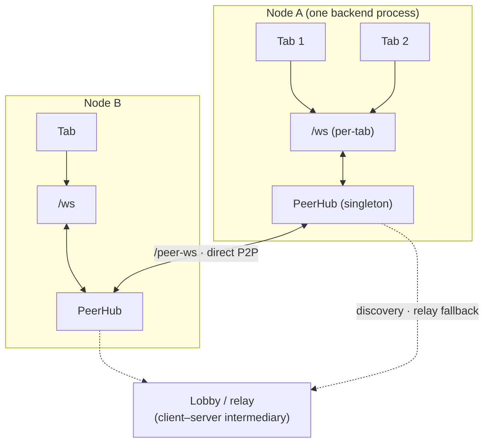
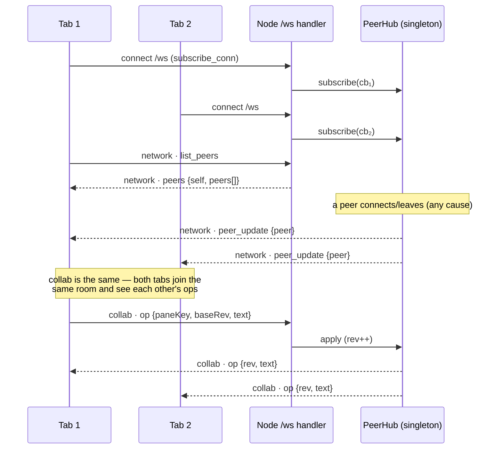
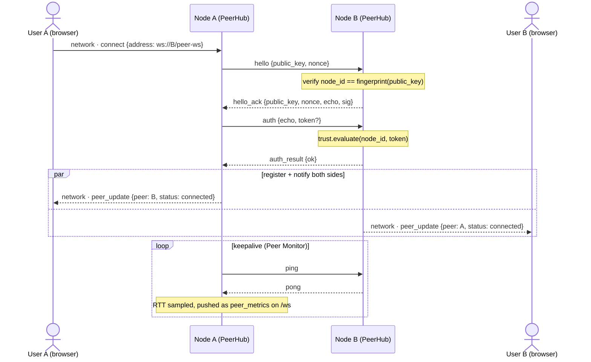
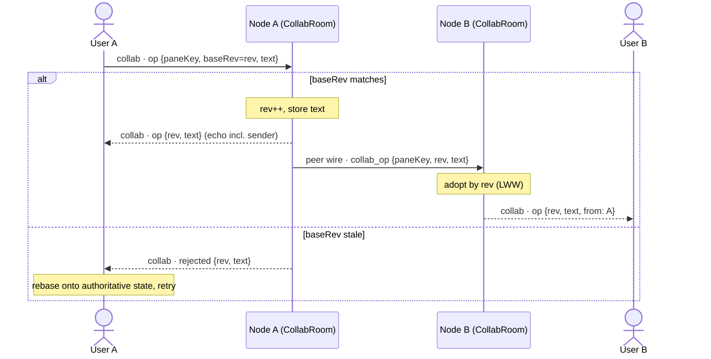
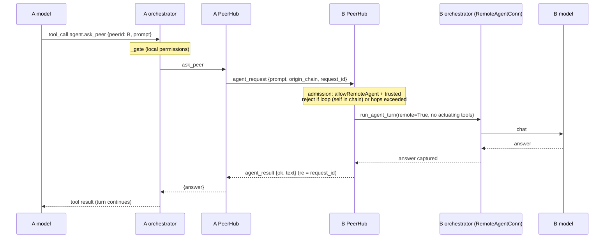
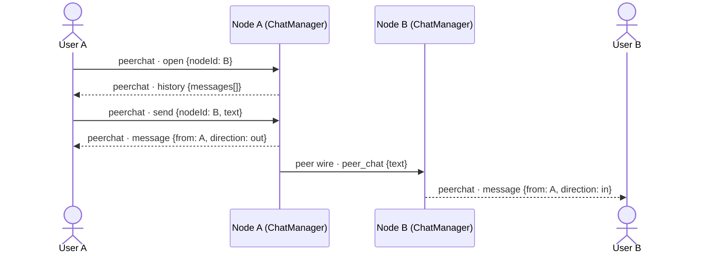
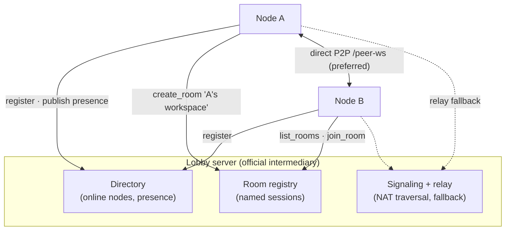
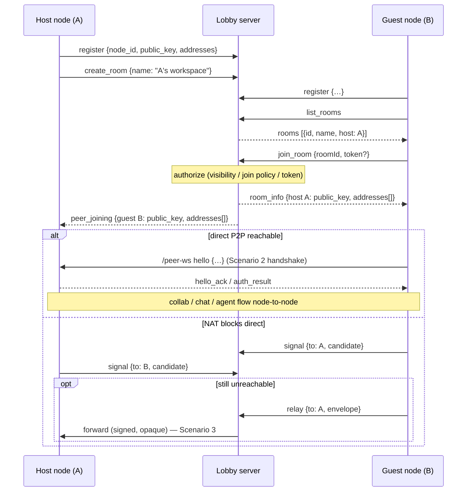

# Network protocol & scenarios

This page diagrams the horrible-dashboard websocket protocols across the situations
they run in — one user with two tabs, two users direct, two users through an
intermediary, collaborative panes, and agent-to-agent — and lays out the target
topology: **peer-to-peer first, a client/server intermediary as fallback, and an
official lobby for discovery**. It complements [Distributed peer fabric](distributed.mdx)
(the building blocks) and [Module: network](../modules/network.mdx) (the surface).

## Two socket layers

There are **two distinct websocket protocols**, and keeping them separate is the
core of the design:

| | `/ws` (browser ↔ its own node) | `/peer-ws` (node ↔ node) |
|---|---|---|
| Scope | **per browser tab** | **per remote peer** |
| Frame | `WsMessage` `{channel, event, data}` | signed `PeerEnvelope` `{type, src, dst?, msg_id, re?, sig, …}` |
| Channels/types | `agent`, `network`, `collab`, `peerchat`, `terminal`, … | `hello`, `auth`, `presence`, `agent_request`, `collab_op`, … |
| Auth | local (same machine) | Ed25519 per-envelope signatures + trust policy |

The bridge between them is the process-global **`PeerHub`** (one per node, shared by
all of that node's tabs). The `/ws` `network`/`collab`/`peerchat` channels are just
live views/controls onto the hub; the hub does the node-to-node work over `/peer-ws`.



---

## Scenario 1 — one user, two connections (two tabs, one node)

The `/ws` socket is **per tab**, but peers and shared-pane state live on the
process-global hub, so both tabs see the same peers and the same collaborative
document. Opening a second tab doesn't open a second peer connection — it just
attaches another subscriber to the hub.



---

## Scenario 2 — two users, direct P2P

Node A dials Node B's `/peer-ws` and runs the signed handshake. Either side can be
the dialer; once paired, presence flows and the browsers are notified over their own
`/ws` `network` channels.



---

## Scenario 3 — two users through an intermediary (relay)

When a direct dial isn't possible (NAT, no reachable address), both nodes hold one
WebSocket to a **relay broker** that forwards signed envelopes by `dst`. The
envelopes are end-to-end signed, so the broker routes but **cannot read or forge**
them. The handshake is identical — only the transport underneath changes.

```mermaid
sequenceDiagram
    participant A as Node A (PeerHub)
    participant R as Relay broker
    participant B as Node B (PeerHub)

    A->>R: ws connect /relay-ws · {register: node_a}
    R-->>A: {registered: node_a}
    B->>R: ws connect /relay-ws · {register: node_b}
    R-->>B: {registered: node_b}

    Note over A,B: same hello/auth handshake, now addressed by dst
    A->>R: PeerEnvelope {type: hello, dst: node_b, sig}
    R->>B: forward (by dst) — opaque, signed
    B->>R: PeerEnvelope {type: hello_ack, dst: node_a, sig}
    R->>A: forward
    A->>R: auth {dst: node_b}
    R->>B: forward
    B->>R: auth_result {dst: node_a}
    R->>A: forward
    Note over A,B: peers registered; traffic continues via the relay
```

---

## Scenario 4 — collaborative pane across two users

A shared pane (e.g. scratch) syncs locally through the hub **and** forwards accepted
ops to connected peers as `collab_op`. Inbound peer ops are adopted as authoritative
by revision and rebroadcast to local tabs (never re-forwarded, so no loops).
Last-writer-wins with a rev check — a stale `baseRev` is rejected and the writer
rebases.



---

## Scenario 5 — multi-agent (agent-to-agent)

User A's agent asks User B's agent a question. The local turn calls `agent.ask_peer`;
the hub sends an `agent_request` to B, which runs its **own** orchestrator turn
(behind a no-browser `RemoteAgentConn`, gated read-only by `network.remoteAgentMode`)
and replies with `agent_result`. The answer comes back into A's turn as an ordinary
tool result.



---

## Scenario 6 — direct peer chat (1:1)

`peerchat` is an append-only message log (vs `collab`'s editable document). A browser
opens a conversation; the backend relays each message to the peer over the signed
wire and mirrors it to this node's own tabs.



---

## The lobby system

Beyond **manual invite link**, **direct address**, and **LAN mDNS**, the **official
lobby** is a client/server intermediary that is more than a dumb relay — it's a
**presence directory + room listing + signaling** service, with P2P as the preferred
data path and relay as the fallback.

**Status: implemented.** Server: `lobby_server.py` (a standalone app bundling the
relay broker for fallback). Node client: `lobby.py` (`LobbyClient`, opt in via
`network.lobbyUrl`). Frontend: the **Lobby** widget. Signaling frames are forwarded
as plumbing; real NAT hole-punching (ICE) is still stubbed — joins use the host's
advertised address (direct) then the relay fallback.

### Roles

- **P2P (preferred):** once two nodes know how to reach each other, bulk traffic
  (collab, peer chat, agent-to-agent) flows node-to-node over `/peer-ws`.
- **Intermediary / relay (fallback):** when direct fails, the lobby relays the same
  signed envelopes — no plaintext exposure.
- **Lobby (discovery + signaling):** a hosted service nodes connect out to; it lists
  who's online and what **rooms** (named, hostable sessions) exist, and brokers the
  address exchange that bootstraps a P2P link.



### Lobby wire protocol (over the `/lobby-ws` socket)

| Direction | message | data | purpose |
|---|---|---|---|
| node→lobby | `register` | `{node_id, public_key, node_name, addresses[]}` | authenticate + publish reachability |
| lobby→node | `registered` | `{session, presence[]}` | ack + initial directory |
| node→lobby | `presence` | `{status, capabilities}` | heartbeat / status change |
| node→lobby | `list_rooms` | `{}` | discover joinable sessions |
| lobby→node | `rooms` | `{rooms[]: {id, name, host, members, locked}}` | room directory |
| node→lobby | `create_room` | `{name, visibility, joinPolicy}` | host a session |
| node→lobby | `join_room` | `{roomId, token?}` | request to join |
| lobby→node | `room_info` | `{roomId, host: {node_id, public_key, addresses[]}}` | candidates to dial |
| node↔lobby | `signal` | `{to, candidate}` | exchange addresses / future ICE |
| node→lobby | `relay` | `{to, envelope}` | fallback path for signed envelopes |
| lobby→node | `error` | `{code, message}` | rejection |

### Join sequence: discover → P2P, with relay fallback



### Trust & safety

- The lobby authenticates nodes by their **Ed25519 identity** (same node_id =
  fingerprint(public_key) rule); it can't impersonate them because every peer
  envelope stays end-to-end signed.
- Room **join policy**: open, token-gated (a per-room invite), or directory-trusted.
  This reuses the existing `network.trustMode` ladder (`manual` / `directory` /
  `open-lan`) plus a hosted `directory` option.
- A node opts into the lobby via `network.directoryUrl`; with it blank, only direct
  + LAN + manual invites are used (today's behavior).
- The lobby sees **metadata** (who is online, room membership) but not pane contents
  or agent prompts when traffic is P2P; even on the relay fallback, payloads are
  signed/opaque.

---

## Implemented vs. proposed

| Capability | Status |
|---|---|
| `/ws` per-tab channels (`network`, `collab`, `peerchat`) | ✅ implemented |
| `/peer-ws` signed handshake + presence | ✅ implemented |
| Direct P2P transport | ✅ implemented |
| Relay broker (intermediary, store-and-forward) | ✅ implemented (`relay_broker.py`) |
| LAN discovery (mDNS) | ✅ implemented |
| Collaborative panes (`collab_op`, LWW+rev) | ✅ implemented |
| Agent-to-agent (`agent_request`/`agent_result`) | ✅ implemented |
| Peer chat (`peer_chat`) | ✅ implemented |
| Peer monitor (RTT/throughput) | ✅ implemented |
| **Lobby** (directory + rooms, P2P handoff + relay fallback) | ✅ implemented (`lobby_server.py` / `lobby.py`) |
| Signaling channel (address exchange) | ✅ plumbing implemented |
| NAT hole-punching / ICE | 🚧 proposed |

See [Distributed peer fabric](distributed.mdx) for identity, the envelope format, and
the transport abstraction; [Module: network](../modules/network.mdx) for the channel
tables and settings; and [Agent chat](../modules/agent-chat.mdx) for the agent-to-agent
tools.
