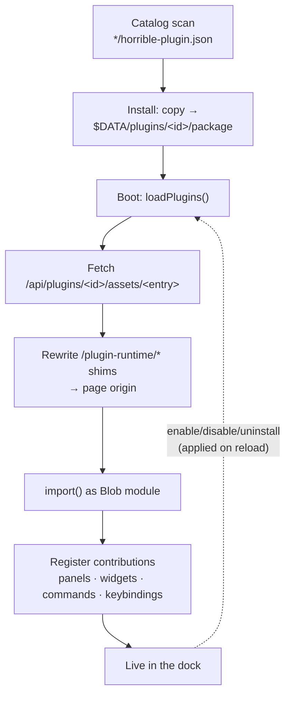

# Plugin SDK: the public extension contract

`@horribledashboard/sdk` (`packages/sdk/`) is the unified framework third-party programs
build against to integrate into the platform. A plugin contributes the same
things a built-in module does — commands, panels, dashboard widgets,
keybindings — using the exact same declaration types, and is installed from the
in-app [marketplace](../modules/marketplace.mdx).

This is the **frontend** contract. For server-side contributions (HTTP routes,
agent tools, `/ws` channels), see the
[backend plugin SDK](backend-plugin-sdk.mdx) — a rich plugin can ship both halves.

The package is published to npm as
[`@horribledashboard/sdk`](https://www.npmjs.com/package/@horribledashboard/sdk) (MIT). Inside
the monorepo its exports point at the TypeScript source; the published tarball
ships compiled ESM + `.d.ts` from `dist/` via `publishConfig` overrides
(`pnpm publish` from `packages/sdk` — `prepublishOnly` runs the build).

**Trust model (v1, stated plainly):** plugins are **trusted code**,
Obsidian/VS Code style. They run unsandboxed as ES modules in the app's realm
with full DOM and SDK access. Marketplace curation is the safety layer; install
only what you trust. Sandboxing is a possible later addition for untrusted
sources, not part of this contract.

## The contract

A plugin's entry module **default-exports** `definePlugin({ setup })`:

```tsx
import { definePlugin } from '@horribledashboard/sdk';

export default definePlugin({
  setup(host) {
    return {
      widgets: [{ id: 'my-plugin.thing', title: 'Thing', component: Thing }],
      commands: [{ id: 'my-plugin.doIt', title: 'My Plugin: Do it', run: () => {} }],
      settings: [{ key: 'my-plugin.size', title: 'Size', type: 'number', default: 5 }],
      // panels?, keybindings? — same shapes built-in modules use
    };
  },
});
```

- `setup(host)` is called once at boot; it may be async. The returned
  contributions are registered in the module registry as module
  `plugin:<id>`.
- **Namespacing is enforced:** every contributed command/panel/widget id **and
  setting key** must start with `<pluginId>.` — the loader rejects the plugin
  otherwise.
- The `host` handle (`PluginHost`) is the only door back into the shell:
  - `host.api.get/post/put/del` — the backend HTTP client (relative to `/api`).
  - `host.storage.get/set/remove` — key-value storage scoped to the plugin,
    persisted server-side (`/api/plugins/<id>/storage/<key>`). Uninstall wipes it.
  - `host.settings.get/set/subscribe` — values of the settings the plugin
    declared, namespace-guarded to its own keys. **Distinct from storage:**
    settings are user-configurable on the settings page; storage is the plugin's
    own bookkeeping. See [../modules/settings.md](../modules/settings.mdx).
  - `host.hasCapability(cap)` — platform capability checks (browser vs desktop).
  - `host.subscribeChannel(channel, handler)` — the shared `/ws` socket.
  - `host.openPanel(panelId)` / `host.runCommand(commandId)`.

Declaration types (`CommandDecl`, `PanelDecl`, `WidgetDecl`, `KeybindingDecl`,
`SettingDecl`, `SettingType`, `Capability`, `CollabDecl`, `WsMessage`) live in the
SDK and are re-exported by `@horrible/core`, so plugins and built-in modules share
one contract. A `KeybindingDecl` can be **focus-scoped**: set `scope` to a pane
view id so the binding is active only while that pane is focused (shadowing plain
globals), or `override: true` on a global so it can't be shadowed — see
[keybinding scopes](layout-shell.mdx#keybinding-scopes).

A plugin's **widgets are dockable panes**, just like a built-in module's: they
open into the workspace (tabbed/split/floating), so a `WidgetDecl` takes an
optional `defaultPlacement` (`left|center|right|bottom`) hinting where it docks.
There is no separate widget board — see
[windowing.md](windowing.mdx).

A pane can also opt into the **distributed peer fabric** declaratively via the
optional `collab` field (`CollabDecl`) on `PanelDecl`/`WidgetDecl`: it names the
shared room the pane syncs through, and the pane consumes it with the
`useCollab` host hook (live cross-node state + presence) rather than touching the
`collab` channel directly. See
[Module: network](../modules/network.mdx#network-aware-panes-the-collab-contract).

## Versioning

`SDK_API_VERSION` (currently `1`) is bumped on **breaking** contract changes
only. A plugin package declares the version it was built against (`sdkVersion`
in its manifest); the loader skips plugins whose version doesn't match and
surfaces the mismatch in the marketplace panel. Additive optional fields (like
the `settings` contribution in SDK `0.2.0`, `WidgetDecl.defaultPlacement` in
`0.3.0`, and the `collab` pane field in `0.4.0`) do **not** bump it, so existing
plugins keep loading.

## Package format

A plugin is a directory:

```
my-plugin/
  horrible-plugin.json   # package manifest (below)
  dist/index.js          # built ESM entry
  src/ …                 # source (authoring)
```

`horrible-plugin.json`:

```json
{
  "id": "my-plugin",
  "name": "My Plugin",
  "version": "0.1.0",
  "description": "…",
  "author": "…",
  "entry": "dist/index.js",
  "sdkVersion": 1,
  "requiredCapabilities": [],
  "permissions": ["storage"]
}
```

- `id`: `^[a-z0-9][a-z0-9-]{0,63}$`, and must equal the directory name.
- `entry`: relative path, no `..` segments.
- `permissions`: informational in v1 (shown in the marketplace UI); reserved
  for enforcement later (e.g. a fetch proxy permission).

## Building a plugin (authoring guide)

Copy `examples/plugins/hello-widget/` — the reference plugin (a persisted
counter widget + a command). The build is a Vite lib build via the SDK preset:

```ts
// vite.config.ts
import { defineConfig } from 'vite';
import { horriblePluginViteConfig } from '@horribledashboard/sdk/vite';

export default defineConfig(horriblePluginViteConfig({ entry: 'src/index.tsx' }));
```

The preset marks `react`, `react/jsx-runtime`, and `@horribledashboard/sdk` **external**
and rewrites them to host-served shim URLs. This is load-bearing:

- The shims (`apps/web/public/plugin-runtime/{react,jsx-runtime,sdk}.js`) are
  static ES modules that re-export from `window.__HORRIBLE_RUNTIME__`, which
  the host populates from its own bundled React before any plugin loads.
- This guarantees **one React instance** across host and plugins. A plugin that
  bundles its own React will crash on hooks — the loader cannot detect this,
  so don't bypass the preset.
- The same URLs work in Vite dev (served from `public/`), the production build,
  and the Tauri webview. The shims are always served by the **page** origin —
  under the desktop layout the plugin entry itself is fetched from the backend
  origin (see below), so the loader pins the shim specifiers to the page origin
  before evaluating the bundle.

`pnpm build` produces `dist/index.js` (a few kB — everything heavy is
external). Drop the directory into a catalog directory and it's installable.

## Catalog and lifecycle



- The backend scans `HORRIBLE_PLUGIN_CATALOG` (default `examples/plugins`) for
  `*/horrible-plugin.json` — the catalog is self-indexing. Pointing this at a
  hosted registry later is a config change, not a redesign.
- **Install** copies the package into `$HORRIBLE_DATA_DIR/plugins/<id>/package/`
  (reinstall = update in place). **Uninstall** removes the whole plugin dir,
  including its storage.
- At boot, `loadPlugins()` (`packages/core/src/plugins/loader.ts`) fetches the
  installed list, then loads each enabled plugin's entry from
  `/api/plugins/<id>/assets/<entry>` (an absolute backend URL under the desktop
  layout): it fetches the source, rewrites the root-absolute
  `/plugin-runtime/*` shim imports to the page origin, and imports the result
  as a Blob module — a plain `import()` would resolve the shims against the
  entry's origin and 404 cross-origin. Contributions are then registered.
  Failures are contained per plugin and listed in the marketplace panel.
- The backend serves `.js`/`.mjs` assets with a forced `text/javascript` MIME —
  Windows' registry-backed `mimetypes` can claim `text/plain`, which browsers
  reject for ES modules.

## Known limitations (v1)

- **Reload to apply:** install/update/enable/disable/uninstall take effect on
  the next reload (the registry has no unregister; the dock holds live
  component refs). The marketplace shows a reload banner.
- **No plugin HMR:** plugin entries are imported via backend URLs that bypass
  Vite's transform pipeline.
- **Single-file bundles only:** entries are evaluated as Blob modules, which
  have no base URL — relative chunk imports inside a plugin bundle won't
  resolve. The SDK build preset produces a single file; don't enable code
  splitting in a plugin build.
- **Stale layout references:** a workspace layout that references a disabled
  plugin's pane (panel or widget) renders the shell's "Unknown pane" placeholder
  until the pane is closed.
- **Frontend-only:** plugins cannot ship backend Python. The host provides
  generic backend services (storage now; more later). A fetch proxy is
  deliberately excluded until a permissions design exists (SSRF surface).
