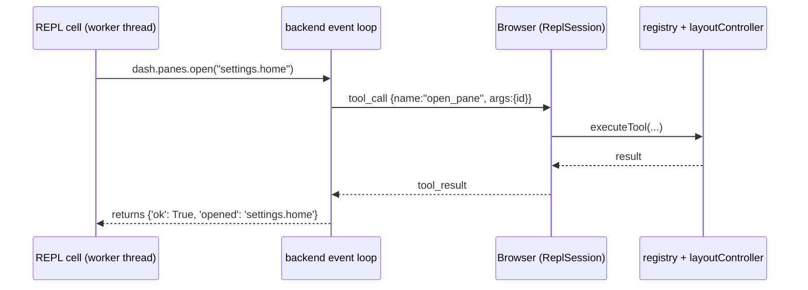

# Python SDK: scripting the dashboard with `dash`

`dash` is the Python handle for driving horrible-dashboard programmatically — open,
close, and **rearrange** panes, manage workspaces, read live widget state, read the
**I/O telemetry**, read/write **settings**, and invoke any agent-exposed
capability. It is seeded into every [Python REPL](../modules/repl.mdx) session, so
you can script the running app interactively. Run **`dash.help()`** for the full
surface, printed live from the objects themselves.

The surface splits in two: **UI facades** (`panes`, `workspaces`, `layout`,
`context`, `call`) relay a tool call to the browser (below); **backend-local
facades** (`io`, `settings`) read/write backend state directly, with no browser
round-trip, so they work even with no tab attached.

This page is the **canonical reference** for the SDK surface. For the REPL pane,
the kernel, and the `/ws` channel protocol, see the
[repl module](../modules/repl.mdx).

**Scope (v1):** the SDK is the namespace injected into the **in-app REPL** — it is
not (yet) a standalone, pip-installable client for driving the app from an external
process. Its source is `backend/modules/repl/sdk.py`.

## How it runs

`dash` is a thin, **synchronous** Pythonic veneer over the *same relay surface the
[agent](../modules/agent-chat.mdx) drives*. Each method becomes a tool call relayed
to the originating browser over the shared `/ws` socket, where
`executeTool` (`packages/core/src/modules/agent/tool-exec.ts`) runs it against the
registry and layout controller. Anything the agent can do, `dash` can do — they
share one executor, so they never drift.

Although the work crosses a process boundary, **you write ordinary blocking
Python**: the call returns the browser's result before the next line runs. Under
the hood the cell runs in a worker thread, and the SDK bridges to the event loop
and blocks that thread until the reply arrives.



Each call blocks until the browser answers (or a **30-second relay timeout**, after
which the call returns `{'error': 'tool timed out'}`).

## Reference

### `dash.panes`

Open, close, and inspect panes (panels and widgets) in the **active workspace**.

| Method | Relayed tool | Returns |
| --- | --- | --- |
| `dash.panes.available()` | `list_available_panes` | `{'panels': [{'id', 'title', 'groupId'}], 'widgets': [{'id', 'title', 'groupId'}]}` — everything openable |
| `dash.panes.open_list()` | `list_open_panes` | `{'panes': [{'id', 'instanceId', 'title', 'hasContext', 'groupId'}]}` — what's open now |
| `dash.panes.open(pane_id)` | `open_pane` | `{'ok': True, 'opened': pane_id}` |
| `dash.panes.close(pane_id)` | `close_pane` | `{'closed': bool}` (`False` if no such open pane) |
| `dash.panes.group(pane_id)` | `get_pane_group` | `{'groupId', 'label', 'companions'}`, or `{'groupId': None}` if ungrouped |

- `id` is the **pane type** id (e.g. `settings.home`); `instanceId` identifies a
  **live instance** (e.g. `repl.console#1`) and is what `dash.context` takes.
- `hasContext` is `True` when that instance exposes a readable state snapshot.
- `groupId` is the primary view id of the [panel group](panel-groups.mdx) `id`
  belongs to (e.g. `network.peers`), or absent/`None` if it isn't grouped.
- `open` of an unknown id is a no-op on the UI but still returns `{'ok': True}`;
  always discover ids with `available()` first.

### `dash.workspaces`

List, create, and switch the named workspace tabs.

| Method | Relayed tool | Returns |
| --- | --- | --- |
| `dash.workspaces.list()` | `list_workspaces` | `{'active': str \| None, 'workspaces': [{'id', 'name'}]}` |
| `dash.workspaces.create(name)` | `create_workspace` | `{'id', 'name'}` — created **and switched to** |
| `dash.workspaces.switch(workspace_id)` | `switch_workspace` | `{'ok': True, 'switched': workspace_id}` |

### `dash.layout`

Rearrange open panes — the same layout verbs the agent drives. Targets are
**instance ids** (from `dash.panes.open_list()`).

| Method | Relayed tool | Notes |
| --- | --- | --- |
| `dash.layout.split(instance_id, direction, view_id=None)` | `split_pane` | `direction` `left`/`right`/`up`/`down`; `view_id` opens a different view in the new region, else duplicates the pane |
| `dash.layout.move(instance_id, reference, direction)` | `move_pane` | `direction` `left`/`right`/`above`/`below`/`within` |
| `dash.layout.resize(instance_id, width=None, height=None)` | `resize_pane` | pixels |
| `dash.layout.float(instance_id)` / `dock(instance_id)` | `float_pane` / `dock_pane` | pop out to a floating window / dock back |
| `dash.layout.maximize(instance_id)` / `restore(instance_id)` | `maximize_pane` / `restore_pane` | within the group |

### `dash.io` (backend-local)

Read the live I/O telemetry — the same stream the
[observability panel](../modules/observability.mdx) shows (HTTP in/out and `/ws`
frames). No browser round-trip; reads the backend's ring buffer directly.

| Method | Returns |
| --- | --- |
| `dash.io.recent(limit=20)` | the most recent events (newest last), each a `dict` (the `IoEvent` shape) |
| `dash.io.errors(limit=20)` | recent events that failed (error set, or status ≥ 400) |
| `dash.io.clear()` | `{'ok': True, 'cleared': True}` — empties the buffer |

### `dash.settings` (backend-local)

Read and write app settings — the same values the
[Settings page](../modules/settings.mdx) edits. Writes persist immediately.

| Method | Returns |
| --- | --- |
| `dash.settings.get(key, default=None)` | the persisted override, else `default` |
| `dash.settings.set(key, value)` | `{'ok': True, 'key', 'value'}` — persisted |
| `dash.settings.all()` | every override as a flat `dict` |

### `dash.help()`

Print the whole surface — every facade, method, and one-line description —
introspected live from the objects, so it never drifts from the code.

### `dash.context(instance_id)`

Read a live pane's current state/selection snapshot (relays `get_pane_context`).
Pass an `instanceId` from `dash.panes.open_list()`. Returns `{'context': <snapshot>}`,
or `{'error': ...}` if that instance exposes no context.

The snapshot shape is defined by the pane itself via `getAgentContext()` — e.g. the
editor returns its buffer text, a file tree returns its selection. This is the
**read-one-widget** half of cross-widget scripting.

### `dash.call(name, **args)`

The escape hatch: relay **any** tool by name. This reaches every per-widget
`agentTool` and agent-exposed command in the registry, so capabilities are
scriptable the moment they exist — no SDK change needed. The layout verbs above are
just ergonomic wrappers over `call`; these are equivalent:

```python
dash.panes.open("settings.home")
dash.call("open_pane", id="settings.home")
```

Discover dynamic tool names from the app's agent tooling
([agent tools & permissions](./agent-tools.mdx)); pass their schema fields as
keyword arguments.

## Return values & errors

Every method returns the browser's JSON result as a plain Python `dict`/`list`/
scalar. Failures are **values, not exceptions** — a failed or unknown tool comes
back as `{'error': '...'}`, and a timed-out relay as `{'error': 'tool timed out'}`.
So branch on the result rather than wrapping calls in `try/except`:

```python
res = dash.context("editor.buffer#1")
if "error" in res:
    print("no context:", res["error"])
else:
    text = res["context"]
```

(Errors raised by *your own* Python — `1/0`, `NameError`, … — are reported as a
normal traceback in the REPL, with the kernel's own frames stripped.)

## Recipes

**Discover, then open**

```python
dash.panes.available()              # find the id you want
dash.panes.open("terminal.instance")
```

**Read one widget, act on another** (the cross-widget pattern)

```python
panes = dash.panes.open_list()["panes"]
ed = next(p for p in panes if p["id"] == "editor.buffer")
src = dash.context(ed["instanceId"])["context"]   # read the editor
# …decide something from `src`, then drive another pane…
dash.panes.open("files.tree")
```

**Build a focused workspace**

```python
dash.workspaces.create("debugging")     # new tab, switched to
dash.panes.open("terminal.instance")
dash.panes.open("observability.logs")
```

## State & lifetime

A REPL session has a **persistent namespace** — variables, imports, and functions
defined in one cell are available in the next. The session (and its kernel) lives
for the life of the `/ws` connection: it is created when the console opens and
dropped when the socket closes (reload/close tears it down). `dash` itself is bound
to *that* connection, so it always drives the browser tab that owns the console.

## Trust model

`dash` calls are **not** routed through the agent
[permission gate](./agent-tools.mdx#the-permission-system). A REPL is the user's own
direct intent — the same trust model as the [terminal](../modules/terminal.mdx)
pane — so UI mutations run without per-call approval. Combined with arbitrary
backend code execution, this is safe only while the backend is bound to localhost;
see the security note on the [repl module](../modules/repl.mdx#security-note).

## Extending the SDK

Two ways to add reach, in order of preference:

1. **Nothing** — if the capability is already a widget `agentTool` or an
   agent-exposed command, it's reachable today via `dash.call(name, **args)`.
2. **A wrapper** — to give a frequently-used tool a first-class method, add it to
   the relevant facade in `backend/modules/repl/sdk.py` (`_Panes`, `_Workspaces`,
   `_Layout`, …). If it's a brand-new UI verb (not just a dynamic tool), also teach
   the shared executor `executeTool` in
   `packages/core/src/modules/agent/tool-exec.ts` — which automatically gives the
   **agent** the same verb. Keep the two surfaces in lockstep.
3. **A backend-local facade** — for reading/writing backend state that needs no
   browser (telemetry, settings, vector DB, …), add a facade like `_Io`/`_Settings`
   that imports the backend module lazily inside its methods (avoids import cycles)
   and returns plain dicts. These have no relay and work with no tab attached.

`dash.help()` is generated by introspection, so any method you add with a docstring
shows up there automatically.

## Source map

| Concern | File |
| --- | --- |
| The `dash` facade | `backend/modules/repl/sdk.py` |
| Relay bridge + session manager | `backend/modules/repl/manager.py` |
| Interpreter / namespace | `backend/modules/repl/kernel.py` |
| Frontend executor (shared with the agent) | `packages/core/src/modules/agent/tool-exec.ts` |
| REPL pane + WS client | `packages/core/src/modules/repl/` |
