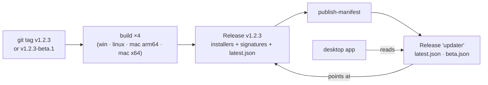

# Releases and remote updates

**Status: implemented and keyed.** The desktop app checks a signed manifest —
automatically in the background and on demand — downloads an update, verifies
it, installs it and restarts. The signing keypair exists: the public half is in
`tauri.conf.json` (key ID `DCD4A446DD335DBD`), so the shell registers the
updater plugin. What remains before an update can actually reach anyone is the
**private** half in the repo secrets and a first `v*` tag.

- **Shell:** `apps/desktop/src-tauri/src/updater.rs`, plugin registered in `main.rs`
- **Config:** `apps/desktop/src-tauri/tauri.conf.json` → `bundle`, `plugins.updater`
- **CI:** `.github/workflows/release.yml`
- **Frontend:** `packages/core/src/modules/updates/` (`auto.ts` is the background
  checker; `AppShell` starts it)

## Why custom commands instead of the plugin's JS API

The app has a release **channel**, and the channel is a user setting rather than
a build-time fact — the same binary must be able to follow either. Tauri's JS
`check()` uses the endpoints baked into `tauri.conf.json` and offers no way to
choose one at runtime; only the Rust `UpdaterBuilder` does. So `updater_check`
and `updater_install` resolve the channel to an endpoint on every call.

Both are Tauri commands, which means both need an ACL entry — a permission in
`permissions/updater.toml` **and** a listing in `capabilities/default.json`.
Registering in `generate_handler!` alone rejects at runtime with no build error
and no UI signal. `acl_coverage::every_command_is_permitted_and_capable` in
`main.rs` is the test that catches it; a new permissions file must also be added
to its `PERMISSION_FILES` list, because `include_str!` needs literal paths.

## The signature is the whole security model

The manifest and the archive come over HTTPS from GitHub Releases, and HTTPS only
says the bytes came from that host. Anyone who can publish a release — or take
over the account — can serve an installer. `plugins.updater.pubkey` is what makes
an update unforgeable without the private key, and the plugin refuses an unsigned
or badly-signed archive rather than asking the user. There is deliberately no
bypass, not even behind a flag.

### One-time setup

```bash
pnpm --filter @horrible/desktop exec tauri signer generate -w $HOME/.tauri/horrible.key
```

The CLI is a devDependency of `@horrible/desktop`, not of the root package, so a
bare `pnpm tauri …` from the repo root fails with `Command "tauri" not found`.
`$HOME` rather than `~` because PowerShell passes a bare `~` through to a native
command literally, producing a directory called `~` in the repo.

1. Public half → `apps/desktop/src-tauri/tauri.conf.json`, replacing
   `REPLACE_WITH_TAURI_SIGNING_PUBLIC_KEY`.
2. Private half → repo secret `TAURI_SIGNING_PRIVATE_KEY`; its password →
   `TAURI_SIGNING_PRIVATE_KEY_PASSWORD`.

The private key never enters the repository. **Losing it means no existing
install can ever be updated again** — a new key is a new identity and every
client refuses a manifest it cannot verify. Back it up somewhere that is not the
machine that generated it.

Until step 1 is done, `updater::is_configured()` (a compile-time read of the
config source, because the answer decides whether the plugin is registered at
all, before there is an `AppHandle` to ask) is false: the plugin is skipped, the
app starts normally, and `updater_check` returns an `error` saying the build
cannot verify an update. It does **not** return "up to date", which would be a
lie.

## Channels and the fixed manifest URL



The app reads its manifest from a **permanent, non-moving release tagged
`updater`**, not from `/releases/latest/download/`. GitHub resolves "latest" to
the newest *non-prerelease*, so a beta manifest published on a prerelease would
be unreachable there and a stable manifest would be shadowed the moment a beta
was promoted. A fixed tag has no such semantics. Only the index lives there; the
manifests point at assets on the real release.

`publish-manifest` runs after **all four** platform builds. A manifest published
earlier would offer an update that 404s on whichever platform is still building.
For the same reason the release is not a draft: a draft release's assets need an
authenticated request to download, so a manifest pointing at them would
verify-then-404 on every client.

The tag decides the channel: `v1.2.3` → `latest.json`, `v1.2.3-beta.1` →
`beta.json`. Switching a client from beta back to stable does not downgrade it —
it simply finds nothing until stable catches up.

## Automatic checks

Nobody opens a settings page to ask whether their app is old, so the app asks on
its own: once about 30 seconds after launch, then on a timer, targeting **one
check every six hours**. `packages/core/src/modules/updates/auto.ts` is that
layer and nothing more — it calls the same `checkForUpdate` the button does, and
installing still goes through the same signature-verified `updater_install`.
It is started once by `AppShell` and is a no-op in the browser layout.

Three decisions in it are load-bearing:

- **The interval is measured from the last completed check, not from process
  start.** A desktop app is left running for weeks and also restarted twenty
  times an afternoon; keying off process start means the first kind never checks
  twice and the second checks on every launch. `lastCheckedAt` is persisted in
  `localStorage`, and the stamp is written **on completion** — stamping at the
  start would silence retries for six hours after a check that never returned.
  A stamp in the *future* (a clock that was wrong, or moved) is treated as due
  rather than trusted, since trusting it parks the app for the size of the skew.
- **A failed background check is never surfaced.** "Could not ask" is a real
  state and the settings section reports it, because a user who clicked deserves
  the truth — but an offline laptop producing a toast every six hours teaches
  people to dismiss update notices unread, which is the one habit this mechanism
  cannot afford. The same reasoning caps the nagging at once per version:
  `notifiedVersion` is remembered, so dismissing is how a user says no and a
  newer version is what makes it a fresh event.
- **There is no silent-install policy.** `app.autoUpdate` is `notify` or
  `never`. An `auto` value would have to mean download-and-restart, because that
  is what the installer does — the process is replaced. Restarting an app
  somebody is working in, to deliver something that was not urgent enough to
  interrupt them for, is worse than being one version behind. The restart is
  always a click the user made.

The notice is a **persistent toast** (`duration: 0`) carrying a single action.
An update notice that expires after four seconds is one a user only catches by
accident. `Toast.action` was added for this and is deliberately one action, not
a list: a toast that grows a row of buttons has become a dialog that does not
block, and the thing that asks is `dialogs`.

## What an update must not touch

Everything under `$HORRIBLE_DATA_DIR` is versioned independently of the app:

| Thing                             | Keyed by                        | Cost to re-fetch |
| --------------------------------- | ------------------------------- | ---------------- |
| `llamacpp/bin/<tag>-<variant>/`   | an upstream llama.cpp tag       | minutes, ~100 MB |
| `hassault/bin/<version>/`         | this app's own version          | seconds, ~20 MB  |
| managed GGUFs                     | repo + filename                 | tens of GB       |
| activation traces                 | `llamaBuild` + `modelSha`       | not reproducible |
| libraries, LanceDB, `secrets.db`  | nothing — they are the user's   | irreplaceable    |

None of it is invalidated by the app version changing, so the installer is never
pointed at that directory. This is a property of *where the data lives* rather
than something the updater enforces, which is exactly why it is written down.
The Fernet master key is a step further out — `~/.horrible/secrets.key`, outside
the data dir entirely — so neither an update nor a data-dir copy touches it.

## The bundled backend runtime

The desktop shell has always *supervised* the backend but never *carried* it: without a
repo checkout `backend.rs` reported `unavailable` — "packaged builds don't bundle the
backend yet" — which made a packaged install an app with no brain. A release now ships
one.

`scripts/build-backend-runtime.mjs` builds it, in CI before `tauri-action` runs (after,
and the installer is built around an empty directory). The output lands in
`apps/desktop/src-tauri/backend-runtime/` and is picked up by `bundle.resources`:

```
backend-runtime/
  python/        relocatable CPython + every locked dependency in its site-packages
  backend/       the backend source tree, verbatim
  pyproject.toml
  runtime.json   what was built
```

**A real interpreter, not a frozen binary.** PyInstaller and friends freeze the import
graph at build time, and this backend's import graph is not knowable at build time:
[`backend/sdk/loader.py`](backend-plugin-sdk.mdx) discovers plugins from bundled dirs,
`HORRIBLE_PLUGINS_DIR` **and pip entry points**, the training module spawns notebook
kernels, and `dash` execs user scripts. Freezing breaks all of that *quietly* — the app
starts and third-party plugins simply never appear. Shipping an ordinary relocatable
CPython means nothing about import resolution differs between a checkout and a package,
which is the property worth ~1 GB.

Dependencies come from `uv export --frozen --no-dev` — the lockfile's exact versions,
no extras. Extras are opt-in by design (torch alone is ~460 MB), every one of them is
lazy-imported, and each answers with an install hint rather than a 500.

:::warning Three spellings of one path
`BUNDLED_RUNTIME_DIR` in `backend.rs`, the `--out` default in
`build-backend-runtime.mjs`, and the `bundle.resources` glob in `tauri.conf.json` are
the same path written three times. Only the first reports anything if they drift, and
what it reports is "no backend found" — which reads like a build that failed rather
than a name that moved.
:::

The runtime is resolved **after** a repo checkout, never before. A developer running the
packaged app from their own tree wants their edits; a bundled runtime is by definition
the code as it was at release time, and silently preferring it is how you spend an
afternoon debugging a change that was never running. `Runtime::bundled_in` also checks
for `backend/app.py` *and* the interpreter rather than just the directory: an interrupted
install leaves a folder that exists and cannot run, and "no backend found" points at the
install while a Python `ModuleNotFoundError` points at nothing useful.

Two consequences worth knowing. The runtime carries **no `.git`**, so
[`paths.repo_root()`](data-directories.mdx) returns `None` and user data resolves to the
per-OS location instead of into the installation directory — which on Windows is under
Program Files. And the installer grows: the Windows NSIS
setup measures **233 MB** against 10 MB before, for **1.00 GB** unpacked. Bundling
~50,000 files also makes the compression step slow — makensis spends several minutes
of CPU on it, which is worth knowing before assuming a release build has hung.

:::note What a packaged install still cannot do
Features that shell out to `uv` at runtime — the training module's project venvs
(`envs.install`) and the notebook kernels built on them — need `uv` on `PATH`, which a
packaged install does not provide. They degrade to an error rather than working; giving
them the shipped interpreter is a separate change.
:::

## Assets that ride the release but are not in the manifest

The `build-native` job builds the [hassault native client](../modules/hassault.mdx)
for all four targets and uploads `hassault-native-{win,macos,linux}-{x64,arm64}` to
the same release. Those assets are **not** in the signed manifest and are not
touched by an update: the backend fetches the one matching this app's version
(`backend/modules/hassault/client_install.py`), verifies it against the sha256
GitHub publishes for the asset, and installs it under `$HORRIBLE_DATA_DIR` — where,
per the table above, an installer never reaches.

Two things follow that are easy to get wrong. `publish-manifest` needs
**both** build jobs: a manifest is what makes a release reachable, and a release
reachable before its client assets exist is one where every Install button answers
"publishes no client for your platform". And the asset names are a contract with
`client_install.asset_name`, which *computes* the name rather than matching loosely
— these are names we control, so a rename should be a clear miss rather than a
wrong download. `backend/tests/test_hassault_client_install.py` reads the workflow
file and pins them.

The client is a download rather than a bundled `externalBin` because the shell does
not package the **backend** yet, and the route that launches the client is a backend
route — a bundled client would sit beside an app with no way to start it.

## Bundle targets

`bundle.active` is now `true` with `createUpdaterArtifacts: true`. Targets are
`nsis` (Windows), `app`/`dmg` (macOS) and `appimage`/`deb` (Linux). The manifest
prefers the **NSIS installer over the MSI**: an MSI cannot update an app while it
is running, which is the only situation an updater is ever in.

Nothing here is code-signed by a platform authority yet, so Windows SmartScreen
and macOS Gatekeeper will both warn on first launch. That is a separate,
paid problem from update signing, which is about *this app trusting its own
updates* and is what actually stops a malicious update.
