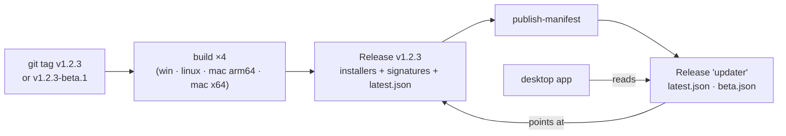

# Releases and remote updates

**Status: implemented, pending a signing key.** The desktop app can check a
signed manifest, download an update, verify it, install it and restart. Until
somebody generates the signing keypair and fills in the public half, the shell
does not register the updater plugin at all and the settings section says so.

- **Shell:** `apps/desktop/src-tauri/src/updater.rs`, plugin registered in `main.rs`
- **Config:** `apps/desktop/src-tauri/tauri.conf.json` → `bundle`, `plugins.updater`
- **CI:** `.github/workflows/release.yml`
- **Frontend:** `packages/core/src/modules/updates/`

## Why custom commands instead of the plugin's JS API

The app has a release **channel**, and the channel is a user setting rather than
a build-time fact — the same binary must be able to follow either. Tauri's JS
`check()` uses the endpoints baked into `tauri.conf.json` and offers no way to
choose one at runtime; only the Rust `UpdaterBuilder` does. So `updater_check`
and `updater_install` resolve the channel to an endpoint on every call.

Both are Tauri commands, which means both need an ACL entry — a permission in
`permissions/updater.toml` **and** a listing in `capabilities/default.json`.
Registering in `generate_handler!` alone rejects at runtime with no build error
and no UI signal. `acl_coverage::every_command_is_permitted_and_capable` in
`main.rs` is the test that catches it; a new permissions file must also be added
to its `PERMISSION_FILES` list, because `include_str!` needs literal paths.

## The signature is the whole security model

The manifest and the archive come over HTTPS from GitHub Releases, and HTTPS only
says the bytes came from that host. Anyone who can publish a release — or take
over the account — can serve an installer. `plugins.updater.pubkey` is what makes
an update unforgeable without the private key, and the plugin refuses an unsigned
or badly-signed archive rather than asking the user. There is deliberately no
bypass, not even behind a flag.

### One-time setup

```bash
pnpm tauri signer generate -w ~/.tauri/horrible.key
```

1. Public half → `apps/desktop/src-tauri/tauri.conf.json`, replacing
   `REPLACE_WITH_TAURI_SIGNING_PUBLIC_KEY`.
2. Private half → repo secret `TAURI_SIGNING_PRIVATE_KEY`; its password →
   `TAURI_SIGNING_PRIVATE_KEY_PASSWORD`.

The private key never enters the repository. **Losing it means no existing
install can ever be updated again** — a new key is a new identity and every
client refuses a manifest it cannot verify. Back it up somewhere that is not the
machine that generated it.

Until step 1 is done, `updater::is_configured()` (a compile-time read of the
config source, because the answer decides whether the plugin is registered at
all, before there is an `AppHandle` to ask) is false: the plugin is skipped, the
app starts normally, and `updater_check` returns an `error` saying the build
cannot verify an update. It does **not** return "up to date", which would be a
lie.

## Channels and the fixed manifest URL



The app reads its manifest from a **permanent, non-moving release tagged
`updater`**, not from `/releases/latest/download/`. GitHub resolves "latest" to
the newest *non-prerelease*, so a beta manifest published on a prerelease would
be unreachable there and a stable manifest would be shadowed the moment a beta
was promoted. A fixed tag has no such semantics. Only the index lives there; the
manifests point at assets on the real release.

`publish-manifest` runs after **all four** platform builds. A manifest published
earlier would offer an update that 404s on whichever platform is still building.
For the same reason the release is not a draft: a draft release's assets need an
authenticated request to download, so a manifest pointing at them would
verify-then-404 on every client.

The tag decides the channel: `v1.2.3` → `latest.json`, `v1.2.3-beta.1` →
`beta.json`. Switching a client from beta back to stable does not downgrade it —
it simply finds nothing until stable catches up.

## What an update must not touch

Everything under `$HORRIBLE_DATA_DIR` is versioned independently of the app:

| Thing                             | Keyed by                        | Cost to re-fetch |
| --------------------------------- | ------------------------------- | ---------------- |
| `llamacpp/bin/<tag>-<variant>/`   | an upstream llama.cpp tag       | minutes, ~100 MB |
| managed GGUFs                     | repo + filename                 | tens of GB       |
| activation traces                 | `llamaBuild` + `modelSha`       | not reproducible |
| libraries, LanceDB, `secrets.db`  | nothing — they are the user's   | irreplaceable    |

None of it is invalidated by the app version changing, so the installer is never
pointed at that directory. This is a property of *where the data lives* rather
than something the updater enforces, which is exactly why it is written down.
The Fernet master key is a step further out — `~/.horrible/secrets.key`, outside
the data dir entirely — so neither an update nor a data-dir copy touches it.

## Bundle targets

`bundle.active` is now `true` with `createUpdaterArtifacts: true`. Targets are
`nsis` (Windows), `app`/`dmg` (macOS) and `appimage`/`deb` (Linux). The manifest
prefers the **NSIS installer over the MSI**: an MSI cannot update an app while it
is running, which is the only situation an updater is ever in.

Nothing here is code-signed by a platform authority yet, so Windows SmartScreen
and macOS Gatekeeper will both warn on first launch. That is a separate,
paid problem from update signing, which is about *this app trusting its own
updates* and is what actually stops a malicious update.
