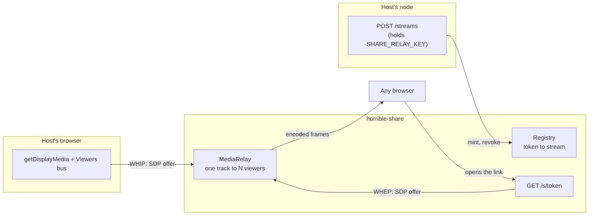

# The share relay

The public half of the [share module](../modules/share.mdx): a standalone service
that takes one host's screen capture over **WHIP** and fans it out to anyone
holding the link over **WHEP**. It is what turns a fabric-only session into a URL
you can paste to somebody who has never heard of this app.

It is a **separate deployable** (`backend/share_relay/`, Fly app `horrible-share`)
rather than part of a node's backend or a corner of the games server. Three
reasons, in order of weight: it is the one component strangers talk to, it scales
on a different axis from everything else, and a relay falling over must never be
able to take a node — or the game server — down with it.



## What a public viewer is

A viewer holds a token and gets **pixels and chat**. Never a grant, never a
cursor with authority, never a way to reach the host's dashboard. Interactivity
requires an authenticated person on the fabric, which is exactly what keeps this
service a dumb pipe rather than something security-critical: the worst thing a
compromised relay can do is show video to the wrong people, or stop showing it to
the right ones.

## The token

A token is the whole of a viewer's authority, so:

- **Opaque and random (256 bits), not signed.** A JWT would let the relay verify
  a link with no state at all, which is tempting for a service meant to scale
  out — but a signed token cannot be **revoked**, and immediate revocation is a
  requirement. Someone who stops a share expects the link to die at that instant,
  not at expiry. The registry is the authority; the token is a lookup key with no
  meaning of its own.
- **Unknown, revoked and expired are one answer.** `Registry.get` returns `None`
  for all three and every route reports 404. Telling a caller "that existed but
  expired" confirms the token was real, which is one bit more than a stranger
  holding a guessed URL should learn.
- **Passphrases are stored hashed** (PBKDF2, per-stream salt) and compared with
  `compare_digest`, even though the registry is in-memory and short-lived. A
  process holding other people's live video is not where plaintext secrets should
  sit waiting for a crash dump.
- **TTL is clamped at both ends** — a node asking for a year gets a day.

The registry is **in memory and never persisted**. Persisting it would make a
relay restart resurrect links for sessions that ended while it was down; the
correct behaviour for a lost relay is that every link dies with it. The host
still has the fabric path, and re-minting is one click.

## Who may do what

| Action | Credential | Why |
| --- | --- | --- |
| Mint a stream | `SHARE_RELAY_KEY` header | Otherwise the relay is free video hosting for anyone who can reach it |
| Publish (WHIP) | The token | The key must never reach the host's _browser_; the token already names the stream |
| Watch (WHEP) | The token (+ passphrase) | This is the public path — it is meant to be openable by a stranger |
| Revoke | `SHARE_RELAY_KEY` header | The same authority that minted it |

`SHARE_RELAY_KEY` is **env-only, never a setting**: `GET /api/settings` hands the
whole bag to the browser. The relay _URL_ is a setting (`share.relayUrl`) because
it is public by construction — it appears verbatim in every link.

If the key is unset the relay logs a warning at boot and `/health` reports
`gated: false`, so an operator can see at a glance that they left it open.

## The ingest URL is publish authority

`ShareSession.link` (the view URL) is broadcast to every guest. The **ingest URL
is not, and must never be** — anyone holding it can push their own video into the
host's stream. It lives on the node's session object and is served only from
`GET /api/share/link`, a route no guest can reach.

`test_share_link.py` asserts the string `whip` never appears in the serialized
session model, because that model is exactly what `_tell_guests` sends over the
fabric.

## CORS is load-bearing

Every caller is cross-origin by construction: the host's browser is on its own
node's origin — a different one for every user, often a bare LAN IP — and the
viewer page is the only thing ever served from the relay itself. There is no
allowlist that could be written, so the answer is `*`, with
`allow_credentials=False`.

That is not a hole, because **the origin was never the credential**. CORS
protects a browser from a page spending _its_ ambient authority (cookies,
sessions) against another site; this relay has no ambient authority to borrow.

Getting it wrong fails asymmetrically, which is why it has its own tests: without
the headers the host's WHIP POST is refused by the browser and the public link
silently carries no video, with nothing but a console message to say so. An ASGI
test client does not enforce CORS, so every route test passed while a real
browser was blocked — this was found by driving an actual share, not by the suite.

## Scaling, and the ceiling

Unlike the games server (a single always-on authority), the relay holds no shared
state and **may** scale out. The constraint is different and just as strict: a
given stream is **sticky to one machine**, because its registry entry and its
live tracks are in that machine's memory. `fly-replay` keyed on the share token
enforces it, and the relay emits `fly-replay-src` on every WHIP and WHEP response.

Fan-out uses `MediaRelay`, so the host uploads **one** copy of the stream no
matter how many people watch. That is the bandwidth win and the reason a public
link scales further than the fabric mesh.

It is **not** a passthrough, and assuming it is will size a machine wrong.
aiortc decodes every incoming stream in a `decoder_worker` thread, and every
outgoing sender holds its own `Encoder` and re-encodes. The real cost is **one
decode plus N encodes** — so the ceiling is CPU, not network.

That ceiling is real: **tens of concurrent viewers per small machine, not
thousands**. `max_viewers_per_stream` (25 by default) refuses the next viewer
with a 503 and a plain sentence, because accepting them and degrading the stream
for everyone already watching is the worse failure. Write the number down rather
than discovering it during a demo; an HLS branch is the answer when it matters
(Phase 6).

## Restreaming to RTMP

A live room can also be pushed to Twitch, YouTube Live, or any RTMP server. The
frames are already decoded (see above), so the relay pays nothing extra to feed
them out — the expensive half is the H.264 encode, and that happens in an
**ffmpeg subprocess**, not in the relay process.

That split is the whole design decision. PyAV is already a dependency, so
encoding in-process would need nothing new — and would be wrong twice over:
encoding is the expensive thing and this process is latency-critical, so a 1080p
encode on the event loop makes every viewer stutter to serve a broadcast nobody
in the room can see; and a transcode is the component most likely to wedge or
crash, which in a subprocess is an exit code and in-process is a dead relay and
25 dropped viewers.

Three things about the ffmpeg invocation are quiet if wrong, which is why
`build_args` is pure and tested:

- **Raw video on a pipe has no header.** `-s`, `-pix_fmt` and `-r` must all be
  correct, and a wrong one does not fail — it produces a skewed, miscoloured or
  wrong-speed picture that reads as a broken encoder rather than a bad argument.
- **`-tune zerolatency`.** Without it x264 buffers frames looking ahead and the
  broadcast lags the room by seconds — invisible in a test, obvious on a stream.
- **Forced keyframes every 2s.** Every platform requires them, and without them a
  viewer joining mid-stream waits for the next natural keyframe, which on a
  static screen share can be a very long time.

A resolution change mid-stream (a host resizing a shared window) scales to the
size the stream started at rather than restarting the encoder: RTMP cannot
renegotiate, and a broadcast that drops for four seconds every time somebody
drags a window edge is worse than one that is very slightly soft.

Stopping closes ffmpeg's stdin and waits, rather than killing it — EOF lets it
finish the current GOP and close the RTMP session properly, where a kill leaves a
corrupt tail on whatever recording the platform kept.

### The stream key

An RTMP stream key is a **password that does not expire**, so:

- It lives in the `streaming` **connector** (Fernet-encrypted in `secrets.db`),
  never in a setting — every setting is served to the browser.
- It is resolved **on the node** and travels node → relay. The browser never sees
  it; the pane gets a label ("Twitch"), never the target URL.
- `POST /restream/{token}` is gated on `SHARE_RELAY_KEY`, **not** on the share
  token — unlike WHIP. The token is the credential for publishing *to* this
  relay; starting an outbound broadcast on someone's behalf is an operator
  action, and the body carries a key.
- Every log line goes through `streaming.redact`, which keeps the host and app
  (diagnostic) and drops the last segment (the key). A key in a log is a key in a
  bug report, a screenshot, and a pasted stack trace.

Revoking a link or stopping a stream **stops the restream too**. Otherwise the
link dies and the broadcast carries on to Twitch, which is the worst possible
reading of "stop".

### What is not built

**The HLS branch is not implemented.** It is the honest answer to the SFU ceiling
for large audiences, and ffmpeg would produce the segments happily — but serving
them needs a player, and Chrome does not play HLS natively. Keeping the viewer
page's no-CDN promise would mean vendoring hls.js into this repo, which is a real
decision rather than an afternoon's work. The RTMP path covers "broadcast to an
audience" today by handing that problem to a platform that has already solved it.

**TikTok is out of reach**, not merely unimplemented: it has no generally
available live-ingest API — RTMP endpoints are issued per-account through a
partner programme — so no amount of effort here would produce one.

## ICE, and the failure with no symptom

The relay's own peer connections need STUN. Without it aiortc gathers **host
candidates only**, which on a hosting platform are private addresses — so a
browser on the public internet has nothing dialable and the connection never
completes. Nothing reports this: WHIP returns a valid SDP answer, `/streams`
says the stream is live, the viewer page sits on "connecting", and no log line
anywhere mentions ICE. It works perfectly on one machine, where a host candidate
is exactly the right answer, which is precisely what makes it easy to ship.

Measured, before and after configuring it:

| | Candidate types the relay offers |
| --- | --- |
| No ICE servers | `host` |
| `SHARE_RELAY_STUN` set (the default) | `host`, `srflx` |

Configuration is env-only, like everything else here:

| Variable | Default | Meaning |
| --- | --- | --- |
| `SHARE_RELAY_STUN` | `stun.l.google.com:19302` | `host:port`; the scheme is added. Empty disables STUN. |
| `SHARE_RELAY_TURN_URL` | — | Full URL (`turn:host:3478`) |
| `SHARE_RELAY_TURN_USER` / `_PASS` | — | Both required; an incomplete TURN entry is dropped rather than offered, because a malformed entry can take the whole configuration down with it |
| `SHARE_RELAY_TURN_FOR_VIEWERS` | off | Whether the **viewer page** also gets the TURN credential |

The semantics match `buildIceConfig` on the frontend and `_ice_servers` in
`network/transport/webrtc.py` — STUN is a bare `host:port`, TURN is a full URL.
Three readers of one idea that disagreed about whether the scheme is included
would fail as "ICE just does not connect".

TURN is **off for viewers by default** and that is a real trade, not an
oversight: a TURN credential in a page anyone can open makes the operator's
relay bandwidth free for the whole internet, while a viewer behind a symmetric
NAT cannot connect without one. The decision belongs to whoever runs the relay.

`/health` reports whether STUN and TURN are configured — presence only, never the
credential — so "is ICE set up" is answerable without reproducing the failure.

### There is no UDP service block

An earlier version of `fly.share.toml` declared `protocol = 'udp'` on port 9100.
That was wrong twice: 9100 is the HTTP port, and aiortc allocates **ephemeral**
high UDP ports for RTP, so no fixed port declaration corresponds to where media
actually lands. What makes media work here is ICE, not a port mapping.

## Peer connections are closed under a timeout

`RTCPeerConnection.close()` waits on the DTLS transport, and a peer that never
finished its handshake — a viewer who closed the tab mid-negotiation, a host
whose network dropped during the offer — never completes that wait. Unbounded,
tearing such a room down hangs the request that asked for it, so **revoking a
link would hang forever exactly when somebody urgently wanted it revoked**.

`CLOSE_TIMEOUT_S` bounds every close, viewers are closed concurrently rather than
in series, and `Room.close` guards against re-entry — closing a peer connection
fires its own `connectionstatechange`, whose handler closes the room, so a plain
teardown otherwise re-enters itself and pays every timeout twice.

## Deploying

```bash
fly deploy -c fly.share.toml
```

```bash
fly secrets set SHARE_RELAY_KEY=... -a horrible-share
```

`fly.share.toml` lives at the repo root for the same reason `fly.toml` does:
flyctl resolves the build context relative to the config file, and the image
needs `pyproject.toml`, `uv.lock` and `backend/`.

Two things in that config are easy to get wrong:

- **UDP must be exposed.** WebRTC carries RTP over UDP; a relay reachable only
  over TCP/443 degrades to TURN-over-TCP at best and simply fails at worst — the
  kind of thing that works perfectly in a local test and never in production.
- **One worker per machine.** The registry and the rooms are process memory, so a
  second worker would answer WHEP for streams it has never seen. Scale by adding
  machines, not workers.

Scale-to-zero is safe and wanted: a relay with no live stream is doing nothing,
and the cold start costs one second on the first mint. The media path itself
never cold-starts — WHIP only happens after a successful mint.

## Running it locally

```bash
uv sync --extra webrtc
```

```bash
uv run uvicorn backend.share_relay.app:app --port 9100
```

Then point a node at it by setting `share.relayUrl` to `http://localhost:9100`.
`aiortc` is an **optional extra** on a node (nothing but the relay needs it) and
required in the relay's own image.
