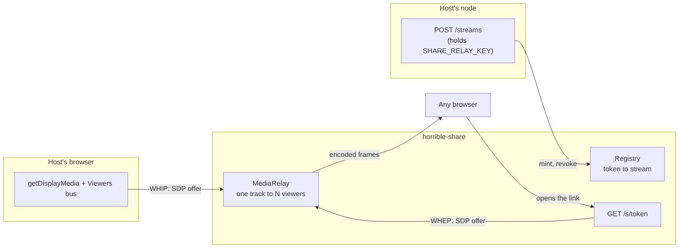

# The share relay

The public half of the [share module](../modules/share.mdx): a standalone service
that takes one host's screen capture over **WHIP** and fans it out to anyone
holding the link over **WHEP**. It is what turns a fabric-only session into a URL
you can paste to somebody who has never heard of this app.

It is a **separate deployable** (`backend/share_relay/`, Fly app `horrible-share`)
rather than part of a node's backend or a corner of the games server. Three
reasons, in order of weight: it is the one component strangers talk to, it scales
on a different axis from everything else, and a relay falling over must never be
able to take a node — or the game server — down with it.



## What a public viewer is

A viewer holds a token and gets **pixels and chat**. Never a grant, never a
cursor with authority, never a way to reach the host's dashboard. Interactivity
requires an authenticated person on the fabric, which is exactly what keeps this
service a dumb pipe rather than something security-critical: the worst thing a
compromised relay can do is show video to the wrong people, or stop showing it to
the right ones.

## The token

A token is the whole of a viewer's authority, so:

- **Opaque and random (256 bits), not signed.** A JWT would let the relay verify
  a link with no state at all, which is tempting for a service meant to scale
  out — but a signed token cannot be **revoked**, and immediate revocation is a
  requirement. Someone who stops a share expects the link to die at that instant,
  not at expiry. The registry is the authority; the token is a lookup key with no
  meaning of its own.
- **Unknown, revoked and expired are one answer.** `Registry.get` returns `None`
  for all three and every route reports 404. Telling a caller "that existed but
  expired" confirms the token was real, which is one bit more than a stranger
  holding a guessed URL should learn.
- **Passphrases are stored hashed** (PBKDF2, per-stream salt) and compared with
  `compare_digest`, even though the registry is in-memory and short-lived. A
  process holding other people's live video is not where plaintext secrets should
  sit waiting for a crash dump.
- **TTL is clamped at both ends** — a node asking for a year gets a day.

The registry is **in memory and never persisted**. Persisting it would make a
relay restart resurrect links for sessions that ended while it was down; the
correct behaviour for a lost relay is that every link dies with it. The host
still has the fabric path, and re-minting is one click.

## Who may do what

| Action | Credential | Why |
| --- | --- | --- |
| Mint a stream | `SHARE_RELAY_KEY` header | Otherwise the relay is free video hosting for anyone who can reach it |
| Publish (WHIP) | The token | The key must never reach the host's _browser_; the token already names the stream |
| Watch (WHEP) | The token (+ passphrase) | This is the public path — it is meant to be openable by a stranger |
| Revoke | `SHARE_RELAY_KEY` header | The same authority that minted it |

`SHARE_RELAY_KEY` is **env-only, never a setting**: `GET /api/settings` hands the
whole bag to the browser. The relay _URL_ is a setting (`share.relayUrl`) because
it is public by construction — it appears verbatim in every link.

If the key is unset the relay logs a warning at boot and `/health` reports
`gated: false`, so an operator can see at a glance that they left it open.

## The ingest URL is publish authority

`ShareSession.link` (the view URL) is broadcast to every guest. The **ingest URL
is not, and must never be** — anyone holding it can push their own video into the
host's stream. It lives on the node's session object and is served only from
`GET /api/share/link`, a route no guest can reach.

`test_share_link.py` asserts the string `whip` never appears in the serialized
session model, because that model is exactly what `_tell_guests` sends over the
fabric.

## CORS is load-bearing

Every caller is cross-origin by construction: the host's browser is on its own
node's origin — a different one for every user, often a bare LAN IP — and the
viewer page is the only thing ever served from the relay itself. There is no
allowlist that could be written, so the answer is `*`, with
`allow_credentials=False`.

That is not a hole, because **the origin was never the credential**. CORS
protects a browser from a page spending _its_ ambient authority (cookies,
sessions) against another site; this relay has no ambient authority to borrow.

Getting it wrong fails asymmetrically, which is why it has its own tests: without
the headers the host's WHIP POST is refused by the browser and the public link
silently carries no video, with nothing but a console message to say so. An ASGI
test client does not enforce CORS, so every route test passed while a real
browser was blocked — this was found by driving an actual share, not by the suite.

## Scaling, and the ceiling

**Run one machine.** Like the games server, though for a different reason: the
games server is a single authority, while this one simply keeps each stream's
registry entry and live tracks in one machine's memory. Fly load-balances across
machines, so with more than one a mint lands on machine A and a viewer's WHEP
lands on machine B, which has never heard of that token.

That is not hypothetical — it was observed on the first real deploy. Four
machines were running, the node reported the stream live, and `/health` answered
`streams: 0` because the health check hit a third machine. `max_machines_running
= 1` in `fly.share.toml` is what prevents it; `fly scale count 1` cleans up
machines that already exist.

Scaling out is possible but not implemented. It needs genuine session affinity:
the app must return a **`fly-replay: instance=<machine>` response header** to
bounce a request to the machine that owns the token, which in turn means the
token has to record which machine minted it. An earlier version of this file
claimed `fly-replay-src` did that job. It does not — that is the header Fly
*adds to* a request it has already replayed, inbound and informational. It was
emitted on every WHIP/WHEP response, looked like affinity, and provided none.

Fan-out uses `MediaRelay`, so the host uploads **one** copy of the stream no
matter how many people watch. That is the bandwidth win and the reason a public
link scales further than the fabric mesh.

It is **not** a passthrough, and assuming it is will size a machine wrong.
aiortc decodes every incoming stream in a `decoder_worker` thread, and every
outgoing sender holds its own `Encoder` and re-encodes. The real cost is **one
decode plus N encodes**.

**There are two ceilings and they bite differently.** Memory is what *crashes*
the relay; CPU is what makes the stream *bad*. This file originally named only
CPU, which missed the crash entirely; the correction then over-swung and called
CPU a non-issue, which missed the lag. Both are real: The host captures the desktop at its native resolution on
purpose (`startCapture` sends no `width`/`height`; scaled text is an unreadable
share), so every viewer adds a full-resolution encoder. On a 512 MB machine that
was an OOM kill **16 seconds after the second viewer connected**: 403 MB RSS,
one publisher and two viewers, no restream running. `fly.share.toml` now asks for
2 GB, and the machine has since moved off shared CPU entirely (below), so the
budget is 4 GB.

**CPU is the quality ceiling.** The decode and every encode are software, in
Python. A shared vCPU is throttled to a fraction of a core under sustained load,
and a continuous encode is exactly that — the burst credits that make shared CPUs
fine for HTTP buy nothing here. `shared-cpu-1x` was visibly laggy with a *single*
viewer. The relay runs on `performance-2x`; this is not a workload a shared vCPU
can do, and no amount of memory fixes it.

An OOM is worse than it sounds, because the registry is process memory: the kill
takes **every token** with it. The link goes dead for everyone holding it, and
the host's browser notices nothing at all — WebRTC to a departed peer does not
raise. That is why the node polls
[`GET /streams/{token}`](../modules/share.mdx#the-four-relay-states) while a
share is running.

That ceiling is real: **tens of concurrent viewers per small machine, not
thousands** — and at desktop capture resolution the honest number is far closer
to "a handful" than to 25. `max_viewers_per_stream` (25 by default) refuses the next viewer
with a 503 and a plain sentence, because accepting them and degrading the stream
for everyone already watching is the worse failure. Write the number down rather
than discovering it during a demo; an HLS branch is the answer when it matters
(Phase 6).

## Viewers need TURN too, and that costs something

STUN alone gets a viewer a server-reflexive candidate, which is enough on most
home networks and not enough behind a symmetric or carrier-grade NAT. The failure
is asymmetric and therefore confusing: the host, on a friendly network, watches
their own link perfectly while some of their audience sits on a black rectangle.
That is how this was found.

So `SHARE_RELAY_TURN_FOR_VIEWERS = '1'` is set in `fly.share.toml`. The trade is
real and deliberate rather than an oversight: the viewer page is **public**, so a
credential on it is public, and the operator's TURN bandwidth becomes usable by
anyone holding a link. It lives in `[env]` and not in `fly secrets` because it is
a flag, not the credential — `SHARE_RELAY_TURN_URL/USER/PASS` stay secrets.
Rotate them if the exposure ever stops being acceptable.

A viewer that still cannot form a path now **says so** rather than showing black
— see below.

## The viewer page is one viewport, never two

`body` is pinned with `height: 100vh` **and** `height: 100dvh` (the second for
mobile browsers, so it measures the visible viewport rather than the one hiding
behind the URL bar) with `overflow: hidden`. Everything that can grow — the chat
log, the diagnostics panel — scrolls inside its own column.

It used to be `min-height: 100vh`, which is the same thing right up until a
child gets tall, and then the page grows and the stage slides off the bottom. A
shared screen you have to scroll to is a shared screen you cannot watch. The
matching half is `min-height: 0` on `main`, `.stage` and `aside`: a flex item
defaults to `min-height: auto` and refuses to shrink below its content, which is
the actual mechanism by which a long conversation breaks a fixed layout.

## Progress, not a spinner

A viewer waiting on a connection is shown which of six steps is in progress —
offer, gather, relay, negotiate, path, live — as a bar and a label. A spinner
says "alive"; this says *which thing* is being waited on, which is also the first
question worth asking about a viewer that never starts.

Waiting on the **host** is deliberately not drawn as progress. The host may never
start sharing, so a bar creeping toward 100% would be a lie; that state sweeps
instead and counts the retry down out loud (`retrying in 3s`), which is what
keeps the page from looking abandoned.

## The page carries its own diagnostics

A `Diagnostics` panel logs every phase, ICE state change, candidate type, track
arrival, autoplay block and connection transition, timestamped, with a **Copy**
button — plus a `getStats` sample every 10s once live: resolution, frame rate,
frames dropped, freezes, packets lost, jitter, jitter-buffer delay, round trip,
and which candidate pair won.

This exists because diagnosing this service meant reading the relay's Fly logs,
and **the relay can only see requests**. It cannot see ICE failing, a track
arriving, or autoplay being blocked — which is where every real failure has
actually been. A viewer who says "it is black" can now copy the whole story.

Two constraints on it: the buffer is **bounded** (people watch for hours), and
candidates are logged as `type/protocol` only — a raw candidate line carries the
viewer's own IP addresses, and this panel is meant to be handed to someone else.

## Closing a tab releases the slot

The page closes its peer connection on `pagehide`. Without that the relay holds
the viewer until ICE consent expires about 30 seconds later, and a viewer slot is
a full-resolution encoder on a machine whose first ceiling is memory.

## One connect attempt at a time

`connect()` awaits five times — offer, ICE gathering, the WHEP fetch, the body,
`setRemoteDescription` — and every one is a window in which the page can call it
again: the Retry button, an unlock, the 409 timer.

It used to read and write the module-level `pc` throughout. So a second attempt
replaced `pc` while the first was still in its fetch, the first then applied
**its** answer to the second attempt's connection, and the second's own
`setRemoteDescription` found the thing already `stable`:

```
InvalidStateError: Failed to set remote answer sdp: Called in wrong state: stable
```

The attempt died there, as an unhandled promise rejection, and the viewer got a
black rectangle.

Each attempt now takes a **generation** and its own `self` reference. The shared
`pc` exists only so the next attempt can close the previous one; every other line
uses `self`, every await is followed by a staleness check, and the event handlers
return early when superseded — a dead connection must not overwrite the live
one's status. `setRemoteDescription` is wrapped, because a rejection there is
invisible except as black video.

`backend/tests/test_share_relay_viewer.py` pins these structurally: this page is
JavaScript inside a Python string, with no compiler, linter or type checker
between writing it and a stranger watching through it, so `node --check` is the
only build step it will ever get.

## A viewer says 'live' only when a path exists

The page used to call itself live the moment the relay's SDP answer arrived. An
answer means the relay agreed to send; it says nothing about whether a path
between the two ends exists. A viewer whose ICE never completed therefore got a
hidden overlay, a green `live` chip and a black rectangle — indistinguishable
from a host who really was sharing a black screen, and the single most confusing
state this page can produce.

`live` now comes only from `connectionstatechange`. Between the answer and a real
connection the chip reads `negotiated` and the overlay says what is happening. A
12s deadline then reports "could not reach the stream" with the likely cause,
because ICE can sit in `checking` for a long time and may settle on
`disconnected` rather than `failed` — in which case the failure handler never
runs at all and nothing would ever be said.

## The viewer page retries, but only once at a time

A viewer arriving before the host starts gets **409**, not 404 — the link is
real, the picture is not there yet — and the page retries every 4s.

That retry holds its timer in `retryTimer` and every entry into `connect()`
cancels it. Without that, each path into `connect()` (the initial call, the Retry
button, an unlock) forked its own loop that nothing ever stopped, and the loops
compounded: observed at roughly **one WHEP per second** against a relay that was
being asked to wait.

The noise is the smaller half. Each loop that eventually *succeeds* becomes a
real viewer session, and a viewer session is a full-resolution encoder — so an
uncapped retry storm is a memory leak on the relay wearing a network-noise
costume, on a machine whose first ceiling is memory. A single page was seen
taking **two** WHEP sessions this way minutes before the relay was OOM-killed.

## Restreaming to RTMP

A live room can also be pushed to Twitch, YouTube Live, or any RTMP server. The
frames are already decoded (see above), so the relay pays nothing extra to feed
them out — the expensive half is the H.264 encode, and that happens in an
**ffmpeg subprocess**, not in the relay process.

That split is the whole design decision. PyAV is already a dependency, so
encoding in-process would need nothing new — and would be wrong twice over:
encoding is the expensive thing and this process is latency-critical, so a 1080p
encode on the event loop makes every viewer stutter to serve a broadcast nobody
in the room can see; and a transcode is the component most likely to wedge or
crash, which in a subprocess is an exit code and in-process is a dead relay and
25 dropped viewers.

Three things about the ffmpeg invocation are quiet if wrong, which is why
`build_args` is pure and tested:

- **Raw video on a pipe has no header.** `-s`, `-pix_fmt` and `-r` must all be
  correct, and a wrong one does not fail — it produces a skewed, miscoloured or
  wrong-speed picture that reads as a broken encoder rather than a bad argument.
- **`-tune zerolatency`.** Without it x264 buffers frames looking ahead and the
  broadcast lags the room by seconds — invisible in a test, obvious on a stream.
- **Forced keyframes every 2s.** Every platform requires them, and without them a
  viewer joining mid-stream waits for the next natural keyframe, which on a
  static screen share can be a very long time.

A resolution change mid-stream (a host resizing a shared window) scales to the
size the stream started at rather than restarting the encoder: RTMP cannot
renegotiate, and a broadcast that drops for four seconds every time somebody
drags a window edge is worse than one that is very slightly soft.

Stopping closes ffmpeg's stdin and waits, rather than killing it — EOF lets it
finish the current GOP and close the RTMP session properly, where a kill leaves a
corrupt tail on whatever recording the platform kept.

### The stream key

An RTMP stream key is a **password that does not expire**, so:

- It lives in the `streaming` **connector** (Fernet-encrypted in `secrets.db`),
  never in a setting — every setting is served to the browser.
- It is resolved **on the node** and travels node → relay. The browser never sees
  it; the pane gets a label ("Twitch"), never the target URL.
- `POST /restream/{token}` is gated on `SHARE_RELAY_KEY`, **not** on the share
  token — unlike WHIP. The token is the credential for publishing *to* this
  relay; starting an outbound broadcast on someone's behalf is an operator
  action, and the body carries a key.
- Every log line goes through `streaming.redact`, which keeps the host and app
  (diagnostic) and drops the last segment (the key). A key in a log is a key in a
  bug report, a screenshot, and a pasted stack trace.

Revoking a link or stopping a stream **stops the restream too**. Otherwise the
link dies and the broadcast carries on to Twitch, which is the worst possible
reading of "stop".

### What is not built

**The HLS branch is not implemented.** It is the honest answer to the SFU ceiling
for large audiences, and ffmpeg would produce the segments happily — but serving
them needs a player, and Chrome does not play HLS natively. Keeping the viewer
page's no-CDN promise would mean vendoring hls.js into this repo, which is a real
decision rather than an afternoon's work. The RTMP path covers "broadcast to an
audience" today by handing that problem to a platform that has already solved it.

**TikTok is out of reach**, not merely unimplemented: it has no generally
available live-ingest API — RTMP endpoints are issued per-account through a
partner programme — so no amount of effort here would produce one.

## ICE, and the failure with no symptom

The relay's own peer connections need STUN. Without it aiortc gathers **host
candidates only**, which on a hosting platform are private addresses — so a
browser on the public internet has nothing dialable and the connection never
completes. Nothing reports this: WHIP returns a valid SDP answer, `/streams`
says the stream is live, the viewer page sits on "connecting", and no log line
anywhere mentions ICE. It works perfectly on one machine, where a host candidate
is exactly the right answer, which is precisely what makes it easy to ship.

Measured, before and after configuring it:

| | Candidate types the relay offers |
| --- | --- |
| No ICE servers | `host` |
| `SHARE_RELAY_STUN` set (the default) | `host`, `srflx` |

Configuration is env-only, like everything else here:

| Variable | Default | Meaning |
| --- | --- | --- |
| `SHARE_RELAY_STUN` | `stun.l.google.com:19302` | `host:port`; the scheme is added. Empty disables STUN. |
| `SHARE_RELAY_TURN_URL` | — | Full URL (`turn:host:3478`) |
| `SHARE_RELAY_TURN_USER` / `_PASS` | — | Both required; an incomplete TURN entry is dropped rather than offered, because a malformed entry can take the whole configuration down with it |
| `SHARE_RELAY_TURN_FOR_VIEWERS` | off (**on** in `fly.share.toml`) | Whether the **viewer page** also gets the TURN credential |

The semantics match `buildIceConfig` on the frontend and `_ice_servers` in
`network/transport/webrtc.py` — STUN is a bare `host:port`, TURN is a full URL.
Three readers of one idea that disagreed about whether the scheme is included
would fail as "ICE just does not connect".

TURN is **off for viewers by default** and that is a real trade, not an
oversight: a TURN credential in a page anyone can open makes the operator's
relay bandwidth free for the whole internet, while a viewer behind a symmetric
NAT cannot connect without one. The decision belongs to whoever runs the relay.

`/health` reports whether STUN and TURN are configured — presence only, never the
credential — so "is ICE set up" is answerable without reproducing the failure.

### There is no UDP service block

An earlier version of `fly.share.toml` declared `protocol = 'udp'` on port 9100.
That was wrong twice: 9100 is the HTTP port, and aiortc allocates **ephemeral**
high UDP ports for RTP, so no fixed port declaration corresponds to where media
actually lands. What makes media work here is ICE, not a port mapping.

## Peer connections are closed under a timeout

`RTCPeerConnection.close()` waits on the DTLS transport, and a peer that never
finished its handshake — a viewer who closed the tab mid-negotiation, a host
whose network dropped during the offer — never completes that wait. Unbounded,
tearing such a room down hangs the request that asked for it, so **revoking a
link would hang forever exactly when somebody urgently wanted it revoked**.

`CLOSE_TIMEOUT_S` bounds every close, viewers are closed concurrently rather than
in series, and `Room.close` guards against re-entry — closing a peer connection
fires its own `connectionstatechange`, whose handler closes the room, so a plain
teardown otherwise re-enters itself and pays every timeout twice.

## Deploying

```bash
fly deploy -c fly.share.toml
```

```bash
fly secrets set SHARE_RELAY_KEY=... -a horrible-share
```

`fly.share.toml` lives at the repo root for the same reason `fly.toml` does:
flyctl resolves the build context relative to the config file, and the image
needs `pyproject.toml`, `uv.lock` and `backend/`.

Two things in that config are easy to get wrong:

- **UDP must be exposed.** WebRTC carries RTP over UDP; a relay reachable only
  over TCP/443 degrades to TURN-over-TCP at best and simply fails at worst — the
  kind of thing that works perfectly in a local test and never in production.
- **One worker per machine.** The registry and the rooms are process memory, so a
  second worker would answer WHEP for streams it has never seen. Scale by adding
  machines, not workers.

Scale-to-zero is safe and wanted: a relay with no live stream is doing nothing,
and the cold start costs one second on the first mint. The media path itself
never cold-starts — WHIP only happens after a successful mint.

## Running it locally

```bash
uv sync --extra webrtc
```

```bash
uv run uvicorn backend.share_relay.app:app --port 9100
```

Then point a node at it by setting `share.relayUrl` to `http://localhost:9100`.
`aiortc` is an **optional extra** on a node (nothing but the relay needs it) and
required in the relay's own image.
