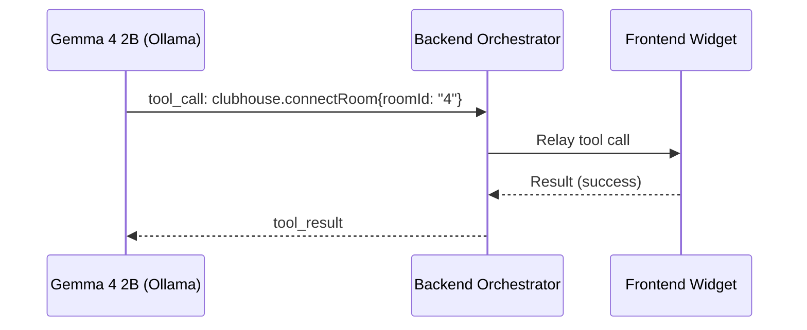

# Tools vs. Agent Skills for Widget Control

**Status: PROPOSED / EVALUATION**  
**Author:** Antigravity AI  
**Target Models:** `gemma4:e2b` (Ollama default) and other small, local LLMs ($\le 8B$ parameters)

---

## 1. Context & Objective

In **horrible-dashboard**, the workspace is a dynamic, dockable layout manager where content is hosted in pane instances running widgets (e.g., Observability, Visualizer, Clubhouse) and panels (e.g., Editor, Terminal, File Explorer). 

To make the system truly "agentic," the agent must be able to control the layout and execute domain-specific widget behaviors. For example:
- *Layout:* "Split the editor vertically and open the visualizer on the right."
- *Widget-specific:* "Connect the Clubhouse widget to room #4 and start streaming visualizer frames."

As the number of widgets and their exported actions grow, we must evaluate whether these capabilities should be exposed as **Direct Tools (MCP-style, schema-bound)** or **Agent Skills (Instruction-bound with generic tools)**, specifically focusing on the capabilities and limitations of small local models like `gemma4:e2b`.

---

## 2. The Direct Tools Model (Dynamic MCP)

Currently, widgets register actions via the frontend dynamic manifest using `WidgetDecl.agentTools`. These are compiled into JSON Schema declarations and sent to the LLM as function-calling definitions.



### Constraints with Small Models (e.g., `gemma4:e2b` / Gemma 2B)

1. **The 38-Tool Reasoning Ceiling:**
   As documented in [agent-chat.mdx](../modules/agent-chat.mdx), if a request payload contains **40 or more tool definitions**, `gemma4:e2b` silently skips its thinking phase (the `<think>` tags) and immediately emits response text. To prevent this, the backend must use a heuristic keyword-pruning algorithm in `_tools_for()` to limit the catalog to 38 tools.
   
2. **Fragility of Dynamic Pruning:**
   Keyword-based pruning is an unstable heuristic. If a user asks a cross-widget command like *"pipe telemetry into a vector DB and draw a graph,"* the pruning algorithm might accidentally discard `visualizer.render` or `vectordb.upsert` if the keywords do not align perfectly.

3. **Schema Overwhelm and Hallucination:**
   Small models have lower reasoning capacity. When presented with 30+ distinct, complex schemas, they frequently hallucinate parameters, confuse argument types, or make syntactically invalid tool calls.

---

## 3. The Agent Skills Model (Instruction + Generic Tool)

Instead of declaring dozens of separate, specialized tool schemas to the model, we consolidate widget controls into a **single, highly generalized tool** and document the API, payloads, and usage guidelines in a markdown-based **Agent Skill** (`SKILL.md` format) that the model reads on demand.

```json
// The single consolidated tool schema
{
  "name": "widget.callAction",
  "description": "Invoke a registered action on a specific active widget instance. Refer to the widget-control skill for valid actionNames and payloads.",
  "parameters": {
    "type": "object",
    "properties": {
      "widgetId": { "type": "string", "description": "The target widget/pane identifier (e.g., 'clubhouse', 'visualizer')" },
      "actionName": { "type": "string", "description": "The specific action to invoke" },
      "payload": { "type": "object", "description": "JSON object of arguments for the action" }
    },
    "required": ["widgetId", "actionName"]
  }
}
```

The detailed specifications for what actions each widget supports are defined in an **Agent Skill**:

```markdown
# Skill: Widget Control API
Exposes capabilities for interacting with horrible-dashboard widgets.

## 1. Clubhouse Widget (`clubhouse`)
- `connectRoom`: Connect to a live clubhouse audio/text channel.
  - `roomId` (string): The room ID.
- `disconnect`: Disconnect from the current channel.

## 2. Visualizer Widget (`visualizer`)
- `startStream`: Begin rendering a script's frame output.
  - `scriptName` (string): e.g., "pygame_billiards"
  - `fps` (number, optional): Target frame rate.
```

### Performance with Small Models (e.g., `gemma4:e2b` / Gemma 2B)

1. **Pattern Matching & Few-Shot Copying:**
   Small models are exceptionally good at textual pattern matching. By reading a markdown file with clear few-shot examples (e.g., *"To connect to clubhouse, call `widget.callAction` with `widgetId='clubhouse'`, `actionName='connectRoom'`..."*), the model can simply copy the JSON structure.
   
2. **Zero Tool-Slot Cost:**
   Replacing 25 specialized widget tools with 1 generic tool frees up 24 tool slots. This guarantees that the orchestrator never breaches the 38-tool ceiling, ensuring the model's reasoning/thinking phase stays active.

3. **Validation & Active Feedback:**
   Since validation is offloaded from LLM schema parsing to the runtime tool handler, we can provide immediate, rich, self-correcting feedback if the model misbehaves. For example:
   ```json
   {
     "ok": false, 
     "error": "Invalid action 'join' for widget 'clubhouse'. Did you mean 'connectRoom'? Valid actions: ['connectRoom', 'disconnect']."
   }
   ```
   The model can immediately read the error and correct its next turn.

---

## 4. Head-to-Head Comparison

| Metric | Direct Tools Model (Dynamic MCP) | Agent Skills Model (Generic Tool + Doc) |
| :--- | :--- | :--- |
| **Tool Count Impact** | High ($O(N)$ tools added per widget). Quickly breaches 38-tool ceiling. | Extremely Low ($1$ tool for all widgets). Preserves reasoning room. |
| **LLM Reasoning Overhead** | High. Must digest many distinct schemas. | Low. Learns one schema; reads documentation on demand. |
| **Syntax Errors** | Common. Small models frequently distort JSON-schema arguments. | Low. Easily copies structure from few-shot examples in instructions. |
| **Pruning Risk** | High. Heuristic pruning in `_tools_for()` can hide critical tools. | Zero. The generic tool is always available. |
| **Extensibility** | Hard. Adding/removing widgets changes the manifest and model schema context. | Easy. Just update/append details to the markdown skill documentation. |
| **Context Window Cost** | Medium. Schema representations are relatively compact. | High. Markdown files can be wordy (mitigated by lazy fetching). |
| **Type Safety / Linting** | Strict. Tool definitions are verified at the LLM interface layer. | Dynamic. Must be validated inside the runtime executor. |

---

## 5. Recommendation: The Hybrid Control Plane

To maximize reliability under local reasoning models like `gemma4:e2b` while keeping core features highly responsive, we propose a **Hybrid Control Plane**:

```mermaid
flowchart TD
    subgraph Core Tools ["Top-Level System Tools (Always Exposed, < 20 tools)"]
        FS["files.* (create, read, write)"]
        Term["terminal.exec"]
        Layout["layout.* (split, focus, switch)"]
    end

    subgraph Generic Control ["Consolidated Widget Bridge (1 tool)"]
        Bridge["widget.callAction(widgetId, actionName, payload)"]
    end

    subgraph Knowledge Base ["Agent Documentation & Skills"]
        SkillDoc["Widget Control Skill (SKILL.md)"]
    end

    Agent["Gemma 4 2B (Ollama)"] --> Core |Direct Schema| Core Tools
    Agent --> Bridge |Generic Schema| Generic Control
    Agent -.-> SkillDoc |Read on Demand / Injected| Knowledge Base
```

### Action Items for Implementation

1. **Retain Core System Verbs as Tools:**
   Keep the file explorer, terminal executor, and dockview layout operations as top-level direct tools (approx. 18-20 tools total). These are highly critical, frequently called, and benefit from immediate structural schemas.

2. **Unify Widget Extensions under a Bridge:**
   Define `widget.callAction` as a core dynamic tool. When plugins or content widgets (like Clubhouse, Visualizer) declare their capabilities, register them on the frontend widget registry under a unified `actions` map rather than pushing them as top-level tools.

3. **Expose Widget Action Index via an Agent Skill:**
   Deploy a built-in skill at `docs/skills/widget-control/SKILL.md` (and symlinked or discovered by the workspace customizations root). This skill will automatically index and document all active widgets and their actions.
   - For `gemma4:e2b`, the system prompt or orchestrator will load this skill into context only when the user's intent matches a widget control keyword, ensuring no context-window waste during plain coding tasks.

4. **Structured Error Self-Correction:**
   Implement strict runtime schemas in the dynamic frontend widget handlers. If `widget.callAction` receives an invalid payload, the error message returned to the model must include:
   1. A schema validation error.
   2. The list of valid action names.
   3. A few-shot correction example.
   This guarantees that even if a 2B model makes a mistake, it can fix it in a single loop step.
