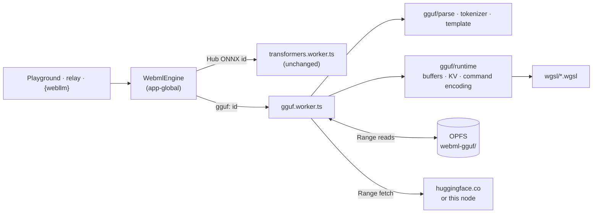

# WebML Phase 6: our own WGSL engine for GGUF

**Status: 6.0–6.5 built. 6.4's and 6.5's exit checks pass on an Intel UHD iGPU
(see [6.4](#64-fast), [6.5](#65-this-nodes-ggufs-in-the-window)). Real-model parity with llama.cpp holds for SmolLM2-360M
Q4_K_M, Qwen3-1.7B Q4_K_M, Qwen3-0.6B Q8_0 and Llama-3.2-1B Q8_0. Still open from
earlier stages: the `browser`-provider agent round with a Hermes tool call (6.3).
6.6 not started.** This is the plan [WebML](../modules/webml.mdx) said
Phase 6 needed before any code was written. It is split into stages; each one ships
on its own and ends with a check that has to pass before the next starts. Nothing
in Phases 0–5 is replaced. The transformers.js worker stays as the engine for ONNX
models, for the WASM CPU fallback and for published Scrive pages.

## Why build an engine at all

Phases 0–5 run ONNX exports through transformers.js and ONNX Runtime Web. That
works, and it limits us in four ways that patches on our side cannot fix:

| Limit today | Where it bites | What owning the forward pass gives |
| --- | --- | --- |
| Only the curated `onnx-community` exports run | The catalog is seven models; the node's own GGUFs (llama.cpp catalog, training's `convert.py` output, Ollama / LM Studio blobs) cannot run in the window | Any GGUF of a supported architecture, including **a fine-tune this node just trained** |
| No `num_logits_to_keep` | Logits for every prompt position: the 2.4 GB `bad_alloc`, worked around with 256-token chunked prefill | The LM head runs on the last position only. The chunking exists only to bound activation memory |
| KV cache thrown away after every reply | An agent round re-prefills ≈4k tokens (system prompt + tool schemas) every time: **~50 s per round** on Qwen3-0.6B | The longest common token prefix is reused across calls, so a round prefills only what changed |
| Logits come back to the CPU every step | ~600 KB readback per token for a 152k vocabulary; the `step` events cost a pass over the vocabulary in JS | Sampling and top-k run on the GPU. A step reads back a token id, or with `topK > 0` the k alternatives |

A fifth gain comes later (6.6): the residual stream lives in our own buffers, so
interpretability readouts (per-layer norms, logit lens) can be read during a normal
generation.

**Non-goals for Phase 6:** multimodal checkpoints, training or LoRA in the
browser, a CPU/WASM GGUF path (machines without WebGPU keep transformers.js),
GGUF in **published** Scrive pages (`webml-embed.html` loads transformers.js from
jsDelivr; shipping our engine there needs a bundled static asset, which is a
follow-up), and every ggml quantization type.

## Baseline to beat

From the Phase 5 measurements (2026-10-07, Intel Gen12 iGPU):

- SmolLM2-360M chat, q4f16 ONNX: **~27 tok/s**, TTFT **~0.7 s**
- Agent round, Qwen3-0.6B, ≈4k-token prompt: **~50 s**, almost all prefill

Stage 6.4 is measured against these numbers on the same machine.

## Shape of the change



**One protocol, two workers.** `gguf.worker.ts` speaks the same
`protocol.ts` events (`progress`, `ready`, `delta`, `step`, `done`, …), so the
playground, the `browser` provider relay and `{webllm}` blocks barely change.

**A GGUF is addressed by its model id**, `gguf:<owner>/<repo>/<path/to/file.gguf>`,
and `WebmlEngine` routes on that prefix. The plan's `source` field was not needed:
every consumer already passes model ids around as opaque strings, including
`browser_provider.py`, the manifest and `webml.defaultModel`. The protocol change is
additive and optional:

- `LoadRequest.contextLength`: KV positions to allocate (default 4096, capped by
  the model).
- `ready` gains `engine` (`'onnx' | 'gguf'`), `quant` (the weight type holding most
  of the file, e.g. `Q8_0`), `contextLength`, and `thinking` (the template takes
  `enable_thinking`). `EngineState.ready` mirrors them.

**Switching engines terminates the other worker.** `WebmlEngine` takes a factory
per engine kind. Loading a model of the other kind terminates the current worker
instead of sending it `unload`, because terminating is the only way to release a
GPU device. Only one model is resident at a time, as today.

### New files

| Path | Holds |
| --- | --- |
| `packages/webml/src/gguf/parse.ts` | GGUF header reader: a TS port of `backend/modules/interpretability/gguf.py`, with the same bounds (`_MAX_TENSORS`, `_MAX_STRING`, …) and the same ggml type table |
| `packages/webml/src/gguf/source.ts` | Range reads: HF `resolve/` URLs, the node's file route, OPFS files |
| `packages/webml/src/gguf/store.ts` | OPFS weight store (`webml-gguf/`, one file and a JSON sidecar per model id): list, delete, resumable download, quota check |
| `packages/webml/src/gguf/arch.ts` | Metadata → `ModelConfig`, plus a support check that says *why* a file is refused |
| `packages/webml/src/gguf/tokenizer.ts` | BPE (`gpt2`) and SentencePiece (`llama`) from `tokenizer.ggml.*`, with pre-tokenizers per `tokenizer.ggml.pre` |
| `packages/webml/src/gguf/template.ts` | `tokenizer.chat_template` through `@huggingface/jinja` (already a transformers.js dependency) |
| `packages/webml/src/gguf/quant.ts` | CPU reference dequantizers: the test oracle, never the runtime path |
| `packages/webml/src/gguf/ggml.ts` | The ggml type table (block elements and bytes), copied entry for entry from `gguf.py` |
| `packages/webml/src/gpu/device.ts` | The device, requested with the adapter's limits and optional features |
| `packages/webml/src/gpu/chunks.ts` | Splitting a tensor over the binding limit into whole-row chunks |
| `packages/webml/src/gpu/dispatch.ts` | Workgroup counts, spilling into y past the per-dimension limit |
| `packages/webml/src/gpu/kernels.ts` | Every pipeline, composed per weight type and cached; uniform and bind-group helpers |
| `packages/webml/src/gguf/rope.ts` | The rope angle table, built the way ggml builds its rope cache |
| `packages/webml/src/gguf/runtime.ts` | Buffers, KV cache, the per-token command list, logits readback |
| `packages/webml/src/gguf/sample.ts` | llama.cpp's default sampler chain; the distribution behind `step` events |
| `packages/webml/src/gguf/session.ts` | One loaded model: template → tokens → runtime → sampler → streamed text; `preflight()` for headers |
| `packages/webml/src/gguf/hub.ts` | A repo's GGUF files (tree API) and one file's header verdict, before download |
| `packages/core/src/modules/webml/panels/GgufPicker.tsx` | The playground's GGUF chooser |
| `packages/webml/src/wgsl/*.wgsl` | Kernels, imported with `?raw` |
| `packages/webml/src/engine/gguf.worker.ts` | The protocol loop around `runtime.ts` |
| `packages/webml/kernel-tests/` | Vitest browser mode (Playwright provider): each kernel on the GPU vs `quant.ts` / a CPU reference |
| `scripts/gen_webml_gguf_fixture.py` | The header conformance fixture and golden dequantized blocks (`gguf` pip package). Token-id goldens (`transformers` tokenizers) come in 6.2 |
| `scripts/gen_webml_llama_parity.py` | llama.cpp references (via `llama-cpp-python`): the tiny-model fixtures, and `--model` runs on real GGUFs |

## Technical decisions

The stages assume these decisions. Each one is checked in the stage named in
brackets, and a stage that disproves one stops and asks. Decisions 1 and 7 were
confirmed on 2026-10-08 (see [Decided](#decided)).

1. **Weights live in OPFS, not Cache Storage** [6.2]. A GGUF is one file of
   0.3–2.5 GB. Cache Storage hands back a `Response`, and reading a byte range out
   of one means reading the body. OPFS `createSyncAccessHandle` (in the worker)
   gives positioned reads. The download streams to disk, and the load streams
   tensor by tensor from disk into `GPUBuffer`s, so the file is never in JS memory
   at once. Downloads resume from the `.part` length the way the llama.cpp module's
   do. `cache.ts`'s listing and deleting cover both stores, so "On this device"
   stays one list.
2. **Read the header before downloading** [6.0]. The tensor directory and
   metadata sit before `data_offset`, a few MB including the vocabulary. A Range
   fetch of the header lets the picker say "architecture `phi3` is not supported"
   or "`IQ2_XS` is not supported" *before* a 2 GB click, and size the GPU budget
   from real tensor sizes.
3. **Port the backend's reader instead of adding `@huggingface/gguf`** [6.0]. The
   two readers must agree on what a file contains, and the backend one is already the
   house reference, with a size table that refuses to guess unknown types. The port
   is about 250 lines and runs against the same fixtures.
4. **Request the adapter's limits, then chunk anyway** [6.0]. Default
   `maxStorageBufferBindingSize` is 128 MiB. A tied 151,936 × 2,048 embedding / LM
   head in Q6_K is ~250 MB. The device is requested with the adapter's maxima, and any
   tensor over the binding limit is split by rows into several buffers; the matvec
   dispatches once per chunk. The probe already reports both limits.
5. **f32 activations and accumulation first, f16 later** [6.1 → 6.4]. Correctness
   is established with f32 everywhere except weights. `shader-f16` storage for
   activations and the KV cache is a 6.4 optimization, accumulation stays f32, and
   parity is re-checked afterwards.
6. **Dequantize inside the kernels** [6.1]. Weights stay in their ggml block
   layout on the GPU (uploaded as `u32` words). Decode kernels dequantize in
   registers; prefill tiles dequantize into workgroup memory. Dequantizing to f16
   at load would double or triple VRAM, and VRAM is what an iGPU shares with the tab.
7. **Kernel tests run in Chromium on SwiftShader** [6.0]. Playwright drives the
   preinstalled Chromium with `--enable-unsafe-webgpu --use-webgpu-adapter=swiftshader`,
   so CI exercises every kernel with no GPU. It is slow, and that is acceptable: the
   tests use small random tensors. Dawn's node bindings are the fallback if
   SwiftShader turns out to miss a feature we need.
8. **The rope variant is a property of the architecture, not the file** [6.3].
   `convert_hf_to_gguf.py` permutes Q/K for `llama`, which uses llama.cpp's "normal"
   interleaved RoPE. `qwen2` and `qwen3` use NEOX (split halves). Getting this wrong
   still produces fluent-looking garbage for a few tokens, which is why the parity
   check runs 64 greedy tokens and not 5. Llama 3.x also ships `rope_freqs.weight`
   (per-dimension factors), which must be applied.

## The kernels

All are compute shaders. "Fused" kernels are a 6.4 change; until then each step is
its own dispatch.

| Kernel | Notes |
| --- | --- |
| `embed` | Dequantize one row per token id. The id is read from a GPU buffer, so the decode loop can feed sampled ids without a round-trip (6.4) |
| `rmsnorm` | Workgroup reduction (subgroup reduction when `subgroups` is available) times weight. A per-head variant is Qwen3's QK-norm |
| `matvec_<q>` | Decode (M = 1), memory-bound: the hot path. One variant per quant type: F32, F16, Q8_0, Q4_0, Q5_0 (6.4), Q4_K, Q5_K, Q6_K |
| `matmul_<q>` | Prefill (M > 1): tiled, weights dequantized into shared memory |
| `rope` | `norm` and `neox` variants, applied in place. Angles come from a host-built table indexed by position (see `rope.ts`); `rope_freqs` factors arrive with 6.3 |
| `kv_store` | The pass's new K and V rows (computed, normed and rotated in f32) into the cache at their positions, rounded to f16 (default) or kept f32. Layout `[pos][kv_heads × head_dim]`, preallocated to the context budget. (Through 6.3 the projections wrote the f32 cache directly.) |
| `attention` + `attn_combine` | Decode: split over 128-position chunks (flash-decoding), one workgroup per (KV head, chunk) serving the whole GQA group, then a merge per head |
| `attn_prefill` | Causal tiled flash attention |
| `swiglu` | `silu(gate) * up`, fused into one pass |
| residual | Folded into the attention-output and FFN-down projections in 6.4 (`accumulate` flag on matvec / matmul). (`add`, out-of-place, is the 6.0 harness kernel) |
| `lm_head` | `matvec` over the vocabulary on the **last position only** |
| `sample` | llama.cpp's chain (top-k → top-p and min-p → temperature → draw with a host-supplied random number), with an exact top-k. Also writes p(chosen), entropy and the alternatives for `step` events |

**Per-token encoding.** Bind groups and uniform buffers are built once at load.
The current position and sequence length sit in one small storage buffer that
`writeBuffer` updates per step, so a token is one command buffer of roughly
layers × 12 dispatches, re-encoded with no allocation. Readback goes through a
ring of mapped staging buffers.

**Pipelined decode (6.4).** `sample` writes the token id into the buffer `embed`
reads, so step N+1 can be submitted before the host has read step N's token. The
host reads ids asynchronously to stream text and check stop conditions. On EOS, the
one speculative step is discarded and its KV slot is dropped.

**Prefix reuse (6.4).** The worker keeps the token ids behind the live KV cache.
A `generate` call tokenizes its prompt, finds the longest common prefix with those
ids, keeps the cache up to that point, and prefills only the suffix. For an agent
round, the suffix is the last tool result plus the new turn.

## Supported models (the first set)

| Model (GGUF) | Arch | Quants | Why |
| --- | --- | --- | --- |
| SmolLM2-360M-Instruct | `llama` | Q8_0, then Q4_K_M | Small, fast to iterate on, a direct comparison with the ONNX baseline |
| Llama-3.2-1B-Instruct | `llama` | Q4_K_M | `rope_freqs` (Llama 3 rope scaling) |
| Qwen3-0.6B / 1.7B | `qwen3` | Q4_K_M, Q8_0 | QK-norm, NEOX rope, `head_dim` ≠ `embd / heads`, Hermes tool calls: the agent models |

Q4_K_M files mix Q4_K, Q5_K and Q6_K (the LM head is usually Q6_K), and the
norms are F32. Supporting "Q4_K_M" therefore means all of these types.

Qwen2.5 (`qwen2`, QKV bias), Gemma 3 (sliding-window attention, sandwich norms,
scaled embeddings, GELU) and SmolLM3 (NoPE every fourth layer) are 6.6 candidates. `arch.ts` refuses
anything else by name.

## Stages

### 6.0 Harness and header (no inference)

- `gguf/parse.ts` plus tests against synthetic GGUFs built in the test, and one
  real header captured as a fixture. Its output must match `gguf.py` on the same
  bytes; a Python script dumps the backend reader's view to JSON for comparison.
- `gguf/source.ts`: Range reads from HF `resolve/` URLs, with the HF token where
  the connector has one, the same way the llama.cpp catalog does.
- `kernel-tests/` running one trivial kernel (`add`) in Chromium on SwiftShader
  in CI.
- Device creation with the adapter's limits. The chunking helper is tested with a
  deliberately low limit.

**Exit:** the header of a real Qwen3 Q4_K_M GGUF parses in the browser from a Range
read, with tensor bytes summing to the file size minus `data_offset`, and
the kernel harness is green in CI.

**Built (2026-10-08):**

- `gguf/ggml.ts`, `gguf/parse.ts` (the reader plus `layoutProblems`, which catches a
  truncated download before any buffer is made) and `gguf/source.ts` (`HttpSource`,
  `blobSource`, `bytesSource`, `hfResolveUrl`).
- `gpu/device.ts`, `gpu/chunks.ts`, `gpu/dispatch.ts`, and the `add` kernel
  (`wgsl/add.wgsl`, `gpu/add.ts`).
- Tests: `pnpm --filter @horrible/webml test` is the node project (parser edge cases,
  Range handling, chunk and dispatch planning). `test:kernels` runs Chromium on
  SwiftShader: the device gets the adapter's limits, and `add` is exact against the
  CPU, across a dispatch that spills into y and across row chunks under a 1000-byte
  limit. CI is `.github/workflows/webml.yml`.
- **Header conformance.** The fixture comes from llama.cpp's own writer rather than
  a downloaded header: a tiny Qwen3-shaped file with Q8_0, Q4_0, Q4_K, Q6_K, F16 and
  F32 tensors and every metadata value type. `parse.ts` must read it exactly as
  `gguf.py` does (`fixture.test.ts`), and `backend/tests/test_webml_gguf_fixture.py`
  checks that `gguf.py` still does. Regenerate it with
  `PYTHONPATH=. uv run python scripts/gen_webml_gguf_fixture.py`.

**Still open:**

- The real-model check is written but has not run.
  `WEBML_HF_HEADER=unsloth/Qwen3-0.6B-GGUF/Qwen3-0.6B-Q4_K_M.gguf pnpm --filter @horrible/webml test:kernels`
  needs a network that reaches huggingface.co. It also confirms that the Hub's CDN
  exposes `Content-Range` to script; if it does not, the picker passes the tree
  API's size instead.
- The HF token for gated repos. `HttpSource` takes `headers`, but nothing in the
  frontend holds a token yet. That is decided in 6.2 with the picker.
- `test_webml_gguf_fixture.py` runs with the backend suite, which has no CI
  workflow. Only the TS half runs in CI.

### 6.1 Correct, slow, `llama` only

- `quant.ts` references for F32, F16, Q8_0, Q4_0, checked against golden vectors
  from the `gguf` pip package's dequantizers.
- Naive kernels: `embed`, `rmsnorm`, `matvec` for those types, `rope` (norm),
  `kv_write`, `attn_decode`, `swiglu`, `add`, `lm_head`. Each is checked against
  its CPU reference in the harness. Prefill runs as a loop of decode steps.
- Logits read back to the CPU and sampled in JS with the existing `distribution()`.
- A dev-only page (not a panel) runs SmolLM2-360M Q8_0 from a fixed prompt.

**Exit:** 64 greedy tokens match llama.cpp token for token on SmolLM2-360M Q8_0,
and the top-5 probabilities at each step are within 1e-2. The reference is
`llama-server`'s `/completion` with `n_probs`, fetched by the llama.cpp module and
run by `scripts/webml/parity.py`.

**Built (2026-10-08):**

- `gguf/quant.ts`: matches the `gguf` package's dequantizers exactly on all four
  types (`quant.test.ts`, golden blocks in `quant-golden.json`).
- `gguf/arch.ts`: header → `ModelConfig`. It refuses other architectures, other
  weight types, rope scaling, `rope_freqs`, and tensors whose shapes contradict the
  metadata, each with a reason.
- Kernels: `embed`, `rmsnorm`, `matvec` (F32 / F16 / Q8_0 / Q4_0), `rope`,
  `attention`, `swiglu`, `accumulate`. `kernel-tests/kernels.test.ts` checks each
  one against a CPU reference (embed exactly, the rest within 1e-5).
- `gguf/runtime.ts`: `GgufRuntime.load` → `queueStep` / `forward` / `readLogits`.
  Everything per-token is built at load, and a step rewrites one 16-byte uniform.
- **Parity with llama.cpp, without the Hub.** The reference is `llama-cpp-python`,
  which builds llama.cpp from source, rather than `llama-server`.
  `scripts/gen_webml_llama_parity.py` writes two tiny random-weight `llama` GGUFs
  and records llama.cpp's logits at every position, with an f32 KV cache and no
  flash attention. `kernel-tests/forward.test.ts` replays them:
  - **All-F32 model:** the same 32 greedy tokens. The worst logit differs by
    5×10⁻⁷ of the row's largest, about the fixture's 6-decimal rounding.
  - **The same model with every tensor chunked to 1 KB bindings:** the same logits.
  - **Q8_0 / Q4_0 / F16 model with tied embeddings:** worst 0.77% and mean 0.42%,
    from llama.cpp quantizing activations to q8_0/f16 where the engine keeps f32.
    The top token agrees at 40 of 40 positions.
- **The suite catches bugs.** These planted bugs each fail it: llama treated as
  NEOX rope, GQA heads mapped `h % group`, Q4_0 nibbles swapped, attention scaled
  by 1/d instead of 1/√d.

**Changed from the plan:**

- The dev page is replaced by `kernel-tests/real-parity.test.ts`. It runs a real
  model from a fixed prompt and checks the result instead of only showing it.
  There is no tokenizer until 6.2, so the prompt's token ids come from llama.cpp's
  tokenizer in the reference file.
- The reference script is `gen_webml_llama_parity.py --model`, not a
  `llama-server` driver.

**Real models (run 2026-10-08, Intel UHD Gen12 iGPU, `WEBML_GPU=hardware`):**
the same 64 greedy tokens as llama.cpp on **Qwen3-0.6B Q8_0** and
**Llama-3.2-1B-Instruct Q8_0**, top-5 probabilities within **2×10⁻⁶** of llama.cpp
with an f32 cache (3×10⁻⁶ after the 6.4 kernels; 1.1×10⁻³ with 6.4's default f16
cache). The reference must come from `--f32`: against llama.cpp's own Q8_0 run the
difference reaches 0.08 on Qwen3 and a near-tie flips on Llama at step 15, because
llama.cpp rounds activations to q8 inside quantized matmuls and its F32 run of the
same weights diverges from its Q8 run the same way.

```sh
uv run --with llama-cpp-python python scripts/gen_webml_llama_parity.py \
  --f32 --model ~/models/Qwen3-0.6B-Q8_0.gguf --out ~/models/qwen3.json
WEBML_GPU=hardware WEBML_PARITY_MODEL=~/models/Qwen3-0.6B-Q8_0.gguf \
WEBML_PARITY_EXPECTED=~/models/qwen3.json \
  pnpm --filter @horrible/webml exec vitest run --project kernels real-parity
```

On Windows, `llama-cpp-python` installs from its CPU wheel index
(`--extra-index-url https://abetlen.github.io/llama-cpp-python/whl/cpu`), and Vite's
`/@fs/` only serves files on the project's drive, so models on another drive go
through a junction. The summary lands in `kernel-tests/.results/` (browser mode does
not forward the page's console).

SmolLM2-360M was run later in its Q4_K_M form (see [6.4](#64-fast)), not Q8_0.

### 6.2 A real engine in the app

- `tokenizer.ts`: `gpt2` BPE with the `smollm`, `llama-bpe` and `qwen2`
  pre-tokenizers, plus `llama` SentencePiece. A golden corpus (code, CJK, emoji,
  whitespace runs, special tokens) is checked against `transformers` tokenizers of
  the source repos. Unknown `tokenizer.ggml.pre` values are refused.
- `template.ts`: chat templates with `tools` and `enable_thinking`, rendered the
  same as transformers.js renders the same template, verified on the same message
  fixtures.
- `gguf.worker.ts` implements the protocol: progress per byte range,
  `warmup` (pipeline compilation plus one token), interrupt, unload, and the
  one-generation-at-a-time rule.
- `store.ts` (OPFS) with resumable downloads. The cache listing covers both stores.
- Playground: a **GGUF** tab next to the catalog. Enter a repo, see its `.gguf`
  files with sizes (HF tree API, as `list_repo_ggufs` does on the backend), and
  get the header preflight verdict before the download button enables.
- `device.lost` is handled like a worker crash, through `onCrash`.

**Exit:** chat in the playground with SmolLM2-360M GGUF. The model shows in
`webml_manifest`, and a `browser`-provider chat turn runs on it. `pnpm test`
and the kernel harness are green.

**Built (2026-10-08):**

- **Tokenizer** (`tokenizer.ts`), ported from llama.cpp's `llama-vocab.cpp`:
  - byte-level BPE with the `default`, `gpt-2`, `starcoder`/`smollm`,
    `llama-bpe`/`llama3` and `qwen2` pre-tokenizers, and SentencePiece with byte
    fallback;
  - special tokens split out longest first, and llama.cpp's end-of-generation set.
  - It matches the reference ids for every test string of llama.cpp's five
    vocab-only GGUFs (llama-bpe, qwen2, starcoder, gpt-2, llama-spm). Those are the
    `.out` files llama.cpp's own tokenizer tests use. The tests download them from
    release tag `b6800`, pin each SHA-256, and CI caches them.
  - `smollm` has no vocab file of its own. llama.cpp gives it the starcoder
    regexes, and starcoder is tested.
- **Templates** (`template.ts`): tested on Qwen2's own template and on Llama 3
  style BOS, `tools` and `enable_thinking` templates. ChatML is the fallback only
  when the vocabulary has its markers.
- **Sampler** (`sample.ts`): top-k 40, top-p 0.95, min-p 0.05, then temperature, as
  llama.cpp's defaults are (GGUFs carry no generation config).
- **Session, worker, client:**
  - The worker checks the header over Range before downloading anything.
  - Prefill runs in batches of 32, so Stop is heard during a long prompt.
  - `unload` waits for a running generation instead of freeing its buffers.
  - A lost GPU device is reported, and the next load creates a new one.
- **Store:** resumable downloads, and partial files are flagged in "On this device"
  but never offered to the manifest.
- **Tests:**
  - Unit: 77 in the node project, including the tokenizer vectors.
  - Kernel project: 35, in Chromium on SwiftShader. The session and the real
    `WebmlEngine` + worker each reproduce llama.cpp's greedy continuation from a
    text prompt. OPFS download, resume and delete run in a real browser.
  - The tiny models' `t2…t63` tokens are user-defined, so a prompt written as text
    tokenizes to exactly the reference ids.
- **In the app:** `pnpm dev` and Playwright, with huggingface.co answered by a
  stand-in that serves the tiny model. Find listed the file and its verdict
  (`llama · F32 · 64 context`), and Load downloaded it into OPFS and reported
  `ready · F32 · 64 context · webgpu`. A chat reply streamed with token
  probabilities. A Qwen3 file was refused, with the reason listed and Load
  disabled.

**Changed from the plan:**

- **Tokenizer reference:** llama.cpp's vocab test files, not a corpus run through
  `transformers` tokenizers. Those need the Hub.
- **Picker placement:** a "GGUF file from the Hub…" choice in the model picker, not
  a separate tab, so load, progress and ready stay one UI.
- **Device loss:** handled in the worker rather than through the client's
  `onCrash`. The worker survives a lost device; only the device has to be recreated.

**Still open:**

- The SmolLM2 chat itself, and a `browser`-provider agent turn on a GGUF model.
  Both need a real model from the Hub.
- The manifest already lists complete `gguf:` ids, and the relay passes the
  template's thinking flag. Neither has run against the backend loop with a real
  model.

### 6.3 K-quants and the agent models

- Q4_K, Q5_K, Q6_K (CPU references, then kernels). The `neox` rope, QK-norm,
  `rope_freqs`, separate `key_length`/`value_length`.
- Llama-3.2-1B and Qwen3 entries go into a GGUF section of `catalog.ts`,
  with `toolFormat` and `thinking` as for the ONNX entries.

**Exit:** parity as in 6.1 for every model in the table at Q4_K_M. A Qwen3-1.7B
`browser`-provider agent round emits a Hermes tool call that the backend parses and
answers, and the next round completes.

**Built (2026-10-08):**

- **K-quants:** Q4_K, Q5_K and Q6_K, as CPU references (equal to the `gguf`
  package's dequantizers on golden blocks) and as kernels.
  - The weight snippets now work in 32-value units, and a K-quant super-block is
    eight of them, so a K-quant row still spreads across the whole workgroup.
  - Matvec and embed are checked for all seven types.
  - Planted bugs are caught: Q6_K's second scale ignored, Q5_K's high bit read from
    the wrong plane, the packed 6-bit scales read from the wrong byte.
- **Architectures** (`arch.ts`): `qwen3` (NEOX rope, per-head Q/K RMS norms, every
  head dimension rotated, as llama.cpp asserts) and Llama 3's `rope_freqs`, plus an
  optional `attention.scale`.
  - The check now also refuses tensors the engine would ignore. Attention biases on
    a `llama` file, for example, are refused rather than silently skipped.
- **Kernels and rope:** a new `headnorm` kernel does the Q/K norms. The rope table
  divides angles by `rope_freqs` in float32, as ggml does.
- **Parity with llama.cpp** (`forward.test.ts`). The K-quant files come from llama.cpp's own
  quantizer (`llama_model_quantize` from F32 sources), so their tensor-type mix is
  the one real Q4_K_M / Q5_K_M files have.
  - **Qwen3, F32** (Q/K norms, NEOX, head size 32 with `embd / heads` = 16): the same
    32 greedy tokens, logits within 5×10⁻⁷.
  - **Llama, Q4_K_M** (Q4_K + Q6_K, `rope_freqs`, tied): worst 0.39%, mean 0.25%, top
    token 40 of 40.
  - **Qwen3, Q5_K_M** (Q5_K + Q6_K, tied): worst 0.39%, mean 0.25%, top token 40 of 40.
  - The differences come from llama.cpp rounding activations to q8_K for K-quant
    dot products.
  - Planted bugs are caught: Q/K norms skipped, `rope_freqs` ignored, Qwen3 with NORM
    rope.
- **Suggested repos:** `GGUF_SUGGESTIONS` in `catalog.ts` lists SmolLM2-360M,
  Qwen3-0.6B/1.7B and Llama-3.2-1B GGUF repos with their tool format and thinking
  switch, shown as suggestions in the picker. The relay uses a suggestion's tool
  format as it uses the ONNX catalog's.

**Changed from the plan:** suggestions carry no sizes, unlike the ONNX catalog.
The picker lists sizes live from the tree API, and the repo and file names could
not be checked against the Hub from this environment. A suggested file is only
preselected when the listing has it.

**Real models (2026-10-08):** Q4_K_M parity passes for SmolLM2-360M and Qwen3-1.7B
(see [6.4](#64-fast)). Qwen3-0.6B and Llama-3.2-1B were checked in Q8_0 (see
[6.1](#61-correct-slow-llama-only)); their Q4_K_M files were not downloaded.

**Still open:** a Qwen3-1.7B `browser`-provider agent round with a Hermes tool call
that the backend parses and answers.

### 6.4 Fast

In order, re-checking parity after each step:

1. Tiled `matmul_<q>` and `attn_prefill`, so prefill stops being a loop of decodes.
2. Prefix KV reuse across `generate` calls.
3. GPU `sample` with top-k readback, then pipelined decode.
4. Subgroup reductions; matvec tuned per quant (rows per workgroup, vectorized
   `u32` loads).
5. `shader-f16` activations and KV cache, where available.
6. Fused epilogues (residual add, norm into the next matvec's input).

`timestamp-query`, when the adapter has it, reports per-kernel time in a dev
overlay, so each step's change is measured rather than assumed.

**Exit**, on the Gen12 machine:
- SmolLM2-360M Q4_K_M decode **> 27 tok/s** (faster than its ONNX export).
- TTFT ≤ 0.7 s for a short chat prompt.
- A Qwen3-1.7B agent round after the first **under 10 s**, with prefix reuse.
  Today the 0.6B model takes ~50 s.

**Which engine is the default.** For a model that has both an ONNX export and a
GGUF, the GGUF engine becomes the default **only if its decode is faster** than
the ONNX export on the same machine. Equal speed is not enough, even with prefix
reuse. Each catalog model with both formats is measured here, and the result is
recorded in `catalog.ts` as that model's preferred engine. Where GGUF loses, ONNX
stays the default and GGUF is still available when picked explicitly. Models with
no ONNX export (local fine-tunes, anything from the GGUF tab) always run on GGUF.

**Built (2026-10-08):** all six steps. Each one was re-checked against llama.cpp on
the tiny fixtures (both on SwiftShader and on the iGPU) and on the two real Q8_0
models.

1. **Batched prefill.** The runtime builds two dispatch lists over the same
   weights and caches: _decode_ (one token: matvec, split attention) and _prefill_
   (up to `batch` tokens, default 256: `matmul.wgsl` and `attn_prefill.wgsl`), plus
   a shared _head_ that runs the final norm and the LM head on the last position
   only. Token ids live in a GPU buffer and a pass's (position, row count) in one
   Step uniform. `forward.test.ts` checks the logits after every prefix length, in
   passes of 5 tokens, against llama.cpp on all five fixtures.
2. **Prefix reuse.** `GgufSession` keeps the token ids behind the live cache and
   prefills only what follows the longest common prefix (always feeding the last
   prompt token). `usage.cachedTokens` reports what was reused. A failed generation
   drops the reuse state.
3. **GPU sampling, pipelined decode.** `sample.wgsl` runs llama.cpp's chain (top-k
   40, top-p, min-p, temperature, draw with a host random number) in one workgroup:
   an exact top-k by bisecting for a threshold, then a bitonic sort of the
   candidates. It writes the token into the buffer the next step's embed reads and
   a small record (id, p, entropy, alternatives) that the host reads instead of a
   vocabulary of logits. The session queues step N+1 before reading token N; on EOS
   the speculative step's cache entry is not kept. `sample.test.ts` holds it to
   `gguf/sample.ts` on seeded cases, including flat logits with thousands of
   candidates.
4. **Kernel tuning.** These changes had the most effect:
   - Weight snippets read whole words (a funnel shift for blocks at 2-byte
     alignment) and unpack four values at a time, rather than one byte at a time.
   - Matvec gives each lane a 32-value unit and reuses its activations across four
     rows, so X is not re-read per row. Because the activations are f32, X was ~4×
     the bytes of a Q8_0 row.
   - Decode attention splits positions into 128-key chunks (flash-decoding plus a
     combine pass), serves every query head of a KV group from one workgroup, and
     reads K in 16-byte pieces shared by four lanes.
   - Prefill attention keeps Q and the output in registers and stages nothing but
     a 4 KB block of partial scores in workgroup memory. Staging the K/V tiles
     there left only two workgroups per core: 9.6 GFLOP/s.
   - Matmul keeps its tiles k-major as vec4s, uses an 8×4 per-thread block, and
     decodes a unit's scales once (`unit_prep` / `unit_quad`).
5. **f16 KV cache** (`LoadOptions.kvCache`, default `f16`). New K/V rows are
   computed, normed and rotated in f32, then stored by `kv_store.wgsl`, as llama.cpp
   does. The store rounds to nearest even itself: this iGPU's `pack2x16float`
   rounds toward zero. It uses core WGSL packing, not `shader-f16`, so SwiftShader
   and CI run the same path.
6. **Fused epilogues.** The two residual adds per layer are a flag on the
   attention-output and FFN-down projections (`accumulate`). The separate kernel is
   gone.

Measuring: `bench.test.ts` (`WEBML_BENCH_MODEL`) times chat and two agent rounds
through `GgufSession` and records a per-kernel profile (`GgufRuntime.profile`,
timestamp queries). `perf.test.ts` (`WEBML_PERF=1`) times each kernel alone at
Qwen3-0.6B shapes. Results go to `kernel-tests/.results/`.

**Measured** on Qwen3-0.6B Q8_0, Intel UHD (Gen12, 67 GB/s streaming reads), with
a 3.5k-token agent prompt. The first column is steps 1–3 on the 6.3 kernels. The
6.3 engine itself (one token at a time, no reuse) had not finished its first agent
round after 80 minutes and was stopped.

|                                                      | Steps 1–3, 6.3 kernels | All six steps             |
| ---------------------------------------------------- | ---------------------- | ------------------------- |
| Chat: TTFT, 20-token prompt                          | 554 ms                 | **171 ms**                |
| Chat: decode                                         | 2.9 tok/s              | **19.0 tok/s**            |
| Agent round 1 (3,668 tokens prefilled, 30 generated) | 209 s                  | **43.5 s**                |
| Agent round 2 (3,664 of 3,719 tokens reused)         | 18.9 s                 | **3.4 s**                 |
| Matvec (Q8_0 / Q4_K)                                 | ~2 GB/s                | 13 / 10 GB/s              |
| Matmul, 256 tokens (Q8_0 / Q4_K)                     | 61 GFLOP/s             | 187 / 193 GFLOP/s         |
| Decode attention at 3.7k positions                   | 3.5 ms/layer           | 0.83 ms (f16), 0.59 (f32) |

The ONNX baseline for an agent round on this model was ~50 s.

**Exit, on the same machine** (`bench.test.ts`, 3.5k-token agent prompt, files from
the Hub: `bartowski/SmolLM2-360M-Instruct-GGUF` and `unsloth/Qwen3-1.7B-GGUF`):

| Check | Target | Measured |
| --- | --- | --- |
| SmolLM2-360M Q4_K_M decode | > 27 tok/s | **30.2 tok/s** (25.7 at 3.7k context) |
| SmolLM2-360M chat TTFT (38-token prompt) | ≤ 0.7 s | **161 ms** |
| Qwen3-1.7B Q4_K_M agent round after the first | < 10 s | **5.8 s**: 3,664 of 3,721 tokens reused, 29 generated at 8 tok/s |

Both models also match llama.cpp (`--f32` references, default f16 cache): the same
64 greedy tokens, top-5 probabilities within 5.7×10⁻⁴ (SmolLM2) and 1.1×10⁻³
(Qwen3-1.7B). Qwen3-1.7B's first round, a cold 3.7k-token prefill, takes 81 s.

**Q5_0 joined the supported types.** The "Q4_K_M" SmolLM2 file holds mostly Q5_0
(159 of 269 MB): llama.cpp's quantizer falls back to it where a row is not a multiple
of 256 values, and SmolLM2's is 960. `quant.ts` matches the `gguf` package's
dequantizer on golden blocks, and the kernel snippet is checked as the others are.
A planted high-bit slip fails the matvec and matmul tests.

**Changed from the plan:**

- **f16 activations: not done.** Only the cache is f16. Activations are a small
  share of the bytes now that matvec reuses them from registers.
- **The dev overlay** is `GgufRuntime.profile` and the bench's report, not a panel.

**Still open:**

- **The default engine per model.** The rule needs ONNX and GGUF runs of the same
  model on this machine. The one comparison so far is SmolLM2-360M: 30.2 tok/s on
  GGUF Q4_K_M against Phase 5's 27 tok/s on ONNX q4f16. That was measured on this
  iGPU but in an earlier session, with different prompts, so `catalog.ts` is
  unchanged until both run in the bench.
- **Matvec is at ~20% of streaming bandwidth.** The next candidates are subgroup
  reductions and more rows per activation load. Neither won on a first try: 8 rows
  per lane group was slower.
- **f16 decode attention is ~40% slower than f32 on this iGPU** although it reads
  half the bytes. Neither the conversions nor the load shapes explain it, measured
  separately. It stays the default for the memory (half a gigabyte at 4k context
  on Qwen3) and for prefill, where it is twice as fast.
- **SwiftShader miscompiles** a dynamically indexed private array kept live across
  workgroup barriers. The decode attention avoids the pattern; new kernels should
  too.

### 6.5 This node's GGUFs in the window

- A backend route in the llama.cpp module streams a servable GGUF with `Range`
  support. It serves only files `llamacpp.list_models` already lists, never an
  arbitrary path, behind the same auth as the rest of `/llamacpp`.
- **Run in this window** on the llama.cpp model list and on a finished training
  run's GGUF (training lineage already links them). The load uses
  `source: { kind: 'gguf-node' }`. Same-origin bytes skip the HF download, and
  OPFS still caches them.
- Hosted (Vercel) has no node, so the action is hidden there.

**Exit:** a model fine-tuned and converted on this node chats in the playground
with nothing fetched from the Hub.

**Built (2026-10-08):**

- **The route:** `GET /api/llamacpp/models/file?path=…` serves a catalog GGUF
  through Starlette's `FileResponse`, which honours `Range`. The boundary is
  `/models/layers`'s: `catalog.find_model` must list the path, so an arbitrary file,
  or a path that walks out of the managed directory, gets a 404.
  - A lookup the catalog vouched for is kept for 60 s. A load is hundreds of Range
    reads, and `find_model` rescans every model directory on each call.
  - CORS now exposes `Content-Range`, because the desktop webview is a different
    origin from the backend.
- **The id:** `gguf-node:<path>`, beside the Hub's `gguf:<repo>/<file>`. Both run on
  the GGUF worker.
  - The worker cannot know the backend's origin, so the window passes the file's
    URL with the load: `LoadRequest.url`, from `WebmlEngine`'s `sourceUrl` option.
    Core sets that option to the route.
  - There is no `.gguf` check on the path, because Ollama's blobs have none.
- **The worker** checks the header over `Range`, then uploads the tensors straight
  from the route. The reads are the "download" progress the playground shows.
- **Run in this window** appears on the llama.cpp pane's model rows and on the
  training convert card's result, through the webml module's `runNodeGguf`. It is
  offered only when:
  - the architecture is one the engine runs;
  - the file is not a LoRA adapter;
  - the app is not hosted. A hosted backend is a remote machine, so every load would
    pull the whole file across the network.
- **Tests:**
  - Backend: Range reads, refused paths, the exposed header.
  - Unit: id round-trips, routing, the URL handed to the worker.
  - Kernel project: the real worker streams the tiny model from an HTTP URL and
    reproduces llama.cpp's continuation, storing nothing in OPFS.
- **Exit, in the running app** (`pnpm dev`, Playwright driving Edge on the iGPU):
  - The node already held `qwen3-0-6b-sft-merged-q8_0.gguf`, a Qwen3-0.6B
    fine-tune trained and converted here. "Run in this window" on its row loaded it
    in 7.9 s, in 323 Range reads from the node.
  - It answered at 19 tok/s, TTFT 219 ms.
  - The page made **no request to the Hub**. The LoRA adapter's row offers no button.

**Changed from the plan:**

- **No OPFS copy.** The plan said OPFS would still cache node files. It does not:
  the node is this machine, and a second copy of a file already on its disk is
  waste. Loading streams from local disk over loopback in seconds.
- **No `source` field.** The id and `LoadRequest.url` carry the source, as 6.2
  already decided for Hub files.

### 6.6 Later, each optional

- Interpretability readouts during generation: per-layer residual norms and a
  logit lens into `{tokenviz}` and the model explorer.
- Qwen2.5 (`qwen2`, QKV bias), Gemma 3 and SmolLM3 architectures.
- GGUF in published Scrive pages (bundled engine asset).

## Risks

| Risk | Mitigation |
| --- | --- |
| iGPU limits: binding size, total VRAM shared with the tab | Chunked tensors (decision 4). The preflight budget compares the header's tensor bytes plus KV (`ctx × layers × 2 × kv_heads × head_dim × bytes`) with `maxBufferSize` and refuses with numbers |
| Tokenizer drift: one wrong pre-tokenizer regex silently changes every prompt | Golden corpus per supported `tokenizer.ggml.pre`, and anything else is refused |
| Numerical drift that "looks fine" | 64-token greedy parity against llama.cpp at every stage exit, re-run after every 6.4 step |
| SwiftShader lacks a feature (subgroups, f16) | Those paths fall back, so the baseline kernel is always tested. The fast paths are checked on real hardware by the parity script |
| OPFS quota or eviction | `navigator.storage.persist()` on the first GGUF download. Quota is checked against the file size before starting |
| Maintaining a second engine indefinitely | The scope is the supported-models table. Everything else stays on transformers.js and is refused at preflight, not half-run |

## Decided

Settled on 2026-10-08, before 6.0:

1. **GGUF weights live in OPFS** (decision 1). "On this device" lists both OPFS
   and Cache Storage.
2. **Kernel tests run in Playwright on SwiftShader** (decision 7), as a browser
   job in `packages/webml`'s CI.
3. **Qwen2.5 moves to 6.6.** The 6.3 set is SmolLM2, Llama 3.2 and Qwen3.
4. **GGUF replaces ONNX as a model's default only if it decodes faster** (6.4).
   Matching ONNX speed is not enough.
