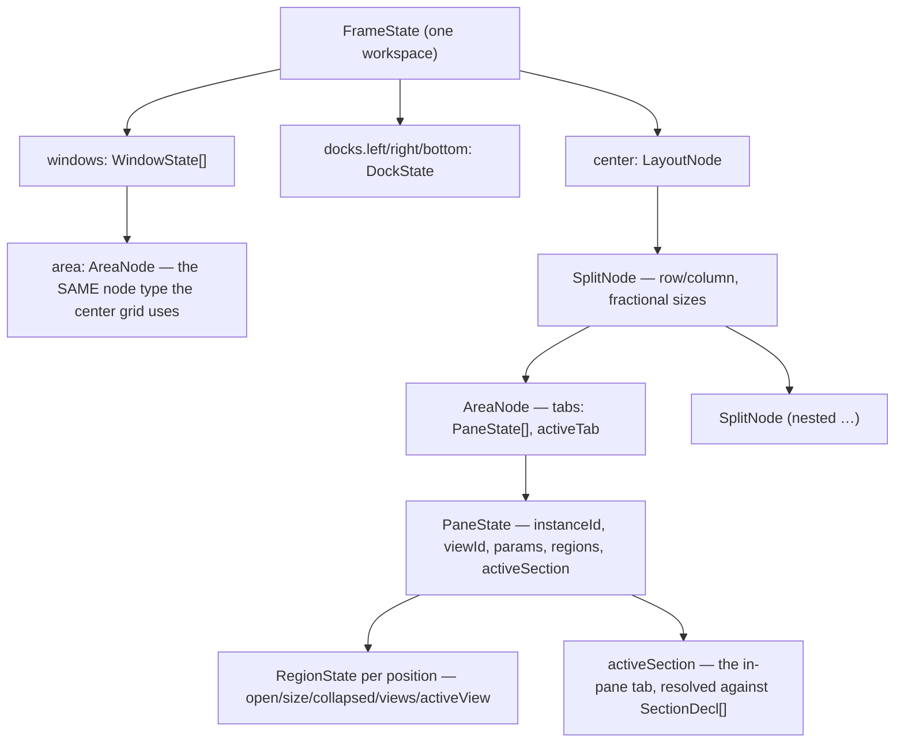

# Windowing: the frame

A desktop in **tiling** mode (see [layout-shell.mdx](layout-shell.mdx)) shows the
**frame** — a custom layout engine that hybridizes VS Code and Blender:

- a **workspace tab strip** across the top (Blender-style, the single switcher);
- VS Code-style **activity rails** down both sides, three fixed **tool docks**, and
  an emacs-style **minibuffer** along the bottom
  (left/right/bottom);
- a Blender-style **center grid** of recursively split **areas**;
- per-pane **region strips** (the successor of panel groups — see
  [panel-groups.mdx](panel-groups.mdx));
- a **fullscreen-area** mode.

The frame's old in-window floating layer has been promoted into the desktop shell's
**window layer**, which floats over the whole shell rather than being clipped inside
the center grid — see [desktop-shell.mdx](desktop-shell.mdx). Windows live on
`FrameState` and so are described here; how they are _presented_ (backdrop, taskbar,
tiling-vs-floating desktops) belongs to that page.

## Decisions

- **Custom engine, no dockview.** The engine is ~a dozen small React components
  over a pure data layer; the old dockview wrapper (tab strips on every group,
  root-relative splits, a hand-rolled mini-dock nested inside panes) is gone.
  Modules never import the engine — the **module registry stays the public API**.
- **Two layers.** `packages/core/src/layout/` is the React-free source of truth:
  `types.ts` (data model), `model.ts` (pure tree ops), `store.ts` (one reducer
  store), `serialize.ts` (versioned schema), `controller.ts` (role routing,
  regions, the `LayoutController` seam), `persistence.ts` (autosave/switch),
  `presets.ts` (frame seeds) — all unit-tested (`pnpm --filter @horrible/core
test`). `packages/ui/src/layout/` renders it: `Frame`, `WorkspaceTabs`,
  `ActivityRail`, `Dock`, `CenterGrid`, `Area`, `AreaHeader`, `Region`,
  `PaneHost`, `CornerGrip`, `Sash` — plus `packages/ui/src/desktop/` for the window
  layer, the backdrops and the taskbar, and `layout/install.ts`, which installs the
  engine from the **shell** rather than from `Frame`'s mount (the frame does not
  mount at all on a floating desktop).
- **Three pane roles = default placement.** Every view (panel or widget
  declaration) declares `role: 'document' | 'tool' | 'widget'`, which says where
  an `openPanel` with no further instruction puts it:
  - **document** — lives in center areas; documents **stack as tabs** (editor
    buffers, notebooks, the SQL console, scratch, the games lobby/board…);
  - **tool** — opens in a dock (file explorer, outline, terminal,
    REPL, agent chat, observability…); `defaultDock` picks its side. A dock shows
    **exactly one tool at a time** — its title in the dock header, no in-dock tab
    strip. The **activity rails are the single tool switcher**: a dock may hold
    several tools in its list, and clicking a rail glyph makes that one active
    (and reveals the dock);
  - **widget** — takes a center **area of its own**, no tab strip (dashboard
    widgets, clubhouse, commons…).

  **Roles are defaults, not zones.** A center area can host any view — including
  a tool — so `changePaneType`, the area type switcher, and the empty-area picker
  all offer the full list (grouped by role, tools last). `openPanel` still routes
  by role, so callers that don't care don't have to; `openPaneInArea` is the
  explicit escape hatch for a caller that has already chosen the destination.

  A **dock**, by contrast, only accepts views that opted in. `dockable`
  (`DockSide | DockSide[]`, preferred side first) is what earns a view a rail
  glyph; `role: 'tool'` implies `dockable: [defaultDock ?? 'left']`, so every
  existing tool is dockable without declaring anything. A `widget` that declares
  `dockable` becomes rail-toggleable **while still opening in the center** — that
  is the whole point of splitting the two axes.

  **Which role a view should declare.** The three are easy to pick between by
  what the pane _is_, rather than by where you first imagined putting it:
  - a **document** is a surface you work _in_ — one per subject, several open at
    once, and it benefits from tabs;
  - a **tool** is a _companion_ to whatever you are working on — narrow,
    singleton, always the same thing, useful alongside a document;
  - a **widget** is a _readout_ — glanceable, no interaction depth, sized to a
    tile, and the thing you would put on the `board` backdrop.

  That last clause is the one test that distinguishes `widget` from `document`
  outside the tiling grid, and it settled several miscategorised panes. The
  giveaway is the preset: `widget` takes a centre area **alone**, so any pane
  that a frame preset _tabs_ with others cannot be one. `lab.hub`,
  `interpretability.context`, `interpretability.architecture` and
  `llamacpp.server` were all declared `widget` purely to make them
  centre-placeable — while the `lab` preset tabs all four into a single area,
  which only documents do. They are documents now.

  In the other direction, `mcp.servers` and `skills.library` were dock-only
  `tool` panes: a five-section console with an authoring surface, and a browsable
  catalogue, both squeezed into a 280px rail. Both are `document` +
  `dockable: 'left'` now, which keeps the rail glyph for consulting one beside
  your work without pretending the rail is where the work happens.

  `clubhouse.account` stays a `widget` despite reading like a tool: the
  `dashboard` preset gives it a centre area of its own beside `dashboard.welcome`,
  which is exactly what the role means.

  Note that a narrow companion view is often better modeled as a **region strip**
  of its host pane than as a dockable view: most of the obvious candidates
  (`editor.recentNotes`, `network.chat`, `observability.logs`, `commons.requests`,
  `interpretability.context`, `training.metrics`) already are regions, and giving
  them a second home in a dock would just be a competing surface for the same
  content. `dockable` is for views with no host to hang off — currently
  `clubhouse.account` and `commons.directory`.

  A view that has become _purely_ a companion says so with **`embedded: true`**,
  which removes the second home rather than merely discouraging it. See
  [Embedded views and sections](#embedded-views-and-sections).

- **Workspaces are full frames (Blender model).** A workspace persists
  _everything_: the center tree, dock visibility/sizes/contents, windows, its own
  `mode` and `backdrop`,
  region state, focus, fullscreen. Switching workspaces switches the whole
  picture. `FramePreset`s (contributed via `ModuleManifest.frames`) seed
  stable-id workspaces on first activation — **Desktop**, **Dashboard**, **Scripting**,
  **Research** (console/arxiv/browser beside the viewers + library — see
  [research](../modules/research.mdx)), **Data Ops** (database console + REPL +
  library), **Web Ops** (embedded browser + its network views + search +
  library), **Coding Harnesses**, plus module-contributed ones (**Data Entry**
  from the [records](../modules/records.mdx) module, **DashArena**
  from games, Training, Notebook, Orchestration); `layout.reset` restores the
  preset.

  **Desktop is first and deliberately empty**: floating mode, an aurora backdrop,
  no panes — what logging into a machine looks like. It is also what a fresh
  install boots into (`hydrate` seeds it rather than `dashboard` on an empty
  slate). Landing on Dashboard meant the app's opening move was to fill the screen
  with somebody else's arrangement of nine panes before the user had asked for
  anything, and the presets beside it stop reading as _choices_ once one of them
  has already been made for you. Only the empty slate is affected — an install
  that already has workspaces still opens whichever one it was left on.

- **A workspace carries a role, not just furniture.** A preset may declare
  `agent: '<roster id>'` — the roster agent its docked chat opens as. Switching to
  Data Ops makes the agent the `dba`; switching to Data Entry makes it `intake`,
  which can only _propose_ record values. Because an `AgentSpec` carries a system
  prompt, a tool scope and a preload set, the persona, its capabilities and its
  token cost all switch with the layout. An unknown id falls back to `main`, the
  same way `seedFromPreset` skips unknown views; picking a different agent by hand
  is a per-workspace override kept in `localStorage`, so it survives a switch away
  and back. See [agent-chat](../modules/agent-chat.mdx).

## Model

- **SplitNode** — a row/column of children with fractional sizes (drag the sash).
- **AreaNode** — a leaf rectangle. Invariant: its tabs are all documents (tab
  strip), exactly one widget (no strip), or empty (view picker).
- **PaneState** — one live pane instance (`${viewId}#${n}`); carries its params,
  its **persisted per-instance region strips**, its **`activeSection`** (see
  [Embedded views and sections](#embedded-views-and-sections)), and — when docked —
  its **remembered `dockSize`**. A centre pane also carries **`minimized`**: it stays
  in its area at its index but is skipped by the tab strip and never rendered, so
  restoring is exact and the split survives (see
  [desktop-shell.mdx](desktop-shell.mdx#minimizing-is-not-window-only)).
- **DockState** — a fixed tool dock: visible flag, px size, stacked tools, one
  active. The px `size` is a **fallback**: a docked tool that the user has
  resized carries its own `dockSize`, so a narrow file tree and a wide agent chat
  can share a side without fighting over one width, and re-opening a tool
  restores the width it was left at. Resizing also mirrors into the dock's
  `size`, so the next tool opened there inherits the width just chosen rather
  than snapping to the built-in default. A view can declare a starting width with
  `defaultDockSize` (`agent.chat` opens at 420); switching the active tool
  therefore changes the dock's extent.
- **WindowState** — one OS-style window on the desktop, replacing the old
  `FloatingPane`. Two things changed with it, and both matter:

  Its **content is an `AreaNode`**, the same node type the center grid uses. That
  is what makes "one pane per window, tabs optional" nearly free: a plain window is
  an area with one tab, a merged window is an area with several, and the existing
  tab strip, `dropPaneOnTab`, `SET_ACTIVE_TAB` and `REORDER_TAB` all apply to
  windows unchanged rather than being duplicated in a parallel vocabulary that
  would drift. `findAreaAnywhere`/`updateAreaAnywhere` (`layout/model.ts`) resolve
  an area id against the center tree **or any window**, which is the seam that makes
  that work.

  Its **geometry is pixels**, measured against `FrameState.windowViewport` — the
  surface size the rects were last measured on. The old fractional rect was
  fractions of `.frame-center`, which is precisely what pinned floating cards
  inside the tiling frame; a window now floats over the whole shell. Fractions also
  cannot express a minimum size, and would reflow a window's contents on every drag
  of the app's edge. On load, if the surface turns out to be a different size than
  when the layout was saved, every rect is rescaled proportionally through
  `SET_WINDOW_VIEWPORT` — which deliberately **does not bump `revision`**: it is a
  projection of the same layout onto a different surface, not a user edit, and
  marking it dirty would make every browser resize dirty the workspace and drive
  the 600 ms autosave debounce into a continuous write loop.

  `mode` is `normal | minimized | maximized`, and `snap` records the zone a window
  occupies. `snap` is **stored rather than re-derived** from the rect, because a
  window the user happened to drag to exactly half-width is not snapped and must
  not spring back to a restore rect when nudged.

  A minimized window keeps its pane **mounted** — see
  [Pane lifetime](#pane-lifetime-unmount-is-not-close).

- **windowViewport** — the surface size `windows[].rect` was last measured
  against, or `null` before anything measured it. A migrated v1 layout arrives as
  `{w:1,h:1}` so its old fractions become pixels through the ordinary rescale path,
  with no migration-only arithmetic to get wrong.

### Embedded views and sections

Two declarations exist to make **one pane hold what used to be several**, without
either half of the merge going wrong: the retired surface must stop being a
destination, and it must not stop being reachable.

**`embedded: true`** (on `PanelDecl` / `WidgetDecl`) says a view exists only inside
another pane. It stays fully registered — regions, sections, `openPaneInArea` and
dragging a strip out into the center all keep working — but it drops out of every
affordance that would present it as a competing home:

| Surface                                       | Effect                                                       |
| --------------------------------------------- | ------------------------------------------------------------ |
| `pane.open:<id>` command                      | not synthesized (`registry.ts`)                              |
| area-header type switcher / empty-area picker | filtered (`AreaHeader.tsx`)                                  |
| activity rails                                | `dockSidesOf` returns `[]`, so **embedded ⇒ never dockable** |
| `list_available_panes`                        | no top-level row — listed under its host instead             |

The last row is the one that matters for the agent, and it is why `show` learned to
resolve an embedded view to _where it lives_: `show("Outline")` reveals it in its
host's region strip or section rather than failing to open it standalone. An
embedded view that **nothing hosts** is a declaration error, and fails loudly
(`ok: false`) rather than quietly opening a pane the flag said shouldn't exist.

### A view that stops being dockable

`role` and `embedded` decide where _new_ opens go; neither touches a layout that is
already saved. So a view that was a docked `tool` and became a centre-only
`document` — as `settings.home` did when the settings page grew two columns — stays
pinned in its old dock in every workspace the user has, forever, and looks like the
change simply didn't work.

`undockableViews()` (`layout/persistence.ts`) closes that at load time: it reports
every view for which `isDockable` is now false, and `deserialize` drops those from
**docks only**. The rule is capability-based rather than a per-view migration list,
so it covers `embedded` and a `role` change identically, and needs no entry when
the next view changes its mind. Centre panes and region placements are untouched —
those are placements the user made deliberately.

**`sections?: SectionDecl[]`** are in-pane tabs — the sibling of a region strip. A
region is a _companion_ beside the main content; a section _replaces_ it. Each
section declares an `id`, a `label` (what `show("friends")` matches), an optional
pick `key`, and its body as either an inline `component` or the `view` id of a
registered (usually embedded) view.

The host owns everything a module used to hand-roll:

- **`PaneState.activeSection`**, persisted **per instance** — the module singletons
  this replaces (games' `hub-section`, the client drawer) forgot the user's choice
  on every reload, and two panes of one view shared one value.
- `SectionTabs` (packages/ui), rendered by `PaneHost` above the body.
- A synthesized `section.show:<host>:<section>` command per section, plus a
  host-scoped keybinding for any declared `key`. Regions and sections share **one
  per-host letter space** — they share a keyboard scope, so a duplicate letter is
  dropped with a warning rather than left to resolve arbitrarily.
- `activeSectionOf` **resolves** rather than reads: a stored section id can outlive
  the declaration that named it (a saved layout loads against today's code), so it
  falls back to the default instead of rendering a strip with nothing selected.

A module picks its style: a section with its own `component`/`view` is rendered by
the host, and one with neither falls through to the host's own component, which
switches internally via `usePaneSection()`. Both exist because a pane being merged
usually already switches internally, and a new one usually doesn't want to.

**The agent-context rule.** Unlike a region strip — which gets a synthetic instance
id (`${host}:${position}:${viewId}`) that neither `listPanes` nor `visiblePanes`
descends into — a section body renders inside its host's `PaneInstanceContext`, so
its provider registers under the **real, enumerable** pane instance id. Providers
are therefore keyed by **instance _and_ section**: `PaneHost` supplies the section
id through `SectionInstanceContext` around a body it renders itself, and
`useAgentContext` takes it from there (a pane that switches sections internally
passes it explicitly instead — its own registration is pane-level, and stamping the
host with the active section would put it and its inner bodies back on one key).

Keying on the instance alone was a silent-overwrite bug: whichever provider mounted
last won, its unmount restored nothing, and the workaround was a standing rule that
a pane may have only one. Now a pane-level snapshot and the mounted section's
**merge**, section last, and reads are pinned to the _active_ section so a provider
that outlives its switch cannot answer for the tab that replaced it.

The active section **and the list of siblings** are stamped onto every snapshot
centrally by `readPaneAgentContext`, not left to each module — a merged pane's
snapshot is ambiguous without the first, and a module that forgot would produce a
plausible-looking snapshot the agent then reasons about wrongly. The sibling list is
there because many sections still have no provider at all (only the _mounted_ body
can provide): a bare `{section}` gave the model nothing to answer from, and a pane
that returns nothing does not produce "I don't know" — it produces a confident
answer sourced from whatever else was in the context window. `hasPayload: false`
now names that case explicitly.

**Contributed sections.** Sections are declared by the pane that owns them, which is
right when the tabs are the pane's own — and wrong for [Explorer](../modules/explorer.mdx),
whose entire purpose is to be the one place you go to find _something_, wherever it
lives. A view opts in with `explorerHost: true`, and any module (or plugin) adds a
tab through `ModuleManifest.explorerSources`. `ExplorerSourceDecl` **is** a
`SectionDecl`, so nothing downstream is a second mechanism.

The merge happens in the `registry.panels` / `registry.widgets` getters — at **read
time, not registration** — so module order cannot matter; the host may register
before or after its contributors. Merged decls are memoized against a registration
counter, because those getters run on every render path and a fresh object per call
would defeat `useSyncExternalStore` snapshots and every memo keyed on the decl.

### The minibuffer

The bottom-most row of the frame, **under** the bottom dock — emacs's minibuffer
and echo area, not a fourth dock. State and command matching live in
`core/src/minibuffer.ts` (pure, unit-tested); the strip is
`packages/ui/src/layout/Minibuffer.tsx`. Three states, in priority order:

| State      | When                            | What it shows                                         |
| ---------- | ------------------------------- | ----------------------------------------------------- |
| **prompt** | a `dialogs.prompt()` is pending | the prompt inline — label, prefilled input, OK/Cancel |
| **input**  | `alt+x` (M-x)                   | slash-command entry with live completions             |
| **status** | idle                            | `workspace › focused pane`, plus the echo area        |

**Slash commands** resolve against the same `registry.commands` the palette uses,
so nothing is registered twice. A command opts into a short name with
`slash: 'save'` (runs as `/save`); the leading slash is optional, so `/save` and
`save` are the same query. Anything without a `slash` stays reachable by fuzzy
title/id search. Ranking is exact-slash → slash-prefix → exact verb → verb-prefix
→ id substring → title substring, ties broken by registration order — which is
what makes **first-registered-wins** the rule for two commands claiming one slash
name. Current names: `/save`, `/save-as`, `/save-all`, `/new`, `/find`.

**Prompts render here, not in a modal.** `dialogs.prompt()` already existed and is
what editor Save As calls, so serving it in the minibuffer gave "save as, right
here" with no new API and every existing caller for free. `<Dialogs />`
deliberately skips `kind === 'prompt'` — rendering it in both places would show
two competing inputs for one pending promise. `confirm`/`choice` stay modal: a
destructive Save / Don't Save / Cancel should interrupt, not be a line you can
ignore.

The `alt+x` binding is declared `override: true` so a focused editor pane can't
shadow it — the minibuffer is the escape hatch and has to be reachable anywhere.

**Anywhere includes a floating desktop**, where the frame is not mounted at all.
It used to not: `alt+x` flipped a store nothing rendered, and every prompt waited
forever on an answer the user was never shown. The shell mounts a second instance
there — `<Minibuffer variant="overlay" />` — which floats above the taskbar and
renders nothing in the **status** state, because the taskbar's `mx` zone is the
desktop's status line. See
[desktop-shell.mdx](desktop-shell.mdx#the-mx-zone-and-where-the-minibuffer-went).

### Activity rails

There is one rail per side, each driving the dock on that side — a left-edge
glyph toggling a right-side pane was the confusing part of the single-rail
design. `railEntries` (core/layout/rail.ts) derives the glyphs as pure data over
`FrameState` + the user's rail prefs; `ActivityRail` (packages/ui) only renders
and routes clicks and gestures.

A rail lists what is actually docked on its side — by where a pane _is_, not
where it declared it wanted to be, so a tool that ended up somewhere unusual
still has a switcher — plus any view declaring `dockable` for that side which
isn't docked anywhere yet, shown dimmed so a module stays discoverable before it
has ever been opened. Each glyph carries one of four states:

| State    | Meaning                               | Click                                                |
| -------- | ------------------------------------- | ---------------------------------------------------- |
| `active` | the dock's visible tool               | hide the dock                                        |
| `docked` | in the dock's list, not showing       | reveal it                                            |
| `center` | open out in a center area or floating | **focus it** — never re-docks or opens a second copy |
| `closed` | not open anywhere                     | open it in this dock                                 |

The **left rail also carries the bottom dock**, in a second section below its
own. The bottom edge is reserved for the minibuffer rather than a third rail,
and a rail is the only tool switcher a dock has — without this the bottom dock's
tools (terminal, REPL) could be revealed by keybinding but never switched
between.

#### Rail customization

The rails are user-customizable, VS Code activity-bar style
(`core/layout/rail-prefs.ts`):

- **Move**: drag a glyph onto another rail section (left ↔ right ↔ the left
  rail's bottom-dock section) to rehome it there, or within its own section to
  reorder; an insertion line previews the drop, and empty sections stay up as
  targets while a dockable drag is in flight. Right-clicking a glyph offers the
  same moves as menu items. If the view is open in a dock, the pane moves with
  the glyph (the `MOVE_TOOL` action); a center pane is re-docked.
- **Hide**: right-click a glyph → _Hide_, or right-click the rail background
  for a visibility checklist (check to show, uncheck to hide). Hiding a view
  that is currently docked closes it first (guarded) — a tool with no glyph
  would be unswitchable. _Reset rail layout_ (also the `rail.reset` command,
  the escape hatch when a rail has been hidden entirely) drops all
  customization.

Preferences are three overrides per view — home dock (`side`), `hidden`, and
per-dock `order` — stored **globally, not per-workspace** (where your tools
live is a habit, not a layout) as one JSON blob riding the settings store under
`frame.railPrefs`, which buys boot hydration, live reactivity, and server-side
persistence for free. A side override reorders `dockSidesOf`, so role routing
and `openToolInDock` follow the user's placement; it never _makes_ a view
dockable — declarations still decide that.

#### Where a window opens

A window opens **where that view's window was last left** — its rect, and the snap
zone if it had one (`core/layout/window-placement.ts`). Only when a view has no
memory does it fall back to the diagonal cascade.

The placement cannot live in the layout blob: a closed pane has no `WindowState` to
hold one, and "reopen the agent where I snapped it" is precisely a question asked
after it was closed. So it rides the settings store under `frame.windowPlacement`,
**globally and keyed by view id** — the same call rail customization makes, for the
same reason. Keying by pane instance would be useless: instance ids are minted per
open, so the key could never be looked up again.

Two details are load-bearing:

- **The snap zone is stored alongside the rect, not derived from it.** A snapped
  window keeps a `restoreRect` to un-snap back to and re-derives its geometry when
  the desktop resizes. Replaying only the pixels produces a window that looks
  identical until either of those matters — and it re-snaps to the right half of
  _today's_ desktop rather than to stale pixels from a differently sized one.
- **Only single-pane windows are recorded.** A window holding three merged tabs has
  one rect and three views; filing that rect under each would teach every pane in
  the group a placement that belonged to the group.

Recording is a **store subscriber**, not a hook in the reducer or the drag handler.
A window takes its geometry from seven places (drag, resize, snap, un-snap, maximize,
an agent tool, a mode flip), and remembering from each means the eighth silently does
not; reading the result catches them all by construction.

View types vs pane instances work as before: widgets are singleton-by-view-id,
panels honor their `singleton` flag, and multi-instance panes get `#n` suffixes.
A caller-supplied `instanceId` (e.g. `editor.buffer:<source>`) focuses the
existing instance instead of duplicating.

## Interaction

- **Corner grip** (bottom-right of every area): drag **into** the area to split
  it (dominant axis picks the orientation, the new area appears on the side you
  drag toward); drag **out past the area's edge** to join — the neighbor on that
  side is absorbed (its document tabs are adopted when both sides hold
  documents). A live overlay previews split (accent) vs join (red).
- **Area header** (Blender-style, collapsible per-area for chrome-less
  dashboards): a view **type switcher** (role-filtered dropdown), the document
  tab row, region toggle buttons, and the area menu
  (split/join/fullscreen/float/hide-header/close). Each tab switches on click,
  closes on middle-click, and carries its own close button (guarded, so a dirty
  buffer can still prompt).

  The tab row renders **whenever the area holds a pane**, not only past two. It
  used to fall back to a plain title for a single pane, which cost nothing until
  the strip grew a `+` — the affordance for adding a pane _to this group_ has to
  be reachable from a group of one, since that is exactly when you want it. The
  `+` opens the same role-grouped view list as the type switcher and routes
  through `openPaneInArea`, deliberately not the role router: the user pointed at
  a specific group, so a `tool` picked here lands **here** rather than being sent
  off to its default dock.

- **Tab gestures**: a tab is `draggable`, and dropping one on another tab in any
  area lands it **at that position** (`dropPaneOnTab`). Two cases share one path
  — a tab dropped inside its own strip is a pure reorder, one arriving from
  another area, a dock, or the rail is inserted and then slid into place. The
  `draggable` sits on the tab **wrapper**, not on the label button, or a drag
  started on the close button would swallow its click. Right-clicking a tab opens
  the `area.tab` [context menu](context-menus.mdx) (Close / Close Others / Close
  to the Right / Close All, then Minimize / Split Right / Split Down / Float).
  _Minimize_ names the taskbar in its hint, because a minimized tile leaves no
  trace in the frame and its taskbar button is the only way back.

  `REORDER_TAB` carries `activeTab` **by identity, not by index**. Every naive
  reorder bug is the same one: the user drags a background tab past the active one
  and the area silently switches to a different pane. Rearranging the strip must
  not change what is on screen.

  _Split Right_ on a tab goes through `moveTabToSplit`, not `splitAreaBy`. The
  latter **copies** the active view into the new area, which is right for "give me
  another editor" and wrong here — a tab sent to a split has to arrive as itself,
  same instance, same scroll position, same live socket, or the user has two of
  something they meant to have one of.

- **Keyboard-first** (see the table in [layout-shell.mdx](layout-shell.mdx)):
  `alt+arrows` move focus between areas, `alt+shift+arrows` move the active
  pane, `mod+alt+arrows` split, `mod+alt+j` join, `ctrl+space` fullscreens the
  focused area (Esc exits), `mod+b`/`mod+alt+b`/`mod+j` toggle the docks,
  `mod+1..9` switch workspaces, and `t`/`n`/`b` toggle the focused pane's region
  strips.
- **Drag-out** (`layout/drag.ts` + the gestures in packages/ui): drag a **rail
  glyph**, a **dock header**, or a **region strip's header** onto any center area
  to pull that view out into its own space. A region strip drags as a `view`
  payload, so it **opens a copy** in the target area and stays put on its host —
  its content is a synthetic per-host instance, not a pane the layout owns. Every area outlines while a drag is in flight and the one under the
  pointer highlights, so the drop zones are discoverable. Two payload kinds: a
  `pane` that already exists **moves** (out of the dock, never copied), a `view`
  that isn't open yet is **opened** where it lands. Once a view is out in the
  center its rail glyph switches to the `center` state — clicking it focuses the
  pane rather than re-docking or opening a second copy.

  The payload rides in a small observable atom rather than `dataTransfer`,
  because `dataTransfer.getData` is unreadable during `dragover`: a drop target
  has to decide whether to accept the drop _while the drag is over it_, which the
  HTML5 API alone can't answer.

  Tabs now drag between center areas as well (see **Tab gestures** above).

  **Moving a pane can now create a split.** `movePaneTo(instanceId, { areaId, edge })`
  splits the target area and lands the pane in the new half, in **one dispatch** —
  `SPLIT_AREA` carries the pane rather than a split being followed by an insert, so a
  failure can't leave an empty area on screen and there is no undo step between the
  two halves. The pane may come from anywhere, including a dock or a window, since
  the split is the destination rather than the source.

  This closes a long-standing gap in the model. Until now `move_pane`/`join_area`
  could only move a pane between areas that **already existed**, so a pane opened
  into the wrong place frequently could not be fixed at all, and the agent guide had
  to advise "do not open then move" — advice about a limitation rather than a design.
  The same primitive backs the desktop's drag-to-edge snapping, so there is one
  implementation with two callers.

  :::note
  The agent's `move_pane` tool now exposes `edge` too, so this is reachable from a
  tool call and not only from a drag. `split_area` is still the better verb when the
  pane is not open yet — it opens and places in one step; `move_pane` with `edge` is
  for a pane that already exists somewhere else.
  :::

## The controller: one set of verbs, three callers

All mutations are dispatches into the layout store, exposed two ways from
`core/layout/controller.ts`:

- the **`LayoutController` seam** (`registry.setLayoutController`) for the
  engine-agnostic basics (open/close/focus/list, workspace CRUD, float,
  `changePaneType`), and
- **plain controller exports** for the frame verbs — `splitAreaBy`,
  `joinAreaDirection`, `focusAreaDirection`, `movePaneTo`, `resizeAreaPx`,
  `fullscreenArea`, `toggleRegion`, `setRegionView`, `revealRegionView`,
  `setPaneSection`, `revealSection`,
  `openToolInDock`, `toggleDock`, `retargetPane`, `openDocument`, `areaHostingView`,
  and `showTarget`.

`showTarget(target, where?)` is the **intent** verb sitting above all of them: it takes
loose text (a pane title, a view id, a **section** label, a region label, a workspace
name), resolves it with `layout/show.ts` (pure, unit-tested), then open-or-focuses,
switches to the named section, reveals the region, or switches workspace — returning the resulting pane's agent-context snapshot. It exists
so the agent can reach a surface in one call instead of
`list_available_panes` → `open_pane` → `get_pane_context`; see
[agent-tools](agent-tools.mdx#show-the-intent-verb). `VIEW_ALIASES` beside it keeps
retired pane names resolving forever, which is deliberately a different lifetime from
`serialize.ts`'s `RENAMED_VIEWS` (that one repairs saved layouts; this one preserves
the agent's vocabulary).

`areaHostingView(viewId)` returns the center area a view already occupies (the
focused one when several qualify), so a module that opens **many documents of one
kind** can stack them as tabs in the area it already owns. `openPane`'s default is
to split — right for a _first_ document, wrong for the second, which is why
clicking a second file in the tree used to carve the frame in half. The editor
pairs it with `openPaneInArea(viewId, areaId, params, instanceId)`, whose optional
`instanceId` applies the same focus-or-create identity rule `openPane` uses.

`retargetPane(instanceId, newInstanceId, params)` is the **reuse** counterpart to
`openPane`: it re-points an already-open pane at a new identity in place, keeping
its area, tab position, viewId, and region strips, and refuses when the new id is
already taken (the caller then falls back to a normal focus-or-create open). It
exists so a caller that knows a pane holds nothing worth preserving can land in it
rather than accumulate placeholders — the editor uses it so opening a note from a
**blank, unmodified** buffer reuses that editor instead of splitting off a second
one. See [editor](../modules/editor.mdx).

`openDocument(viewId, instanceId, params, canReuse?)` packages that rule as the
one way a module opens "a thing" (a notebook, a project, a URL) in a
**non-singleton** document pane. It resolves in three steps:

1. **Already open** — a pane with that `instanceId` exists → focus it. This is
   why the `instanceId` must be derived from the thing's identity
   (`notebook.editor:<path>`), not left to the `#n` counter: without it, opening
   the same notebook twice yields two panes.
2. **Reusable pane open** — a pane of the same view that isn't dirty
   (`setPaneDirty` / `isPaneDirty`) and that the caller's `canReuse` accepts →
   `retargetPane` into it, so the area, tab position and region strips survive.
   Only the module can judge reuse, so the predicate is its call; a module whose
   panes autosave (notebook, training notebook, browser) passes `() => true`,
   meaning "any clean pane of mine". A pane in a **floating window** counts here
   as much as one in the centre area — `RETARGET_PANE` rewrites a pane wherever it
   lives, and restricting this to areas silently switched the whole rule off in
   floating mode, which is where the accumulation it prevents is most visible. A
   pane in a **dock** is still excluded: a document must not take over a tool slot.
3. **Otherwise** — a normal role-routed `openPane`.

Omitting `canReuse` opts out of step 2 and gives identity-only behavior. A pane
that genuinely wants one instance per invocation (a terminal) uses neither and
calls `openPanel` directly.

Such an opener should also pass a **`title` param** naming the thing it opened.
A view's declared title names a *kind* of pane, so without it every open notebook
is a tab and a taskbar button reading "Notebook Editor". `paneDisplayTitle(pane)`
(`layout/controller.ts`) is the one rule — `title` → `name` → `path` → the view's
declared title — and the document tab strip, the floating window titlebar and the
taskbar all resolve through it, so a pane is never labelled two different ways at
once.

The **user's gestures**, the **keybinding commands**, and the **agent's layout
tools** (`show`, `split_area`, `join_area`, `move_pane`, `fullscreen_area`,
`toggle_region`, `open_tool_in_dock`, `get_layout`, … relayed through
`tool-exec.ts`) all converge on these same functions — one code path, and every
mutation rides the store's autosave. Layout verbs stay **ungated**. See
[agent-tools.mdx](agent-tools.mdx).

## Pane lifetime: unmount is not close

Only an area's **active tab** renders, and a workspace switch replaces the whole
frame — so a pane unmounts constantly, for reasons that have nothing to do with the
user closing anything. A React cleanup cannot tell those apart, and the panes that
owned something expensive assumed the destructive reading: `TerminalPane` killed its
PTY on unmount, and the browser released the last reference to the shared Chromium
engine. **Looking at another workspace for four seconds destroyed your shell** — and
handed back a fresh one that looked identical, which is why it read as "state was
lost" rather than as a bug.

`layout/pane-lifetime.ts` is where that distinction lives. A resource created
through `paneSession` survives every unmount and is disposed only on a real close:
`closePaneGuarded`, `changePaneType` (the outgoing view's resource), workspace
delete, and the panes a `layout.reset` drops. Nothing is timer-based. The pattern is
not new — notebook and training kernels are already process-global for exactly this
reason ("closing a pane leaves the kernel running; reopening reattaches") — this
generalizes it to the frontend.

Three details are load-bearing:

- **Keys are workspace-scoped.** `paneSeq` lives on `FrameState`, so instance ids are
  unique only _within_ a frame: two workspaces can each hold a
  `terminal.instance#1`. A globally keyed store would hand the second one the first
  one's shell.
- **The terminal keeps its DOM element**, not just its session. Moving the xterm host
  between mounts preserves the rendered scrollback exactly; rebuilding the terminal
  around a surviving PTY would not.
- **A pane that changes workspace must be re-keyed.** `movePaneSession(from, to)`
  moves a live resource to the new key without disposing or recreating it. Moving a
  window to another desktop otherwise looks like a different pane — because the key
  is `(workspaceId, instanceId)` — and "send this terminal to Desktop 2" would
  silently kill the shell.

**Minimizing must not unmount either.** A minimized window is moved off screen with
a transform, not `display: none` and not by rendering different JSX: an early return
with a different tree makes React reconcile the body to a different position and
rebuild the subtree, which is exactly this failure with a new trigger. `display:none`
is also wrong here for a second reason — it collapses a canvas or an xterm to zero
size, and many of them never recover their measurement when shown again.

If a close path is ever missed the resource leaks until the page closes, where the
backend reaps it anyway (PTYs die with their `/ws` connection). That is deliberately
the failure we chose: strictly better than killing a live shell on every tab switch.

## Persistence

The store holds `{ workspaceId, frame }` as **one atom**; the debounced (~600ms)
autosave reads both from the same snapshot at fire time, so a workspace switch
(which flushes first, then atomically loads the next frame) can never write a
layout under the wrong id — this retired the old engine's race-guard refs.

### Losing an edit: the four ways, and why none of them are open

A layout edit is invisible until it is written, and a window that is still on screen
looks saved whether or not it is. Every one of these presented as "refreshing reset
my desktop", so each is closed deliberately rather than by luck:

- **A save that fails is retried.** `lastSavedRevision` advances only _after_ the PUT
  resolves. It used to advance before, so a failed write — the backend restarting
  under `--reload`, a dropped connection — left the store believing it was clean and
  no retry was ever attempted. The frame is a full snapshot, so the retry needs no
  record of what was lost: one later success carries every edit since.
- **Saves never overlap.** Each serializes the frame before awaiting, so a slow save
  of revision 5 landing after a fast save of revision 6 would write the older layout
  last. They are strictly sequential, and a request arriving mid-flight waits rather
  than skipping (skipping would report an unsent edit as saved).
- **The last edit before a refresh is flushed.** `pagehide` / tab-hidden writes the
  pending frame with a `keepalive` PUT — a normal `fetch` started during unload is
  cancelled with the document, which made the 600ms debounce a window in which every
  edit was lost. `sendBeacon` is the obvious tool and the wrong one: it can only POST.
- **A boot that cannot read the layout never overwrites it.** `hydrate` retries the
  read (boot races the backend: the Tauri shell spawns it alongside the UI, `pnpm dev`
  restarts it on every save), and on real failure the store stays **un-hydrated** —
  which is what keeps autosave switched off, so the blank frame on screen can never be
  written over the layout still safely on disk. The shell then says so and offers a
  reload, because an empty desktop with no message is indistinguishable from one that
  was erased.

Layouts serialize as a **versioned envelope**
`{ schema: 'horrible.frame', version: 2, frame }` to
`PUT /api/workspaces/{id}`; the backend (`backend/modules/workspace/`) still
stores each `layout` **opaquely** — which is why the desktop shell needed no
backend change at all for `mode`, `backdrop` or `windows`. `deserialize` validates
defensively, prunes panes whose views no longer exist (e.g. an uninstalled plugin),
and returns `null` for anything that isn't a frame blob — pre-frame legacy layouts
are discarded by design and reseed from their preset.

**v1 → v2** is the desktop shell's migration. `floating[]` becomes `windows[]`, and
the old fractional rects are carried over by setting `windowViewport` to `{w:1,h:1}`
so they scale into pixels through the **ordinary rescale path** rather than through
migration-only arithmetic that only ever runs once and is therefore never exercised
again. `mode` defaults to `tiling`, so an existing workspace opens exactly as its
owner left it rather than as a wallpaper full of windows.

The backdrop is the one thing that deliberately does **not** come back as it was: a
v1 desktop had no backdrop, because there was no surface one could show on. Choosing
`none` would look conservative and would in fact hand every upgrading user a blank
landing screen for a feature they never turned off, so a migrated desktop gets
`DEFAULT_BACKDROP`.

The version guard rejects a blob whose version is **higher** than this build's, so
an older build reading a v2 blob reseeds from the preset — **downgrading discards
the layout rather than corrupting it**. That is the intended trade: the alternative
is an old build reading pixel rects as fractions and stacking every window in the
top-left few pixels.

## Browser vs desktop

The engine is web-only and shared verbatim by the browser and the desktop shell
(no per-platform fork). The window layer and the frame's `area.fullscreen`
mode are in-window; the phase-2 native shell claims the OS-level versions
through new capabilities, all via the `WindowControl` seam. Shipped (phase 2
complete): **`window.fullscreen`** — on desktop `F11` (`shell.toggleFullscreen`)
toggles native OS-window fullscreen, orthogonal to the in-window
`area.fullscreen` (`ctrl+space`); **`chrome.workspaceTabs`** — the desktop window
is undecorated and the workspace tab strip is its titlebar (drag, double-click
maximize, min/maximize/close controls, and edge-resize grips for the borderless
frame); and **`window.perWorkspace`** — a workspace tab's **Open in new window**
spawns a second OS window (`ws-<id>`) that opens **detached** (a slim titlebar over
just that workspace's frame, no switcher strip) and boots straight into the
workspace via an initialization-script global (`window.__HORRIBLE_WORKSPACE__`),
all windows sharing one backend. See the capability table in
[layout-shell.mdx](layout-shell.mdx).

**External links.** The Tauri webview cannot spawn browser windows — `window.open`,
`target="_blank"`, and "open link in new window" are all silent no-ops — so the
shell exposes an **`open_external`** command (`window.rs`, http/https only) that
hands a URL to the user's default browser via the `open` crate. The shared helper
`openExternal(url)` (`packages/core/src/external.ts`) branches on the runtime:
browser layout → `window.open`, desktop → the command. The desktop boot also
installs a document-level **external-link bridge** (`installExternalLinkBridge`,
capture-phase click handler) so every plain `<a href="https://…">` in the app
routes to the system browser without per-component work. OAuth flows (games
sign-in, connectors) call `openExternal` directly — the system browser carries the
user's existing sessions, and Google refuses OAuth inside embedded webviews
(RFC 8252). Distinct from `browser_open_url`, which deliberately opens an
app-owned webview window as the embedded browser's un-iframable-site escape hatch.

:::danger Registering a command is only half of it
Tauri v2 gates **app** commands behind the ACL, not just plugin ones. Every command
in `generate_handler!` also needs an `allow-*` permission **defined** in
`src-tauri/permissions/*.toml` and **listed** in `capabilities/default.json`. Miss
either half and `invoke` rejects at runtime — no build error, no type error, and
nothing in the UI.

`open_external` shipped with neither. `openExternal` caught the rejection and
returned `false`, the link bridge discarded that `false`, and the result was that
OAuth sign-in and _every external link in the desktop app_ silently did nothing.
`acl_coverage::every_command_is_permitted_and_capable` (`src/main.rs`) now asserts
both halves for every registered command; a new permissions TOML must be added to
its `PERMISSION_FILES` list. See
[Onboarding](../modules/onboarding.mdx#the-bug-that-motivated-all-of-it).
:::

**Both mechanisms fail quietly**, so `openExternal` returns whether it actually
opened and callers that need the user to _arrive_ somewhere must check it. The
bridge reports failure through `onExternalOpenFailed`, which `AppShell` turns into
a persistent toast carrying the URL — necessary because the bridge cancels the
browser's own navigation before substituting its own, so a failed substitute means
the click is simply gone.

## Dev affordance

In dev builds the Frame exposes `window.__horribleFrame = { store, registry,
exec }` — `exec(name, args)` runs any relayed layout tool exactly as the agent
would (`await __horribleFrame.exec('get_layout', {})`). Not set in production.

## Status

Implemented: the full frame (tab strip, activity rail, three docks, center area
grid, window layer, fullscreen-area, minibuffer), three roles as default
placement with opt-in `dockable`, per-tool remembered dock sizes, drag-out from
rails, docks, and region strips,
engine-native **persisted regions**, corner-drag split/join, the keyboard-first
command set, role-routed opening, frame presets for all built-in workflows, the
versioned serialization schema, the rewritten agent layout tools, and the full
phase-2 native shell — all three capabilities (`window.fullscreen` native
OS-window fullscreen; `chrome.workspaceTabs` undecorated window with the tab
strip as its titlebar; `window.perWorkspace` a workspace in its own OS window).
Not yet: pointer **tab** drag-docking between center areas (deliberate; drag-out
from the rails, docks, and region strips _is_ implemented), region view cycling
on repeat-press, and workspace reorder/import-export.
