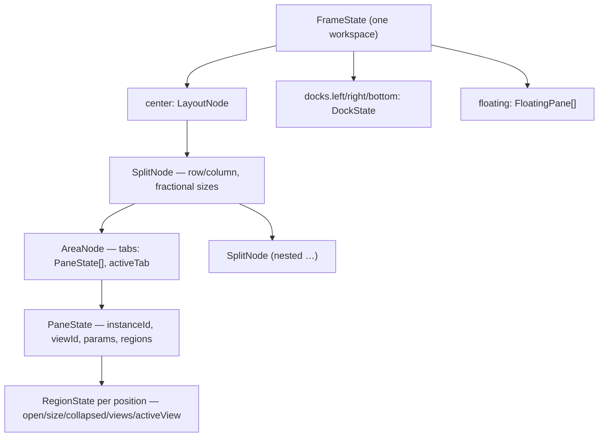

# Windowing: the frame

The `workspace` view (see [layout-shell.mdx](layout-shell.mdx)) is the **frame** —
a custom layout engine that hybridizes VS Code and Blender:

- a **workspace tab strip** across the top (Blender-style, the single switcher);
- VS Code-style **activity rails** down both sides, three fixed **tool docks**, and
  an emacs-style **minibuffer** along the bottom
  (left/right/bottom);
- a Blender-style **center grid** of recursively split **areas**;
- per-pane **region strips** (the successor of panel groups — see
  [panel-groups.mdx](panel-groups.mdx));
- an in-window **floating layer** and a **fullscreen-area** mode.

## Decisions

- **Custom engine, no dockview.** The engine is ~a dozen small React components
  over a pure data layer; the old dockview wrapper (tab strips on every group,
  root-relative splits, a hand-rolled mini-dock nested inside panes) is gone.
  Modules never import the engine — the **module registry stays the public API**.
- **Two layers.** `packages/core/src/layout/` is the React-free source of truth:
  `types.ts` (data model), `model.ts` (pure tree ops), `store.ts` (one reducer
  store), `serialize.ts` (versioned schema), `controller.ts` (role routing,
  regions, the `LayoutController` seam), `persistence.ts` (autosave/switch),
  `presets.ts` (frame seeds) — all unit-tested (`pnpm --filter @horrible/core
  test`). `packages/ui/src/layout/` renders it: `Frame`, `WorkspaceTabs`,
  `ActivityRail`, `Dock`, `CenterGrid`, `Area`, `AreaHeader`, `Region`,
  `PaneHost`, `CornerGrip`, `FloatingLayer`, `Sash`.
- **Three pane roles = default placement.** Every view (panel or widget
  declaration) declares `role: 'document' | 'tool' | 'widget'`, which says where
  an `openPanel` with no further instruction puts it:
  - **document** — lives in center areas; documents **stack as tabs** (editor
    buffers, notebooks, the SQL console, scratch, the games lobby/board…);
  - **tool** — opens in a dock (file explorer, outline, terminal,
    REPL, agent chat, observability…); `defaultDock` picks its side. A dock shows
    **exactly one tool at a time** — its title in the dock header, no in-dock tab
    strip. The **activity rails are the single tool switcher**: a dock may hold
    several tools in its list, and clicking a rail glyph makes that one active
    (and reveals the dock);
  - **widget** — takes a center **area of its own**, no tab strip (dashboard
    widgets, clubhouse, commons…).

  **Roles are defaults, not zones.** A center area can host any view — including
  a tool — so `changePaneType`, the area type switcher, and the empty-area picker
  all offer the full list (grouped by role, tools last). `openPanel` still routes
  by role, so callers that don't care don't have to; `openPaneInArea` is the
  explicit escape hatch for a caller that has already chosen the destination.

  A **dock**, by contrast, only accepts views that opted in. `dockable`
  (`DockSide | DockSide[]`, preferred side first) is what earns a view a rail
  glyph; `role: 'tool'` implies `dockable: [defaultDock ?? 'left']`, so every
  existing tool is dockable without declaring anything. A `widget` that declares
  `dockable` becomes rail-toggleable **while still opening in the center** — that
  is the whole point of splitting the two axes.

  Note that a narrow companion view is often better modeled as a **region strip**
  of its host pane than as a dockable view: most of the obvious candidates
  (`editor.recentNotes`, `network.chat`, `observability.logs`, `commons.requests`,
  `interpretability.context`, `training.metrics`) already are regions, and giving
  them a second home in a dock would just be a competing surface for the same
  content. `dockable` is for views with no host to hang off — currently
  `clubhouse.account` and `commons.directory`.
- **Workspaces are full frames (Blender model).** A workspace persists
  *everything*: the center tree, dock visibility/sizes/contents, floating panes,
  region state, focus, fullscreen. Switching workspaces switches the whole
  picture. `FramePreset`s (contributed via `ModuleManifest.frames`) seed
  stable-id workspaces on first activation — **Dashboard**, **Scripting**,
  **Research** (console/arxiv/browser beside the viewers + library — see
  [research](../modules/research.mdx)), **Data Ops** (database console + REPL +
  library), **Web Ops** (embedded browser + its network views + search +
  library), **Coding Harnesses**, plus module-contributed ones (**CRM** and
  **Data Entry** from the [records](../modules/records.mdx) module, **DashArena**
  from games, Training, Notebook, Orchestration); `layout.reset` restores the
  preset.
- **A workspace carries a role, not just furniture.** A preset may declare
  `agent: '<roster id>'` — the roster agent its docked chat opens as. Switching to
  Data Ops makes the agent the `dba`; switching to Data Entry makes it `intake`,
  which can only *propose* record values. Because an `AgentSpec` carries a system
  prompt, a tool scope and a preload set, the persona, its capabilities and its
  token cost all switch with the layout. An unknown id falls back to `main`, the
  same way `seedFromPreset` skips unknown views; picking a different agent by hand
  is a per-workspace override kept in `localStorage`, so it survives a switch away
  and back. See [agent-chat](../modules/agent-chat.mdx).

## Model

- **SplitNode** — a row/column of children with fractional sizes (drag the sash).
- **AreaNode** — a leaf rectangle. Invariant: its tabs are all documents (tab
  strip), exactly one widget (no strip), or empty (view picker).
- **PaneState** — one live pane instance (`${viewId}#${n}`); carries its params,
  its **persisted per-instance region strips**, and — when docked — its
  **remembered `dockSize`**.
- **DockState** — a fixed tool dock: visible flag, px size, stacked tools, one
  active. The px `size` is a **fallback**: a docked tool that the user has
  resized carries its own `dockSize`, so a narrow file tree and a wide agent chat
  can share a side without fighting over one width, and re-opening a tool
  restores the width it was left at. Resizing also mirrors into the dock's
  `size`, so the next tool opened there inherits the width just chosen rather
  than snapping to the built-in default. A view can declare a starting width with
  `defaultDockSize` (`agent.chat` opens at 420); switching the active tool
  therefore changes the dock's extent.
- **FloatingPane** — an in-window card over the center grid (fractional rect).

### The minibuffer

The bottom-most row of the frame, **under** the bottom dock — emacs's minibuffer
and echo area, not a fourth dock. State and command matching live in
`core/src/minibuffer.ts` (pure, unit-tested); the strip is
`packages/ui/src/layout/Minibuffer.tsx`. Three states, in priority order:

| State | When | What it shows |
| --- | --- | --- |
| **prompt** | a `dialogs.prompt()` is pending | the prompt inline — label, prefilled input, OK/Cancel |
| **input** | `alt+x` (M-x) | slash-command entry with live completions |
| **status** | idle | `workspace › focused pane`, plus the echo area |

**Slash commands** resolve against the same `registry.commands` the palette uses,
so nothing is registered twice. A command opts into a short name with
`slash: 'save'` (runs as `/save`); the leading slash is optional, so `/save` and
`save` are the same query. Anything without a `slash` stays reachable by fuzzy
title/id search. Ranking is exact-slash → slash-prefix → exact verb → verb-prefix
→ id substring → title substring, ties broken by registration order — which is
what makes **first-registered-wins** the rule for two commands claiming one slash
name. Current names: `/save`, `/save-as`, `/save-all`, `/new`, `/find`.

**Prompts render here, not in a modal.** `dialogs.prompt()` already existed and is
what editor Save As calls, so serving it in the minibuffer gave "save as, right
here" with no new API and every existing caller for free. `<Dialogs />`
deliberately skips `kind === 'prompt'` — rendering it in both places would show
two competing inputs for one pending promise. `confirm`/`choice` stay modal: a
destructive Save / Don't Save / Cancel should interrupt, not be a line you can
ignore.

The `alt+x` binding is declared `override: true` so a focused editor pane can't
shadow it — the minibuffer is the escape hatch and has to be reachable anywhere.

### Activity rails

There is one rail per side, each driving the dock on that side — a left-edge
glyph toggling a right-side pane was the confusing part of the single-rail
design. `railEntries` (core/layout/rail.ts) derives the glyphs as pure data over
`FrameState` + the user's rail prefs; `ActivityRail` (packages/ui) only renders
and routes clicks and gestures.

A rail lists what is actually docked on its side — by where a pane *is*, not
where it declared it wanted to be, so a tool that ended up somewhere unusual
still has a switcher — plus any view declaring `dockable` for that side which
isn't docked anywhere yet, shown dimmed so a module stays discoverable before it
has ever been opened. Each glyph carries one of four states:

| State | Meaning | Click |
| --- | --- | --- |
| `active` | the dock's visible tool | hide the dock |
| `docked` | in the dock's list, not showing | reveal it |
| `center` | open out in a center area or floating | **focus it** — never re-docks or opens a second copy |
| `closed` | not open anywhere | open it in this dock |

The **left rail also carries the bottom dock**, in a second section below its
own. The bottom edge is reserved for the minibuffer rather than a third rail,
and a rail is the only tool switcher a dock has — without this the bottom dock's
tools (terminal, REPL) could be revealed by keybinding but never switched
between.

#### Rail customization

The rails are user-customizable, VS Code activity-bar style
(`core/layout/rail-prefs.ts`):

- **Move**: drag a glyph onto another rail section (left ↔ right ↔ the left
  rail's bottom-dock section) to rehome it there, or within its own section to
  reorder; an insertion line previews the drop, and empty sections stay up as
  targets while a dockable drag is in flight. Right-clicking a glyph offers the
  same moves as menu items. If the view is open in a dock, the pane moves with
  the glyph (the `MOVE_TOOL` action); a center pane is re-docked.
- **Hide**: right-click a glyph → *Hide*, or right-click the rail background
  for a visibility checklist (check to show, uncheck to hide). Hiding a view
  that is currently docked closes it first (guarded) — a tool with no glyph
  would be unswitchable. *Reset rail layout* (also the `rail.reset` command,
  the escape hatch when a rail has been hidden entirely) drops all
  customization.

Preferences are three overrides per view — home dock (`side`), `hidden`, and
per-dock `order` — stored **globally, not per-workspace** (where your tools
live is a habit, not a layout) as one JSON blob riding the settings store under
`frame.railPrefs`, which buys boot hydration, live reactivity, and server-side
persistence for free. A side override reorders `dockSidesOf`, so role routing
and `openToolInDock` follow the user's placement; it never *makes* a view
dockable — declarations still decide that.

View types vs pane instances work as before: widgets are singleton-by-view-id,
panels honor their `singleton` flag, and multi-instance panes get `#n` suffixes.
A caller-supplied `instanceId` (e.g. `editor.buffer:<source>`) focuses the
existing instance instead of duplicating.

## Interaction

- **Corner grip** (bottom-right of every area): drag **into** the area to split
  it (dominant axis picks the orientation, the new area appears on the side you
  drag toward); drag **out past the area's edge** to join — the neighbor on that
  side is absorbed (its document tabs are adopted when both sides hold
  documents). A live overlay previews split (accent) vs join (red).
- **Area header** (Blender-style, collapsible per-area for chrome-less
  dashboards): a view **type switcher** (role-filtered dropdown), the document
  tab row, region toggle buttons, and the area menu
  (split/join/fullscreen/float/hide-header/close). The tab row appears **only
  once an area holds more than one pane** — a single-pane area shows its plain
  title instead. Each tab switches on click and carries its own close button
  (guarded, so a dirty buffer can still prompt).
- **Keyboard-first** (see the table in [layout-shell.mdx](layout-shell.mdx)):
  `alt+arrows` move focus between areas, `alt+shift+arrows` move the active
  pane, `mod+alt+arrows` split, `mod+alt+j` join, `ctrl+space` fullscreens the
  focused area (Esc exits), `mod+b`/`mod+alt+b`/`mod+j` toggle the docks,
  `mod+1..9` switch workspaces, and `t`/`n`/`b` toggle the focused pane's region
  strips.
- **Drag-out** (`layout/drag.ts` + the gestures in packages/ui): drag a **rail
  glyph**, a **dock header**, or a **region strip's header** onto any center area
  to pull that view out into its own space. A region strip drags as a `view`
  payload, so it **opens a copy** in the target area and stays put on its host —
  its content is a synthetic per-host instance, not a pane the layout owns. Every area outlines while a drag is in flight and the one under the
  pointer highlights, so the drop zones are discoverable. Two payload kinds: a
  `pane` that already exists **moves** (out of the dock, never copied), a `view`
  that isn't open yet is **opened** where it lands. Once a view is out in the
  center its rail glyph switches to the `center` state — clicking it focuses the
  pane rather than re-docking or opening a second copy.

  The payload rides in a small observable atom rather than `dataTransfer`,
  because `dataTransfer.getData` is unreadable during `dragover`: a drop target
  has to decide whether to accept the drop *while the drag is over it*, which the
  HTML5 API alone can't answer.

  Still no **tab** drag-docking between center areas (panes move between areas
  via keyboard, the area menu, and the agent's `move_pane`).

## The controller: one set of verbs, three callers

All mutations are dispatches into the layout store, exposed two ways from
`core/layout/controller.ts`:

- the **`LayoutController` seam** (`registry.setLayoutController`) for the
  engine-agnostic basics (open/close/focus/list, workspace CRUD, float,
  `changePaneType`), and
- **plain controller exports** for the frame verbs — `splitAreaBy`,
  `joinAreaDirection`, `focusAreaDirection`, `movePaneTo`, `resizeAreaPx`,
  `fullscreenArea`, `toggleRegion`, `setRegionView`, `revealRegionView`,
  `openToolInDock`, `toggleDock`, `retargetPane`, `openDocument`, `areaHostingView`.

`areaHostingView(viewId)` returns the center area a view already occupies (the
focused one when several qualify), so a module that opens **many documents of one
kind** can stack them as tabs in the area it already owns. `openPane`'s default is
to split — right for a *first* document, wrong for the second, which is why
clicking a second file in the tree used to carve the frame in half. The editor
pairs it with `openPaneInArea(viewId, areaId, params, instanceId)`, whose optional
`instanceId` applies the same focus-or-create identity rule `openPane` uses.

`retargetPane(instanceId, newInstanceId, params)` is the **reuse** counterpart to
`openPane`: it re-points an already-open pane at a new identity in place, keeping
its area, tab position, viewId, and region strips, and refuses when the new id is
already taken (the caller then falls back to a normal focus-or-create open). It
exists so a caller that knows a pane holds nothing worth preserving can land in it
rather than accumulate placeholders — the editor uses it so opening a note from a
**blank, unmodified** buffer reuses that editor instead of splitting off a second
one. See [editor](../modules/editor.mdx).

`openDocument(viewId, instanceId, params, canReuse?)` packages that rule as the
one way a module opens "a thing" (a notebook, a project, a URL) in a
**non-singleton** document pane. It resolves in three steps:

1. **Already open** — a pane with that `instanceId` exists → focus it. This is
   why the `instanceId` must be derived from the thing's identity
   (`notebook.editor:<path>`), not left to the `#n` counter: without it, opening
   the same notebook twice yields two panes.
2. **Reusable pane open** — a pane of the same view that isn't dirty
   (`setPaneDirty` / `isPaneDirty`) and that the caller's `canReuse` accepts →
   `retargetPane` into it, so the area, tab position and region strips survive.
   Only the module can judge reuse, so the predicate is its call; a module whose
   panes autosave (notebook, training notebook, browser) passes `() => true`,
   meaning "any clean pane of mine".
3. **Otherwise** — a normal role-routed `openPane`.

Omitting `canReuse` opts out of step 2 and gives identity-only behavior. A pane
that genuinely wants one instance per invocation (a terminal) uses neither and
calls `openPanel` directly.

The **user's gestures**, the **keybinding commands**, and the **agent's layout
tools** (`split_area`, `join_area`, `move_pane`, `fullscreen_area`,
`toggle_region`, `open_tool_in_dock`, `get_layout`, … relayed through
`tool-exec.ts`) all converge on these same functions — one code path, and every
mutation rides the store's autosave. Layout verbs stay **ungated**. See
[agent-tools.mdx](agent-tools.mdx).

## Persistence

The store holds `{ workspaceId, frame }` as **one atom**; the debounced (~600ms)
autosave reads both from the same snapshot at fire time, so a workspace switch
(which flushes first, then atomically loads the next frame) can never write a
layout under the wrong id — this retired the old engine's race-guard refs.

Layouts serialize as a **versioned envelope**
`{ schema: 'horrible.frame', version: 1, frame }` to
`PUT /api/workspaces/{id}`; the backend (`backend/modules/workspace/`) still
stores each `layout` **opaquely**. `deserialize` validates defensively, prunes
panes whose views no longer exist (e.g. an uninstalled plugin), and returns
`null` for anything that isn't a frame blob — pre-frame legacy layouts are
discarded by design and reseed from their preset.

## Browser vs desktop

The engine is web-only and shared verbatim by the browser and the desktop shell
(no per-platform fork). The floating layer and the frame's `area.fullscreen`
mode are in-window; the phase-2 native shell claims the OS-level versions
through new capabilities, all via the `WindowControl` seam. Shipped (phase 2
complete): **`window.fullscreen`** — on desktop `F11` (`shell.toggleFullscreen`)
toggles native OS-window fullscreen, orthogonal to the in-window
`area.fullscreen` (`ctrl+space`); **`chrome.workspaceTabs`** — the desktop window
is undecorated and the workspace tab strip is its titlebar (drag, double-click
maximize, min/maximize/close controls, and edge-resize grips for the borderless
frame); and **`window.perWorkspace`** — a workspace tab's **Open in new window**
spawns a second OS window (`ws-<id>`) that opens **detached** (a slim titlebar over
just that workspace's frame, no switcher strip) and boots straight into the
workspace via an initialization-script global (`window.__HORRIBLE_WORKSPACE__`),
all windows sharing one backend. See the capability table in
[layout-shell.mdx](layout-shell.mdx).

**External links.** The Tauri webview cannot spawn browser windows — `window.open`,
`target="_blank"`, and "open link in new window" are all silent no-ops — so the
shell exposes an **`open_external`** command (`window.rs`, http/https only) that
hands a URL to the user's default browser via the `open` crate. The shared helper
`openExternal(url)` (`packages/core/src/external.ts`) branches on the runtime:
browser layout → `window.open`, desktop → the command. The desktop boot also
installs a document-level **external-link bridge** (`installExternalLinkBridge`,
capture-phase click handler) so every plain `<a href="https://…">` in the app
routes to the system browser without per-component work. OAuth flows (games
sign-in, connectors) call `openExternal` directly — the system browser carries the
user's existing sessions, and Google refuses OAuth inside embedded webviews
(RFC 8252). Distinct from `browser_open_url`, which deliberately opens an
app-owned webview window as the embedded browser's un-iframable-site escape hatch.

:::danger Registering a command is only half of it
Tauri v2 gates **app** commands behind the ACL, not just plugin ones. Every command
in `generate_handler!` also needs an `allow-*` permission **defined** in
`src-tauri/permissions/*.toml` and **listed** in `capabilities/default.json`. Miss
either half and `invoke` rejects at runtime — no build error, no type error, and
nothing in the UI.

`open_external` shipped with neither. `openExternal` caught the rejection and
returned `false`, the link bridge discarded that `false`, and the result was that
OAuth sign-in and *every external link in the desktop app* silently did nothing.
`acl_coverage::every_command_is_permitted_and_capable` (`src/main.rs`) now asserts
both halves for every registered command; a new permissions TOML must be added to
its `PERMISSION_FILES` list. See
[Onboarding](../modules/onboarding.mdx#the-bug-that-motivated-all-of-it).
:::

**Both mechanisms fail quietly**, so `openExternal` returns whether it actually
opened and callers that need the user to *arrive* somewhere must check it. The
bridge reports failure through `onExternalOpenFailed`, which `AppShell` turns into
a persistent toast carrying the URL — necessary because the bridge cancels the
browser's own navigation before substituting its own, so a failed substitute means
the click is simply gone.

## Dev affordance

In dev builds the Frame exposes `window.__horribleFrame = { store, registry,
exec }` — `exec(name, args)` runs any relayed layout tool exactly as the agent
would (`await __horribleFrame.exec('get_layout', {})`). Not set in production.

## Status

Implemented: the full frame (tab strip, activity rail, three docks, center area
grid, floating layer, fullscreen-area, minibuffer), three roles as default
placement with opt-in `dockable`, per-tool remembered dock sizes, drag-out from
rails, docks, and region strips,
engine-native **persisted regions**, corner-drag split/join, the keyboard-first
command set, role-routed opening, frame presets for all built-in workflows, the
versioned serialization schema, the rewritten agent layout tools, and the full
phase-2 native shell — all three capabilities (`window.fullscreen` native
OS-window fullscreen; `chrome.workspaceTabs` undecorated window with the tab
strip as its titlebar; `window.perWorkspace` a workspace in its own OS window).
Not yet: pointer **tab** drag-docking between center areas (deliberate; drag-out
from the rails, docks, and region strips *is* implemented), region view cycling
on repeat-press, and workspace reorder/import-export.
