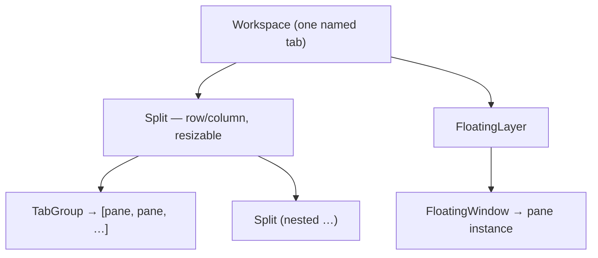

# Windowing: the dockable workspace

The `workspace` view (see [layout-shell.md](layout-shell.mdx)) is a dockable window
manager: module panes open as **windows** that can be tabbed, split, resized, and
floated. This replaced the earlier single-panel switcher.

## Decisions

- **Engine: [dockview](https://dockview.dev), wrapped.** dockview (MIT, React +
  TS) provides tabs, resizable splits, floating groups, and layout
  serialization. It lives behind `packages/ui/src/Workspace.tsx` so the **module
  registry stays the public API** — modules never import dockview. We could swap
  the engine without touching modules.
- **One level: widgets are panes.** A pane hosts either a module _panel_
  (`PanelDecl`) or a _widget_ (`WidgetDecl`) — both have `id`/`title`/`component`,
  so `PanelHost` resolves an id against `registry.panels` then `registry.widgets`
  and renders either. There is no separate "widget board"; a widget docks,
  resizes, and floats exactly like a panel. (Earlier the dashboard had a fixed
  inner grid of widgets — that two-level model is gone.)
- **Workflow layouts (Blender-style).** A workspace is a named, savable dockview
  layout; you switch between them from the **shell rail** (the single switcher —
  there is no separate tab strip). The rail lists **predefined workflow layouts**
  — `LayoutPreset`s contributed via the module registry — e.g. **Dashboard** (a
  layout of common widget-panes) and **Scripting** (files · editor · REPL +
  terminal). A preset is the *seed* for a stable-id workspace: first activation
  lays out its panes, then the user's rearrangements persist per layout (a
  `layout.reset` command restores the preset). Custom workspaces (the rail's `＋`)
  are just presetless layouts.

## Model

A single workspace's layout is a serializable tree owned by the engine:

- **Split** — a resizable row/column of children (drag the divider).
- **TabGroup** — stacked panes sharing one rectangle (drag tabs to reorder, to
  another group, or out to split/float).
- **Pane instance** — a live registry panel _or_ widget rendered inside a window.
- **FloatingLayer** — windows not docked into the grid; move/resize freely.

## Pane _types_ vs _instances_

A `PanelDecl`/`WidgetDecl` in the registry is a pane **type**. The workspace
creates **instances**:

- **Widgets** are **singleton by id** — one "Data flow" pane per workspace;
  opening again focuses it.
- **Panels** honor their `singleton` flag: `singleton: true` (e.g.
  `settings.home`) focuses the one window; omitted/false (e.g. `scratch.note`)
  creates a new instance each open (`scratch.note#2`, …) — N terminals/buffers.

`defaultPlacement` (`left|center|right|bottom`) on either decl hints where a
freshly opened pane docks; once the user rearranges, the persisted tree wins.

## How panes reach the workspace

1. A command calls `registry.openPanel(id)` (works for panel _or_ widget ids).
   Every panel and widget is openable from the command palette — panels via their
   module command, and every widget via a synthesized `widget.open:<id>` command
   ("Open widget: &lt;title&gt;"). (The rail switches whole layouts; it no longer
   opens individual panes.)
2. The shell switches to the `workspace` view and signals `Workspace` which pane
   to open (a bumped `pendingOpen` nonce, so repeats re-fire).
3. `Workspace` renders every pane through one host (`PanelHost`) that resolves
   `params.panelId` from the registry — so the serialized layout stores only ids
   and restore just re-resolves them.

## Workflow layouts, the rail & switching

The **shell rail** (in `AppShell.tsx`) is the workspace switcher. It renders every
`registry.layouts` preset (always, even before first open) plus any custom
workspace, highlighting the active one. The active id + workspace list come from a
small observable, `workspace-store` (`packages/core`), that `Workspace` publishes
on every change — so the rail (in `packages/ui`) stays in sync without owning the
state.

A rail click calls `registry.switchWorkspace(id)` — the existing
`setWorkspaceSwitcher` seam (AppShell enters the workspace view, then signals via a
`pendingWorkspace` nonce, mirroring `pendingOpen`). `Workspace.switchTo` flushes
the current layout (`saveWorkspace`), then `loadInto`:

- a saved layout **with panes** → `api.fromJSON(layout)`;
- otherwise → seed from the matching `LayoutPreset` (via `seedPreset`, which
  replays `preset.panes` through `addPane`), or a blank dock for a presetless
  custom workspace.

All guarded by `swappingRef` so the programmatic swap doesn't trip autosave.
Activating a preset that has **no workspace yet** creates one with the preset's
**stable id** (`saveWorkspace(preset.id, …)`) then seeds it — so the rail (and the
agent's `switch_workspace`) can open a never-touched layout. `layout.reset`
re-seeds the active layout from its preset; `workspace.new`/`workspace.delete`
manage custom layouts (a preset resets rather than deletes).

On first run (no workspaces) the frontend seeds the **default preset** (Dashboard)
under its stable id so the app always opens onto something.

## The geometry seam: one set of operations, two callers

Splitting, resizing, moving, floating and maximizing panes are **semantic
operations on `LayoutController`** (`packages/core/src/registry.ts`), implemented
once in `Workspace.tsx` against the live dockview api:

| Method | dockview primitive |
| --- | --- |
| `splitPane(instanceId, direction, paneId)` | `addPanel({ position: { referencePanel, direction } })` |
| `resizePane(instanceId, {width?, height?})` | `panel.api.setSize(...)` |
| `movePane(instanceId, reference, direction)` | `panel.api.moveTo({ group, position })` |
| `setPaneFloating(instanceId, floating)` | `addFloatingGroup` / `moveTo` back to a grid group |
| `maximizePane(instanceId, maximized)` | `panel.api.maximize()` / `exitMaximized()` |

This is deliberately the **only** place these operations live, because two
callers drive them:

- the **agent**, via the `split_pane`/`resize_pane`/`move_pane`/`float_pane`/
  `dock_pane`/`maximize_pane`/`restore_pane` tools (relayed through
  `tool-exec.ts`), and
- the **user**, via direct manipulation — the **Blender-style split grip**
  (`packages/ui/src/SplitHandle.tsx`), a grab tab in each pane's bottom-right
  corner (rendered by `PanelHost`, hidden until the pane is hovered). Dragging it
  picks the orientation from the dominant axis and the new region appears on the
  side you drag toward (drag left → new pane on the left, down → below); a live
  overlay previews the split, and on release it calls `splitPane`, duplicating the
  pane's content into the new region. Resizing and re-docking use dockview's
  native sashes and tab-drag (already Blender-like), so the custom layer only adds
  the split gesture the engine lacks.

So "the agent splits a pane" and "the user drags a split" are the same code path.
Because each method mutates the dockview tree, the existing `onDidLayoutChange`
autosave persists the result for free — no separate save path. Geometry verbs are
layout-only, so the orchestrator leaves them **ungated** (like `open_pane`).

## Agent-driven layout

The agent orchestrator can arrange the workspace too (open/close panes, the
geometry verbs above, create and switch workspaces). The mutations it needs beyond
the existing `openPanel`/`switchWorkspace` seams go through
`registry.layoutController` (`setLayoutController`), which `Workspace` installs over
its dockview api. So the agent stays decoupled from the engine, same as every
module. See [../modules/agent-chat.md](../modules/agent-chat.mdx).

## Persistence

`Workspace` serializes the active dockview layout on change (debounced ~600ms) to
`PUT /api/workspaces/{id}`, and restores on mount from `GET /api/workspaces`. The
backend (`backend/modules/workspace/`) stores the collection
(`{ active, workspaces: [{ id, name, layout }] }`) but treats each `layout`
**opaquely** — it never interprets the engine's JSON shape (`SerializedLayout` in
`packages/core/src/workspace.ts` is `Record<string, unknown>`). Authoring the
preset arrangements is the frontend's job (engine-shaped); the backend just stores
the resulting blobs.

## Browser vs desktop

The floating layer is where the `window.multi` capability will matter: in the
**browser** a floating window is an in-document pane (implemented today); on
**desktop (Tauri)** the same action can pop a pane out to a _real OS window_. The
seam is `Workspace` + the capability service; the OS-window path is not built yet.

## Dev affordance

In dev builds (`import.meta.env.DEV`), `Workspace` exposes the live dockview API
as `window.__horribleWorkspace` for console/preview experimentation
(`addPanel`, `toJSON`, …). It is not set in production builds.

## Status

Implemented: widgets-as-panes; workflow-layout presets (`registry.layouts`) with
the rail as the single switcher; lazy stable-id seeding, per-layout
persistence/restore, and `layout.reset`; custom workspace create/delete; splits,
tab groups, floating windows; the singleton/instance distinction; the
**`LayoutController` geometry seam** (split/resize/move/float/maximize), the
**agent geometry tools** that drive it, and the **Blender-style split grip**
(`SplitHandle`) that drives the same seam from direct manipulation. Built-in
presets: **Dashboard** and **Scripting**. `scratch.note` is the reference
non-singleton panel. Not yet: a pane-type picker for the split target (it
duplicates the current pane today), edge-drag-to-split (native sashes cover
resize), real OS windows on desktop, per-instance pane state (scratch instances
share one store), multiple instances of the same widget in one workspace, and
workspace reorder/import-export.
