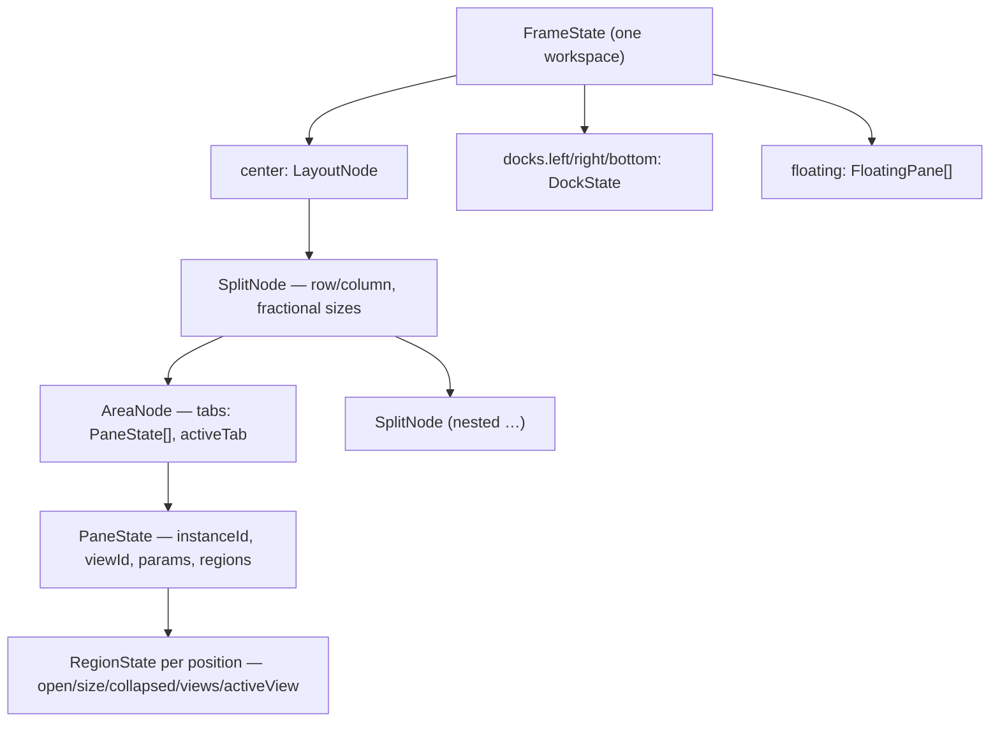

# Windowing: the frame

The `workspace` view (see [layout-shell.mdx](layout-shell.mdx)) is the **frame** —
a custom layout engine that hybridizes VS Code and Blender:

- a **workspace tab strip** across the top (Blender-style, the single switcher);
- a VS Code-style **activity rail** plus three fixed **tool docks**
  (left/right/bottom);
- a Blender-style **center grid** of recursively split **areas**;
- per-pane **region strips** (the successor of panel groups — see
  [panel-groups.mdx](panel-groups.mdx));
- an in-window **floating layer** and a **fullscreen-area** mode.

## Decisions

- **Custom engine, no dockview.** The engine is ~a dozen small React components
  over a pure data layer; the old dockview wrapper (tab strips on every group,
  root-relative splits, a hand-rolled mini-dock nested inside panes) is gone.
  Modules never import the engine — the **module registry stays the public API**.
- **Two layers.** `packages/core/src/layout/` is the React-free source of truth:
  `types.ts` (data model), `model.ts` (pure tree ops), `store.ts` (one reducer
  store), `serialize.ts` (versioned schema), `controller.ts` (role routing,
  regions, the `LayoutController` seam), `persistence.ts` (autosave/switch),
  `presets.ts` (frame seeds) — all unit-tested (`pnpm --filter @horrible/core
  test`). `packages/ui/src/layout/` renders it: `Frame`, `WorkspaceTabs`,
  `ActivityRail`, `Dock`, `CenterGrid`, `Area`, `AreaHeader`, `Region`,
  `PaneHost`, `CornerGrip`, `FloatingLayer`, `Sash`.
- **Three pane roles, strict zones.** Every view (panel or widget declaration)
  declares `role: 'document' | 'tool' | 'widget'`:
  - **document** — lives in center areas; documents **stack as tabs** (editor
    buffers, notebooks, the SQL console, scratch, the games lobby/board…);
  - **tool** — lives **only in the docks** (file explorer, outline, terminal,
    REPL, agent chat, observability…); `defaultDock` picks its side. A dock shows
    **exactly one tool at a time** — its title in the dock header, no in-dock tab
    strip. The **activity rail is the single tool switcher**: a dock may hold
    several tools in its list, and clicking a rail glyph makes that one active
    (and reveals the dock);
  - **widget** — takes a center **area of its own**, no tab strip (dashboard
    widgets, clubhouse, commons…).

  Tools never open in the center; documents and widgets never dock. `openPanel`
  routes by role, so callers don't care.
- **Workspaces are full frames (Blender model).** A workspace persists
  *everything*: the center tree, dock visibility/sizes/contents, floating panes,
  region state, focus, fullscreen. Switching workspaces switches the whole
  picture. `FramePreset`s (contributed via `ModuleManifest.frames`) seed
  stable-id workspaces on first activation — **Dashboard**, **Scripting**,
  **Coding Harnesses**, plus module-contributed ones (**DashArena** from the
  games module, Training, Notebook, Orchestration); `layout.reset` restores the
  preset.

## Model

- **SplitNode** — a row/column of children with fractional sizes (drag the sash).
- **AreaNode** — a leaf rectangle. Invariant: its tabs are all documents (tab
  strip), exactly one widget (no strip), or empty (view picker).
- **PaneState** — one live pane instance (`${viewId}#${n}`); carries its params
  and its **persisted per-instance region strips**.
- **DockState** — a fixed tool dock: visible flag, px size, stacked tools, one
  active.
- **FloatingPane** — an in-window card over the center grid (fractional rect).

View types vs pane instances work as before: widgets are singleton-by-view-id,
panels honor their `singleton` flag, and multi-instance panes get `#n` suffixes.
A caller-supplied `instanceId` (e.g. `editor.buffer:<source>`) focuses the
existing instance instead of duplicating.

## Interaction

- **Corner grip** (bottom-right of every area): drag **into** the area to split
  it (dominant axis picks the orientation, the new area appears on the side you
  drag toward); drag **out past the area's edge** to join — the neighbor on that
  side is absorbed (its document tabs are adopted when both sides hold
  documents). A live overlay previews split (accent) vs join (red).
- **Area header** (Blender-style, collapsible per-area for chrome-less
  dashboards): a view **type switcher** (role-filtered dropdown), the document
  tab row, region toggle buttons, and the area menu
  (split/join/fullscreen/float/hide-header/close).
- **Keyboard-first** (see the table in [layout-shell.mdx](layout-shell.mdx)):
  `alt+arrows` move focus between areas, `alt+shift+arrows` move the active
  pane, `mod+alt+arrows` split, `mod+alt+j` join, `ctrl+space` fullscreens the
  focused area (Esc exits), `mod+b`/`mod+alt+b`/`mod+j` toggle the docks,
  `mod+1..9` switch workspaces, and `t`/`n`/`b` toggle the focused pane's region
  strips.
- **No pointer tab drag-docking** (deliberate v1 choice): panes move between
  areas via keyboard, the area menu, and the agent's `move_pane`.

## The controller: one set of verbs, three callers

All mutations are dispatches into the layout store, exposed two ways from
`core/layout/controller.ts`:

- the **`LayoutController` seam** (`registry.setLayoutController`) for the
  engine-agnostic basics (open/close/focus/list, workspace CRUD, float,
  `changePaneType`), and
- **plain controller exports** for the frame verbs — `splitAreaBy`,
  `joinAreaDirection`, `focusAreaDirection`, `movePaneTo`, `resizeAreaPx`,
  `fullscreenArea`, `toggleRegion`, `setRegionView`, `revealRegionView`,
  `openToolInDock`, `toggleDock`.

The **user's gestures**, the **keybinding commands**, and the **agent's layout
tools** (`split_area`, `join_area`, `move_pane`, `fullscreen_area`,
`toggle_region`, `open_tool_in_dock`, `get_layout`, … relayed through
`tool-exec.ts`) all converge on these same functions — one code path, and every
mutation rides the store's autosave. Layout verbs stay **ungated**. See
[agent-tools.mdx](agent-tools.mdx).

## Persistence

The store holds `{ workspaceId, frame }` as **one atom**; the debounced (~600ms)
autosave reads both from the same snapshot at fire time, so a workspace switch
(which flushes first, then atomically loads the next frame) can never write a
layout under the wrong id — this retired the old engine's race-guard refs.

Layouts serialize as a **versioned envelope**
`{ schema: 'horrible.frame', version: 1, frame }` to
`PUT /api/workspaces/{id}`; the backend (`backend/modules/workspace/`) still
stores each `layout` **opaquely**. `deserialize` validates defensively, prunes
panes whose views no longer exist (e.g. an uninstalled plugin), and returns
`null` for anything that isn't a frame blob — pre-frame legacy layouts are
discarded by design and reseed from their preset.

## Browser vs desktop

The engine is web-only and shared verbatim by the browser and the desktop shell
(no per-platform fork). The floating layer and the frame's `area.fullscreen`
mode are in-window; the phase-2 native shell claims the OS-level versions
through new capabilities, all via the `WindowControl` seam. Shipped (phase 2
complete): **`window.fullscreen`** — on desktop `F11` (`shell.toggleFullscreen`)
toggles native OS-window fullscreen, orthogonal to the in-window
`area.fullscreen` (`ctrl+space`); **`chrome.workspaceTabs`** — the desktop window
is undecorated and the workspace tab strip is its titlebar (drag, double-click
maximize, min/maximize/close controls, and edge-resize grips for the borderless
frame); and **`window.perWorkspace`** — a workspace tab's **Open in new window**
spawns a second OS window (`ws-<id>`) that opens **detached** (a slim titlebar over
just that workspace's frame, no switcher strip) and boots straight into the
workspace via an initialization-script global (`window.__HORRIBLE_WORKSPACE__`),
all windows sharing one backend. See the capability table in
[layout-shell.mdx](layout-shell.mdx).

## Dev affordance

In dev builds the Frame exposes `window.__horribleFrame = { store, registry,
exec }` — `exec(name, args)` runs any relayed layout tool exactly as the agent
would (`await __horribleFrame.exec('get_layout', {})`). Not set in production.

## Status

Implemented: the full frame (tab strip, activity rail, three docks, center area
grid, floating layer, fullscreen-area), three roles with strict zones,
engine-native **persisted regions**, corner-drag split/join, the keyboard-first
command set, role-routed opening, frame presets for all built-in workflows, the
versioned serialization schema, the rewritten agent layout tools, and the full
phase-2 native shell — all three capabilities (`window.fullscreen` native
OS-window fullscreen; `chrome.workspaceTabs` undecorated window with the tab
strip as its titlebar; `window.perWorkspace` a workspace in its own OS window).
Not yet: pointer tab drag-docking (deliberate), region view cycling on
repeat-press, and workspace reorder/import-export.
