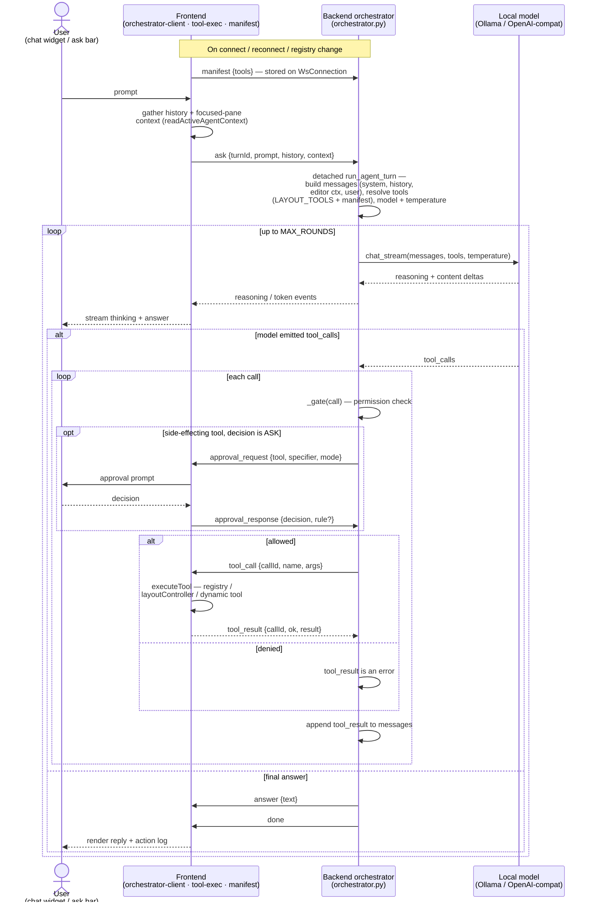
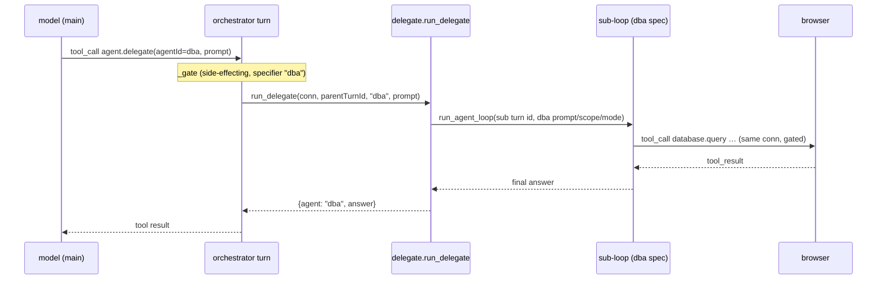
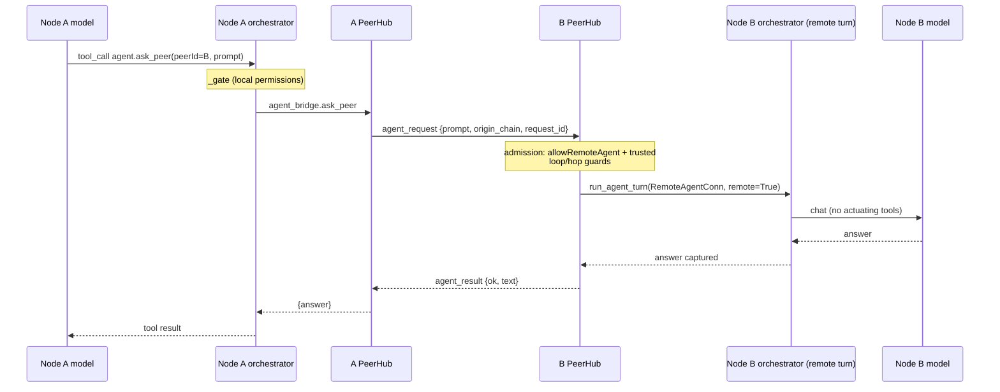

# Module: agent chat cockpit

The core "agentic era" surface: converse with agents/LLMs, watch their tool calls
stream, and manage sessions.

**Status: first slice implemented** — frontend in
`packages/core/src/modules/agent/`, backend in `backend/modules/agent/`. What
exists today:

- **Onboarding** on the home view (see layout-shell.mdx): detects a local
  [Ollama](https://ollama.com) at `http://localhost:11434` (override:
  `HORRIBLE_OLLAMA_URL`), offers a model picker defaulting to `gemma4:e2b`,
  pulls models with streamed progress (`POST /api/agent/pull`), and persists the
  choice (`PUT /api/agent/config` → `$HORRIBLE_DATA_DIR/agent-config.json`).
- **One-shot ask**: the legacy `POST /api/agent/chat` (NDJSON passthrough of
  Ollama's `/api/generate`) still exists; the home ask bar no longer uses it.
- **Orchestrator (layout control)** — the home ask bar now drives the
  **agent orchestrator**: a backend tool-calling loop that arranges the user's
  workspace. Like the chat widget, it renders the model's **streamed reasoning**
  (a collapsible "Reasoning" disclosure) and streams answer tokens live, not just
  the final answer — so a turn shows the thinking instead of looking silent if the
  final `content` is sparse. See "The orchestrator" below.
- **Conversational chat widget** (`agent.chat`, command `agent.openChat`): a
  dockable pane with a multi-turn transcript, a per-turn action log, and the
  model's reply. Each turn replays prior user/assistant turns to the backend as
  `history` (the backend stays stateless per turn). It drives the same
  orchestrator, so it reasons about the live layout and widget contents (via the
  read tools) and acts on them. See `ChatWidget.tsx`. The pane shows the 3D
  [avatar](../architecture/layout-shell.mdx) (`Avatar3D`, now in `packages/core`)
  cycling through its mood animations; the **`agent.avatarAnimation`** setting
  (default on) turns it off for a plain text pane. The transcript persists as named
  **sessions** and supports **slash commands** (both below).
- **Inline autosuggest source** (`POST /api/agent/complete`): a short non-streaming
  fill-in completion the [editor](./editor.mdx)'s opt-in ghost-text autosuggest calls.

Per-widget `agentTools` + `getAgentContext` widget interop ship (see
[agent tools & permissions](../architecture/agent-tools.mdx)). Remaining design:
a fuller chat/inspector cockpit.

## Sessions (persistence)

Chat transcripts persist server-side as named **sessions** — a small `chat` backend
module (`backend/modules/chat/`) that mirrors the workspace store: file-backed JSON
at `$HORRIBLE_DATA_DIR/chat-sessions.json`, CRUD under `/api/chat/sessions` (list
returns metadata only; `GET /{id}` returns the full transcript; `PUT /{id}` is a
partial upsert of `title`/`messages`; plus `/active` and `DELETE`). The chat widget
loads the active session on mount (so a pane remount restores the conversation),
lazily creates a session titled from the first prompt, and **auto-saves each
completed turn**. The session bar (a `<select>` + new/delete) switches between them,
and an **agent picker** beside it (populated from `GET /api/agent/roster`) selects
which roster agent the pane talks to — sessions are **per agent** (`agent_id` on
the session, `?agent=` on the list endpoint), so each agent keeps its own
conversations and active pointer. See
[Specialized agents & delegation](#specialized-agents--delegation).
Frontend client: `packages/core/src/modules/agent/sessions.ts`.

## Slash commands

`/`-prefixed inputs run **locally** in the chat widget (no model turn) and render as
ephemeral system output that is never persisted or replayed to the model
(`packages/core/src/modules/agent/slash.ts`): `/tools` (the agent's live tool
catalog, fetched via the `list_tools`→`tools` WS round-trip), `/help`, `/panes`
(open panes), `/clear` (new session), `/agent` (list the roster agents or switch
the pane to one: `/agent dba`), `/llm` (query, set, or reset orchestrator LLM
hyperparameter overrides), and honest placeholders `/mcp` and `/skills`
(those subsystems don't exist yet). Typing `/` shows a suggestion list.

## The orchestrator

The Agent is the app's **orchestrator**: a backend-resident brain that drives the
UI through tools. Per [[agent-orchestrator-architecture]] the brain runs on the
backend (so agent logic/history stays server-side) while the tools execute in the
frontend; the two halves talk over the **shared `/ws` socket** on the `agent`
channel — the turn is bidirectional and stateful, so running it on the socket
(not HTTP) avoids correlating an HTTP request with the right browser.

### End-to-end walkthrough

The numbered phases below trace one turn through the code; the diagram above is the
same flow visually.

1. **Manifest (once per connection).** Before any turn, the frontend pushes its
   **capability manifest** — the serialized agent-exposed commands and per-pane
   `agentTools`, handlers stripped (`manifest.ts`, `initAgentManifestSync`) — on
   socket open and on every registry change. The backend stores it on the
   `WsConnection` and forgets it on disconnect (hence the re-push on reconnect).
   `_tools_for` later merges it with the static `LAYOUT_TOOLS` into the tool list the
   model sees each round.
2. **Ask.** The chat widget (or home ask bar) calls `askAgent(prompt, cb, history)`.
   `askAgent` attaches the user's **focused-pane snapshot** (`readActiveAgentContext`
   — currently the active editor buffer) and sends `ask {turnId, prompt, history,
   context}` on the `agent` channel.
3. **Turn setup (backend).** `handle_agent_message` routes the `ask` to a **detached**
   `run_agent_turn` task — it must run detached (`asyncio.create_task`) because it
   awaits `tool_result`s that arrive on the *same* receive loop; awaiting inline would
   deadlock. The task assembles the messages (`SYSTEM_PROMPT` + sanitized `history` +
   the focused-buffer system message from `_active_editor_message` + the user prompt),
   resolves the tool list (`_tools_for`), the model (`_orchestrator_model` — the
   override or the configured model), and the sampling temperature (`_tool_temperature`).
4. **The loop (≤ `MAX_ROUNDS`).** Each round streams the provider via
   `providers.chat_stream`; the model's reasoning (`thinking`/`reasoning_content`) and
   answer `content` token-deltas relay live as `reasoning`/`token` events the chat
   widget and home ask bar render as they arrive. A round ends with either
   `tool_calls` or a final answer.
5. **Tool execution + gating.** For each `tool_call`, `_gate` decides: read-only and
   layout verbs pass straight through; side-effecting tools are evaluated against the
   permission **mode + rules**, prompting the user via
   `approval_request`/`approval_response` on an `ASK` (and persisting a rule on
   "always allow"). An **allowed** call is relayed to the browser as `tool_call`, where
   `executeTool` runs it against the registry / `layoutController` seam /
   `executeDynamicTool` and returns a `tool_result`; a **denied** call returns an error
   to the model instead. Either way the result is appended to `messages`
   (provider-formatted by `tool_result_message`) and the loop continues so the model
   can react to it.
6. **Completion.** When a round returns no tool calls, the backend sends the
   authoritative `answer` then `done` (or `error` on an HTTP failure). If the model
   *narrated* an action without emitting a call, the loop first grants **one** forced
   retry (`tool_choice:"required"`, OpenAI dialect only) before giving up and
   answering. The widget renders the reply plus the per-turn action log, and a completed
   turn auto-saves to its [session](#sessions-persistence).

The tool-calling loop itself is factored into a reusable
**`run_agent_loop(conn, messages, tools, …, emit) → str`** (`orchestrator.py`):
`run_agent_turn` assembles the messages/tools and supplies an `emit` that sends
`agent`-channel `reasoning`/`token`, while the [flow canvas](./flow-canvas.mdx)'s
Agent nodes reuse the same loop with a `flow`-channel `emit` — so chat and flow
share one gated tool-calling implementation.

**Loop** (`backend/modules/agent/orchestrator.py`): on an `ask`, a detached task
**streams** the user's local Ollama `/api/chat` (`stream:true`) with
`tools=LAYOUT_TOOLS` via `providers.chat_stream`. Each round's reasoning
(`thinking`/`reasoning_content`) and answer `content` token-deltas are relayed live
to the chat widget (`reasoning`/`token` events) as they arrive. If the model returns
`tool_calls`, each is relayed to the browser and the loop awaits the result before
continuing; otherwise it sends the final (authoritative) `answer`. Capped at
`MAX_ROUNDS`. Ollama gets `think:true` best-effort — models without a thinking mode
reject it (400) and the round transparently retries without, still streaming content.

**Tool-calling reliability.** Turns decode **greedily** (`temperature` 0, via
`chat_stream`'s new `temperature` arg → Ollama `options` / OpenAI payload) — at
higher temperatures small local models *narrate* an action ("I'll call …") instead
of emitting the structured call. The temperature is overridable through the settings
store (`agent.orchestrator.temperature`). Other model hyperparameters can be overridden
using setting keys `agent.orchestrator.contextSize` (context window limit, maps to Ollama's
`num_ctx`), `agent.orchestrator.maxTokens` (maps to OpenAI's `max_tokens` / Ollama's `num_predict`),
and `agent.orchestrator.topP` (Top P nucleus sampling). When the model still answers in prose that
reads like an unemitted call, the loop gives it **one** forced retry with
`tool_choice:"required"` — but only on the OpenAI dialect, which has a real
`tool_choice` (Ollama has no reliable equivalent, so it leans on the temperature
fix). The loop never forces a tool unconditionally: a plain conversational reply must
stay a reply. For weak emitters, prefer a larger model (e.g. `gemma4:12b`) for the
orchestrator: the **`agent.orchestrator.model`** setting overrides only the
orchestrator's model — leave it on the configured agent model to reuse it, so
chat/autosuggest can stay on a smaller, faster model while the tool-calling loop runs
a stronger one. All knobs live in the **Agent orchestrator** section of the Settings
page (a custom section — `OrchestratorSettings` — because the model is a **dropdown of
the provider's live models** from `/agent/status`, not a static enum); the blank
"Configured agent model" choice clears the override. These hyperparameters can also
be inspected/configured directly in chat using the `/llm` slash command, or modified
by the agent itself using the gated `agent.setHyperparameters` tool. The ghost-text
`/agent/complete` path likewise samples at a low fixed temperature so completions
are stable, not creative.

**Channel protocol** (`{channel:'agent', event, data:{turnId, …}}`):

| Direction     | event               | data                                              |
| ------------- | ------------------- | ------------------------------------------------- |
| client→server | `manifest`          | `{tools: SerializedTool[]}`                       |
| client→server | `ask`               | `{turnId, prompt, history?, context?, agentId?}`  |
| server→client | `tool_call`         | `{turnId, callId, name, args}`                    |
| client→server | `tool_result`       | `{turnId, callId, ok, result?, error?}`           |
| server→client | `approval_request`  | `{turnId, approvalId, tool, specifier, mode}`     |
| client→server | `approval_response` | `{approvalId, decision, rule?}`                   |
| client→server | `list_tools`        | `{}` — request the live tool catalog              |
| server→client | `tools`             | `{tools: [{name, description, source}]}`          |
| server→client | `reasoning`         | `{turnId, agentId, delta}` — streamed thinking    |
| server→client | `token`             | `{turnId, agentId, delta}` — streamed answer      |
| server→client | `delegate_token`    | `{turnId, agentId, delta}` — sub-agent's stream   |
| server→client | `answer`            | `{turnId, agentId, text}` — final, authoritative  |
| server→client | `done` / `error`    | `{turnId, agentId, …}`                            |

`agentId` selects (and tags) the **roster agent** driving the turn — omitted it
means `main`, so pre-roster clients keep working. See
[Specialized agents & delegation](#specialized-agents--delegation).

The frontend pushes the **capability manifest** (`manifest`) on connect, on every
reconnect, and whenever the registry changes
(`packages/core/src/modules/agent/manifest.ts`, `initAgentManifestSync`): the
serialized agent-exposed commands and per-widget/panel `agentTools` (handlers
stripped). The backend stores it on the `WsConnection`, groups the pushed tools by
prefix, and exposes them via **progressive disclosure** (see [Hierarchical tools
& progressive disclosure](#hierarchical-tools--progressive-disclosure)): each turn
the model sees the layout/peer core + meta-tools + whatever groups are active, and
`load_tools` injects more as needed. Relayed calls that aren't layout verbs are
dispatched on the frontend via `executeDynamicTool`. Side-effecting calls pass through the **permission gate**
(`_gate` in the orchestrator) before relay: read-only tools pass straight through,
denied calls return an error to the model, and an `ASK` decision prompts the user
via `approval_request`/`approval_response` (the in-chat approval UI is the next
slice) — see [agent tools & permissions](../architecture/agent-tools.mdx).

### Specialized agents & delegation

The orchestrator is one of several **roster agents** — fully separate loops, each
with its own system prompt, tool-group scope, per-agent settings, and chat
sessions. Built-ins (`backend/modules/agent/roster.py`):

| id           | scope (`tool_groups`)                        | preloaded          | default mode  |
| ------------ | -------------------------------------------- | ------------------ | ------------- |
| `main`       | unrestricted (keyword preloading, delegate)  | by prompt keywords | session mode  |
| `coder`      | files, editor, terminal, code, symbols       | editor, files, symbols | `acceptEdits` |
| `dba`        | database, symbols                            | database           | session mode  |
| `researcher` | browser, library, github, google, research, arxiv | research, library, arxiv | session mode  |

Mechanics (`run_agent_turn(agent_id=…)`):

- A specialized agent **skips keyword preloading** — its `active_groups` start at
  the spec's `preload_groups`, and `list_tool_groups`/`load_tools` only see its
  allowed groups (no forgiveness auto-load outside them). The peer tools and
  `agent.delegate` are core only for specs that declare them (`main`).
- **Per-agent settings** `agent.<id>.model/temperature/contextSize/maxTokens/topP/permissionMode`
  fall back to the `agent.orchestrator.*` keys, then defaults (`roster.agent_setting`).
  The permission-mode override threads through the gate; the user's explicit
  allow/ask/deny rules still apply unchanged.
- **Per-agent sessions**: `ChatSession.agent_id` (default `main`) + an
  `active_by_agent` map and a `GET /api/chat/sessions?agent=<id>` filter — all
  additive, so pre-roster `chat-sessions.json` files load unchanged.
- `GET /api/agent/roster` lists the roster (id, name, description, scope) for the
  chat widget's agent picker; plugins add agents with `host.add_agent(AgentSpec(…))`
  (see [backend plugin SDK](../architecture/backend-plugin-sdk.mdx)).

**Delegation** — `agent.delegate(agentId, prompt)` (backend-static, side-effecting,
specifier `{agentId}`) runs a whole sub-turn of the target agent **on the same
browser connection**, so unlike `agent.ask_peer`'s tool-less remote turns the
specialist can actuate — its tool calls relay to the same frontend and pass the
same permission gate under its own mode. The sub-turn gets a fresh turn id (its
stream stays out of the parent chat's turn-scoped subscription); its answer deltas
surface as `delegate_token` events on the parent turn, and the final answer
returns to the caller as an ordinary tool result. One level deep by design:
specialists don't see the delegate tool (`spec.can_delegate`), and a
`DELEGATE_TIMEOUT_S` (300 s) bounds the sub-turn.

### Agent-to-agent (talking to a peer's agent)

When this node is connected to peers (see [Module: network](network.mdx) and
[Distributed peer fabric](../architecture/distributed.mdx)), the orchestrator gains
two **backend-static** tools, merged into the catalog by `_tools_for` and resolved
in `_run_backend_tool` against the process-global `PeerHub` (no browser handler):

- `list_peers()` — the connected peer nodes (node_id, name, capabilities). Read-only.
- `agent.ask_peer(peerId, prompt)` — ask another user's agent and get its answer
  back as an ordinary tool result. **Side-effecting** (specifier `{peerId}`), so it
  passes the local permission gate first.

The network module's **Agent Relay** widget (`network.relay`) is the direct UI over
this: it posts to `POST /api/network/ask-peer` (the same `agent_bridge.ask_peer`),
so you can ask a peer's agent without going through your own model. See
[Module: network](network.mdx#agent-to-agent-relay).

The **cross-peer boundary** is the security crux:

- A remote turn runs behind a `RemoteAgentConn` (no browser) under a **forced mode**
  = `network.remoteAgentMode` (default `plan` → read-only). It is given **no
  actuating tools**, so a remote agent answers from the model but cannot drive your
  panes, files, or terminal. Its gate never blocks on an absent human — an `ASK`
  decision becomes a deny.
- Admission requires `network.allowRemoteAgent` and a **trusted** peer.
- Fan-out is bounded: an `origin_chain` cycle guard (reject if this node is already
  in the chain), a `MAX_PEER_HOPS` cap, and a `PEER_AGENT_TIMEOUT_S` request timeout.

Peer-wire message types (on `/peer-ws`, not the `agent` channel):
`agent_request` → `agent_result` (caller awaits the reply via `PeerHub.request`).

**Focused-pane context.** Pane snapshots are normally read on demand (the model
calls `get_pane_context` — pull, not push). As a convenience the frontend *also*
attaches the user's **focused pane** snapshot to every `ask` as `context`: the
editor's `BufferView` marks its instance active on focus/load (and clears it on
unmount) through core's `agent-context` ambient slot
(`setActiveContextInstance`/`readActiveAgentContext`), and `askAgent` reads it. When
that snapshot is an addressable editor buffer, the backend injects it as a system
message just before the user turn (`_active_editor_message`) handing the model the
open code up front, so "alter/refactor/fix this code" modifies the open buffer and
writes it back with `editor.proposeEdit(uri=…)` — no `list_open_panes` +
`get_pane_context` discovery first (a multi-step dance weak local models often skip).
Unsaved scratch buffers (no uri) are excluded.

The frontend executes each relayed `tool_call` against the registry and the
`registry.layoutController` seam and the frame controller (installed by
`Frame.tsx`), then replies. This
runs in an **always-on relay handler** (`initAgentRelay` in
`packages/core/src/modules/agent/orchestrator-client.ts`, registered at boot) rather
than inside a chat turn — so the same relay serves chat turns **and**
[flow canvas](./flow-canvas.mdx) runs (Tool nodes + flow Agent nodes). `askAgent`
keeps only a turn-scoped listener for its per-turn action log. The executor itself
lives in `packages/core/src/modules/agent/tool-exec.ts` (`executeTool`) — the
**shared relay surface** the [Python REPL](./repl.mdx)'s `dash` SDK drives too, so
they all stay in lockstep.

**`LAYOUT_TOOLS`** (app-level verbs over the frame — center **areas**, tool
**docks**, per-pane **regions**; the model discovers ids via the read tools, so
the catalog stays frontend-owned). Reads: `list_available_panes` (views with
role + regions), `list_open_panes` (instances with location), **`get_layout`**
(the whole frame — the orientation read), `list_workspaces`,
`get_pane_context(instanceId)`. Panes: `open_pane(id)` (role-routed),
`close_pane(id)`, `focus_pane(instanceId)`, `move_pane(instanceId, areaId? |
direction?)`, `float_pane`/`dock_pane(instanceId)`. Areas:
`split_area(instanceId, direction, viewId?)`, `join_area(instanceId,
direction)`, `resize_area(instanceId, width?, height?)`,
`fullscreen_area(instanceId?, on?)`. Regions & docks: `toggle_region(instanceId,
position, open?)`, `set_region_view(instanceId, viewId)`,
`open_tool_in_dock(id, dock?)`, `toggle_dock(dock, visible?)`. Workspaces:
`create_workspace(name)`, `switch_workspace(id)`. `split_area`'s `direction`
takes the model-friendly orientations **`vertical`** (areas side by side) and
**`horizontal`** (stacked) as well as the four concrete sides
(`left`/`right`/`above`/`below`), resolved in `tool-exec.ts`.

The layout verbs are **layout-only and ungated** (like `open_pane`), and they
execute through the same frame-controller functions the user's gestures and
keybindings use — one set of operations, three callers (see
[windowing](../architecture/windowing.mdx)). Each mutation triggers the store's
autosave, so an agent split persists exactly like a user drag.

The `/ws` handler (`backend/app.py`) is now a bidirectional router: one inbound
receive loop dispatches by channel (`agent` → the orchestrator) while a telemetry
push task sends outbound; `WsConnection` (`backend/modules/ws.py`) serializes
sends and tracks pending tool-call futures.

The capability manifest, `getAgentContext()` state-reads, widget interop, and the
Claude Code–style permission system gating side effects all ship now (specified in
[agent tools & permissions](../architecture/agent-tools.mdx)) — the shared surface
the editor, terminal, and file-explorer modules build on. The chat widget now
**streams** reasoning + answer tokens live (`chat_stream`), persists transcripts as
**sessions**, and supports **slash commands**. **Next slices:** parameterized
commands-as-tools and a fuller chat/inspector cockpit.

## Providers & HTTP endpoints

The model is always a **local** server reached over HTTP — there is no cloud /
hosted-API path anywhere in the agent. `backend/modules/agent/providers.py` is the
source of truth; it collapses every provider onto one of two **dialects**:

| Provider  | Dialect  | Default endpoint         | Pull | Spawn |
| --------- | -------- | ------------------------ | ---- | ----- |
| Ollama    | `ollama` | `http://localhost:11434` | yes  | no    |
| LM Studio | `openai` | `http://localhost:1234`  | no   | no    |
| vLLM      | `openai` | `http://localhost:8001`  | no   | yes   |

The dialect — **not** an online/offline switch — decides the wire format and the
request paths. "OpenAI-compatible" refers to LM Studio's and vLLM's wire format;
it does not mean any request leaves the machine. Everything runs offline against a
localhost server.

| Operation                | `ollama` dialect                  | `openai` dialect                             | Used by                                  |
| ------------------------ | --------------------------------- | -------------------------------------------- | ---------------------------------------- |
| List models / probe      | `GET /api/tags`                   | `GET /v1/models`                             | `list_models` — `/agent/status`          |
| Tool-calling round (streamed) | `POST /api/chat` (`stream:true`, `think`) | `POST /v1/chat/completions` (`stream:true`) | `chat_stream` — the orchestrator loop    |
| One-shot streamed answer | `POST /api/generate`              | `POST /v1/chat/completions` (SSE)            | `generate_stream` — legacy `/agent/chat` |
| Short fill-in completion | `POST /api/generate` (`stream:false`) | `POST /v1/chat/completions` (`stream:false`) | `generate` — `/agent/complete` (autosuggest) |
| Pull a model             | `POST /api/pull`                  | — (unsupported)                              | `/agent/pull`                            |

Ollama's default URL can be overridden with `HORRIBLE_OLLAMA_URL`; a backend-spawned
vLLM advertises its own port. All of these outbound calls go through
`instrumented_client()`, so they surface in the observability I/O stream with full
request↔response bodies — the streamed tool-calling round, answer, and pull
responses all via `tee_stream`. See
[observability.md](observability.mdx).

### Hierarchical tools & progressive disclosure

Local reasoning models (e.g. `gemma4:e2b` under Ollama) have a strict tool-count
ceiling: list **40+ tool definitions** and the model silently skips its thinking
phase and streams the final answer from the first token; with **≤39** it reasons
normally. The whole catalog (layout + peer + every module/plugin tool) is well past
that, so tools are exposed **hierarchically and injected on demand** rather than
flattened and pruned.

Tools belong to **groups** by name prefix (`files`, `editor`, `terminal`,
`visualizer`, `database`, `network`, …; layout verbs are the `layout` core). Each
turn the model sees only:

* the **core** — the layout verbs, the peer tools (`list_peers`, `agent.ask_peer`),
  and two **meta-tools**: `list_tool_groups()` (discover groups + counts) and
  `load_tools(groups[])` (enable a group); plus
* the tools of every **active** group.

`run_agent_turn` recomputes the presented list **each round** from `active_groups`,
so a group loaded this round is **injected** into the next model call (true dynamic
injection — nothing is ever dropped, just not-yet-loaded). `active_groups` is:

* **seeded** by a keyword preload (`_preload_groups`): a prompt mentioning a file,
  shell command, etc. auto-activates that group so common asks stay single-round;
* **grown** when the model calls `load_tools`; and
* **grown forgivingly** — if the model calls a known tool from a group it never
  loaded, `_dispatch_call` activates the group and runs the call anyway.

A `TOOL_BUDGET = 38` cap remains only as a backstop (core is always kept first). The
`/tools` command (`list_tools`→`tools`) still reports the **full** catalog, labeled
by group, independent of what any single turn has loaded.

## Contributions to the layout shell

- **Panels:** `chat.conversation` (main chat view, default: center tab group),
  `chat.sessions` (session list, default: left dock), `chat.inspector`
  (tool-call/trace detail, default: right dock, opened on demand).
- **Commands:** `chat.new`, `chat.focusInput`, `chat.openSession`,
  `chat.toggleInspector`, `chat.stopGeneration`.
- **Default keybindings:** declared for new-session and focus-input; bound through
  the shell keybinding service.
- **Dashboard widgets:** `chat.recentSessions` (see [dashboard.md](dashboard.mdx)).

## Backend surface

`backend/modules/chat/` — session CRUD over HTTP; streaming (tokens, tool-call
events, status) over the shared WebSocket on `chat.*` channels. Agent execution
lives entirely in the backend; the frontend only renders the stream and sends
user input. Pydantic models define the event schema.

## Browser vs desktop

The conversation experience is identical — it's all backend traffic over the
shared socket. Differences are notification/summon ergonomics only:

| Concern                  | Browser                                                                              | Desktop                                                      |
| ------------------------ | ------------------------------------------------------------------------------------ | ------------------------------------------------------------ |
| Completion notifications | Web Notifications (`notifications.system` capability, tab must allow it)             | OS notification, click focuses window                        |
| Quick summon             | none                                                                                 | global shortcut raises the window and runs `chat.focusInput` |
| Long-running agents      | keep tab open (no background work in the page; the backend keeps running regardless) | window can be closed to tray; stream resumes on reopen       |

Both layouts must tolerate socket reconnects mid-generation: the backend is the
source of truth for session state, and the panel re-syncs on reconnect.
