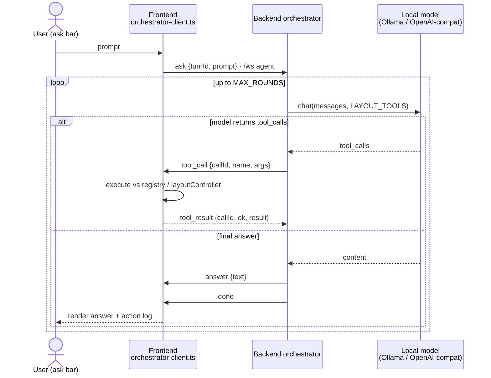

# Module: agent chat cockpit

The core "agentic era" surface: converse with agents/LLMs, watch their tool calls
stream, and manage sessions.

**Status: first slice implemented** — frontend in
`packages/core/src/modules/agent/`, backend in `backend/modules/agent/`. What
exists today:

- **Onboarding** on the home view (see layout-shell.mdx): detects a local
  [Ollama](https://ollama.com) at `http://localhost:11434` (override:
  `HORRIBLE_OLLAMA_URL`), offers a model picker defaulting to `gemma4:e2b`,
  pulls models with streamed progress (`POST /api/agent/pull`), and persists the
  choice (`PUT /api/agent/config` → `$HORRIBLE_DATA_DIR/agent-config.json`).
- **One-shot ask**: the legacy `POST /api/agent/chat` (NDJSON passthrough of
  Ollama's `/api/generate`) still exists; the home ask bar no longer uses it.
- **Orchestrator (layout control)** — the home ask bar now drives the
  **agent orchestrator**: a backend tool-calling loop that arranges the user's
  workspace. See "The orchestrator" below.

Everything else — session management, chat/inspector panels, per-widget
`agentTools`, and widget interop — is still design, not implementation.

## The orchestrator

The Agent is the app's **orchestrator**: a backend-resident brain that drives the
UI through tools. Per [[agent-orchestrator-architecture]] the brain runs on the
backend (so agent logic/history stays server-side) while the tools execute in the
frontend; the two halves talk over the **shared `/ws` socket** on the `agent`
channel — the turn is bidirectional and stateful, so running it on the socket
(not HTTP) avoids correlating an HTTP request with the right browser.

**Loop** (`backend/modules/agent/orchestrator.py`): on an `ask`, a detached task
calls the user's local Ollama `/api/chat` (`stream:false`) with `tools=LAYOUT_TOOLS`.
If the model returns `tool_calls`, each is relayed to the browser and the loop
awaits the result before continuing; otherwise it sends the final answer. Capped
at `MAX_ROUNDS`.

**Channel protocol** (`{channel:'agent', event, data:{turnId, …}}`):

| Direction     | event               | data                                          |
| ------------- | ------------------- | --------------------------------------------- |
| client→server | `manifest`          | `{tools: SerializedTool[]}`                   |
| client→server | `ask`               | `{turnId, prompt}`                            |
| server→client | `tool_call`         | `{turnId, callId, name, args}`                |
| client→server | `tool_result`       | `{turnId, callId, ok, result?, error?}`       |
| server→client | `approval_request`  | `{turnId, approvalId, tool, specifier, mode}` |
| client→server | `approval_response` | `{approvalId, decision, rule?}`               |
| server→client | `answer`            | `{turnId, text}`                              |
| server→client | `done` / `error`    | `{turnId, …}`                                 |

The frontend pushes the **capability manifest** (`manifest`) on connect, on every
reconnect, and whenever the registry changes
(`packages/core/src/modules/agent/manifest.ts`, `initAgentManifestSync`): the
serialized agent-exposed commands and per-widget/panel `agentTools` (handlers
stripped). The backend stores it on the `WsConnection` and merges it with the
static `LAYOUT_TOOLS` into the model's tool list each turn (`_tools_for`). Relayed
calls that aren't layout verbs are dispatched on the frontend via
`executeDynamicTool`. Side-effecting calls pass through the **permission gate**
(`_gate` in the orchestrator) before relay: read-only tools pass straight through,
denied calls return an error to the model, and an `ASK` decision prompts the user
via `approval_request`/`approval_response` (the in-chat approval UI is the next
slice) — see [agent tools & permissions](../architecture/agent-tools.mdx).

The frontend (`packages/core/src/modules/agent/orchestrator-client.ts`,
`askAgent`) executes each `tool_call` against the registry and the
`registry.layoutController` seam (installed by `Workspace.tsx`), then replies. The
executor itself lives in `packages/core/src/modules/agent/tool-exec.ts`
(`executeTool`) — the **shared relay surface** the [Python REPL](./repl.mdx)'s
`dash` SDK drives too, so the two stay in lockstep.

**`LAYOUT_TOOLS`** (app-level verbs; the model discovers ids via the read tools,
so the catalog stays frontend-owned): `list_available_panes`, `list_workspaces`,
`list_open_panes`, `get_pane_context(instanceId)`, `open_pane(id)`,
`close_pane(id)`, `create_workspace(name)`, `switch_workspace(id)`.
`list_open_panes` reports each open pane's type id, live `instanceId`, title, and
whether it exposes agent context; `get_pane_context` pulls one instance's snapshot
(see [agent tools & permissions](../architecture/agent-tools.mdx)).

The `/ws` handler (`backend/app.py`) is now a bidirectional router: one inbound
receive loop dispatches by channel (`agent` → the orchestrator) while a telemetry
push task sends outbound; `WsConnection` (`backend/modules/ws.py`) serializes
sends and tracks pending tool-call futures.

**Next slices:** the frontend→backend capability manifest now ships (above);
remaining are `getAgentContext()` state-reads and widget interop, a Claude
Code–style permission system gating side effects, streamed tokens, and
parameterized commands-as-tools. These are specified in
[agent tools & permissions](../architecture/agent-tools.mdx) — the shared surface
the editor, terminal, and file-explorer modules build on.

## Providers & HTTP endpoints

The model is always a **local** server reached over HTTP — there is no cloud /
hosted-API path anywhere in the agent. `backend/modules/agent/providers.py` is the
source of truth; it collapses every provider onto one of two **dialects**:

| Provider  | Dialect  | Default endpoint         | Pull | Spawn |
| --------- | -------- | ------------------------ | ---- | ----- |
| Ollama    | `ollama` | `http://localhost:11434` | yes  | no    |
| LM Studio | `openai` | `http://localhost:1234`  | no   | no    |
| vLLM      | `openai` | `http://localhost:8001`  | no   | yes   |

The dialect — **not** an online/offline switch — decides the wire format and the
request paths. "OpenAI-compatible" refers to LM Studio's and vLLM's wire format;
it does not mean any request leaves the machine. Everything runs offline against a
localhost server.

| Operation                | `ollama` dialect                  | `openai` dialect                             | Used by                                  |
| ------------------------ | --------------------------------- | -------------------------------------------- | ---------------------------------------- |
| List models / probe      | `GET /api/tags`                   | `GET /v1/models`                             | `list_models` — `/agent/status`          |
| Tool-calling round       | `POST /api/chat` (`stream:false`) | `POST /v1/chat/completions` (`stream:false`) | `chat` — the orchestrator loop           |
| One-shot streamed answer | `POST /api/generate`              | `POST /v1/chat/completions` (SSE)            | `generate_stream` — legacy `/agent/chat` |
| Pull a model             | `POST /api/pull`                  | — (unsupported)                              | `/agent/pull`                            |

Ollama's default URL can be overridden with `HORRIBLE_OLLAMA_URL`; a backend-spawned
vLLM advertises its own port. All of these outbound calls go through
`instrumented_client()`, so they surface in the observability I/O stream with full
request↔response bodies — the non-streaming tool-calling round directly, and the
streamed answer/pull responses via `tee_stream`. See
[observability.md](observability.mdx).

## Contributions to the layout shell

- **Panels:** `chat.conversation` (main chat view, default: center tab group),
  `chat.sessions` (session list, default: left dock), `chat.inspector`
  (tool-call/trace detail, default: right dock, opened on demand).
- **Commands:** `chat.new`, `chat.focusInput`, `chat.openSession`,
  `chat.toggleInspector`, `chat.stopGeneration`.
- **Default keybindings:** declared for new-session and focus-input; bound through
  the shell keybinding service.
- **Dashboard widgets:** `chat.recentSessions` (see [dashboard.md](dashboard.mdx)).

## Backend surface

`backend/modules/chat/` — session CRUD over HTTP; streaming (tokens, tool-call
events, status) over the shared WebSocket on `chat.*` channels. Agent execution
lives entirely in the backend; the frontend only renders the stream and sends
user input. Pydantic models define the event schema.

## Browser vs desktop

The conversation experience is identical — it's all backend traffic over the
shared socket. Differences are notification/summon ergonomics only:

| Concern                  | Browser                                                                              | Desktop                                                      |
| ------------------------ | ------------------------------------------------------------------------------------ | ------------------------------------------------------------ |
| Completion notifications | Web Notifications (`notifications.system` capability, tab must allow it)             | OS notification, click focuses window                        |
| Quick summon             | none                                                                                 | global shortcut raises the window and runs `chat.focusInput` |
| Long-running agents      | keep tab open (no background work in the page; the backend keeps running regardless) | window can be closed to tray; stream resumes on reopen       |

Both layouts must tolerate socket reconnects mid-generation: the backend is the
source of truth for session state, and the panel re-syncs on reconnect.
