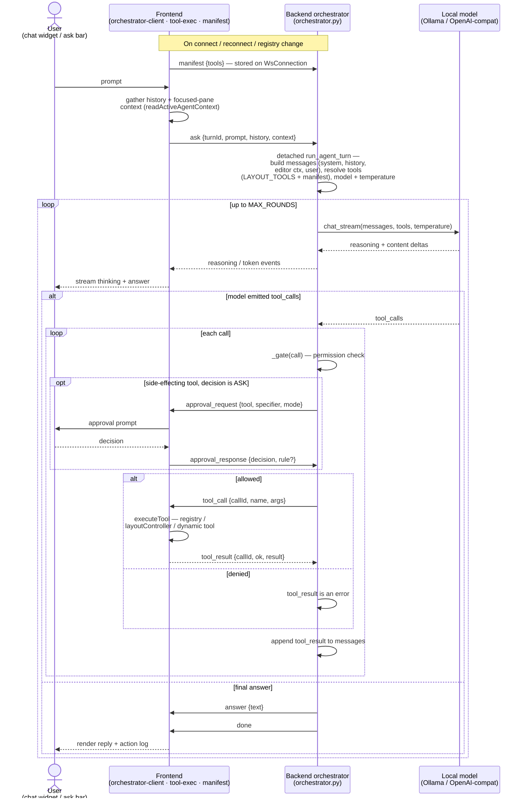
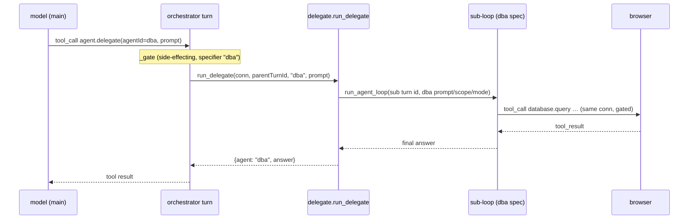
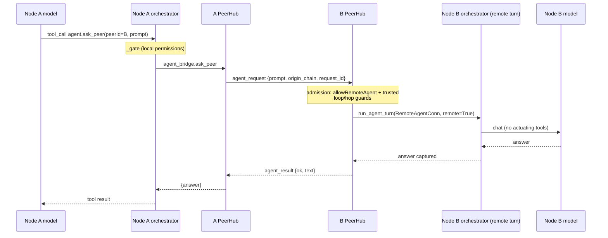

# Module: agent chat cockpit

The core "agentic era" surface: converse with agents/LLMs, watch their tool calls
stream, and manage sessions.

**Status: first slice implemented** — frontend in
`packages/core/src/modules/agent/`, backend in `backend/modules/agent/`. What
exists today:

- **Onboarding** on the home view (see layout-shell.mdx): detects a local
  [Ollama](https://ollama.com) at `http://localhost:11434` (override:
  `HORRIBLE_OLLAMA_URL`), offers a model picker defaulting to `gemma4:e2b`,
  pulls models with streamed progress (`POST /api/agent/pull`), and persists the
  choice (`PUT /api/agent/config` → `$HORRIBLE_DATA_DIR/agent-config.json`).
- **One-shot ask**: the legacy `POST /api/agent/chat` (NDJSON passthrough of
  Ollama's `/api/generate`) still exists; the home ask bar no longer uses it.
- **Orchestrator (layout control)** — the home ask bar now drives the
  **agent orchestrator**: a backend tool-calling loop that arranges the user's
  workspace. Like the chat widget, it renders the model's **streamed reasoning**
  (a collapsible "Reasoning" disclosure) and streams answer tokens live, not just
  the final answer — so a turn shows the thinking instead of looking silent if the
  final `content` is sparse. See "The orchestrator" below.
- **Conversational chat widget** (`agent.chat`, command `agent.openChat`): a
  dockable pane with a multi-turn transcript, a per-turn action log, and the
  model's reply. Each turn replays prior user/assistant turns to the backend as
  `history` (the backend stays stateless per turn). It drives the same
  orchestrator, so it reasons about the live layout and widget contents (via the
  read tools) and acts on them. See `ChatWidget.tsx`. The pane shows the 3D
  [avatar](../architecture/layout-shell.mdx) (`Avatar3D`, now in `packages/core`)
  cycling through its mood animations; the **`agent.avatarAnimation`** setting
  (default on) turns it off for a plain text pane. The transcript persists as named
  **sessions** and supports **slash commands** (both below).
- **Inline autosuggest source** (`POST /api/agent/complete`): a short non-streaming
  fill-in completion the [editor](./editor.mdx)'s opt-in ghost-text autosuggest calls.

Per-widget `agentTools` + `getAgentContext` widget interop ship (see
[agent tools & permissions](../architecture/agent-tools.mdx)). Remaining design:
a fuller chat/inspector cockpit.

## Readiness: four states, not one

`AgentStatus` carries two independent booleans — `configured` (has a provider and
model been chosen?) and `reachable` (is that provider answering right now?) — and
two more failure modes live outside the payload: the backend not answering at all,
and the status not having resolved yet.

Those are four different problems with four different remedies, and the pane used
to render every one of them as the same grey input placeholder, `Agent not ready`.
That is the inversion of this product's own rule that a capability check reports
what it found, what it looked for and failed to find, and what it could not ask.

`AgentReadiness` (`modules/agent/AgentReadiness.tsx`) maps the status to one
banner above the input:

| State                       | Says                       | Offers                        |
| --------------------------- | -------------------------- | ----------------------------- |
| unresolved                  | Checking the agent         | nothing — it is not a verdict |
| backend unreachable         | Backend not answering      | Retry                         |
| `configured: false`         | No model selected          | Choose a model → Settings     |
| `reachable: false`          | Can't reach `<provider>`   | Retry · Change provider       |
| ready                       | nothing                    | —                             |

The endpoint appears only in the `reachable: false` case, as telemetry in mono:
nothing was tried yet when no model is configured, so naming an endpoint there
would be inventing a cause. `planFor` is exported and tested
(`__tests__/readiness.test.ts`) because the distinction between those states is
the whole point of the component, and collapsing them does not error — it just
tells everyone the least useful true thing.

An empty transcript carries **three clickable opening prompts** rather than one
grey sentence, each exercising a different half of what makes this agent unlike a
chat box: layout control, pane reading, buffer editing. Deleting a conversation
goes through a confirm that **names the conversation** — there is no undo behind
it, and the control sits beside "New chat".

## Sessions (persistence)

Chat transcripts persist server-side as named **sessions** — a small `chat` backend
module (`backend/modules/chat/`) that mirrors the workspace store: file-backed JSON
at `$HORRIBLE_DATA_DIR/chat-sessions.json`, CRUD under `/api/chat/sessions` (list
returns metadata only; `GET /{id}` returns the full transcript; `PUT /{id}` is a
partial upsert of `title`/`messages`; plus `/active` and `DELETE`). The chat widget
loads the active session on mount (so a pane remount restores the conversation),
lazily creates a session titled from the first prompt, and **auto-saves each
completed turn**. The session bar (a `<select>` + new/delete) switches between them,
and an **agent picker** beside it (populated from `GET /api/agent/roster`) selects
which roster agent the pane talks to — sessions are **per agent** (`agent_id` on
the session, `?agent=` on the list endpoint), so each agent keeps its own
conversations and active pointer. See
[Specialized agents & delegation](#specialized-agents--delegation).
Frontend client: `packages/core/src/modules/agent/sessions.ts`.

## Slash commands

`/`-prefixed inputs run **locally** in the chat widget (no model turn) and render as
ephemeral system output that is never persisted or replayed to the model
(`packages/core/src/modules/agent/slash.ts`): `/tools` (the agent's live tool
catalog, fetched via the `list_tools`→`tools` WS round-trip), `/help`, `/panes`
(open panes), `/clear` (new session), `/agent` (list the roster agents or switch
the pane to one: `/agent dba`), `/llm` (query, set, or reset orchestrator LLM
hyperparameter overrides), and honest placeholders `/mcp` and `/skills`
(those subsystems don't exist yet). Typing `/` shows a suggestion list.

## The orchestrator

The Agent is the app's **orchestrator**: a backend-resident brain that drives the
UI through tools. Per [[agent-orchestrator-architecture]] the brain runs on the
backend (so agent logic/history stays server-side) while the tools execute in the
frontend; the two halves talk over the **shared `/ws` socket** on the `agent`
channel — the turn is bidirectional and stateful, so running it on the socket
(not HTTP) avoids correlating an HTTP request with the right browser.



### End-to-end walkthrough

The numbered phases below trace one turn through the code; the diagram above is the
same flow visually.

1. **Manifest (once per connection).** Before any turn, the frontend pushes its
   **capability manifest** — the serialized agent-exposed commands and per-pane
   `agentTools`, handlers stripped (`manifest.ts`, `initAgentManifestSync`) — on
   socket open and on every registry change. The backend stores it on the
   `WsConnection` and forgets it on disconnect (hence the re-push on reconnect).
   `_tools_for` later merges it with the static `LAYOUT_TOOLS` into the tool list the
   model sees each round.
2. **Ask.** The chat widget (or home ask bar) calls `askAgent(prompt, cb, history)`.
   `askAgent` attaches the user's **focused-pane snapshot** (`readActiveAgentContext`
   — currently the active editor buffer) and sends `ask {turnId, prompt, history,
   context}` on the `agent` channel.
3. **Turn setup (backend).** `handle_agent_message` routes the `ask` to a **detached**
   `run_agent_turn` task — it must run detached (`asyncio.create_task`) because it
   awaits `tool_result`s that arrive on the *same* receive loop; awaiting inline would
   deadlock. The task assembles the messages (`SYSTEM_PROMPT` + sanitized `history` +
   the focused-buffer system message from `_active_editor_message` + the user prompt),
   resolves the tool list (`_tools_for`), the model (`_orchestrator_model` — the
   override or the configured model), and the sampling temperature (`_tool_temperature`).
4. **The loop (≤ `MAX_ROUNDS`).** Each round streams the provider via
   `providers.chat_stream`, which first flattens the system tier (see
   [below](#the-system-tier-is-several-messages-until-the-wire)); the model's reasoning (`thinking`/`reasoning_content`) and
   answer `content` token-deltas relay live as `reasoning`/`token` events the chat
   widget and home ask bar render as they arrive. A round ends with either
   `tool_calls` or a final answer.
5. **Tool execution + gating.** For each `tool_call`, `_gate` decides: read-only and
   layout verbs pass straight through; side-effecting tools are evaluated against the
   permission **mode + rules**, prompting the user via
   `approval_request`/`approval_response` on an `ASK` (and persisting a rule on
   "always allow"). An **allowed** call is relayed to the browser as `tool_call`, where
   `executeTool` runs it against the registry / `layoutController` seam /
   `executeDynamicTool` and returns a `tool_result`; a **denied** call returns an error
   to the model instead. Either way the result is appended to `messages`
   (provider-formatted by `tool_result_message`) and the loop continues so the model
   can react to it.
6. **Completion.** When a round returns no tool calls, the backend sends the
   authoritative `answer` then `done` (or `error` on an HTTP failure). If the model
   *narrated* an action without emitting a call, the loop first grants **one** nudged
   retry — on **every** dialect, with `tool_choice:"required"` added where the provider
   supports it — before giving up and
   answering. The widget renders the reply plus the per-turn action log, and a completed
   turn auto-saves to its [session](#sessions-persistence).

### The system tier is several messages until the wire

`run_agent_turn` assembles the system tier as **separate messages**: the spec's system
prompt, then the [skill catalog](./skills.mdx), then the guides for the groups the turn
starts with. That split is deliberate — the
[interpretability recorder](./interpretability.mdx) tells the blocks apart by position
and content marker (`CATALOG_MARKER`) to attribute each one's per-turn token cost, and
one glued string would make that impossible. The forced-tool nudge adds a *fourth*,
mid-conversation.

Many models' Jinja chat templates reject both shapes:

```
Error: Jinja Exception: System message must be at the beginning.
```

That is a **500 from the engine**, not a worse answer — the turn is lost outright. So
the split survives right up to the wire and `providers.normalize_system_messages`
flattens it inside `chat`/`chat_stream`, the one chokepoint every dialect and every
call site passes through:

- **leading** system messages are joined with a blank line, order preserved;
- a **later** one becomes a `user` message, because its position is the point — a
  nudge merged into the preamble would arrive before the failure it answers.

It runs on every dialect, not just the strict ones: the flattened form is semantically
identical, and branching would let a template's strictness decide whether the nudge was
delivered at all. Because the recorder captures in the orchestrator, *before* the
provider call, it still sees the unflattened blocks.

The tool-calling loop itself is factored into a reusable
**`run_agent_loop(conn, messages, tools, …, emit) → str`** (`orchestrator.py`):
`run_agent_turn` assembles the messages/tools and supplies an `emit` that sends
`agent`-channel `reasoning`/`token`, while the [flow canvas](./flow-canvas.mdx)'s
Agent nodes reuse the same loop with a `flow`-channel `emit` — so chat and flow
share one gated tool-calling implementation.

**Loop** (`backend/modules/agent/orchestrator.py`): on an `ask`, a detached task
**streams** the user's local Ollama `/api/chat` (`stream:true`) with
`tools=LAYOUT_TOOLS` via `providers.chat_stream`. Each round's reasoning
(`thinking`/`reasoning_content`) and answer `content` token-deltas are relayed live
to the chat widget (`reasoning`/`token` events) as they arrive. If the model returns
`tool_calls`, each is relayed to the browser and the loop awaits the result before
continuing; otherwise it sends the final (authoritative) `answer`. Capped at
`MAX_ROUNDS`. Ollama gets `think:true` best-effort — models without a thinking mode
reject it (400) and the round transparently retries without, still streaming content.

**Tool-calling reliability.** Turns decode **greedily** (`temperature` 0, via
`chat_stream`'s new `temperature` arg → Ollama `options` / OpenAI payload) — at
higher temperatures small local models *narrate* an action ("I'll call …") instead
of emitting the structured call. The temperature is overridable through the settings
store (`agent.orchestrator.temperature`). Other model hyperparameters can be overridden
using setting keys `agent.orchestrator.contextSize` (context window limit, maps to Ollama's
`num_ctx`), `agent.orchestrator.maxTokens` (maps to OpenAI's `max_tokens` / Ollama's `num_predict`),
and `agent.orchestrator.topP` (Top P nucleus sampling). When the model still answers in prose that
reads like an unemitted call, the loop gives it **one** nudged retry: a system message
saying it described an action without emitting the call, plus
`tool_choice:"required"` where the dialect has one. This runs on **every** dialect.
It used to be gated on `openai`, which meant the repair never fired for **Ollama —
the default provider**, and so never for the small local models that need it most;
`tool_choice` is extra leverage, not the mechanism. The loop never forces a tool
unconditionally: a plain conversational reply must stay a reply.

**Malformed arguments are reported, not silently emptied.** A tool call's `arguments`
arrive as a dict (Ollama) or a JSON string (OpenAI, and some Ollama models), and the
streaming paths accumulate that string from deltas — so a truncated payload is a real
failure mode. `_coerce_args` used to swallow anything unparseable into `{}`, which
meant the call **ran with no arguments at all** (`close_pane` with no instanceId,
`files.delete` with no path) and the model saw a plain failure with no hint its JSON
was to blame. It now returns an error alongside the args, carried on
`ToolCall.arg_error`, and `_dispatch_call` refuses the call — nothing is relayed to
the browser — returning a message the model can actually act on. An *empty* payload
is still a valid no-arg call.

**Unknown tool names get a suggestion.** A name the relay can't resolve comes back
with `didYouMean` — up to three near matches over the layout verbs plus the advertised
manifest (`tool-names.ts`, pure and unit-tested). It matches normalized names
(`openPane` → `open_pane`), dropped words (`list_panes` → `list_open_panes`), small
typos, and — as a last resort — other tools in the same namespace, which is what
rescues an invented verb like `files.remove`. For weak emitters, prefer a larger model (e.g. `gemma4:12b`) for the
orchestrator: the **`agent.orchestrator.model`** setting overrides only the
orchestrator's model — leave it on the configured agent model to reuse it, so
chat/autosuggest can stay on a smaller, faster model while the tool-calling loop runs
a stronger one. All knobs live in the **Agent orchestrator** section of the Settings
page (a custom section — `OrchestratorSettings` — because the model is a **dropdown of
the provider's live models** from `/agent/status`, not a static enum); the blank
"Configured agent model" choice clears the override. These hyperparameters can also
be inspected/configured directly in chat using the `/llm` slash command, or modified
by the agent itself using the gated `agent.setHyperparameters` tool. The ghost-text
`/agent/complete` path likewise samples at a low fixed temperature so completions
are stable, not creative.

**Channel protocol** (`{channel:'agent', event, data:{turnId, …}}`):

| Direction     | event               | data                                              |
| ------------- | ------------------- | ------------------------------------------------- |
| client→server | `manifest`          | `{tools: SerializedTool[]}`                       |
| client→server | `ask`               | `{turnId, prompt, history?, context?, agentId?}`  |
| server→client | `tool_call`         | `{turnId, callId, name, args}`                    |
| client→server | `tool_result`       | `{turnId, callId, ok, result?, error?}`           |
| server→client | `approval_request`  | `{turnId, approvalId, tool, specifier, mode}`     |
| client→server | `approval_response` | `{approvalId, decision, rule?}`                   |
| client→server | `list_tools`        | `{}` — request the live tool catalog              |
| server→client | `tools`             | `{tools: [{name, description, source}]}`          |
| server→client | `reasoning`         | `{turnId, agentId, delta}` — streamed thinking    |
| server→client | `token`             | `{turnId, agentId, delta}` — streamed answer      |
| server→client | `delegate_token`    | `{turnId, agentId, delta}` — sub-agent's stream   |
| server→client | `answer`            | `{turnId, agentId, text}` — final, authoritative  |
| server→client | `done` / `error`    | `{turnId, agentId, …}`                            |

`agentId` selects (and tags) the **roster agent** driving the turn — omitted it
means `main`, so pre-roster clients keep working. See
[Specialized agents & delegation](#specialized-agents--delegation).

The frontend pushes the **capability manifest** (`manifest`) on connect, on every
reconnect, and whenever the registry changes
(`packages/core/src/modules/agent/manifest.ts`, `initAgentManifestSync`): the
serialized agent-exposed commands and per-widget/panel `agentTools` (handlers
stripped). The backend stores it on the `WsConnection`, groups the pushed tools by
prefix, and exposes them via **progressive disclosure** (see [Hierarchical tools
& progressive disclosure](#hierarchical-tools--progressive-disclosure)): each turn
the model sees the layout/peer core + meta-tools + whatever groups are active, and
`load_tools` injects more as needed. Relayed calls that aren't layout verbs are
dispatched on the frontend via `executeDynamicTool`. Side-effecting calls pass through the **permission gate**
(`_gate` in the orchestrator) before relay: read-only tools pass straight through,
denied calls return an error to the model, and an `ASK` decision prompts the user
via `approval_request`/`approval_response` (the in-chat approval UI is the next
slice) — see [agent tools & permissions](../architecture/agent-tools.mdx).

### Specialized agents & delegation

The orchestrator is one of several **roster agents** — fully separate loops, each
with its own system prompt, tool-group scope, per-agent settings, and chat
sessions. Built-ins (`backend/modules/agent/roster.py`):

| id           | scope (`tool_groups`)                        | preloaded          | default mode  |
| ------------ | -------------------------------------------- | ------------------ | ------------- |
| `main`       | unrestricted (keyword preloading, delegate)  | by prompt keywords | session mode  |
| `coder`      | files, editor, terminal, code, symbols       | editor, files, symbols | `acceptEdits` |
| `dba`        | database, symbols                            | database           | session mode  |
| `researcher` | browser, search, library, github, google, research, arxiv, records | research, library, arxiv | session mode  |
| `intake`     | records, browser, research, library           | records, research  | session mode  |
| `trainer`    | training, evals, localtrack, editor, files    | training           | session mode  |

Two of `researcher`'s groups are load-bearing for the workspaces it backs, and both
were **dead buttons** before: Research and Web Ops dock the Review pane (`records` —
it could display a proposal but not file one), and Web Ops docks the search panel
(`search` — the pane's own results were unreachable to the agent beside it). A
docked pane whose agent lacks the matching group is the failure mode to watch for
when adding a preset.

`trainer` backs the [fine-tuning workspace](training.mdx#the-fine-tuning-workspace)
and shows the *other* half of that trap. It scopes to `training`/`evals`/`localtrack`
and pointedly **not** to `llamacpp` or `hardware`, even though the workspace docks a
llama.cpp pane: a group is a tool name's prefix (`_group_of`), and those two
namespaces hold settings keys rather than tools, so naming one would permit nothing
at all and say nothing about it. Check that a group you list has tools under it, not
just a module with that name.

There is deliberately **no `crm` agent**. It existed to enrich contacts and deals
from the open web, which is what `researcher` already does now that it carries
`records` alongside browser/search/github/google — so it was a persona rather than
a capability, and its prompt hardcoded a contacts/deals model the records substrate
never required. See [records](records.mdx).

Mechanics (`run_agent_turn(agent_id=…)`):

- A specialized agent **skips keyword preloading** — its `active_groups` start at
  the spec's `preload_groups`, and `list_tool_groups`/`load_tools` only see its
  allowed groups (no forgiveness auto-load outside them). The peer tools and
  `agent.delegate` are core only for specs that declare them (`main`).
- **A workspace picks the agent.** A `FramePreset` may declare `agent: '<id>'`, and
  the docked chat opens as that agent for that workspace — Data Ops as the `dba`,
  Research and Web Ops as `researcher`, Data Entry as `intake`. Choosing another
  from the picker is a
  per-workspace override (kept in `localStorage`, keyed by workspace id) so it
  survives switching away and back; the declared agent is the default, not a lock.
  See [windowing](../architecture/windowing.mdx).
- **Per-agent settings**
  `agent.<id>.provider/endpoint/model/temperature/contextSize/maxTokens/topP/permissionMode`
  fall back to the `agent.orchestrator.*` keys, then defaults (`roster.agent_setting`).
  The permission-mode override threads through the gate; the user's explicit
  allow/ask/deny rules still apply unchanged.
- **Per-agent provider** (`roster.resolve_provider`). `provider`/`endpoint` used to be
  global while `model` was per-agent, which made "run the coder on the node's
  [llama.cpp](./llamacpp.mdx) server and leave the orchestrator on Ollama"
  unexpressible: a model *name* means nothing on a server that does not have that
  model. An override naming an unknown provider is ignored rather than fatal, so a
  stale settings value cannot take the agent down. It must be resolved at **all three**
  `run_agent_loop` call sites — the orchestrator, `delegate.py`, and the flow
  executor's Agent node — because a site left on `provider_for(config.provider)` does
  not fail, it quietly runs on the global provider.
- **Per-agent sessions**: `ChatSession.agent_id` (default `main`) + an
  `active_by_agent` map and a `GET /api/chat/sessions?agent=<id>` filter — all
  additive, so pre-roster `chat-sessions.json` files load unchanged.
- `GET /api/agent/roster` lists the roster (id, name, description, scope) for the
  chat widget's agent picker; plugins add agents with `host.add_agent(AgentSpec(…))`
  (see [backend plugin SDK](../architecture/backend-plugin-sdk.mdx)).

**Delegation** — `agent.delegate(agentId, prompt)` (backend-static, side-effecting,
specifier `{agentId}`) runs a whole sub-turn of the target agent **on the same
browser connection**, so unlike `agent.ask_peer`'s tool-less remote turns the
specialist can actuate — its tool calls relay to the same frontend and pass the
same permission gate under its own mode. The sub-turn gets a fresh turn id (its
stream stays out of the parent chat's turn-scoped subscription); its answer deltas
surface as `delegate_token` events on the parent turn, and the final answer
returns to the caller as an ordinary tool result. One level deep by design:
specialists don't see the delegate tool (`spec.can_delegate`), and a
`DELEGATE_TIMEOUT_S` (300 s) bounds the sub-turn.



### Agent-to-agent (talking to a peer's agent)

When this node is connected to peers (see [Module: network](network.mdx) and
[Distributed peer fabric](../architecture/distributed.mdx)), the orchestrator gains
two **backend-static** tools, merged into the catalog by `_tools_for` and resolved
in `_run_backend_tool` against the process-global `PeerHub` (no browser handler):

- `list_peers()` — the connected peer nodes (node_id, name, capabilities). Read-only.
- `agent.ask_peer(peerId, prompt)` — ask another user's agent and get its answer
  back as an ordinary tool result. **Side-effecting** (specifier `{peerId}`), so it
  passes the local permission gate first.

The network module's **Agent Relay** widget (`network.relay`) is the direct UI over
this: it posts to `POST /api/network/ask-peer` (the same `agent_bridge.ask_peer`),
so you can ask a peer's agent without going through your own model. See
[Module: network](network.mdx#agent-to-agent-relay).



The **cross-peer boundary** is the security crux:

- A remote turn runs behind a `RemoteAgentConn` (no browser) under a **forced mode**
  = `network.remoteAgentMode` (default `plan` → read-only). It is given **no
  actuating tools**, so a remote agent answers from the model but cannot drive your
  panes, files, or terminal. Its gate never blocks on an absent human — an `ASK`
  decision becomes a deny.
- Admission requires `network.allowRemoteAgent` and a **trusted** peer.
- Fan-out is bounded: an `origin_chain` cycle guard (reject if this node is already
  in the chain), a `MAX_PEER_HOPS` cap, and a `PEER_AGENT_TIMEOUT_S` request timeout.

Peer-wire message types (on `/peer-ws`, not the `agent` channel):
`agent_request` → `agent_result` (caller awaits the reply via `PeerHub.request`).

**Focused-pane context.** Pane snapshots are normally read on demand (the model
calls `get_pane_context` — pull, not push). As a convenience the frontend *also*
attaches the user's **focused pane** snapshot to every `ask` as `context`: the
editor's `BufferView` marks its instance active on focus/load (and clears it on
unmount) through core's `agent-context` ambient slot
(`setActiveContextInstance`/`readActiveAgentContext`), and `askAgent` reads it. When
that snapshot is an addressable editor buffer, the backend injects it as a system
message just before the user turn (`_active_editor_message`) handing the model the
open code up front, so "alter/refactor/fix this code" modifies the open buffer and
writes it back with `editor.proposeEdit(uri=…)` — no `list_open_panes` +
`get_pane_context` discovery first (a multi-step dance weak local models often skip).
Unsaved scratch buffers (no uri) are excluded.

This buffer rides on every turn too, and was long the **one context injection with no
cap at all** — a single large file could dwarf everything else in a small model's
window. `agent.activeBufferBudget` (24000 chars, `0` = unlimited) now clips it in the
frontend. The clip sets a `truncated` flag, and honouring that flag is **safety-critical
rather than cosmetic**: the normal message tells the model to write the *complete*
buffer back via `editor.proposeEdit`, so doing that from a clipped copy would silently
delete everything past the cut. A truncated snapshot therefore flips the instruction —
the model is told the code is cut off and must re-read the file before any whole-buffer
write. Pinned by
`test_agent_orchestrator.py::test_truncated_buffer_forbids_writing_the_whole_file_back`.

**Workspace context.** Alongside the focused pane, `askAgent` attaches
`context.panes` — a snapshot of every *visible* pane that exposes one
(`readVisibleAgentContexts`: each area's active tab, each visible dock's active
tool, floating panes; background tabs are unmounted, so their state isn't readable
anyway). The backend formats it as a compact index just before the user turn
(`_workspace_context_message`). This is what makes a preset workspace a role rather
than furniture: the researcher already knows which row the Review pane has open,
and the intake agent which document is on screen, without spending a
`list_open_panes` +
`get_pane_context` round on it. It rides on **every** turn, so it is budgeted —
`agent.workspaceContext` (on/off), `agent.workspaceContextPanes` (6) and
`agent.workspaceContextBudget` (1500 chars per pane, clipping oversized *fields*
rather than the whole object, so the JSON stays parseable and the note points the
model at `get_pane_context` for the full read).

The frontend executes each relayed `tool_call` against the registry and the
`registry.layoutController` seam and the frame controller (installed by
`Frame.tsx`), then replies. This
runs in an **always-on relay handler** (`initAgentRelay` in
`packages/core/src/modules/agent/orchestrator-client.ts`, registered at boot) rather
than inside a chat turn — so the same relay serves chat turns **and**
[flow canvas](./flow-canvas.mdx) runs (Tool nodes + flow Agent nodes). `askAgent`
keeps only a turn-scoped listener for its per-turn action log. The executor itself
lives in `packages/core/src/modules/agent/tool-exec.ts` (`executeTool`) — the
**shared relay surface** the [Python REPL](./repl.mdx)'s `dash` SDK drives too, so
they all stay in lockstep.

**`LAYOUT_TOOLS`** (app-level verbs over the frame — center **areas**, tool
**docks**, per-pane **regions**; the model discovers ids via the read tools, so
the catalog stays frontend-owned). Reads: `list_available_panes` (views with
role + regions), `list_open_panes` (instances with location), **`get_layout`**
(the whole frame — the orientation read), `list_workspaces`,
`get_pane_context(instanceId)`. Panes: `open_pane(id)` (role-routed),
`close_pane(id)`, `focus_pane(instanceId)`, `move_pane(instanceId, areaId? |
direction? | edge?)`. Windows: `open_window(instanceId, snap?, rect?)`,
`dock_window(instanceId)`, `window_state(instanceId, state, …)`,
`arrange_windows(style)`. Areas:
`split_area(instanceId, direction, viewId?)`, `join_area(instanceId,
direction)`, `resize_area(instanceId, width?, height?)`,
`fullscreen_area(instanceId?, on?)`. Regions & docks: `toggle_region(instanceId,
position, open?)`, `set_region_view(instanceId, viewId)`,
`open_tool_in_dock(id, dock?)`, `toggle_dock(dock, visible?)`. Workspaces:
`create_workspace(name)`, `switch_workspace(id)`. `split_area`'s `direction`
takes the model-friendly orientations **`vertical`** (areas side by side) and
**`horizontal`** (stacked) as well as the four concrete sides
(`left`/`right`/`above`/`below`), resolved in `tool-exec.ts`. `move_pane`'s `edge`
takes the same vocabulary and is what lets a pane opened in the wrong place be moved
*beside* another one — without it, `move_pane` could only tab into an existing area
or step to an adjacent one, which is why the guide used to say "do not open then
move". `edge` alone is a valid call: it means "split where this pane already is".

**Appearance verbs are a separate, lazily-loaded `desktop` group**
(`desktop.set_backdrop`, `desktop.set_theme`, `desktop.set_mode`,
`desktop.configure_taskbar`) rather than part of the layout core. Restyling the
desktop is a rare request and every always-on tool is paid for on every turn by every
agent — the same reasoning that cut the core 34 → 11 below. The group loads on demand
or on a theme/wallpaper/taskbar keyword, and `get_layout` carries the backdrop and
theme **catalogs** so those verbs have ids the model cannot guess without two more
always-on `list_*` schemas.

The layout verbs are **layout-only and ungated** (like `open_pane`), and they
execute through the same frame-controller functions the user's gestures and
keybindings use — one set of operations, three callers (see
[windowing](../architecture/windowing.mdx)). Each mutation triggers the store's
autosave, so an agent split persists exactly like a user drag.

The `/ws` handler (`backend/app.py`) is now a bidirectional router: one inbound
receive loop dispatches by channel (`agent` → the orchestrator) while a telemetry
push task sends outbound; `WsConnection` (`backend/modules/ws.py`) serializes
sends and tracks pending tool-call futures.

The capability manifest, `getAgentContext()` state-reads, widget interop, and the
Claude Code–style permission system gating side effects all ship now (specified in
[agent tools & permissions](../architecture/agent-tools.mdx)) — the shared surface
the editor, terminal, and file-explorer modules build on. The chat widget now
**streams** reasoning + answer tokens live (`chat_stream`), persists transcripts as
**sessions**, and supports **slash commands**. **Next slices:** parameterized
commands-as-tools and a fuller chat/inspector cockpit.

## Multi-turn durability

Two things made a long conversation degrade in ways nothing surfaced.

**The transcript was replayed whole.** `agent.orchestrator.contextSize` defaults to
the provider default, so overflow never errored — the provider truncates from the
**front** of the message list, which is exactly where the system prompt and the
group guides sit. A five-turn conversation on a small local model would quietly
stop following its own instructions, and the only symptom was worse answers.
`compactHistory` (`modules/agent/history.ts`) now keeps the last
`MAX_HISTORY_TURNS` verbatim, caps any single oversized message (one pasted stack
trace can outweigh the rest of the conversation), and replaces what falls out with
one marker message. The marker is a **user** message — `_history_messages` keeps
only user/assistant text, and an assistant announcing its own amnesia reads as
something the assistant said — and it tells the model to ask rather than leaving a
hole it will confidently fill. The transcript draws the same seam
(`agent-compacted`), because silent compaction is indistinguishable from an agent
that forgot.

**Loaded tool groups reset every turn.** `active_groups` was rebuilt from prompt
keywords each turn, so the model spent a `load_tools` round to reach `files` in turn
one, used it, and in turn two the tools were simply gone — a follow-up like "now
delete it" arrived with nothing to delete it *with*. `_carried` / `_remember_groups`
keep them for the session, keyed on the socket (weakly, so a reload starts clean) and
per `agent_id`. **Empty `history` resets the carry** — that is the widget saying "new
chat", an exact signal needing no extra protocol. The carry is bounded to
`MAX_CARRIED_GROUPS` and trims oldest-first, because every carried group costs schema
bytes on every later turn and the whole point of progressive disclosure is staying
under the 40-tool reasoning cliff. A carry never widens a scoped agent's reach: it
can only re-activate a group `spec.tool_groups` already allows.

## Providers & HTTP endpoints

The model is always a **local** server reached over HTTP — there is no cloud /
hosted-API path anywhere in the agent. `backend/modules/agent/providers.py` is the
source of truth; it collapses every provider onto one of two **dialects**:

| Provider   | Dialect  | Default endpoint         | Pull | Spawn |
| ---------- | -------- | ------------------------ | ---- | ----- |
| Ollama     | `ollama` | `http://localhost:11434` | yes  | no    |
| LM Studio  | `openai` | `http://localhost:1234`  | no   | no    |
| llama.cpp  | `openai` | `http://127.0.0.1:8080`  | no   | yes   |
| vLLM       | `openai` | `http://localhost:8001`  | no   | yes   |

`llamacpp` is the node's **own** server — the backend downloads the `llama-server`
binary, picks the GGUF and supervises the process, which is why it is the one
provider whose model *path* is known rather than inferred. See
[llamacpp](./llamacpp.mdx). It is an `openai`-dialect entry rather than a new
dialect on purpose: a bespoke one would have meant six new branches here and would
have silently lost the `tool_choice="required"` retry, which is gated on
`info.dialect == "openai"`.

The dialect — **not** an online/offline switch — decides the wire format and the
request paths. "OpenAI-compatible" refers to LM Studio's, llama.cpp's and vLLM's wire format;
it does not mean any request leaves the machine. Everything runs offline against a
localhost server.

| Operation                | `ollama` dialect                  | `openai` dialect                             | Used by                                  |
| ------------------------ | --------------------------------- | -------------------------------------------- | ---------------------------------------- |
| List models / probe      | `GET /api/tags`                   | `GET /v1/models`                             | `list_models` — `/agent/status`          |
| Tool-calling round (streamed) | `POST /api/chat` (`stream:true`, `think`) | `POST /v1/chat/completions` (`stream:true`) | `chat_stream` — the orchestrator loop    |
| One-shot streamed answer | `POST /api/generate`              | `POST /v1/chat/completions` (SSE)            | `generate_stream` — legacy `/agent/chat` |
| Short fill-in completion | `POST /api/generate` (`stream:false`) | `POST /v1/chat/completions` (`stream:false`) | `generate` — `/agent/complete` (autosuggest) |
| Pull a model             | `POST /api/pull`                  | — (unsupported)                              | `/agent/pull`                            |

Ollama's default URL can be overridden with `HORRIBLE_OLLAMA_URL`; a backend-spawned
vLLM advertises its own port, and so does a spawned `llama-server` — for that one
alone the **live manager is checked before the saved endpoint**, because it takes an
ephemeral port when the default is occupied and a saved `:8080` would point at
nothing. All of these outbound calls go through
`instrumented_client()`, so they surface in the observability I/O stream with full
request↔response bodies — the streamed tool-calling round, answer, and pull
responses all via `tee_stream`. See
[observability.md](observability.mdx).

### Hierarchical tools & progressive disclosure

Local reasoning models (e.g. `gemma4:e2b` under Ollama) have a strict tool-count
ceiling: list **40+ tool definitions** and the model silently skips its thinking
phase and streams the final answer from the first token; with **≤39** it reasons
normally. The whole catalog (layout + peer + every module/plugin tool) is well past
that, so tools are exposed **hierarchically and injected on demand** rather than
flattened and pruned.

Tools belong to **groups** by name prefix (`files`, `editor`, `terminal`,
`visualizer`, `database`, `records`, `network`, …; the dotless layout verbs are the
`layout` group). Each turn the model sees only:

* the **core** — the layout verbs (see below), the peer tools (`list_peers`,
  `agent.ask_peer`), and two **meta-tools**: `list_tool_groups()` (discover groups
  + counts) and `load_tools(groups[])` (enable a group); plus
* `use_skill(name)`, but **only when a [skill](skills.mdx) is enabled** — a third
  meta-tool that is absent (costing nothing) on an install with no skills; plus
* the tools of every **active** group.

Skills are the same idea one tier up, and they reuse this machinery rather than
paralleling it: a one-line description per skill rides every turn (that is the
trigger), the instructions arrive only when `use_skill` asks, and a skill's
`allowed-tools` are resolved to groups and activated in that same call — so the
instructions never name tools the model cannot see. See [Skills](skills.mdx).

The **layout verbs split by cost**, because they were the largest always-on block
and most agents never rearrange anything. The five *read* verbs
(`list_available_panes`, `list_workspaces`, `list_open_panes`, `get_layout`,
`get_pane_context`) plus [`show`](../architecture/agent-tools.mdx#show-the-intent-verb)
stay in every agent's core — any agent may need to see what the user is looking at, and
`show` is how it puts something there. The sixteen *arrangement* verbs are loaded on
demand via `load_tools("layout")`.

**Including for `main`.** They used to stay in `main`'s core on the reasoning that
driving the shell is its job — but that made the *loosely prompted* agent the most
starved one, carrying ~1,455 tokens of geometry schemas on turns that only wanted to
read a file. `show` covers "open/go to X" in a single call, and the narrow `layout`
keyword list preloads the arrangement verbs on the turns that genuinely rearrange
things. A spec that names `layout` in its `tool_groups` still opts back into all of
them up front.
`layout` is shell control rather than a
capability, so it stays loadable for **every** agent regardless of scope — scoping
only decides whether it costs schema space up front. Two traps worth knowing:
`_all_dynamic_tools` dedupes against the core, and that dedupe base **must** be
spec-aware or the arrangement verbs are swallowed and `load_tools("layout")`
silently returns nothing; and the `layout` keyword list is deliberately narrow
(`pane`, `dock`, `split`, … but never `open`/`close`), since a keyword that fires
on most turns would give back exactly what the split saves.

`run_agent_turn` recomputes the presented list **each round** from `active_groups`,
so a group loaded this round is **injected** into the next model call (true dynamic
injection — nothing is ever dropped, just not-yet-loaded). `active_groups` is:

* **seeded** by a keyword preload (`_preload_groups`): a prompt mentioning a file,
  shell command, etc. auto-activates that group so common asks stay single-round;
* **grown** when the model calls `load_tools`; and
* **grown forgivingly** — if the model calls a known tool from a group it never
  loaded, `_dispatch_call` activates the group and runs the call anyway.

A `TOOL_BUDGET = 38` cap remains only as a backstop (core is always kept first). The
`/tools` command (`list_tools`→`tools`) still reports the **full** catalog, labeled
by group, independent of what any single turn has loaded.

:::caution Watch the core, not the cap
The cap was 44 — deliberately *above* the ≤39 ceiling, so that a legitimate
`training`+`notebook` turn would not be truncated. A backstop above the cliff protects
nothing, though: it lets a turn through in exactly the state the cliff warns about.
What actually keeps a turn safe is a small **always-on core**, and once the arrangement
verbs left it that same flagship flow costs `11 + 12 + 9 = 32`, so the cap now sits at
**38**, under the cliff, without truncating real work.

Truncation is also easy to miss, which is why it now logs at **ERROR and names the
tools it dropped** (plus a `dropped` list in the stats the
[interpretability](interpretability.mdx) pane reads). A silently-dropped tool looks
exactly like a model that chose not to use one.

The core has come down in two steps, both measured with the interpretability
recorder's own counter:

| | tools | always-on schema |
| --- | --- | --- |
| Originally | 34 | — |
| After grouping `research.*`/`arxiv.*` (see the danger note in [agent-tools](../architecture/agent-tools.mdx#a-tools-group-is-its-name-prefix)) | 26 | — |
| After moving the arrangement verbs out | **11** | **-68%** (15,299 → 4,867 chars) |

The system prompt halved alongside it (3,017 → 1,375 chars), because the geometry
rules it used to carry moved into the `layout` group's guide.
:::


## Contributions to the layout shell

- **Panels:** `chat.conversation` (main chat view, default: center tab group),
  `chat.sessions` (session list, default: left dock), `chat.inspector`
  (tool-call/trace detail, default: right dock, opened on demand).
- **Commands:** `chat.new`, `chat.focusInput`, `chat.openSession`,
  `chat.toggleInspector`, `chat.stopGeneration`.
- **Default keybindings:** declared for new-session and focus-input; bound through
  the shell keybinding service.
- **Dashboard widgets:** `chat.recentSessions` (see [dashboard.md](dashboard.mdx)).

## Backend surface

`backend/modules/chat/` — session CRUD over HTTP; streaming (tokens, tool-call
events, status) over the shared WebSocket on `chat.*` channels. Agent execution
lives entirely in the backend; the frontend only renders the stream and sends
user input. Pydantic models define the event schema.

## Browser vs desktop

The conversation experience is identical — it's all backend traffic over the
shared socket. Differences are notification/summon ergonomics only:

| Concern                  | Browser                                                                              | Desktop                                                      |
| ------------------------ | ------------------------------------------------------------------------------------ | ------------------------------------------------------------ |
| Completion notifications | Web Notifications (`notifications.system` capability, tab must allow it)             | OS notification, click focuses window                        |
| Quick summon             | none                                                                                 | global shortcut raises the window and runs `chat.focusInput` |
| Long-running agents      | keep tab open (no background work in the page; the backend keeps running regardless) | window can be closed to tray; stream resumes on reopen       |

Both layouts must tolerate socket reconnects mid-generation: the backend is the
source of truth for session state, and the panel re-syncs on reconnect.
