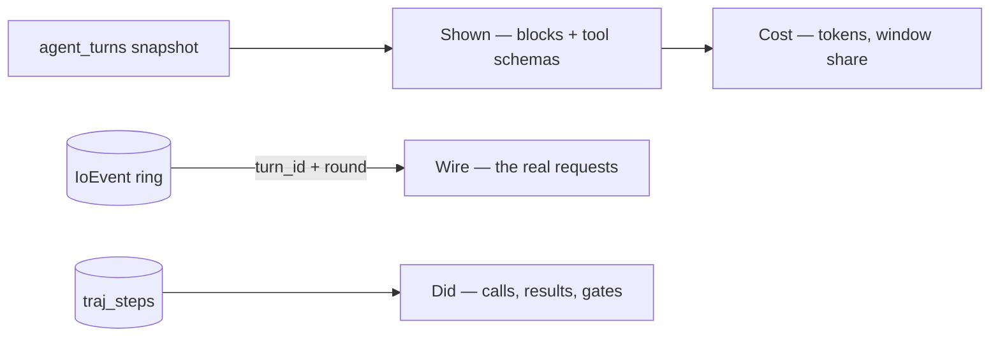

# Module: agentpedia — one agent turn, steppable

A turn was already recorded three times over, in three places, by three modules that
were not designed together:

| Record | Module | Answers |
| --- | --- | --- |
| `agent_turns` | [interpretability](interpretability.mdx) | what the model was **shown** |
| the `IoEvent` ring | [observability](observability.mdx) | what went over the **wire** |
| `traj_runs` / `traj_steps` | [trajectories](trajectories.mdx) | what the agent **did** |

Reading one turn meant three panes and a lot of matching by timestamp. Agentpedia is
what happens when you put the three beside each other and scrub them together.

**It owns one table and no more.** Every field the stepper serves is joined at read
time from a module that already owns it; the single exception is the **fork edge**
(which turn is a counterfactual of which, produced by which edits), because nothing
else records that and there is nowhere honest to put it — see
[Where the edge lives](#where-the-edge-lives).

The name is the point of comparison. A Neuronpedia feature page gives a *feature* a
permanent address you can cite and compare against. A **harness** — the prompt, the
tools, the sampling settings, everything that decides how an agent behaves minus the
task itself — deserves the same, instead of being an untracked implementation detail
of whichever run happened to use it.

**Status: implemented** — the stepper, the harness pages, and forks.

## What made it possible

The wire half only became joinable when every request the agent loop makes started
carrying `turn_id` and `round`, stamped from a contextvar in `run_agent_loop` (see
[observability](observability.mdx#which-turn-an-event-belongs-to)). That was three
lines in the loop and two fields on a model, and without it the only way to attribute
a request to a round is a timestamp range — which silently interleaves two agents
running at once into a transcript that reads as one agent behaving erratically.

## Contributions to the layout shell

- **Panels:** `agentpedia.hub` (role `document`, singleton) with three sections —
  **Runs** (`r`), **Harness** (`h`), **Forks** (`f`). One pane rather than three, per
  the pane-consolidation rule: these are three views of one object.
- **Commands:** `agentpedia.open`, `agentpedia.prevRound`, `agentpedia.nextRound`.
- **Agent tools** (grouped under `agentpedia`, so they cost nothing until loaded):
  `agentpedia.step`, `agentpedia.harness`, `agentpedia.fork` (gated),
  `agentpedia.diff`. The agent reading — and re-running — its own last turn is the
  exploratory payoff of the whole module.
- **Keybindings:** `←` / `→` scrub rounds, scoped to the pane **and** guarded with
  `!textInput` — unguarded, an arrow key pressed in a filter box moves the round out
  from under the cursor. The section keys are declared on the sections themselves;
  the host's tab strip owns them, and a second binding would be a second authority
  over one value.
- **Settings:** none. It reads other modules' data and has no policy of its own.

The scrubbing commands reach the pane through a published handle (`actions.ts`), the
same idiom the [model designer](interpretability.mdx#keyboard) uses and for the same
reason: which round is showing is component state, and commands are declared at module
load outside React. With no turn open they are no-ops, which is correct rather than a
gap.

## Runs — the stepper

A turn expands to rounds, and a round is four columns:

**Shown** is rendered by the same components the interpretability pane uses
(`packages/core/src/ContextBlocks.tsx` — `BlockRow`, `CompositionBar`, `ToolList`,
`TokenizerBadge`, moved to core so both modules import them from one place rather than
one reaching into the other). The two panes therefore cannot disagree about what a
round contained.

**Wire** is the requests this round actually made, plus the one thing the context pane
cannot tell you.

### The flatten notice

The interpretability pane shows the system tier **pre-flatten** — several separate
messages, which is how the orchestrator assembles it and how the recorder tells the
parts apart by position. That is not what the provider received. Every strict Jinja
chat template rejects a second system message, so
`providers.normalize_system_messages` reduces the turn to one leading system message
at the wire, joining the leading ones and demoting a later one to `user`.

Both views are true, and a reader comparing the pane against a captured request body
without being told would conclude one of them was lying. So the Wire column reports
the transformation: how many messages went in, how many came out, and which blocks
were folded together. It computes that by running **the real normalizer**, not a
reimplementation of its rule — the block contents are previews so the text is
approximate, but the shape change, which is the whole point, is exact.

### Three ways a column can be empty

An empty column is a claim, and the wrong claim is worse than none. The wire half
reports `wire_status`:

| Status | Means |
| --- | --- |
| `live` | Requests matched this turn. |
| `aged_out` | The ring holds only events newer than this turn — it is 500 events, in memory, never written to disk. |
| `unrecorded` | Nothing matched and nothing is newer: this turn predates the `turn_id` stamp, or telemetry was off. |

The Did column draws the same distinction differently: trajectory capture is **off by
default and dataset-scoped**, so an empty Did column says either "this round called
nothing" or "nothing was recording", depending on `capture_on`. Rendering both as an
empty list is the failure this module exists to avoid.

The Cost column follows the same rule for the context window: no window means no
denominator, so `window_pct` stays null and the pane says the provider does not report
one, rather than drawing a percentage of a guess. (Where the window *does* come from
is [the probe](interpretability.mdx#the-window-a-turn-actually-ran-under).)

A **peer** turn has no rounds at all and that is not an error: `agent.ask_peer` ran on
another user's node, which assembled its own context on its own machine. The stepper
says so instead of rendering a blank.

## Harness — the pedia pages

A harness is content-addressed: two runs share a fingerprint exactly when they ran
under the same agent, prompt, tools and sampling settings, which is the condition
under which comparing their outcomes means anything. The section gives each one a
page — system prompt, tools offered, run count, and how each tool fared.

`failures` and `gated` are separate columns on purpose. "The tool errored" and "the
harness refused the call" look identical in a success flag and are completely
different findings: one is a broken tool, the other is a permission rule you may not
have known you had.

This section reads `/api/trajectories/harnesses` and `/api/trajectories/tools`
**over HTTP**, rather than importing the trajectories module's client. An HTTP route
is a public surface; another module's `api.ts` is an internal, and modules do not
reach into each other's internals.

## Forks

Re-run a recorded turn with one thing changed, and diff the two decisions.

The ordering was deliberate: a fork is only meaningful once you can see exactly what
the original turn was given and what it did with it, which is what the stepper is.

It is also the same intervention the [lens](llamacpp.mdx#the-lens--a-trace-read-as-words) performs on a
trace, one altitude up. There the edit is a token and the readout is a logit; here
the edit is the context and the readout is what the agent decided to do. One
vocabulary — `derived_from`, `edits`, `diff` — at the token level and at the context
level, which is the whole reason the two shipped as one project.

Open a turn in **Runs**, scrub to the round you want to branch at, and press **Fork
this round**. The button carries the _round_, not just the turn: a fork branches at
the context the model was holding there, and forking from round 0 while reading
round 3 would replay a different question.

### The eight edits

| Op                 | Changes                                        |
| ------------------ | ---------------------------------------------- |
| `drop_tool`        | One tool leaves the catalog                    |
| `drop_group`       | Every tool in a group leaves the catalog       |
| `set_system`       | Replace the system prompt                      |
| `edit_message`     | Replace one message's text, by index           |
| `truncate_history` | Keep only the newest N history messages        |
| `set_model`        | Run the same context against a different model |
| `set_provider`     | …on a different provider                       |
| `set_temperature`  | …at a different temperature                    |

`truncate_history` is applied **last**, whatever order the edits were typed in:
`edit_message` addresses a message by index, and an index resolved against a list
that has already had three messages removed would edit whatever slid into the slot.

### No second loop

The fork runs `run_agent_loop` — the same function a chat turn runs — which is the
rule [evals](evals.mdx) already follows and the only way the result means anything.
What is under test is _this app's_ catalog assembly, budget cap, progressive
disclosure and permission gate. A replay that built its own message list and called
the provider directly would be measuring a harness nobody ships.

The browser stand-in it needs already existed as `evals/runner_agent.EvalConnection`.
It now lives at `backend/modules/agent/offline_conn.py` as `OfflineConnection`, with
evals aliasing the name it earned: agentpedia importing evals' internals would break
the rule that modules do not reach into each other, so the one proven copy moved to
where both can import it.

### Nothing acts, by default

A tool call can act through **three** legs, and answering only the first would have
been a comfortable illusion:

1. the browser leg — a fixture resolves the pending future the way a real pane would;
2. backend tools (`agent.delegate`, `agent.ask_peer`) — resolved server-side, they
   never touch a connection at all;
3. backend-plugin tools — likewise.

So `run_agent_loop` grew a `simulate` hook that stands in for all three, at the one
point after the gate where a call would otherwise act. `OfflineConnection`'s fixtures
alone would have let a replayed turn delegate, or reach a peer, a second time.
[Evals](evals.mdx#tools-are-simulated-never-executed) had the same hole and now
passes the same hook — its suites were only safe because they happen to exercise UI
tools.

`live: true` removes the hook — and then the fork runs on the **real browser
connection**, so the tools genuinely run and the orchestrator's own permission gate
prompts the user exactly as it would in a chat turn. There is no path where a tool
acts and nobody was asked. It is a confirm-then-run button in the pane, and the agent
tool cannot reach it at all: a live fork prompts a human per acting call, which is
not a conversation the agent can have on the user's behalf.

`deny_tools` is the loop's other new parameter, and it is needed _with_ the catalog
filter rather than instead of it. Under progressive disclosure the tool list is
rebuilt every round from the live registry, so removing a tool once would see it
reappear next round — and `_dispatch_call` forgivingly loads a group for any tool it
recognizes. A denied tool the model names anyway comes back as
`tool X is not available in this run`, which is usually the interesting half of the
counterfactual.

### The rebuild is the honest part

`agent_turns` was written to be read by a human: block previews are clipped at 4000
characters and an assistant's tool calls are folded into its message text so their
context cost is counted. A fork needs the opposite — the message list the provider
was handed. `rebuild.py` inverts that, and reports every place it could not:

- **Tool calls** are recovered by parsing the JSON array off the tail of the block.
  Left folded, the model would be reading its own previous calls as _prose_ — a
  transcript of a conversation it did not have, with nothing to say so.
- **`tool_call_id`** was never recorded, so each tool result is paired with the calls
  of the assistant block above it, in order. Both `tool_call_id` and `tool_name` are
  written, because which one the provider reads depends on the dialect the _fork_
  runs against, and changing the provider is one of the edits. A tool result with no
  call above it is **reported, not given an invented id**.
- **The system prompt** is restored to its full text when the live agent's prompt
  _starts with_ the recorded preview — a verified restoration, not a guess. Anything
  still clipped is named, and the pane shows `context rebuilt approximately`.

That banner is the point. A fork that quietly ran a truncated prompt would answer
differently _for a reason that is not the edit_, which is the worst failure available
here: indistinguishable from a finding.

The same rule covers edits themselves. An edit that matched nothing — a `drop_tool`
naming a tool that was never offered, an `edit_message` past the end — is **rejected
loudly** rather than skipped. "I dropped the tool and it still answered the same way"
and "I dropped a tool whose name I misspelled and it still answered the same way" are
the same sentence with the meaning removed, and nothing else on the screen would tell
the two apart.

**Tool drift** is reported for the same reason: the snapshot records tool _names_, not
schemas, so the fork's catalog is rebuilt from the live registry for the round's
active groups. That is the right call — a schema pinned from a snapshot would be a
fork of a tool that no longer exists — but a fork taken after a plugin was installed
or a pane was closed is not a clean comparison, and the pane says how many tools are
no longer available.

### Where the edge lives

The fork itself is an ordinary turn: it runs through the ordinary loop, so
`agent_turns` records what it was shown, the telemetry ring records what it sent, and
`traj_runs` records what it did — all under the fork's own `turn_id`. It opens in the
stepper like any other turn, and nothing is duplicated.

What nothing else records is the **edge**: that this turn is a counterfactual of that
one, produced by these edits. Two obvious homes were both wrong:

- `TurnSnapshot.parentTurnId` already means _delegated from_. A fork parked there
  would join the delegation tree — hidden by `roots_only`, counted as a sub-agent by
  `get_children` — which is a different claim about what happened.
- `traj_runs.meta` is the right shape, and was the plan's answer, but trajectory
  capture is **off by default and dataset-scoped**. A fork taken on a node that never
  turned capture on would leave no edge at all, and the Forks section would be empty
  for the ordinary user.

So `agentpedia_forks` in `app.db`: three real columns and a JSON blob, written
swallow-and-log like every other recorder here. Losing the edge costs a row in a
list; it must never cost the fork you just waited for.

### The diff

The parent is read at `from_round` and the fork at round 0 — the same instant, since
the fork's first round _is_ the parent's branch round with the edits applied.
Comparing round 0 to round 0 would line the fork's opening move up against a decision
the parent made several rounds earlier.

The **decision** — what each side reached for first, once it had its context — is read
off the _next_ round's blocks rather than from the trajectory steps. That works
identically on both sides and needs no trajectory capture, which is what makes the two
halves comparable rather than merely adjacent. An empty decision means the model
answered without calling anything, and is rendered as that sentence rather than as a
blank.

One asymmetry is unavoidable and is labelled rather than hidden: the **parent's final
answer** is in no snapshot, because the last assistant message is appended after the
last round was captured. It comes from the trajectory store when capture was on, and
otherwise reads `not recorded`.

## Backend surface

| Method | Path | Purpose |
| --- | --- | --- |
| GET | `/api/agentpedia/turns` | The timeline — stored turn summaries joined to their runs (`limit`, `agent_id`, `since`, `roots_only`) |
| GET | `/api/agentpedia/turns/{turn_id}` | One turn, joined: shown / wire / did / cost per round |
| POST | `/api/agentpedia/fork/preview` | What a fork would run — rebuilt messages, catalog, drift — without running it |
| POST | `/api/agentpedia/fork` | Run the fork. Tools simulated unless `live` |
| GET | `/api/agentpedia/forks` | The fork edges, newest first (`limit`, `parent`) |
| GET | `/api/agentpedia/forks/{fork_turn_id}/diff` | Parent beside fork at the branch round |
| DELETE | `/api/agentpedia/forks/{fork_turn_id}` | Forget the edge; the fork's own turn stays |

`GET /turns` reads the **durable** `agent_turns` table, not the 25-turn ring: a
stepper whose history ends 25 turns ago cannot answer "what was the agent doing this
morning", which is most of why anyone opens it. `GET /turns/{turn_id}` tries the ring
first and then the table, because a turn reached from the timeline is by definition
one the ring has dropped.

Harness and tool aggregates are **not** duplicated here — `/api/trajectories/*`
already returns them, and a second aggregate would be the one that drifts.

## Browser vs desktop

| | Browser | Desktop |
| --- | --- | --- |
| Stepper, harness pages | Yes | Yes |
| Live turns | Yes | Yes |
| Simulated forks | Yes | Yes |
| Live forks | Yes | Yes |

Nothing here touches a native capability, so both layouts behave identically. A
**live** fork is the one thing that needs a browser attached at all — not because of
the layout, but because it runs the tools the browser owns and prompts through the
permission gate the browser renders. With no window open it refuses and says so,
rather than silently running against backend tools only.
