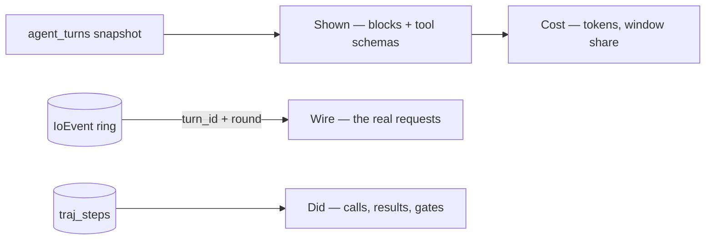

# Module: agentpedia — one agent turn, steppable

A turn was already recorded three times over, in three places, by three modules that
were not designed together:

| Record | Module | Answers |
| --- | --- | --- |
| `agent_turns` | [interpretability](interpretability.mdx) | what the model was **shown** |
| the `IoEvent` ring | [observability](observability.mdx) | what went over the **wire** |
| `traj_runs` / `traj_steps` | [trajectories](trajectories.mdx) | what the agent **did** |

Reading one turn meant three panes and a lot of matching by timestamp. Agentpedia is
what happens when you put the three beside each other and scrub them together.

**It owns no store.** Every field it serves is joined at read time from a module that
already owns it, and if this module ever needs to *write* something, that is a sign
the recording end is missing a field and the fix belongs there.

The name is the point of comparison. A Neuronpedia feature page gives a *feature* a
permanent address you can cite and compare against. A **harness** — the prompt, the
tools, the sampling settings, everything that decides how an agent behaves minus the
task itself — deserves the same, instead of being an untracked implementation detail
of whichever run happened to use it.

**Status: the stepper and the harness pages are implemented.** Forks are not — see
[Forks](#forks).

## What made it possible

The wire half only became joinable when every request the agent loop makes started
carrying `turn_id` and `round`, stamped from a contextvar in `run_agent_loop` (see
[observability](observability.mdx#which-turn-an-event-belongs-to)). That was three
lines in the loop and two fields on a model, and without it the only way to attribute
a request to a round is a timestamp range — which silently interleaves two agents
running at once into a transcript that reads as one agent behaving erratically.

## Contributions to the layout shell

- **Panels:** `agentpedia.hub` (role `document`, singleton) with three sections —
  **Runs** (`r`), **Harness** (`h`), **Forks** (`f`). One pane rather than three, per
  the pane-consolidation rule: these are three views of one object.
- **Commands:** `agentpedia.open`, `agentpedia.prevRound`, `agentpedia.nextRound`.
- **Keybindings:** `←` / `→` scrub rounds, scoped to the pane **and** guarded with
  `!textInput` — unguarded, an arrow key pressed in a filter box moves the round out
  from under the cursor. The section keys are declared on the sections themselves;
  the host's tab strip owns them, and a second binding would be a second authority
  over one value.
- **Settings:** none. It reads other modules' data and has no policy of its own.

The scrubbing commands reach the pane through a published handle (`actions.ts`), the
same idiom the [model designer](interpretability.mdx#keyboard) uses and for the same
reason: which round is showing is component state, and commands are declared at module
load outside React. With no turn open they are no-ops, which is correct rather than a
gap.

## Runs — the stepper

A turn expands to rounds, and a round is four columns:

**Shown** is rendered by the same components the interpretability pane uses
(`packages/core/src/ContextBlocks.tsx` — `BlockRow`, `CompositionBar`, `ToolList`,
`TokenizerBadge`, moved to core so both modules import them from one place rather than
one reaching into the other). The two panes therefore cannot disagree about what a
round contained.

**Wire** is the requests this round actually made, plus the one thing the context pane
cannot tell you.

### The flatten notice

The interpretability pane shows the system tier **pre-flatten** — several separate
messages, which is how the orchestrator assembles it and how the recorder tells the
parts apart by position. That is not what the provider received. Every strict Jinja
chat template rejects a second system message, so
`providers.normalize_system_messages` reduces the turn to one leading system message
at the wire, joining the leading ones and demoting a later one to `user`.

Both views are true, and a reader comparing the pane against a captured request body
without being told would conclude one of them was lying. So the Wire column reports
the transformation: how many messages went in, how many came out, and which blocks
were folded together. It computes that by running **the real normalizer**, not a
reimplementation of its rule — the block contents are previews so the text is
approximate, but the shape change, which is the whole point, is exact.

### Three ways a column can be empty

An empty column is a claim, and the wrong claim is worse than none. The wire half
reports `wire_status`:

| Status | Means |
| --- | --- |
| `live` | Requests matched this turn. |
| `aged_out` | The ring holds only events newer than this turn — it is 500 events, in memory, never written to disk. |
| `unrecorded` | Nothing matched and nothing is newer: this turn predates the `turn_id` stamp, or telemetry was off. |

The Did column draws the same distinction differently: trajectory capture is **off by
default and dataset-scoped**, so an empty Did column says either "this round called
nothing" or "nothing was recording", depending on `capture_on`. Rendering both as an
empty list is the failure this module exists to avoid.

The Cost column follows the same rule for the context window: no window means no
denominator, so `window_pct` stays null and the pane says the provider does not report
one, rather than drawing a percentage of a guess. (Where the window *does* come from
is [the probe](interpretability.mdx#the-window-a-turn-actually-ran-under).)

A **peer** turn has no rounds at all and that is not an error: `agent.ask_peer` ran on
another user's node, which assembled its own context on its own machine. The stepper
says so instead of rendering a blank.

## Harness — the pedia pages

A harness is content-addressed: two runs share a fingerprint exactly when they ran
under the same agent, prompt, tools and sampling settings, which is the condition
under which comparing their outcomes means anything. The section gives each one a
page — system prompt, tools offered, run count, and how each tool fared.

`failures` and `gated` are separate columns on purpose. "The tool errored" and "the
harness refused the call" look identical in a success flag and are completely
different findings: one is a broken tool, the other is a permission rule you may not
have known you had.

This section reads `/api/trajectories/harnesses` and `/api/trajectories/tools`
**over HTTP**, rather than importing the trajectories module's client. An HTTP route
is a public surface; another module's `api.ts` is an internal, and modules do not
reach into each other's internals.

## Forks

Not built. Re-running a recorded turn with one thing changed — a tool dropped, the
system prompt edited, a different model — and diffing the two. The section exists and
says so rather than being hidden, because the empty state is the honest description of
where the module is.

The ordering is deliberate: a fork is only meaningful once you can see exactly what
the original turn was given and what it did with it, which is what the stepper is.

## Backend surface

| Method | Path | Purpose |
| --- | --- | --- |
| GET | `/api/agentpedia/turns` | The timeline — stored turn summaries joined to their runs (`limit`, `agent_id`, `since`, `roots_only`) |
| GET | `/api/agentpedia/turns/{turn_id}` | One turn, joined: shown / wire / did / cost per round |

`GET /turns` reads the **durable** `agent_turns` table, not the 25-turn ring: a
stepper whose history ends 25 turns ago cannot answer "what was the agent doing this
morning", which is most of why anyone opens it. `GET /turns/{turn_id}` tries the ring
first and then the table, because a turn reached from the timeline is by definition
one the ring has dropped.

Harness and tool aggregates are **not** duplicated here — `/api/trajectories/*`
already returns them, and a second aggregate would be the one that drifts.

## Browser vs desktop

| | Browser | Desktop |
| --- | --- | --- |
| Stepper, harness pages | Yes | Yes |
| Live turns | Yes | Yes |

Nothing here touches a native capability: it is a reader over three backend stores, so
both layouts behave identically.
