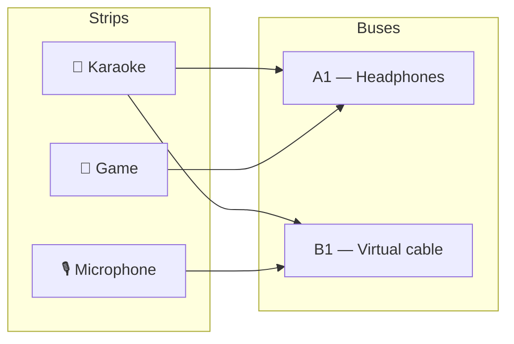

# Audio

**Status: implemented.** Default input, default output, and a routing matrix over
both — the dashboard's answer to the question VoiceMeeter answers.

Before it, every module that made a sound opened its own `AudioContext` and
connected to whatever the OS called "default": the karaoke stage, the game's
synthesized noise, voice comms, the Plaza's level meter, the arcade blips. There
was no way to say "the karaoke video goes to the living-room speakers, my
microphone does not", because nothing in the app modelled *which output* a sound
goes to. There was also no way to route anything anywhere, because nodes cannot
cross `AudioContext` boundaries — five private contexts are five islands.

- **Backend:** `backend/modules/audio/` (`voicemeeter.py`, `providers.py`,
  `store.py`, `routes.py`, `agent_tools.py`, `events.py`)
- **Frontend:** `packages/core/src/modules/audio/` — the `audio.mixer` pane, a
  settings section, and the engine every other module now feeds
- **Routes:** `GET /api/audio/status`, `GET|PUT|DELETE /api/audio/mixer`,
  `POST /api/audio/host/launch|send|level`, `POST|DELETE /api/audio/devices`
- **Channel:** `audio` on the shared `/ws`
- **Agent tools:** `audio.status`, `audio.route`, `audio.level`,
  `audio.start_host_mixer`

## The shape: strips, buses, and a matrix

A **strip** is a source of sound. A **bus** is somewhere sound comes out. Any
strip can feed any number of buses at once, and that last clause is the whole
feature.



That diagram *is* the motivating example: a video plays into a virtual cable that
another application is recording as its microphone, the singer's own voice goes
to the same cable, and the headphones hear the video but not the voice. Three
sources, two destinations, five decisions — and it is unexpressible in a model
with one "output device" setting, which is why the matrix exists.

## The one thing no web app can do

**A browser cannot create a virtual audio device.** Making audio appear as a
*microphone* to another application requires a kernel or HAL driver. Everything
here routes to devices the OS already offers; producing the device itself is the
job of VoiceMeeter, VB-CABLE, BlackHole, or PipeWire.

The corollary catches people out: **an embedded `<iframe>`'s audio cannot be
routed either.** There is no element to attach to a Web Audio graph. Playing "a
YouTube video" through the mixer means playing it through an element we own —
which is exactly what the [karaoke](karaoke.mdx) module already does, fetching
with yt-dlp to a local file the backend serves same-origin.

## Per platform

The platforms differ in kind, not degree, so `ProviderStatus` carries two
separate capability flags rather than one.

| Platform | Provider | `canCreate` | `canControl` | What that means |
| --- | --- | --- | --- | --- |
| **Linux** | PipeWire / PulseAudio | ✅ | ❌ | We make the cable ourselves: one `pactl load-module`. No install, no driver, no third party — the best-supported platform, which surprises people. |
| **Windows** | Voicemeeter, VB-CABLE | ❌ | ✅ | The device is the user's install, but Voicemeeter has a remote API, so we can drive the machine's *whole* mixer — including audio the dashboard does not produce. |
| **macOS** | BlackHole | ❌ | ❌ | Detect, report, link. No scripting surface exists; hearing audio *and* sending it needs a Multi-Output Device the user creates in Audio MIDI Setup. |

Nothing is bundled. VB-CABLE is donationware with restricted redistribution and
BlackHole is a driver with its own installer, so both get the treatment SearXNG
and the AssaultCube content get — supported, detected, linked, never shipped.

### Three states, not two

The [hardware](hardware.mdx) module's rule, applied to audio:

> `installed=false, certain=true` means we looked and it is not there.
> `certain=false` means **we could not ask**.

No `pactl` on `PATH` is not evidence that there is no sound server; an unreadable
registry is not evidence that Voicemeeter is absent. Rendering the second state
as the first tells a user with a working Voicemeeter to go install Voicemeeter.

## Where each half lives

The graph lives in the browser, because only Web Audio can move samples. The
*routing* is server state, because the karaoke rule applies here too: **the
server holds intent, a pane renders it.** A change made by the agent, by a second
window, or by a phone on the fabric arrives on the `audio` channel and every open
mixer reconciles.

That is also why the matrix is not a setting. `SettingValue` is a scalar, the
axes are discovered at runtime, and `GET /api/settings` hands the whole bag to
every plugin. It gets its own table, the way layouts do.

## Joining the mixer

A module that makes sound registers a strip and connects to it:

```ts
import { mixer } from '../audio/engine';

mixer.declareStrip({ id: 'karaoke', label: 'Karaoke', icon: '🎤' });

const handle = mixer.connectStrip('karaoke');
source.connect(handle.input); // never handle.context.destination
```

For a media element there is a hook, `useMediaStrip(ref, decl)`, which handles
the once-per-element rule below.

Capturing a microphone goes through `inputConstraints()` so the chosen input
device is honoured — a module that keeps calling `getUserMedia({ audio: true })`
silently gets the system default whatever the user picked, with nothing on screen
to explain it.

## Failures that are silent

Every one of these produces *no error* — which is why they are listed rather than
left to be rediscovered.

1. **A private `AudioContext` is an island.** Nodes cannot cross contexts, and
   connecting across them is a no-op, not an exception. A module that calls
   `new AudioContext()` is not in the mixer and nothing says so.
2. **`ctx.close()` is not cleanup.** The context is shared now. Closing it when a
   match ends or a microphone is switched off silences the entire app. Release
   the strip instead — this is the "unmount is not close" rule from
   [the layout shell](../architecture/layout-shell.mdx), with an audible symptom.
3. **`createMediaElementSource` may be called once per element, and it *moves*
   the audio.** After attaching, the element no longer plays to the default
   output on its own; attach without connecting and the video plays in total
   silence.
4. **Cross-origin media yields zeros, not an error.** Anything routed must be
   same-origin or CORS-enabled.
5. **A context created without a user gesture starts suspended** — wired, silent,
   and uncomplaining. The engine resumes on the first `pointerdown`/`keydown`.
6. **`enumerateDevices()` returns blank labels until a media permission is
   granted.** That is a prompt to show, not an empty device list.
7. **Device ids are origin-scoped and rotate.** Clearing site data renames every
   device, so a mixer keyed on ids alone silently reverts every bus to the
   default output at once. Both the id *and* the label are saved, and
   `resolveDeviceId` tries the id first (exact; two identical headsets share a
   label) and falls back to the label (survives rotation).
8. **`setSinkId` is Chromium-only** and rejects asynchronously for a device that
   has been unplugged — while the element happily keeps playing to the default
   output. The engine catches that and marks the bus as fallen back rather than
   claiming audio went somewhere it did not.

## Voicemeeter specifics

The Remote API is reached with `ctypes` rather than a PyPI wrapper: the DLL ships
*with Voicemeeter*, so it exists only where Voicemeeter does, and taking a
dependency for nine entry points would put a Windows-only concern into
`pyproject.toml` for every platform.

- **The API is stateful, single-client and not thread-safe.** `VBVMR_Login` binds
  the process; a second login without a logout returns `-2`. One module-global
  client, one lock, logged out from the app lifespan.
- **The version counts must be read, never assumed.** Voicemeeter is 3 strips ×
  2 buses, Banana 5 × 5, Potato 8 × 8. A matrix sized for Banana ignores three of
  Potato's strips; sized for Potato it writes `Strip[7].A1` on a Banana, which
  goes nowhere and reads as "the routing didn't take".
- **The executable names do not match the marketing names.**
  `voicemeeterpro.exe` is **Banana**; Potato is `voicemeeter8.exe`. Getting this
  backwards launches the wrong mixer against the user's saved routing.
- **Launching waits for the engine.** `VBVMR_RunVoicemeeter` returns as soon as
  the process spawns, and every parameter written in the second or two before the
  audio engine answers is dropped silently.
- **Launching is never implicit.** It takes over the machine's default audio
  devices, which every running application hears immediately, so it happens only
  when someone asks.

## Not built

- **Level meters.** The matrix shows routing, not signal; a meter per strip needs
  an `AnalyserNode` per strip and a render loop.
- **Per-application routing on Linux and macOS.** Moving another app's stream is
  a per-stream operation on PipeWire and impossible on macOS without a helper.
- **A media pane.** The karaoke stage is currently the only routable media
  element; a general "play this URL through the mixer" pane is the obvious next
  source.
- **Fabric audio.** The phone is already a peer; carrying a bus to it (or a strip
  from it) would make any paired device a speaker or a microphone.
