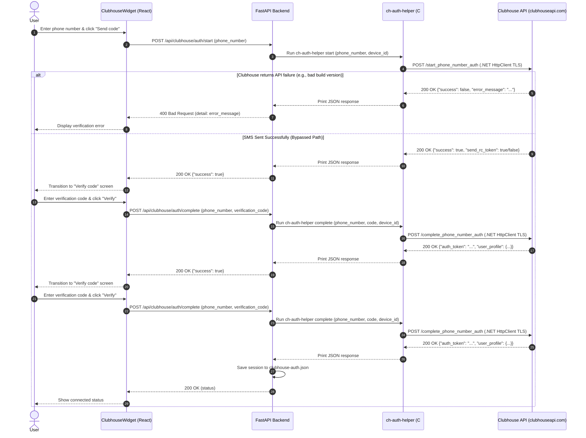
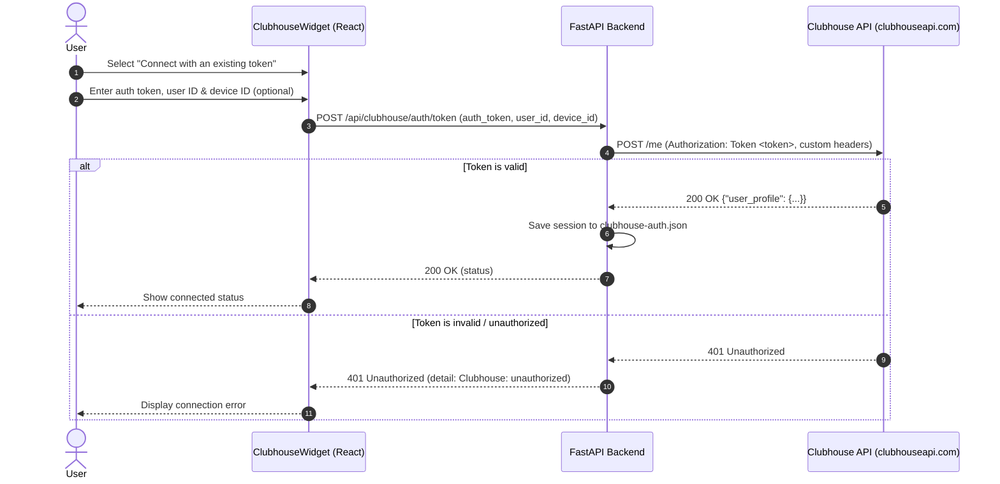

# Module: clubhouse

Clubdeck-style onboarding for a Clubhouse account. The widget offers three ways
in, chosen from a switcher at the top of the card:

- **Text me a code** — phone number → we ask Clubhouse to send the SMS → verification code → connected profile.
- **I have a code** — enter a phone number _and_ a code you already hold, skipping our `/auth/start` call entirely. Use this when you requested the code from the real Clubhouse app, or when the anti-abuse gate swallowed our SMS request: `/complete_phone_number_auth` carries no server-side state from the start call, so a code obtained anywhere completes the same way.
- **Auth token** — connect directly with an existing `auth_token` + `user_id`.

**Status: implemented** — frontend in [ClubhouseWidget.tsx](file:///home/horrible/horrible-dashboard/packages/core/src/modules/clubhouse/ClubhouseWidget.tsx),
backend in [routes.py](file:///home/horrible/horrible-dashboard/backend/modules/clubhouse/routes.py). Token-connect is verified end to end
against the live API; phone-auth depends on Clubhouse's gate (see below).

## Unofficial API & The Verification Gate

Clubhouse has no public API. Like Clubdeck, the backend speaks the
reverse-engineered mobile client protocol (`www.clubhouseapi.com/api`,
overridable via `HORRIBLE_CLUBHOUSE_API`), sending mobile-client headers and a
stable per-install `CH-DeviceId`.

### 1. Client-Version Headers

Clubhouse validates two version headers — `CH-AppVersion` (`26.08.30`) and the **numeric** `CH-AppBuild` (`1038152`, also the `User-Agent`) — read off the 26.08.30 client's own interceptor (`defpackage/cb1.java`). A stale value earns "Please upgrade your app" on room actions and makes SMS codes come back `is_verified: false`. Update both constants in [routes.py](file:///C:/Users/Horrible/Code/horrible-dashboard/backend/modules/clubhouse/routes.py) `_headers` **and** `auth_helper/Program.cs`, then delete the compiled helper so it rebuilds; confirm with `check_for_update` (`has_update: false`).

### 2. The attestation gate — why SMS sign-in no longer works

`start_phone_number_auth` in the 26.08.30 client attaches a `tokens` → **`AttestationRequest`** (`rc_token` reCAPTCHA, `integrity_response` Play Integrity, plus the legacy `safety_net_*`). Clubhouse now **rejects a code request that carries none**, answering `{"success": false, "error_message": "login did not pass token validation!"}`.

These tokens can only be minted by the signed Clubhouse app running on a Google-Play-certified device. **No TLS fingerprint or header trick from a desktop helper can produce one**, so the `ch-auth-helper` WinHTTP bypass (which defeated an earlier, softer Cloudflare/JA3 gate) no longer gets an SMS dispatched. `/auth/start` detects this message and steers the user to token-connect rather than surfacing the raw error.

The C# helper still exists and still sends the current version headers; the WinHTTP-vs-`HttpClientHandler` platform split remains (Windows uses the trust-listed WinHTTP stack, other OSes fall back). But this is now moot for `start`: attestation gates every platform equally.

### 3. Token-Connect — the working path

`POST /auth/token` (the **"Auth token"** tab) takes an `auth_token` + `user_id` captured from a real logged-in Clubhouse session and validates them against **`/get_profile`** (of the account's own id) — deliberately **not** `/me`, see the route-block note below. It needs no attestation and is the supported way to link an account. Capture the token from the official app's traffic (or a prior successful sign-in); it is stored server-side only.

### The `/me` + `/get_feed_v3` route block (Cloudflare 503)

Cloudflare intermittently serves a **503 "Application temporarily unavailable"** on **exactly two routes — `/me` and `/get_feed_v3`** — while every *other* authenticated route (`/get_profile`, `/get_settings`, `/get_activities`, `/get_followers`, …) answers normally from the same machine, same IP, same token. Verified 2026-09-12: those two 503 while the rest return a clean `401` on a bad token; the official app on the *same Wi-Fi* uses them fine. It is **not** the IP, the token, TLS/JA3, HTTP version, headers, or the `__cf_bm` cookie — all were tested and ruled out. It is a **per-route rate/abuse rule**, and it is easy to trip by polling: a reconnect loop hitting `/me`, or `channels()` paging `/get_feed_v3` six times a refresh, is exactly the traffic that provokes it. It decays once that traffic stops. Two consequences the code now respects: **token-connect validates via `/get_profile`, not `/me`**, so linking an account works while `/me` is blocked; and a 503 on these routes is surfaced as a clean "temporarily unavailable" (see `_raise_for_upstream`), never as a token or payload error. The **room list still depends on `/get_feed_v3`**, so browsing live rooms is the one thing that waits for the block to clear — a room joined by known id does not.

### 4. Headers & Endpoints Reference

To communicate with Clubhouse, the backend passes specific metadata headers to authenticate and pass validation checks. If Clubhouse updates its mobile apps and starts rejecting requests, these headers and build versions must be updated in the backend config:

- **Base API URL:** `https://www.clubhouseapi.com/api`
- **Common Request Headers:**
  - `CH-Languages`: `en-US`
  - `CH-Locale`: `en_US`
  - `CH-AppBuild`: `26.07.07` (build version)
  - `CH-AppVersion`: `26.07.07` (app version)
  - `CH-DeviceId`: A stable, per-install UUID generated by the backend (stored in `.data/clubhouse-device-id`).
  - `User-Agent`: `clubhouse/android/26.07.07`
- **Authenticated Request Headers:**
  - `Authorization`: `Token <auth_token>`
  - `CH-UserID`: The numeric user ID linked to the session.

#### Reversed Endpoints Reference:

- **POST `/get_feed_v3`:** Fetches the active hallway rooms list. (Replaces the deprecated `/get_channels` endpoint which returns a Cloudflare/Clubhouse `404 Not Found`). It returns a list of feed items; the backend filters for entries containing a `channel` dictionary to extract room lists.
- **GET `/get_cofollows`:** Returns profiles of followed users. Replaces `/get_following`, which was removed from the API (it 404s and the 26.08.30 client does not reference it). Note it is a **GET with query params**, not a POST body.
- **GET `/get_activities`:** Recent activity, replacing the removed `/get_notifications`. It paginates by **opaque cursor** (`next_cursor`), so the page/page_size the old route took has no meaning and was dropped rather than ignored.
- **GET `/get_handraise_queue`** / **POST `/update_handraise_queue_setting`:** the hand-raise queue, replacing the removed `/update_is_ask_to_join_allowed`. The queue read is **moderator-only**: a listener in the same room gets a bare `400 Invalid request.`, relayed as a 403. Raising a hand is still **`/audience_reply`** (`channel`, `raise_hands`, `unraise_hands`), which is alive in 26.08.30 and verified live — it is not a retired route.
- **POST `/set_chat_permission`** (`chat_permission`: 1 open / 2 host's followers / 3 trusted followers — the values a room serves in its own `chat_permission_options`), **POST `/emoji_reaction`** (`channel` + `emoji`), **POST `/get_channel_audience`**, **GET `/search_channel_users`**, **POST `/mute_other_speakers`**, **GET `/get_mutual_cofollows`**, and **POST `/get_profile`** with `username` in place of `user_id`.
- **POST `/me`:** Used to validate an existing token and fetch the corresponding user profile.
- **POST `/start_phone_number_auth`:** Starts phone authentication (handled by the native `ch-auth-helper`).
- **POST `/complete_phone_number_auth`:** Verifies verification code (handled by the native `ch-auth-helper`).

#### Removed features (2026-09-02)

These called routes that are **404** upstream and have no successor in the
26.08.30 client, so the panes, API functions and models for them were deleted
rather than left to fail:

- **Clubs** — `get_club`, `get_club_members`, `follow_club`, `unfollow_club`.
  Gone product-wide; `get_house*` 404s too, so there is no renamed successor to
  point at. The `Club` model survives only because the **feed** still carries a
  `social_club` badge on a room — that is display data, not the clubs API.
- **Events** — `get_events`, `edit_event`, `delete_event`.
- **Online friends** — `get_online_friends`.
- **Room visibility** — `make_channel_public`, `make_channel_social`.
- **Skin tone** — `update_skintone`.

`accept_speaker_invite` was **not** deleted: it migrated to `become_speaker`,
which does still exist. Don't re-add anything above without probing it first —
a 404 route reads as a working feature right up until someone uses it.

#### Endpoint status (probed 2026-09-02, against the 26.08.30 route table)

Unauthenticated probes discriminate cleanly, because Clubhouse answers three
different ways — and the difference decides whether a fix is even possible:

| Response | Meaning |
| --- | --- |
| `401` + JSON + an `Allow:` header | route exists; only auth is missing (the `Allow` header also confirms GET vs POST) |
| `404` + HTML | route removed from the API |
| `503` + Cloudflare HTML | never reaches the app; **no client-side change gets past it** |

On 2026-09-02 a 503 blanket covered the whole live-room path (`me`, `get_feed_v3`,
`join_channel`, `send_channel_message`, …). **It has since lifted** — every one of
those answers authenticated requests again (verified 2026-09-08 and 2026-09-10) —
so a failure there today is our payload or the room, and the status code still
says which.

#### Request rules (probed live against a real account, 2026-09-10)

Read out of the 26.08.30 serializers and then confirmed on the wire:

- **Every room read needs membership.** `get_channel`, `get_channel_audience`,
  `get_channel_messages` and `search_channel_users` all answer a 400 for a room
  the account is not in — `get_channel` with `should_leave: true`, the rest with
  an empty `error_message` — and 200 for the identical request once joined.
  `audience_reply` is the odd one out: it answers **200 for a room you have
  left**, so a hand "raised" there succeeds and does nothing. `_raise_for_upstream` turns `should_leave` into
  a **409 "not in this room"**. The pane used to fetch the chat backlog *before*
  `join_channel`, which made it a guaranteed 400 on every join.
- **`source` is an int code**, the client's `SourceLocation` enum (`PROFILE=4`,
  `CHANNEL=5`, `SEARCH=9`, `HALLWAY=14`) — the code, not the name and not the
  ordinal. `/follow` refused our string `"feed"` with *"A valid integer is
  required."*, so following someone never worked.
- **`create_channel`** takes `privacy_level` ∈ `public` / `friend` /
  `friend_of_friend` / `house` (the last needs a `social_club_id`); `private` and
  `social` are refused as *not a valid choice*. It has **no `topic` field** — the
  room is titled afterwards with `set_channel_title`, which can refuse in the
  room's first moment (*"Invalid operation"*), so it is best-effort. And it must
  send **`is_chat_enabled: true`**, or the room starts with
  `can_post_to_chat: false` *for its own host*.
- **`cannot send message` has two causes**: not being in the room, and the room
  refusing this account chat (`user_capabilities.can_post_to_chat: false`).
- **`get_channel_messages`**'s default page is the *latest* messages, newest
  first; the backend reverses it to match the pane's append order.
  `is_chronological_order=true` pages from the start of the room instead.
- `active_ping` answers `should_leave: true` once the room ends or a moderator
  removes you; the pane now leaves on it.
- Gone or gated (not implemented): `get_room_recap` and `get_channel_shares` 404;
  `get_karma_details` answers *Not available*; paid reactions are behind a
  feature flag; `get_replays` needs a `social_club_id`; `search` needs
  `limit_to_object_types`.

Separately, `check_for_update` answers unauthenticated and is the cheapest check
that our version headers are current — it keys on the numeric **`CH-AppBuild`**,
not the dotted version. With the old pin (`26.07.07` in both headers) it answers
`has_update: true, is_mandatory: true`; with the 26.08.30 client's real values
(`CH-AppVersion: 26.08.30`, `CH-AppBuild: 1038152`, `User-Agent:
clubhouse/android/1038152`, read off `defpackage/cb1.java`) it answers
`has_update: false`. (An earlier version of this page called that response frozen
for every version — it only looked that way because the build header carried a
version string.)

**The version is enforced as of 2026-09-10.** A stale client gets "Please upgrade
your app" on room actions, and an SMS code comes back `success: true,
is_verified: false` with `number_of_attempts_remaining` that never goes down —
the code is not even checked. `/auth/complete` now reports that as "Clubhouse did
not accept that code (N attempts left)" rather than "wrong or expired code". This
is distinct from `login did not pass token validation` on `start`, which is the
anti-bot gate and is not fixed by a version bump.

> [!NOTE]
> **Token-Connect (The Backup Path):** While the C# helper bypasses standard bot gating, users can still use **Token-Connect** to link their accounts directly. Users can supply an existing `auth_token` and `user_id` (captured from an active official app session).

---

## Authentication Flow Diagrams

### SMS Phone Authentication Flow

This diagram illustrates the phone verification flow, highlighting how the C# auth helper subprocess matches a trusted TLS signature to bypass Clubhouse's reCAPTCHA gate.



### Token Connection Flow

This diagram shows how users connect an existing session token (bypass path).



---

## Backend API Endpoints

All routes are prefixed by `/api/clubhouse` and documented via Pydantic models in [models.py](file:///home/horrible/horrible-dashboard/backend/modules/clubhouse/models.py).

### 1. `GET /status`

Checks if the local dashboard is connected to a Clubhouse account.

- **Response Schema:** [ClubhouseStatus](file:///home/horrible/horrible-dashboard/backend/modules/clubhouse/models.py#L32)
- **Response Body:**
  ```json
  {
    "connected": true,
    "user_id": 4242,
    "username": "horrible",
    "name": "Horrible User",
    "photo_url": "https://example.com/photo.jpg"
  }
  ```
  _(Never exposes the stored `auth_token` to the browser.)_

### 2. `POST /auth/start`

Initiates the SMS verification process.

- **Request Schema:** [StartAuthRequest](file:///home/horrible/horrible-dashboard/backend/modules/clubhouse/models.py#L10) (`phone_number`: E.164 string format `+15551234567`)
- **Response Schema:** [StartAuthResult](file:///home/horrible/horrible-dashboard/backend/modules/clubhouse/models.py#L28)
- **Errors:**
  - **400 Bad Request:** Thrown if Detections match `send_rc_token: true` or `success: false` (displays a clean warning explaining the verification gate/reCAPTCHA blocker).

### 3. `POST /auth/complete`

Submits the texted code to complete authentication and retrieve the auth token.

- **Request Schema:** [CompleteAuthRequest](file:///home/horrible/horrible-dashboard/backend/modules/clubhouse/models.py#L14) (`phone_number`, `verification_code` — 4–8 digits; Clubhouse currently sends 6)
- **Response Schema:** [ClubhouseStatus](file:///home/horrible/horrible-dashboard/backend/modules/clubhouse/models.py#L32)
- **Behavior:** Stores session details (including the `auth_token` and optional `refresh_token`) inside `$HORRIBLE_DATA_DIR/clubhouse-auth.json`.
- **No dependency on `/auth/start`:** neither this route nor `ch-auth-helper` keeps state between the two calls, so the widget's "I have a code" path posts here on its own with a code the user obtained elsewhere.

### 4. `POST /auth/token`

Directly connects an existing session token bypass.

- **Request Schema:** [TokenConnectRequest](file:///home/horrible/horrible-dashboard/backend/modules/clubhouse/models.py#L19) (`auth_token`, `user_id`, `device_id` optional)
- **Response Schema:** [ClubhouseStatus](file:///home/horrible/horrible-dashboard/backend/modules/clubhouse/models.py#L32)
- **Behavior:** Validates the token against Clubhouse `/me`, sets headers, and persists configuration details.

### 5. `DELETE /auth`

Disconnects the account and cleans up stored credentials.

- **Response Schema:** [ClubhouseStatus](file:///home/horrible/horrible-dashboard/backend/modules/clubhouse/models.py#L32) (resets connected to `False`)

### 6. `GET /channels`

Returns currently live Clubhouse channels.

- **Response Schema:** [ChannelList](file:///home/horrible/horrible-dashboard/backend/modules/clubhouse/models.py#L67)
- **Errors:** **409 Conflict** if not connected.

### 7. `GET /following`

Returns profiles of people followed by the connected account.

- **Response Schema:** [FollowingList](file:///home/horrible/horrible-dashboard/backend/modules/clubhouse/models.py#L78)
- **Errors:** **409 Conflict** if not connected.

### 8. `POST /channels/{channel}/join`

Joins a live Clubhouse room and retrieves voice / signaling tokens.

- **Response Schema:** [JoinChannelResult](file:///home/horrible/horrible-dashboard/backend/modules/clubhouse/models.py#L82)
- **Body Parameters:** None.
- **Errors:** **409 Conflict** if not connected.

### 9. `POST /channels/{channel}/leave`

Leaves a live room.

- **Response Schema:** Generic success object.
- **Body Parameters:** None.
- **Errors:** **409 Conflict** if not connected.

### 10. `POST /channels/{channel}/ping`

Keeps the room voice session active (heartbeat ping). Should be called every 30 seconds while connected to a channel.

- **Response Schema:** `{ success, should_leave }`. `should_leave: true` means the
  account is out of the room — it ended, or a moderator removed you — and the
  pane leaves on it (unless it has already switched to another room). Before, it
  kept showing the room while every send was refused.
- **Body Parameters:** None.
- **Errors:** **409 Conflict** if not connected.

### 11. `POST /channels/{channel}/mute`

Notifies Clubhouse of speaker mute/unmute state. Relays to upstream
`/mute_speaker` — **not** `/update_is_muted`, which no longer exists and answers
404, so the mute button used to fail silently.

- **Request Schema:** `MuteRequest` (`is_muted` boolean)
- **Response Schema:** Generic success object.
- **Errors:** **409 Conflict** if not connected.
- **`user_id` is required upstream.** Sending only `channel` and `is_muted` gets
  a `400 User id is required.` — a rejection the pane swallowed, so the mute
  button once again did nothing. Mute here is always _self_-mute, so the id is
  the connected account's.

### 12. `POST /channels/{channel}/hand`

Raises or lowers a hand in the channel.

- **Request Schema:** `HandRequest` (`raise_hands` boolean)
- **Response Schema:** Generic success object.
- **Errors:** **409 Conflict** if not connected.

### 13. `POST /channels/{channel}/accept_speaker`

Comes up on stage after being invited to speak.

- **Request Schema:** none — takes only the channel in the path.
- **Response Schema:** Generic success object.
- **Errors:** **409 Conflict** if not connected.

> [!NOTE]
> Upstream is `/become_speaker`, not the removed `/accept_speaker_invite` (404).
> The 26.08.30 client pairs it with the `/reject_speaker_invite` we already call,
> and **neither carries a moderator id** — you accept the stage itself, not one
> particular person's invitation, so there is no user id to get stale.

### 14. Moderation & room control

These exist because a room you _host_ needs more than joining and muting. All
409 when not connected, and all return a generic success object.

| Route                                       | Request                                        | Upstream                                                   |
| ------------------------------------------- | ---------------------------------------------- | ---------------------------------------------------------- |
| `POST /channels/{channel}/invite_speaker`   | `InviteUserRequest`                            | `/invite_speaker` — promote an audience member              |
| `POST /channels/{channel}/topic`            | `UpdateTopicRequest`                           | `/set_channel_title`                                        |
| `POST /channels/{channel}/handraise_settings` | `HandraiseSettingsRequest`                   | `/update_handraise_queue_setting`                           |
| `GET /channels/{channel}/handraise_queue`   | —                                              | `/get_handraise_queue` — who has a hand up (GET-only, **moderators only**: 403 otherwise) |
| `POST /channels/{channel}/chat_settings`    | `ChatSettingsRequest`                          | `/enable_channel_messages` or `/disable_channel_messages`   |
| `POST /channels/{channel}/chat_permission`  | `ChatPermissionRequest` (`everyone` / `host_followers` / `trusted_followers`) | `/set_chat_permission` — named here, ints 1/2/3 only in `routes._CHAT_PERMISSION` |
| `POST /channels/{channel}/mute_others`      | —                                              | `/mute_other_speakers`                                      |
| `POST /channels/{channel}/reaction`         | `ReactionRequest` (`emoji`)                    | `/emoji_reaction` — the room lists accepted emoji as `emoji_reaction_options` on join |
| `GET /channels/{channel}/audience`          | —                                              | `/get_channel_audience` — the room's listeners              |
| `GET /channels/{channel}/users/search?query=` | —                                            | `/search_channel_users` — find someone in the room          |
| `POST /send_channel_message`                | `SendChannelMessageRequest`                    | `/send_channel_message`                                     |

The join result also carries the room's own menus — `handraise_queue_setting`,
`handraise_queue_options` (value + label) and `emoji_reaction_options` — so the
pane can render what this room offers instead of a hardcoded list. They had to be
named on `JoinChannelResult`, or the response model drops them.

A room read for a room the account is not in (never joined, left, or ended)
answers **409 "not in this room"**, from Clubhouse's `should_leave: true`.

### 15. `GET /channels/{channel}/chat`

The chat backlog, fetched on join so a late arrival sees what was already said —
live messages arrive over PubNub, which only carries what is sent after you
subscribe.

- **Response:** `{ "comments": [...], "next_cursor": ... }`, **oldest first**.
  Upstream's default page is the latest messages newest-first; it is reversed so
  the backlog reads like the live messages appended below it.
- **Fetched after the join, never before.** Like every room read it needs
  membership; the pane used to fetch it before `join_channel`, which was a 400 on
  every single join.
- **Degrades rather than fails:** chat can be disabled by a moderator, so an
  upstream error returns an **empty backlog**. A room with no chat is not a
  failed join.

### `cannot send message` usually means "you are not in that channel"

(The other cause is the room refusing this account chat —
`user_capabilities.can_post_to_chat: false` — which is also what a room created
without `is_chat_enabled: true` gives its own host. `create_channel` now sends it.)

Clubhouse rejects a chat write it does not like with a bare **`400 cannot send
message`** — no reason, no room named. Probed against the live API, the error is
specific: a **nonexistent** channel answers `Invalid channel ID`, while a real
room the account has **not joined** answers `cannot send message`. It is an
address error, not a permission or payload error — the same payload succeeds the
moment the account is actually in the room.

That made one ordering bug in `joinRoom` invisible for as long as it existed.
`joinClubhouseChannel()` moves the account into the new room — and out of any
previous one — the moment it returns, but `activeChannel` was patched at the
**end** of the join, after `AgoraRTC.createClient`, `client.join`,
`getUserMedia`, the track publish and the PubNub subscribe. A slow or failed step
anywhere in that stretch left the account in the new room while the pane still
addressed the old one, and every send went to a room it had left. The failure
surfaced as a generic "Failed to send message" toast, so it read as a broken
send rather than a wrong address.

The pane therefore claims the channel **as soon as the upstream join returns**,
which is the moment membership actually moves. `joined` is still set at the end,
because that gates the room UI on a working connection rather than on membership.
`joinOrder.test.ts` pins the ordering by reading the source — it is not reachable
from a unit test without standing up Agora and a microphone.

### Leaving a room must not close the audio context

The room's audio is built on `mixer.getContext()` — the app's one shared
`AudioContext`. The teardown used to `await audioCtx.close()` on it, which is not
a room teardown at all: it silences [every other module](audio.mdx) and, because
`getContext()` caches that context for the life of the page and never rebuilds a
closed one, it kills **the next Clubhouse join too**. The join's first
`createMediaStreamDestination()` throws `InvalidStateError`, the `suspended`
resume guard never fires (a closed context is `closed`), and the symptom the user
sees is a microphone that does nothing while the button reads *Mic Active*.

The teardown now disconnects the nodes it created (`humanGain`, the two
`MediaStreamDestination`s) and stops the physical mic stream, which drops its
source with it — the mixer's context is left running. The rule is enforced tree
wide by `modules/audio/__tests__/shared-context-is-never-closed.test.ts`.

The teardown also resets the room state in a **`finally`**. `leaveRoom` raises
`loading` before calling it, and every control in the room — mute, raise hand,
join stage, the chat composer — is `disabled={voiceLoading}`. A teardown that
threw or hung on one of its awaits therefore left the pane showing a room with
every button dead and no error to explain it.

### A missing microphone is reported, never mimed

`getUserMedia` is allowed to fail — a denied permission, no device, a webview
that does not grant capture — and continuing as a **listener** is a legitimate
outcome. What is not legitimate is doing it quietly. Without a microphone there
is no `humanGain`, so `toggleMute` used to change nothing, flip the label to
*Mic Active (Mute)* and tell Clubhouse the account was unmuted: the room shows a
live speaker and hears silence, which reads as a broken microphone rather than a
denied permission.

So the join's failure path raises a voice error naming the reason, and
`toggleMute` refuses outright when there is no microphone attached rather than
reporting a mute state it cannot honour.

### Chat availability is carried, not guessed

Chat is also decided per room and per account, and the join response says so — but
the response model was dropping the answer. `JoinChannelResult` now declares
`is_chat_enabled`, `is_room_chat_available`, `chat_permission`,
`chat_permission_options` and `user_capabilities`; the pane records the verdict as
`RoomState.chatDisabledReason` and **disables the composer with that reason in its
placeholder** instead of accepting text it cannot deliver.

`user_capabilities.can_post_to_chat` is the field Clubhouse computes for exactly
this question, and a room can have chat on while still refusing a given account,
so both are checked and they produce different reasons.

Two traps sit here:

- **The response model is the filter.** These fields reach the browser only
  because `JoinChannelResult` names them; a Pydantic response model silently
  drops what it does not declare, which is why the pane had no idea what the room
  allowed even though every join response said so.
- **Only an explicit `false` means off.** An absent flag is an older room, not a
  closed one — reading it as falsy would disable chat in every room that does not
  mention it.

Both the join verdict and a rejected send are logged by **value** — the send line
names the channel and message length, because a bare `cannot send message` in
`logs/backend.log` otherwise identifies neither the room nor the cause.

### Feed pagination

`GET /channels` walks up to **four pages** of `/get_feed_v3` rather than one,
deduplicating by channel id across pages. One page is a partial hallway, which
made the rooms list look like Clubhouse was empty.

A failure on the **first** page is raised, not swallowed. Returning an empty list
there renders as "no rooms are live", which is a different claim from "the feed is
unavailable" and a false one — the pane looked like a quiet Clubhouse while the
endpoint was in fact unreachable. Failures on **later** pages still break the loop
and keep what was already collected, since those pages are only ever extra.

---

## Voice agent

The room view can put an **LLM agent in the room**: it listens, decides when it
is its turn, and speaks. The speech pipeline is two routes on the agent module:

- **`POST /api/agent/stt`** — an uploaded WebM/Opus chunk in, transcript out.
  Local Whisper (`whisper-tiny.en`), decoded via `ffmpeg` as a plain subprocess
  on a worker thread (asyncio cannot spawn one under `uvicorn --reload` on
  Windows). Whisper answers silence with its priors rather than with nothing, so
  a small set of known hallucinations (`"you"`, `"thank you"`, …) is filtered to
  empty — otherwise the agent answers a room that said nothing. A `language` hint
  is forwarded to the transcriber (and on to a remote node's `/api/agent/stt`
  when the work is delegated); it is ignored by the English-only default model,
  which is why it is a hint rather than a setting.
- **`GET /api/agent/tts?text=`** — MP3 audio, via Edge TTS. `voice`, `rate`,
  `pitch` and `volume` are all passed through to the synthesizer, so the agent's
  loudness is tuned alongside its speed and pitch rather than left to the mixer.

Everything between those two — whether to answer, what the agent knows, what it
remembers — is the **voice session**, and it lives on the server.

### The conversation is a server-side session

`backend/modules/clubhouse/voice.py` holds one session **per channel**, process-global
(the [karaoke](./karaoke.mdx) precedent): a pane reload, a second pane, or a workspace
switch rejoins the same conversation instead of resetting it. `voice_runtime.py` is the
impure half — retrieval, generation, room commands — so the policy in `voice.py` is
testable without a model, a network, or a connected account.

This replaced a one-shot `POST /api/agent/generate` issued from the pane with the raw
utterance as the entire prompt. That shape had three faults:

- **No memory.** Every utterance was an independent completion, so the agent could not
  follow a conversation or answer "what did you just say?".
- **No room knowledge.** It did not know the topic, who was on stage, who was
  moderating, or its own name — so "who's here?" was answered by invention.
- **No way to look anything up.** `/agent search` built a prompt asking the model to
  "perform a simulated web search", which is a hallucination with extra steps.

### One generation per turn, unless a tool is called

A live room is a realtime medium: every extra round against a local model is seconds
of silence while people talk. So the **server** still decides, deterministically,
everything a turn gets for free:

| Need | How it is met | Cost |
| --- | --- | --- |
| Who is here, the topic, who is talking, what music is on | `render_room_brief` — on the turn message every turn | none |
| Who these people are | bios fetched for **speakers only**, cached per session | one profile fetch each |
| A fact, when the utterance looks like a question | `gather_context` — real `quick_search` + library RAG, run **before** the generation | one concurrent lookup |
| Change the room (topic, chat, hands, invite) | an explicit `/agent` command, never a model decision | no generation at all |

On top of that the model is offered three tools (`voice_tools`), and only these —
a room is strangers talking to your agent, so nothing that acts on a person or a file:

| Tool | Does | Notes |
| --- | --- | --- |
| `play_music(query)` | a `ready` song from the karaoke library, else a YouTube search **without** the karaoke bias and a background **audio-only** download (`ba[ext=m4a]`) | returns a `music.play` action |
| `music_control(action, value)` | `stop` / `pause` / `resume` / `volume` (0–1, clamped) / `louder` / `quieter` (±0.2 step) | a pane action only; "Nothing is playing" when the room brief says so |
| `look_up(query)` | web + library snippets via `gather_context` | not offered when `retrieval` is `off` |

A turn where the model calls nothing costs one generation, as before. A turn that
calls a tool pays a **second** generation with no tools offered, whose prompt is the
same turn message plus a report of what the tools returned — so the reply describes
what actually happened. The report rides the turn message rather than `tool` role
messages, which keeps the roles alternating for strict templates. At most three calls
per turn are honoured. `/agent play <song>`, `/agent stop`, `/agent pause`,
`/agent resume` and `/agent volume <0-1>` do the same with no model, for when a small
one fumbles the call. Anyone who can address the agent can play music.

**Unambiguous requests do not wait for the model to choose a tool.** Measured on
gemma-4-e2b: offered `music_control`, it answered "stop the music" with "I will stop
the music" and made no call, and it never called `look_up` even when told to "look
up" something — `play_music` was the only tool it used reliably. So `detect_intent`
(pure, in `voice.py`, the `wants_retrieval` precedent) routes a narrow set of
phrasings directly: stop / pause / resume + a music word, "turn it up/down" (only
while music is playing — "it" names nothing otherwise), and "look up / search for /
google X". The tool runs first and the turn costs **one** generation with no tools
offered. Everything fuzzier still goes to the model with its tools.

**Music is resolved on the server and played by the pane**, because the room's
published audio track exists only in the pane. The turn response carries `actions`
(declared on `TurnResponse`, or FastAPI's response model drops them). For a song still
downloading the pane polls `GET /api/clubhouse/voice/music/{song_id}` and starts it
when the file lands; a newer request or a stop cancels the wait. Playback runs through
a gain node into `agentAudioDest` (what the room hears) and a `clubhouse-music` mixer
strip (what you hear), and the agent's voice ducks it to a quarter while speaking.
Like TTS, it unmutes the channel while playing and restores the mute when it stops —
and TTS no longer re-mutes the channel while a song is on. Room teardown stops it.

Moderation is command-only on purpose: `invite_speaker` acts on a real person, and a
small model asked to pick one will eventually pick wrong. For the same reason
`_resolve_member` refuses an **ambiguous** name rather than taking the first match, and
resolves only against people actually in the room — a global user search for "dave"
would happily return a stranger.

### When it speaks

`should_respond` is a pure function, and every refusal carries a **reason** that the
pane renders. A silent agent and a broken one are otherwise indistinguishable, which is
the single most common "it doesn't respond" report.

- **`addressed`** (default) — only when a wake word or its own name is said. Safest in
  a room of strangers.
- **`conversational`** — replies more freely, with a cooldown so two people talking
  cannot produce two overlapping answers.
- **`always`** — the old behaviour, now opt-in.
- **`interject`** — may cut in *while someone is still talking*. See below.

Two rules are load-bearing. Wake words match on **word boundaries**, so "bot" does not
fire inside "robot". And the agent never answers **its own voice**: its TTS is published
into the room and comes back through the same transcription path, so `is_own_speech`
compares a normalized word set with a similarity floor — an exact-match check would let
every echo through, and the result sounds exactly like a broken agent talking to itself.
Utterances shorter than three words are never treated as an echo, or one person saying
"yes" would be silenced.

Turn-taking (when a chunk is cut) stays client-side in
[useClubhouseVoice.ts](file:///C:/Users/Horrible/Code/horrible-dashboard/packages/core/src/modules/clubhouse/useClubhouseVoice.ts):
a VAD watches the mixed stream and a silence delay closes the chunk, so the agent waits
for a pause instead of interrupting.

### Interrupting, in both directions

These are two separate mechanisms and only one of them is new.

**A human cuts off the agent** — *barge-in*, `allowBargeIn`, on by default. The VAD is
watching the mixed stream, which carries the remote speakers *and* the local mic but
never the agent's own TTS, so any real voice in the room stops playback: the audio
source is stopped, the TTS fetch is aborted, and the pending queue is dropped. It stops
at a **chunk boundary**, so it cannot cut a word in half.

**The agent cuts into the room** — the `interject` posture. Every other posture only
ever sees finished utterances, because a turn is only sent once the endpointing silence
closes the chunk. Under `interject` the pane also flushes a chunk *mid-breath* once one
person has held the floor past `interjectAfterS` (default 6s), and marks it `partial`.

Three things about that flush are easy to get wrong:

- **The server, not the pane, decides.** A `partial` is dropped with the reason
  `waiting for a pause` under every posture but `interject` — being eager
  (`always`) is about *how often* the agent speaks, not about talking over people.
  A partial that names the agent is always answered: that is a request, not an
  interruption, and making the speaker finish their sentence first is exactly the
  behaviour that reads as broken.
- **A partial is never remembered.** The finished utterance follows seconds later and
  contains it; keeping both puts the same sentence in the history twice, once truncated
  mid-word, and the model starts answering the fragment.
- **The flush has to stop the recorder**, because each blob is a complete WebM and a
  fragment without its header decodes to nothing. Every chunk after the first therefore
  holds only the tail, so the pane concatenates the run's pieces — that is what keeps
  the finished utterance a whole sentence after the agent has already cut in on its
  first half. Cutting in is also skipped while the agent is already speaking, and a
  partial that arrives to a busy queue is dropped rather than queued: a partial is only
  worth acting on while the speaker is still inside it.

### Utterances queue; they are not dropped

The pane holds a serialized queue. The old code returned early whenever the agent was
already speaking, so anything said while it talked or thought vanished — including the
answer to a question it had just been asked. The backlog is capped at six, because if
the model is slower than the room the oldest utterances are the least worth answering.

Utterances are offered to the backend even when the agent is disabled or staying quiet:
it wants to hear a conversation it is staying out of, or "what were we just talking
about?" has no answer.

### Replies are cleaned before they are spoken

`clean_reply` strips speaker prefixes (`Agent:`) and stage directions (`*laughs*`) —
small models emit both regardless of the prompt, and TTS reads them aloud — flattens
markdown, and truncates on a **sentence boundary**, since a reply cut mid-word sounds
like the connection dropped.

### The system message is the persona, then the speech rules

The speech rules are kept **separate from the persona**: the user edits the persona
and must not be able to delete the rules that keep a reply speakable. They used to
be separate *paragraphs of the same system message*, though, alongside the room
brief and everyone's profile bios — and that was wrong twice over.

A persona is short. A real one measured 163 characters, against roughly 3 kB of
rules, room state and biography sharing the same message; the user writes a persona
and hears a model that mostly ignores it, with nothing to point at. And a bio is
**not ours** — it is profile text written by a stranger in the room, so carrying it
in the highest-authority message meant anyone could put "ignore your persona" in
their Clubhouse profile and have it arrive with the standing of a rule we wrote.

So `render_turn_context` puts the room brief, the retrieval and the bios on the
**current turn**, with the bios explicitly labelled as information about people
rather than instructions to the model. There is still exactly one system message,
deliberately: strict Jinja chat templates reject a second one outright, so a tidier
"context" system message is not available here.

The **speech rules**, though, went back into the system message, after the persona
(`persona + "\n\n" + SPEECH_RULES`). For a while they rode the turn too, and on
gemma-4-e2b that failed in a way worth remembering: "How to speak here: – Two or three
sentences…" arriving in a `user` message reads as a list of instructions the user just
handed over, so the model answered it — "I understand the instructions for how I should
communicate in this setting" — instead of speaking. Every such reply was remembered,
and a history of assistant turns that all acknowledge the rules is a few-shot example;
the model kept producing them for unrelated chat lines. The rules are ours and static,
so the system message is where they belong; what stays on the turn is facts that change
per turn, or text we did not write.

Three pieces keep it from coming back:

- **The turn ends on a cue** (`REPLY_CUE`: call a tool if the request needs one,
  otherwise write only what you say next; do not acknowledge these notes), because the
  last thing a small model reads decides what it writes. **The tool clause is
  load-bearing and comes first.** The first version said only "write only the words
  you say next", and gemma-4-e2b obeyed it over the tools it was offered: asked to play
  a song it called `play_music` 0/5 times with that cue and 5/5 without, replying
  "playing Africa by Toto now" while nothing played.
- **`is_meta_reply` drops an acknowledgement** — it is neither spoken nor remembered,
  and the turn returns `reason: "dropped a reply that only acknowledged the prompt"`.
  It needs both an acknowledging opening ("I understand", "I will respond/keep/speak…")
  *and* a subject that is the prompt itself ("the instructions", "plain spoken prose",
  "text chat only"), so "I understand your point, Piper" survives.
- **Remembered acknowledgements are skipped** when history is replayed, so a room
  already poisoned by them recovers without `/agent forget`.

Riding the turn is also the more correct place on the merits. The room brief changes
every turn — who is on stage, who has a hand up, who is talking right now — and
pinning it ahead of a twelve-turn history described the room as it was twelve turns
ago.

Bios are **speakers only**, which this page has always said and the memory path did
not do: it passed every member, so a silent listener the store happened to know was
reintroduced by name and biography every turn. The audience is a count in the room
brief precisely so that does not happen. A listener cannot say anything the agent
has to answer, so their biography buys nothing and costs a hundred-odd characters.

### Room lines are folded, and chat has a real sender

History is replayed with **every run of consecutive room lines folded into one
`user` message**, one line per utterance (`Ada: …`, `Grace (@grace) in chat: …`), and
room lines just before the current turn fold into the turn message itself. Replayed
one message each, an agent that mostly listens sent a dozen `user` messages in a row,
which templates enforcing strict user/assistant alternation (older Gemma, Mistral)
reject. A window that opens on the agent's own line carries it as `(Earlier, you
said: …)` inside the first user message, since an assistant message straight after
the system prompt is the other shape those templates refuse.

A chat turn carries the sender the pane actually saw: the display name and
`@username` (`chatSpeakerLabel`) as `speaker`, and the user id as `speaker_id`. It
used to be enqueued with no sender at all, so every chat line reached the model as
"Someone in chat", and the model — told to address people by name — picked a name
off the stage. People memory now learns against `speaker_id` ahead of a name match,
because an `@handle` label matches no roster name.

The agent answers to the **first word of its own name** as well as the full name and
the wake words — "Horrible" for "Horrible Program". A first word under three letters
or a generic one (`the`, `dr`, `dj`, …) is skipped: the fallback name "the agent"
would otherwise fire on every "the". The cost is a false positive when the name is
also an ordinary word ("that's horrible").

### Switching rooms tears the old one down first

There is no Leave between two rooms: the pane goes straight through `joinRoom`. It
used to build the new connection **on top of the live one**, so everything belonging
to the room you left kept running — its Agora client (still subscribed, still
publishing your microphone into it), its PubNub subscription, its ping and volume
intervals, its `MediaRecorder`, and its VAD loop.

The VAD loop is the one that does real damage, and it is not obvious why. It reads
and writes `session.sttRecorder` and `session.sttChunk` — *session* fields, so after
a switch they are the **new** room's recorder and chunk. Meanwhile its analyser is
still wired to the old room's destination, which is now silent, so it takes the idle
branch: every ~1.5 s it sets `chunk.discard = true`, stops the recorder and starts
another. It was discarding the new room's audio, on a timer, forever. Nothing
reached Whisper, `lastHeardSpeech` never updated, and the pane sat on *"Microphone
listening for room audio…"* while people talked. Every further switch added another
ghost doing the same thing.

`joinRoom` now `await session.teardown()` first — **before** the upstream join,
because `joinClubhouseChannel` moves the account out of the old room as a side
effect, so tearing down afterwards would be leaving a room Clubhouse had already
moved us out of.

Both joins and leaves also go through `session.serialize`, a one-at-a-time queue.
Switching is teardown-then-build and both halves await, so clicking a second room
mid-switch used to run two builds concurrently: the second teardown ran while the
first was still installing its intervals, tore down nothing, and left exactly the
orphans the teardown exists to prevent. A rejected task does not wedge the queue —
a failed join that jammed it would leave the pane unable to enter any room at all.

### A room switch clears the pane's per-room state

`joinRoom` resets the *session* — `joined`, `comments`, `liveUsers`, `speakingVolumes`
— but `RoomsPanel` keeps per-room state of its own in React, and nothing was
resetting it. Switching rooms therefore carried the room you left into the room you
arrived in.

The visible one was the **LIVE STT** panel. It kept rendering the last thing said in
the previous room instead of falling back to *"Microphone listening for room
audio…"*, and that panel is the only evidence in the pane that the agent's ears
work: a stale line there reads as a live transcript, and a genuinely fresh room
reads as one nobody has spoken in yet. Exactly backwards, in both directions.

Two of the others are not cosmetic:

- A **queued utterance is addressed at drain time**, from `activeChannelRef.current`
  — not when it was enqueued. So anything still in the queue when you switched was
  answered *into the new room*: the agent replying to a stranger, about something
  nobody there had said. An in-flight generation landed the same way.
- `agentSentTextsRef` is the echo-dedup set and is keyed on **text alone**, with no
  channel. Left uncleared it suppresses a genuine line in the new room because the
  old room happened to say the same words.

One effect keyed on `activeChannel` now drops all of it — the queue, the dedup set,
any in-flight generation, a reply still being spoken, the STT line, the agent's
reason and remembered turns, and the chat draft (which would otherwise be sent to the
wrong room, the same wrong-address failure the `activeChannel` ordering fix removed
from the send path). `roomSwitchResets.test.ts` pins each entry by reading the source;
an effect's dependency list is not reachable without rendering the whole pane.

### A nudge is a direction, not speech

The pane's **Speak Now** button and its silence probe both ask the agent to take the
floor. They used to do it by enqueuing an ordinary `voice` utterance, so the model
received `A speaker said out loud: Say something to the room — pick up the current
conversation` and answered *that*: it replied to a speaker who did not exist. The
silence probe was worse — it passed the speaker name `Room Atmosphere`, inventing a
participant, whose "utterance" the people-memory store then tried to learn facts
about.

There is now a third `Source`, **`nudge`**, and the last message is rendered
`Direction (nobody said this aloud; act on it): …` instead of `X said …`. Three
consequences follow from "nobody said it":

- it is **not remembered** — a nudge in the twelve-turn history is a phantom line the
  agent will later summarise back at the room, and it crowds out real speech;
- it does **not** feed people-memory, which has no speaker to attribute it to;
- it carries **no speaker name**; the pane's `'A speaker'` fallback is skipped.

What it does *not* change is the gate. `should_respond` treats `nudge` exactly as
`voice`, including `respond_to_voice` — a room with voice replies switched off must
not be nudged into talking through a side door.

### The pane may carry its settings with the utterance

`POST .../voice/turn` accepts the pane's whole `config` alongside the text. The
session is still the authority — it simply adopts what arrives — but a `config`
pushed separately races the turn that should have used it, so an utterance
arriving between an edit and its `POST .../voice/config` was answered under the
*previous* persona. Sending the settings with the utterance makes that
unrepresentable. `model`, `temperature` and `max_tokens` reach the provider from
that same config, so a room's agent can run a different model from the
orchestrator's.

The turn is generated with **thinking switched off** (`providers.chat(think=False)`:
`reasoning_effort: "none"` on LM Studio, `think: false` on Ollama,
`chat_template_kwargs.enable_thinking: false` on llama-server / vLLM). Reasoning
tokens count against `max_tokens`, so a thinking model left at its default — Gemma 4
thinks by default — spent the entire ~160-token spoken-reply budget reasoning and
came back with `content: ""` and `finish_reason: "length"`. That used to surface as
`model returned nothing`, indistinguishable from an agent choosing silence. A model
that reasons regardless (R1 distills) now raises instead, and the pane shows a
`notice` telling you to pick a non-reasoning model or raise max tokens.

The request also takes an explicit **`is_self`**. The agent must not answer its
own speech coming back through the room, and the fallbacks for recognizing it —
matching the speaker id, or overlapping the text it just spoke — both fail on a
paraphrase or a shared account. The client knows which audio it originated, so it
says so; `is_self: false` is a positive assertion that a human spoke, and the
text-overlap check still runs underneath as a backstop.

### Routes

| Route | Purpose |
| --- | --- |
| `POST /api/clubhouse/voice/turn` | One utterance in, one decision out (`spoke` / `reason` / `reply` / `notice`). Optionally carries the pane's live `config` and an explicit `is_self` — see above |
| `POST /api/clubhouse/voice/config` | Replace a room's agent settings |
| `GET /api/clubhouse/voice/config` | Read them back |
| `GET /api/clubhouse/voice/state` | What the agent currently remembers (rendered in the Agent tab) |
| `POST /api/clubhouse/voice/reset` | Forget the conversation, keep the settings |
| `GET /api/clubhouse/voice/music/{song_id}` | Download status of a song a `music.play` action named (`queued` / `downloading` / `ready` / `failed`) |

A turn carries a **room snapshot** pushed by the pane rather than polled by the server:
the pane holds the PubNub feed and the Agora volume indicator, so it is seconds fresher
about who is muted, has a hand up, or is speaking right now.

### People memory outranks the room's bio

`voice.render_bios` prefers what `people_memory_store` has *learned* about a member
over the `bio` the room reported, deliberately: the bio is what Clubhouse says today,
memory is what the agent has actually observed across rooms.

The store (`people_memory.py`) is a **process-global singleton constructed at import
time**, which had two consequences worth knowing:

- **Its path is resolved lazily**, not in `__init__`. `paths.data_dir()` reads the
  environment, so a path pinned at construction would follow whatever the data dir was
  when the module first loaded, and every later read would answer from the wrong
  directory. `_ensure_loaded` compares the path it last loaded from and re-reads when
  it changes, rather than caching a boolean.
- **`reset()` exists for tests.** Its in-memory dict otherwise outlives every test in a
  run, so one test's people are visible to all the tests after it — which produced an
  ordering-dependent failure in a test about *bios*, several files away from where the
  state was written. `backend/tests/conftest.py` clears it after each test, beside the
  data-dir isolation and for the same reason.

A provider failure is **reported, never raised** — the route answers 200 with
`reason: "model error"` and the provider's own message ("Failed to load model X"). A 500
here is indistinguishable in the pane from an agent that chose not to answer, and the
model not being loaded is the most common cause of a room agent that has gone quiet.

The agent also takes a **per-room model override** (`model`, blank = the configured
agent model). A live room is a latency budget, not a reasoning budget: the orchestrator
may be on a 27B that takes twenty seconds a turn, which is unusable when people are
talking.

### The reply starts speaking before it has finished synthesizing

`playAgentAudio` used to `await res.arrayBuffer()` for the whole utterance and then
decode it, so nothing played until every sentence had been synthesized **and**
transferred. That cost is paid in full no matter how fast the synthesizer is.

The reply is now split by
[speechChunks.ts](file:///C:/Users/Horrible/Code/horrible-dashboard/packages/core/src/modules/clubhouse/speechChunks.ts)
and each chunk is fetched **one ahead** of the one playing, so the listener waits only
for the first and every later synthesis hides behind the audio already running. The
first chunk is deliberately the smallest — it is the only latency anyone experiences.

Measured through `GET /api/agent/tts` on this machine, median of 5 warm runs:

| reply | words | chunks | before (whole) | after (first chunk) |
| --- | --- | --- | --- | --- |
| short | 4 | 1 | 382 ms | 449 ms |
| medium | 21 | 1 | 491 ms | 490 ms |
| long | 69 | 2 | 785 ms | **478 ms** (1.6×) |

Short and medium replies are a single chunk, so they are unchanged by construction —
splitting a reply that already fits would add a round trip and save nothing. The win is
on long replies, and it grows with length.

:::note There is a ~435 ms floor, and only a local model removes it
Latency against chunk size is flat below ~120 characters — 40 chars costs 437 ms and
60 chars costs 438 ms — then grows. That floor is the round trip to Microsoft's
service, not synthesis, so **no amount of chunking gets under it**. It is the one real
argument for swapping in a local model (Kokoro-82M: Apache, ONNX, non-autoregressive,
and it fits the ONNX setup CLIP already uses); privacy is the other, since utterances
currently leave the machine. Chunking was the model-independent win and it is done —
measure again before assuming a swap is needed for anything else.
:::

Barge-in now stops at a **chunk boundary** and drops the queue, rather than killing one
monolithic buffer. The channel is unmuted once around the whole utterance, not per
chunk: toggling between sentences would clip the start of each one.

### Why Edge TTS and not local XTTS

XTTS-v2 was tried first and dropped. It held a model in VRAM **alongside the
local LLM** and OOM'd against it, and took seconds per utterance — dead air in a
live room. Edge TTS has no local weights and starts immediately. The trade is
explicit: it is a network call, so utterances leave the machine.

### Installing it

Both services are **optional** and lazy-imported — Whisper pulls in torch (~1–2
GB), which every other module does fine without:

```bash
uv sync --extra voice
```

Without the extra, `/api/agent/stt` and `/api/agent/tts` answer **503** with an
install hint rather than 500, and the rest of the Clubhouse module is unaffected.
Decoding also needs `ffmpeg` on `PATH` (the same optional binary karaoke's pitch
shift uses).

The pane now **surfaces** that 503 as a toast and a line in the Agent tab. It used
to call `res.json()` on the error body, read `undefined` off it and return silently,
which made a missing install indistinguishable from a quiet room — the agent simply
never heard anything and never said why.

:::note Desktop
The TTS fetch used a bare `/api/agent/tts` path while every other call in the module
went through `apiUrl`. Under Tauri the frontend is served from its own origin and the
backend lives on a port the shell reports at boot, so a relative `/api` URL resolves
against the webview and never reaches the backend — the agent was mute on the desktop
build. Relatedly, an `AudioContext` created without a user gesture starts `suspended`,
and a suspended context is silent in the quietest possible way: the graph is wired,
`MediaRecorder` produces valid-but-empty WebM, and the VAD analyser reads zero forever.
The hook now resumes it explicitly after joining.
:::

### Enhanced In-Room Moderation, Social & Voice Customization

The Clubhouse client integrates reverse-engineered endpoints providing comprehensive room and social management:

- **Room Moderation & Stage Management:**
  - `POST /channels`: Start a room. `CreateChannelRequest` is `topic` + `audience`
    (`public` / `friend` / `friend_of_friend` — Clubhouse's `privacy_level`; there is
    no invite-only room any more, so the old "Closed (Private)" option is gone). The
    topic is applied afterwards via `set_channel_title`, best-effort.
  - `POST /channels/{channel}/uninvite_speaker`: Demote speaker back to audience.
  - `POST /channels/{channel}/make_moderator`: Promote speaker to moderator.
  - `POST /channels/{channel}/block`: Remove and block a user from the room.
  - `POST /channels/{channel}/end`: End the room for everyone.
  - `POST /channels/{channel}/reject_speaker`: Decline invitation to speak on stage.
- **Social & Presence:**
  - `GET /users/{user_id}/followers`: Paginated follower discovery.
  - `GET /users/{user_id}/mutuals`: People you and that user both follow (`/get_mutual_cofollows`).
  - `GET /users/by-username/{username}`: A profile by @handle (`/get_profile` with `username`).
  - `POST /users/{user_id}/follow` / `unfollow`: now send `source` as the int code upstream requires — following was refused with *"A valid integer is required."* until 2026-09-10.
  - `GET /notifications`: Recent activity, via `/get_activities`.
- **Profile Updates:**
  - `POST /me/bio`, `/me/name`, `/me/username`: Update bio, display name, and handle.
- **TTS Voice & Pitch Customization:**
  - `GET /api/agent/tts/voices`: Catalog of Microsoft Edge neural voices.
  - `GET /api/agent/tts?text=...&voice=...&rate=...&pitch=...&volume=...`: Customizable voice, speed multiplier, pitch and volume tuning.
- **Real-Time Speaker Attribution:**
  - Correlates Agora RTC audio volume indicator metrics with active room participant rosters during VAD speech windows, passing speaker name and user ID directly to the agent's turn loop.

---

## Contributions to the Layout Shell

- **Singleton Panel:** `clubhouse.account` — The unified "Clubhouse" panel. Displays the account onboarding/connection card when disconnected, and the live rooms list when connected. Inside a room it is a three-panel view — participants, chat, and agent settings — each independently toggleable, so a narrow pane can show only what is being used. Declares `dockable: 'right'`, so it opens in a center area by default but can also be toggled into the right dock from the rail — see [Windowing](../architecture/windowing.mdx).
- **Commands:**
  - `clubhouse.connect` — Opens the unified Clubhouse panel.
  - `clubhouse.toggleMic` — Mic on/off in the live room, for push-to-talk.
- **Keybindings:**
  - `1` — `clubhouse.toggleMic`, scoped `when: paneFocus == 'clubhouse.account'`. A
    bare digit has to be pane-scoped or it is swallowed by every text field in the app,
    this pane's own room chat first among them. Only `mod+1..9` is reserved (workspace
    switching), so a plain `1` is free — see [Keybindings](../architecture/keybindings.mdx).

    The command reaches the mic through a handle the pane publishes while it holds a
    joined room (`actions.ts`), the same shape as the model designer's. Not being in a
    room means the command does nothing, which is the point: the handle's absence *is*
    how "there is no mic to toggle" is expressed, so there is no joined flag to keep in
    step with the truth.

---

## Agent Context Integrations

The account widget exposes its connection status using `useAgentContext()`.

- **State:** `loading`, `backend-down`, or connection state properties: `{ connected: boolean, name: string | null, username: string | null }`. While disconnected it also reports the chosen onboarding `method` (`sms` / `code` / `token`) and, for `sms`, the `step`.
- **Reference:** See the [Agent Tools Documentation](../architecture/agent-tools.mdx#reading-widget-state-getagentcontext).

