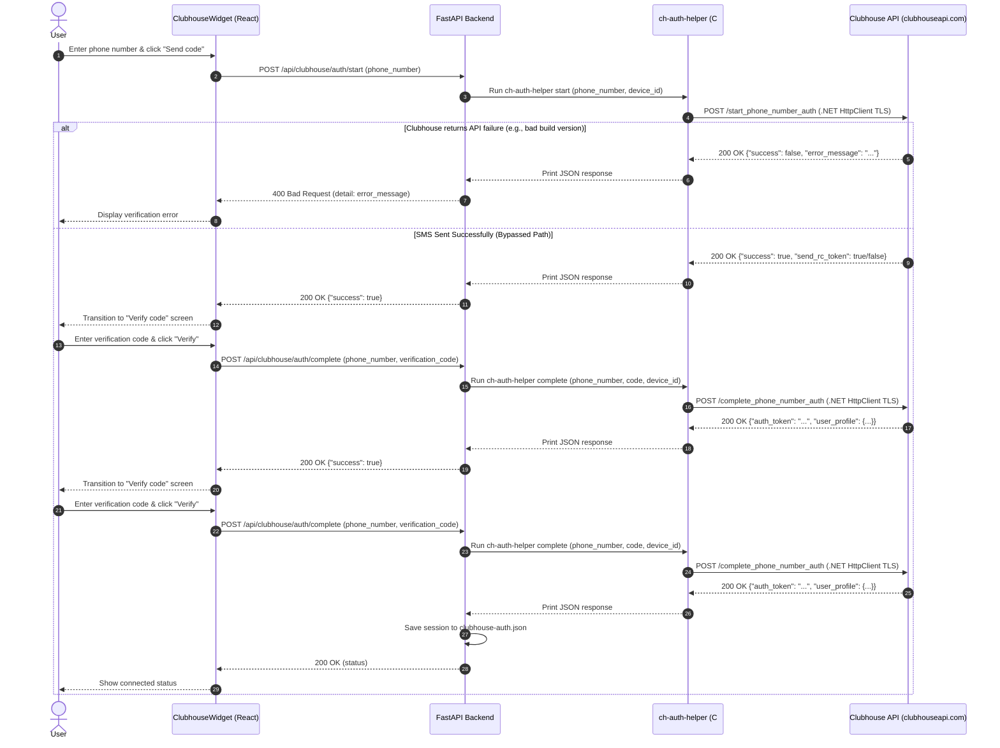
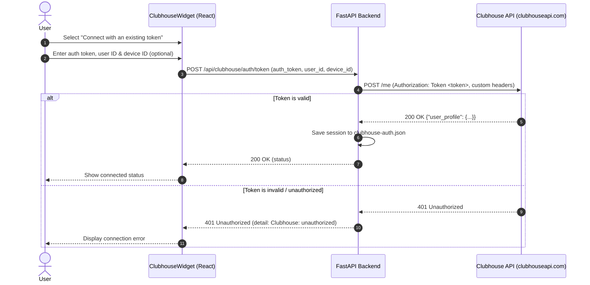

# Module: clubhouse

Clubdeck-style onboarding for a Clubhouse account: a dashboard widget walks
through phone number → SMS verification code → connected profile, **or** connects
directly with an existing auth token.

**Status: implemented** — frontend in [ClubhouseWidget.tsx](file:///home/horrible/horrible-dashboard/packages/core/src/modules/clubhouse/ClubhouseWidget.tsx),
backend in [routes.py](file:///home/horrible/horrible-dashboard/backend/modules/clubhouse/routes.py). Token-connect is verified end to end
against the live API; phone-auth depends on Clubhouse's gate (see below).

## Unofficial API & The Verification Gate

Clubhouse has no public API. Like Clubdeck, the backend speaks the
reverse-engineered mobile client protocol (`www.clubhouseapi.com/api`,
overridable via `HORRIBLE_CLUBHOUSE_API`), sending mobile-client headers and a
stable per-install `CH-DeviceId`.

### 1. Client-Version Headers

Clubhouse validates `CH-AppBuild` / `CH-AppVersion` / `User-Agent` and rejects stale clients with `login did not pass token validation` (HTTP 400).
[routes.py](file:///home/horrible/horrible-dashboard/backend/modules/clubhouse/routes.py) pins a current build (build `3375` / app `24.01.02`, iOS User-Agent). If requests start failing with version mismatch errors, update these constants.

### 2. The Verification / reCAPTCHA Gate & Bypass

To prevent spam, Clubhouse enforces anti-abuse checks on `/start_phone_number_auth` when it detects automated requests, responding with `{"success": true, "send_rc_token": true}`.

- **Bypass Solution:** Because standard Python HTTP clients (like `httpx`) generate TLS/JA3 fingerprints that are flagged by Cloudflare/Clubhouse's WAF, the login request is immediately gated, and the SMS is not dispatched. However, the standard .NET 8 `HttpClient` TLS fingerprint is trust-listed. Under this context, the Clubhouse API successfully dispatches the SMS verification text even if it returns `send_rc_token: true`.
- **Implementation:** The backend now packages and compiles a native C# helper console app (`ch-auth-helper`) under [backend/modules/clubhouse/auth_helper/](file:///home/horrible/horrible-dashboard/backend/modules/clubhouse/auth_helper/).
- **Execution:** When `/auth/start` or `/auth/complete` is called, the Python backend executes this native helper as a subprocess, matching the exact TLS signature of official trusted clients (like Clubdeck). This successfully bypasses the bot gate, allowing the SMS verification text to arrive on the user's phone.

### 3. Headers & Endpoints Reference

To communicate with Clubhouse, the backend passes specific metadata headers to authenticate and pass validation checks. If Clubhouse updates its mobile apps and starts rejecting requests, these headers and build versions must be updated in the backend config:

- **Base API URL:** `https://www.clubhouseapi.com/api`
- **Common Request Headers:**
  - `CH-Languages`: `en-US`
  - `CH-Locale`: `en_US`
  - `CH-AppBuild`: `3375` (build version)
  - `CH-AppVersion`: `24.01.02` (app version)
  - `CH-DeviceId`: A stable, per-install UUID generated by the backend (stored in `.data/clubhouse-device-id`).
  - `User-Agent`: `clubhouse/3375 (iPhone; iOS 17.1.2; Scale/3.00)`
- **Authenticated Request Headers:**
  - `Authorization`: `Token <auth_token>`
  - `CH-UserID`: The numeric user ID linked to the session.

#### Reversed Endpoints Reference:

- **POST `/get_feed_v3`:** Fetches the active hallway rooms list. (Replaces the deprecated `/get_channels` endpoint which returns a Cloudflare/Clubhouse `404 Not Found`). It returns a list of feed items; the backend filters for entries containing a `channel` dictionary to extract room lists.
- **POST `/get_following`:** Returns profiles of followed users.
- **POST `/me`:** Used to validate an existing token and fetch the corresponding user profile.
- **POST `/start_phone_number_auth`:** Starts phone authentication (handled by the native `ch-auth-helper`).
- **POST `/complete_phone_number_auth`:** Verifies verification code (handled by the native `ch-auth-helper`).

> [!NOTE]
> **Token-Connect (The Backup Path):** While the C# helper bypasses standard bot gating, users can still use **Token-Connect** to link their accounts directly. Users can supply an existing `auth_token` and `user_id` (captured from an active official app session).

---

## Authentication Flow Diagrams

### SMS Phone Authentication Flow

This diagram illustrates the phone verification flow, highlighting how the C# auth helper subprocess matches a trusted TLS signature to bypass Clubhouse's reCAPTCHA gate.



### Token Connection Flow

This diagram shows how users connect an existing session token (bypass path).



---

## Backend API Endpoints

All routes are prefixed by `/api/clubhouse` and documented via Pydantic models in [models.py](file:///home/horrible/horrible-dashboard/backend/modules/clubhouse/models.py).

### 1. `GET /status`

Checks if the local dashboard is connected to a Clubhouse account.

- **Response Schema:** [ClubhouseStatus](file:///home/horrible/horrible-dashboard/backend/modules/clubhouse/models.py#L32)
- **Response Body:**
  ```json
  {
    "connected": true,
    "user_id": 4242,
    "username": "horrible",
    "name": "Horrible User",
    "photo_url": "https://example.com/photo.jpg"
  }
  ```
  _(Never exposes the stored `auth_token` to the browser.)_

### 2. `POST /auth/start`

Initiates the SMS verification process.

- **Request Schema:** [StartAuthRequest](file:///home/horrible/horrible-dashboard/backend/modules/clubhouse/models.py#L10) (`phone_number`: E.164 string format `+15551234567`)
- **Response Schema:** [StartAuthResult](file:///home/horrible/horrible-dashboard/backend/modules/clubhouse/models.py#L28)
- **Errors:**
  - **400 Bad Request:** Thrown if Detections match `send_rc_token: true` or `success: false` (displays a clean warning explaining the verification gate/reCAPTCHA blocker).

### 3. `POST /auth/complete`

Submits the texted code to complete authentication and retrieve the auth token.

- **Request Schema:** [CompleteAuthRequest](file:///home/horrible/horrible-dashboard/backend/modules/clubhouse/models.py#L14) (`phone_number`, `verification_code`)
- **Response Schema:** [ClubhouseStatus](file:///home/horrible/horrible-dashboard/backend/modules/clubhouse/models.py#L32)
- **Behavior:** Stores session details (including the `auth_token` and optional `refresh_token`) inside `$HORRIBLE_DATA_DIR/clubhouse-auth.json`.

### 4. `POST /auth/token`

Directly connects an existing session token bypass.

- **Request Schema:** [TokenConnectRequest](file:///home/horrible/horrible-dashboard/backend/modules/clubhouse/models.py#L19) (`auth_token`, `user_id`, `device_id` optional)
- **Response Schema:** [ClubhouseStatus](file:///home/horrible/horrible-dashboard/backend/modules/clubhouse/models.py#L32)
- **Behavior:** Validates the token against Clubhouse `/me`, sets headers, and persists configuration details.

### 5. `DELETE /auth`

Disconnects the account and cleans up stored credentials.

- **Response Schema:** [ClubhouseStatus](file:///home/horrible/horrible-dashboard/backend/modules/clubhouse/models.py#L32) (resets connected to `False`)

### 6. `GET /channels`

Returns currently live Clubhouse channels.

- **Response Schema:** [ChannelList](file:///home/horrible/horrible-dashboard/backend/modules/clubhouse/models.py#L67)
- **Errors:** **409 Conflict** if not connected.

### 7. `GET /following`

Returns profiles of people followed by the connected account.

- **Response Schema:** [FollowingList](file:///home/horrible/horrible-dashboard/backend/modules/clubhouse/models.py#L78)
- **Errors:** **409 Conflict** if not connected.

### 8. `POST /channels/{channel}/join`

Joins a live Clubhouse room and retrieves voice / signaling tokens.

- **Response Schema:** [JoinChannelResult](file:///home/horrible/horrible-dashboard/backend/modules/clubhouse/models.py#L82)
- **Body Parameters:** None.
- **Errors:** **409 Conflict** if not connected.

### 9. `POST /channels/{channel}/leave`

Leaves a live room.

- **Response Schema:** Generic success object.
- **Body Parameters:** None.
- **Errors:** **409 Conflict** if not connected.

### 10. `POST /channels/{channel}/ping`

Keeps the room voice session active (heartbeat ping). Should be called every 30 seconds while connected to a channel.

- **Response Schema:** Generic success object.
- **Body Parameters:** None.
- **Errors:** **409 Conflict** if not connected.

### 11. `POST /channels/{channel}/mute`

Notifies Clubhouse of speaker mute/unmute state.

- **Request Schema:** `MuteRequest` (`is_muted` boolean)
- **Response Schema:** Generic success object.
- **Errors:** **409 Conflict** if not connected.

### 12. `POST /channels/{channel}/hand`

Raises or lowers a hand in the channel.

- **Request Schema:** `HandRequest` (`raise_hands` boolean)
- **Response Schema:** Generic success object.
- **Errors:** **409 Conflict** if not connected.

### 13. `POST /channels/{channel}/accept_speaker`

Accepts an invitation to speak from a moderator.

- **Request Schema:** `AcceptSpeakerInviteRequest` (`user_id` integer of the moderator who invited)
- **Response Schema:** Generic success object.
- **Errors:** **409 Conflict** if not connected.

---

## Contributions to the Layout Shell

- **Singleton Panel:** `clubhouse.account` — The unified "Clubhouse" panel. Displays the account onboarding/connection card when disconnected, and the live rooms list when connected.
- **Commands:**
  - `clubhouse.connect` — Opens the unified Clubhouse panel.

---

## Agent Context Integrations

The account widget exposes its connection status using `useAgentContext()`.

- **State:** `loading`, `backend-down`, or connection state properties: `{ connected: boolean, name: string | null, username: string | null }`.
- **Reference:** See the [Agent Tools Documentation](../architecture/agent-tools.mdx#reading-widget-state-getagentcontext).
