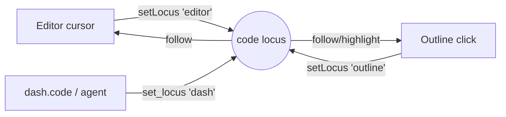

# Code intelligence

The `code` module is the app's **code-intelligence substrate**: an app-owned
tree-sitter symbol index, surfaced as a **Symbol Outline** pane, and the shared
**code locus** that wires the outline, the editor, `dash.code`, and the agent to one
notion of "what code am I looking at."

It's the spine the coding panes stand on: the tree-sitter index, locus bus, and
Outline (Slice 1) plus semantic `code.search` and the cross-repo find palette
(Slice 2, below). The [git provenance pane](git.mdx) is a separate module that also
follows the locus.

## The code locus — the emacs `point`, for code

The load-bearing idea is a single, global, ephemeral **locus**: `{ path, range?,
symbol? }`. Every coding pane *publishes* to it and *follows* it, so panes cross-wire
without knowing about each other:

- Move the editor cursor → the outline highlights the definition you're in.
- Click a symbol in the outline → the editor scrolls to and selects it.
- `dash.code.set_locus(path, line=…)` → the browser opens/scrolls there.

It lives in **`packages/core/src/locus.ts`** (a core primitive, not a module — like
keybindings), exposing `useLocus()`, `setLocus(locus, source)`, and `subscribeLocus`.

Updates mirror over the `code` `/ws` channel so `dash.code`, the agent, and other
windows follow. Two guards stop it feeding back on itself (the same hazard the
reveal/toggle buses hit): a per-client `origin` id drops our own echoes off the
socket, and each update carries the `source` pane so a follower ignores updates it
drove itself.

## The index

`backend/modules/code/` is a process-global service (like the LSP spine): tree-sitter
parses **definitions only** — functions, methods, classes, interfaces, type aliases,
enums — for Python and TypeScript/TSX/JS. `document_symbols(path)` is mtime-cached, so
the outline is always fresh with no save hook; `find_symbols(q, roots)` fuzzy-searches
across the workspace roots (exact > prefix > substring > subsequence), rebuilding from
the per-file cache each call so results stay current. The all-methods quirk of this
platform's `tree-sitter-language-pack` build is absorbed in `ts.py`.

## Contributions

### Panels

| Panel | Id | Role | What |
| --- | --- | --- | --- |
| Symbol Outline | `code.outline` | singleton, **embedded** | The current file's definitions; follows the cursor, drives the locus on click. Meaningless without a buffer, so it lives as the editor's right-hand region strip and has no home of its own — see [Embedded views and sections](../architecture/windowing.mdx#embedded-views-and-sections). `code.search` is deliberately **not** embedded: it *drives* the editor rather than following it. |
| Symbol Search | `code.search` | singleton, right | Cross-repo search: Name (live fuzzy) ⇄ Semantic (`Tab`); each hit drives the locus. Same component the quick-open modal hosts. |

### Backend routes (`/api/code`)

| Route | What |
| --- | --- |
| `GET /symbols?path=` | Definitions in one file (the outline). Path resolves inside a workspace root. |
| `GET /find?q=&limit=` | Fuzzy symbol search across all roots (exact-name / structural). |
| `GET /search?q=&limit=` | Semantic search over embedded definitions; `building` = a reindex is in flight. Auto-kicks a build when the index is empty. |
| `POST /reindex` | Kick a full background rebuild of the semantic index. |

Path access reuses the files module's `_resolve`/`_roots` boundary, so the same
path-traversal guard applies (a path outside every root is `403`).

### `/ws` channel

`code` — carries two events. `locus` (the locus mirror):
`{event:'locus', data:{path,range?,symbol?,source,origin}}` both ways — browsers
publish their locus; the backend stores the latest (for `dash.code.locus()`) and re-fans
to browsers so windows stay in sync. `index` (semantic reindex progress):
`{event:'index', data:{state,done,total}}` pushed from the reindex task, so the search
surface can tick "Indexing… N/total".

### Agent tools

Declared on `code.outline` so they reach the capability manifest:

| Tool | What |
| --- | --- |
| `symbols.outline` | Definitions in a file — the agent's structural view without reading it whole. |
| `symbols.find` | Fuzzy symbol search across the workspace — locate a definition by name. |
| `code.search` | Semantic search — find definitions by *meaning* (embeddings) when the name is unknown. |
| `code.reindex` | Rebuild the semantic index after large changes. |

### `dash.code`

Backend-local facade (no browser round-trip): `dash.code.locus()`,
`dash.code.set_locus(path, line=…, symbol=…)`, `dash.code.symbols(path)`,
`dash.code.find(q)`, `dash.code.search(q)`, `dash.code.reindex()` (blocks until built).
See [python-sdk](../architecture/python-sdk.mdx).

### Commands & keys

- `code.openOutline` — open the Symbol Outline pane.
- `code.openSearch` — open the Symbol Search pane.
- `code.findSymbol` (`mod+p`) — the quick-open search modal.

## Browser vs desktop

Identical in both layouts — the pane, index, and locus bus are platform-agnostic and
reach the backend through the same relative `/api` + `/ws`.

## Semantic search (Slice 2)

`backend/modules/code/semantic.py` embeds each **definition** (from the same tree-sitter
index) into the shared vector store's `documents` table under the `code` collection —
reusing `get_embedding` → `upsert_document` → `search_documents` exactly as the library
ingest does. `search(q)` embeds the query and cosine-ranks; a `reindex` is a full
rebuild that runs detached and streams `index` progress on the `code` `/ws` channel.

Embeddings come from the configured model when one is available, and **fall back to a
deterministic 384-dim hash** when it isn't — so search always works, degrading to lexical
matching offline. **True semantic quality needs an embedding model** (e.g. Ollama with
`nomic-embed`/`all-minilm`).

## Not yet

- Git provenance pane + `git.commit` with session trailers (Slice 3).
- Incremental reindex on save (reindex is a full rebuild for now).
- Languages beyond Python/TS/TSX/JS; references/call-graph (defs only, by design).
