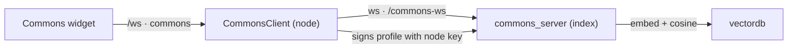
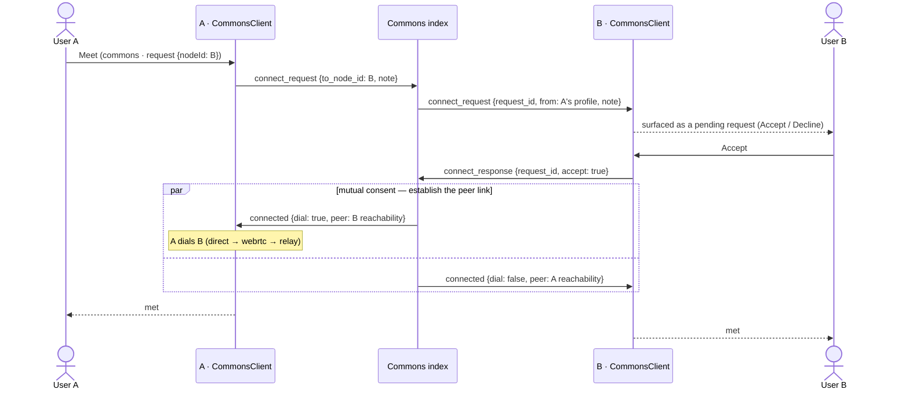

# Module: commons

The **agent commons**: a public square where nodes that don't already know each other
discover one another and (eventually) collaborate safely. Where [network](network.mdx)
connects peers you've already paired with, the commons is for meeting **strangers** —
browse and search public profiles, with trust earned in steps rather than assumed.

**Status: Phase 4 implemented.** Browse + search, the **two-sided consent handshake**
(request-to-meet → accept/decline → peer link), and the **full reputation floor** — a
local blocklist, signed vouches, moderation reports, and per-profile trust tiers
(`known` / `vouched` / `unknown` / `blocked`) — plus a profile editor and a dedicated
requests inbox, all work end to end against a commons index. Remaining (v2): DHT/PEX
decentralized discovery and index federation. The full design — safety ladder,
matchmaking, federation, standards interop — is in
[Agent commons](../architecture/agent-commons.mdx).

Frontend in `packages/core/src/modules/commons/`; node-side client in
`backend/modules/network/commons.py`; the standalone index server in
`backend/modules/network/commons_server.py`.

## Contributions to the layout shell

- **Widget** `commons.directory` (Commons) — `CommonsDirectory.tsx`. Connection status,
  a search box (cosine match over the index's vectordb), and the directory / match
  results as profile cards (name, headline, tags, online dot, **trust-tier badge**) each
  with **Meet** / **Vouch** / **Block** (or **Unblock**) / **Report** actions.
- **Widget** `commons.requests` (Commons Requests) — `CommonsRequests.tsx`. The consent
  inbox: inbound meet requests with Accept / Decline.
- **Widget** `commons.profile` (Commons Profile) — `CommonsProfileEditor.tsx`. Edit your
  storefront (headline, bio, tags, seeking, visibility) and re-sign + republish.
- **Commands** `commons.open` (Open directory), `commons.openRequests` (Open requests),
  `commons.openProfile` (Edit my profile).
- **Settings** (see below).

## How it works

A node opts in (`commons.enabled` + `commons.serverUrl`) and the backend
**`CommonsClient`** connects to the index. On connect it **builds and signs this node's
`CommonsProfile` from settings** — signing happens on the backend because the Ed25519
node key never crosses an API; the frontend edits the *settings* that feed the profile,
never the key. The browser drives browse/search over the `/ws` `commons` channel; the
index answers search by embedding the query and ranking profiles by cosine similarity
(the same `get_embedding` used to index them, so even the local fallback stays
self-consistent).

Profiles are **self-certifying**: the index verifies that a profile's signature is valid
and that its `node_id` is the fingerprint of its `public_key`, so it can list but never
forge a profile (and a federated index could re-serve it later).

### `/ws` `commons` channel

| Direction | event | data |
|---|---|---|
| client→server | `state` | `{}` (request a snapshot) |
| client→server | `connect` | `{ url? }` |
| client→server | `disconnect` | `{}` |
| client→server | `search` | `{ query, limit }` |
| client→server | `directory` | `{}` |
| client→server | `publish` | `{}` |
| client→server | `request` | `{ nodeId, note? }` (ask to meet) |
| client→server | `respond` | `{ requestId, accept }` (consent to an inbound request) |
| client→server | `block` / `unblock` | `{ nodeId }` |
| client→server | `vouch` | `{ nodeId }` (signed attestation, built backend-side) |
| client→server | `report` | `{ nodeId, reason }` |
| client→server | `set_profile` | `{ headline?, bio?, tags?, seeking?, visibility? }` |
| server→client | `state` | `{ connected, url, self, my_profile, directory, results, requests }` |
| server→client | `directory` | `{ profiles[] }` |
| server→client | `candidates` | `{ results[]: { profile, score } }` |
| server→client | `requests` | `{ requests[]: { request_id, from, note } }` (inbound, changed) |
| server→client | `met` | `{ peer, request_id }` (mutual consent — peer link established) |
| server→client | `declined` | `{ node_id }` |
| server→client | `error` | `{ message }` |

### Consent handshake (the safety core)

Meeting a stranger is **two-sided and explicit** — nothing happens on the target's node
until its human accepts. A wants to meet B:

The index only **brokers consent** — it holds an in-flight `request_id → (requester,
target)` map and hands out reachability *only after* the target accepts. On decline it
sends `declined` to the requester and nothing else; if the target is offline the
requester gets `request_failed`. The requester dials (mirrors the lobby guest→host
handoff); the responder waits to accept the inbound link. Read-only agent-to-agent
([`network.remoteAgentMode=plan`](network.mdx#settings)) remains the ceiling for a freshly
met stranger.

### Reputation floor (blocklist + vouches + tiers)

Each profile the node hands to the browser is annotated **node-side** with a
viewer-relative `trust_tier` — `blocked` > `known` (trusted in `network-peers.json`) >
`vouched` > `unknown` — never trusted to the index. The index supplies the raw
`vouchers` list per profile; the node decides the tier.

- **Block.** `block {nodeId}` sets `blocked` in the local trust store via
  `trust.save_known_peer`, with two effects: the commons **auto-declines that node's
  meet requests silently**, and the peer fabric's
  [`trust.evaluate`](../architecture/distributed.mdx#trust) refuses it at the handshake —
  one block ends contact across both layers. Because the `node_id` is a key fingerprint,
  a blocked node can't slip back under a new name. `unblock {nodeId}` clears it.
- **Vouch.** `vouch {nodeId}` publishes a **signed attestation** (signed backend-side
  over `canonical_vouch_bytes`; the index verifies against the voucher's key and stores
  it attributably). A profile reaches the `vouched` tier only when a node *you already
  trust* vouched for it — weighting by your own trust graph, not a global count, so it's
  Sybil-resistant.
- **Report.** `report {nodeId, reason}` is recorded at the index
  (`commons-reports.json`) for moderation; v1 does **not** auto-de-list.

### The index server (`/commons-ws`)

Run separately: `uv run uvicorn backend.modules.network.commons_server:app --port 9100`.
It mounts `/commons-ws` and **bundles `/lobby-ws` + `/relay-ws`** so one host serves
both discovery and connectivity. It speaks `publish_profile` / `search` / `directory` /
`unpublish`, the consent frames `connect_request` / `connect_response` / `connected`
(above), and the reputation frames `vouch` / `report`; it persists the registry to
`$HORRIBLE_DATA_DIR/commons-profiles.json`, vouches to `commons-vouches.json`, reports
to `commons-reports.json`, and stores embeddings in the [vectordb](vectordb.mdx) SQLite
store. Disconnect marks a
profile offline (kept, still discoverable); `unpublish` removes it.

## Settings

| Key | Type | Default | Meaning |
|---|---|---|---|
| `commons.enabled` | boolean | `false` | Connect to a commons index at startup. |
| `commons.serverUrl` | string | `""` | The `ws://…/commons-ws` index (blank = off). |
| `commons.autoPublish` | boolean | `true` | Publish this node's signed profile on connect. |
| `commons.headline` | string | `""` | One-line storefront tagline. |
| `commons.bio` | string | `""` | Longer profile description. |
| `commons.tags` | string | `""` | Comma-separated skills/interests. |
| `commons.seeking` | string | `""` | What collaboration you're looking for. |
| `commons.visibility` | enum | `public` | `public` (listed) or `unlisted` (link-only). |

The display name is the node's `network.nodeName`; agent capabilities are advertised
from the node's hub. Server-side state lives under the *index's* `$HORRIBLE_DATA_DIR`.

## Browser vs desktop

| | Browser | Desktop (Tauri) |
|---|---|---|
| Commons widget, `/ws` `commons` channel | ✅ | ✅ |
| Profile signing + index connection (backend) | ✅ | ✅ |

Everything runs in the backend, so both layouts behave identically.
