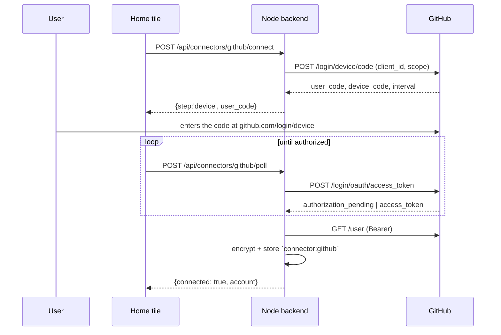
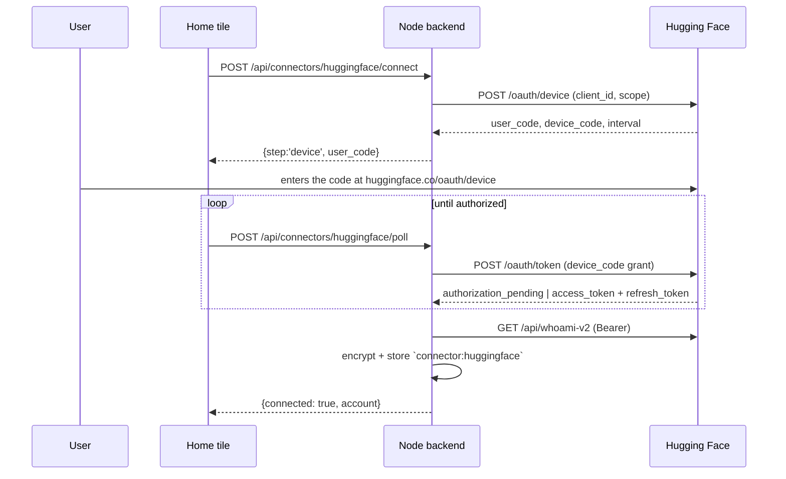

# Module: connectors

External accounts the node holds credentials for — GitHub, Google, an API-key
provider — surfaced as a row of tiles above the ask bar on the home page. One
connector owns three things: **how you connect it**, **the credential** once you
have (held server-side, encrypted, never handed to the browser), and **the agent
tools it unlocks**.

**Status: GitHub + Google implemented.** Backend in `backend/modules/connectors/`,
contract in `backend/sdk/types.py`, frontend in `packages/ui/src/home/` +
`packages/core/src/connectors/api.ts`.

## Why this is not the games sign-in

The games module has had "Sign in with GitHub/Google" for a while, and it cannot
be reused here — it is **identity-only by construction**:

- its OAuth client runs in a **separate process** (`backend/games_server/`,
  deployed to Fly), which holds the client secrets;
- it asks for minimal scopes (`read:user`, `email profile`) with
  `access_type=online`;
- `_finish_github` / `_finish_google` take only the *profile dict* and **discard
  the provider access token**, keeping just enough to mint the game server's own
  player JWT. The `accounts` table has no token column.

Nothing in that path can search GitHub. Connectors are a separate, token-retaining
OAuth client that runs on **this node** — which is also why the credential can stay
local.

## The contract

A connector is contributed through the backend plugin SDK, so a built-in module and
a third-party backend plugin register identically (see
[backend-plugin-sdk](../architecture/backend-plugin-sdk.mdx)):

```python
host.add_connector(Connector(
    id="github",            # MUST equal the agent-tool namespace — see below
    label="GitHub",
    kind="oauth",           # oauth | api-key | custom
    icon="github",          # slug the frontend resolves; unknown -> letter avatar
    blurb="Search code and repositories…",   # one line; doubles as the agent group blurb
    scopes=[ConnectorScope(id="repo", label="Read your repositories", description="…")],
    guide=guide_loader("github"),            # SKILL.md-style agent guide
    status=_status, begin=_begin, poll=_poll, disconnect=_disconnect,
))
```

`Connector.id` **must** equal the prefix of the agent tools it enables
(`github` → `github.searchCode`). The orchestrator derives a tool's group from its
name prefix, so a mismatch silently splits a connector's tools off from its blurb
and guide. A test locks the invariant (`test_connectors.py`).

### One machine, three kinds

`begin` → optionally `submit` → optionally `poll`. A single step shape covers every
kind, which is the point — `custom` is just *a form step that may return another form
step*, so Clubhouse's phone → SMS → connected flow needs no new concepts.

| kind | `begin` returns | then |
| --- | --- | --- |
| `oauth` (device) | `{step:'device', user_code, verification_uri, interval}` | `poll` until `{connected}` |
| `oauth` (redirect) | `{step:'redirect', authorize_url}` | `poll` until `{connected}` |
| `api-key` | `{step:'form', fields:[…]}` | `submit` → `{connected}` |
| `custom` | `{step:'form', fields:[…]}` | `submit` → another form step → `{connected}` |

### Routes

Mounted at `/api/connectors`:

| Route | Purpose |
| --- | --- |
| `GET /` | Every connector + live status — the home tile row |
| `POST /{id}/connect` | Start a flow; returns the first step |
| `POST /{id}/submit` | Answer a `form` step |
| `POST /{id}/poll` | Check an in-flight flow (`{pending: true}` until done) |
| `DELETE /{id}` | Drop the credential (idempotent) |
| `GET /{id}/callback` | A provider's redirect target |

None of these ever return a token. The browser learns *that* an account is
connected, its display name, and which scopes were granted.

## Credential custody

Credentials live in the shared secrets store
(`backend/modules/database/secrets_store.py`) as one Fernet-encrypted record per
connector under `connector:<id>`, holding `access_token`, `refresh_token`,
`expires_at`, `scopes`, and a display-only `account`.

**What the encryption is and isn't worth — stated plainly.** The master key lives on
the same machine as the database, so this is **not** a defense against code running
as you: anything that can read the DB can read the key. What it does defend is the
realistic accident — the data dir being copied somewhere it shouldn't (a cloud-synced
folder, a backup, a screen share). That is exactly why the key is kept **out of
`$HORRIBLE_DATA_DIR`**: co-locating it with the database it decrypts would defeat the
only threat the design covers.

Key resolution: `SECRETS_MASTER_KEY` → `SECRETS_KEY_PATH` → `~/.horrible/secrets.key`
(generated once, owner-only). `SECRETS_KEY_PATH` exists so tests and multi-node dev
setups can isolate the key the way they isolate the data dir.

A record that exists but won't decrypt raises `SecretDecryptError` rather than reading
as absent, and surfaces as `ConnectorStatus.error` — "connected but broken" is a
different thing from "never connected", and collapsing them makes a rotated key look
like an unconfigured integration.

### Client credentials

A **client id is public** by design, so it may be a setting or a shipped default. A
**client secret must never be a setting** — `GET /api/settings` returns the whole bag
to the browser (see [settings](settings.mdx)). Secrets come from the environment or
the secrets store only.

`backend/modules/connectors/config.py` owns this contract for every OAuth connector,
so a provider never re-implements it:

| | Client id | Client secret |
| --- | --- | --- |
| Resolution | `<PROVIDER>_CLIENT_ID` → `connectors.<id>.clientId` setting | `<PROVIDER>_CLIENT_SECRET` → `secrets.db` under `<id>_client_secret` |
| Sent to the browser | yes (it's in every authorize URL) | **never** — not as a value, not as a form prefill |
| Reported in `/api/connectors` | — | only as the boolean `configured` |

### Configuring a client from the UI

An unconfigured connector returns a **`form` step** rather than an `{error}`. An error
string tells you what you'd have to go and do in a terminal; a form lets you do it
where you are. Submitting it persists the credentials and then **chains straight into
the OAuth step** — you fill in the fields and land on the consent screen, rather than
having to press Connect a second time.

- `configurable` / `configured` on `ConnectorModel` drive the tile: an unconfigured
  connector offers **Set up**, a connected one also offers **Reconfigure** (rotate a
  secret, point at a different project). Reconfigure is
  `POST /connectors/<id>/connect` with `{"options": {"reconfigure": true}}` — no new
  route; `begin` already receives options.
- **The environment always wins.** A field pinned by an env var renders with a note
  saying so and its submitted value is *discarded* rather than stored — persisting a
  setting that is never read would be a lie the UI then displays back as if in effect.
- A **blank secret means "leave it alone"**, not "clear it". The form can't prefill a
  secret, so blank cannot be a deliberate erasure — and treating it as one would break
  the connector every time you edited only the client id.

Adding a connector to this: give it a `configured` callable (`Connector.configured`)
and a `submit` that calls `config.apply_config`.

## GitHub

**Device flow**, because GitHub OAuth Apps don't support PKCE — an
authorization-code flow would force shipping a client secret in an app that runs on
the user's machine, which is not a secret. The device flow needs no secret and no
redirect URI, so it also works headless and under Tauri unchanged.



Scopes: `read:user` (identify the account) and `repo` (search code, read files, list
issues — private repos included). GitHub has **no read-only `repo` scope** for OAuth
Apps, so the grant also permits writes; the agent still routes writes through the
permission gate. Configure it **in the app** (the tile's Set up form), or with
`GITHUB_CLIENT_ID` / the `connectors.github.clientId` setting. No client secret is
asked for, because the device flow doesn't use one.

GitHub OAuth App user tokens **don't expire by default**, so `ensure_fresh` is a
no-op for this connector.

### Repo-viewer routes

`github_routes.py` backs the [GitHub viewer](github.mdx) pane. It lives beside the
connector rather than in a `backend/modules/github/` of its own, mirroring
`google_routes.py`: the token is reached through `github_tools._request`, and a separate
module would have to import another module's private helpers.

| Route (under `/api/connectors/github`) | Purpose |
| --- | --- |
| `GET /repos` | the connected user's repositories |
| `GET /search/repos?q=` | repository search |
| `GET /repos/{owner}/{repo}` | metadata, incl. `default_branch` |
| `GET /repos/{owner}/{repo}/branches` | branch names |
| `GET /repos/{owner}/{repo}/tree?ref=` | the whole tree in one request |
| `GET /repos/{owner}/{repo}/contents?path=&ref=` | one directory (lazy fallback) |
| `GET /repos/{owner}/{repo}/file?path=&ref=` | one file's text; backs the `github:` buffer scheme |
| `GET /repos/{owner}/{repo}/readme?ref=` | the README, 404 when there isn't one |

All of them cache (60 s for the repo list, 300 s for refs/trees/files, `?fresh=1` to
bypass) because GitHub allows 5000 requests/hour and browsing is read-heavy and
repetitive. Errors keep `github_tools`' error-as-value convention internally and become
HTTP codes at the boundary: **409** for "not connected" (yours to fix), **502** for
anything upstream.

## Google

**Loopback authorization-code + PKCE**, not the device flow: Google's limited-input
device flow only permits a small allowlist of scopes (`email`/`profile`/`openid` +
YouTube), and `drive.readonly` isn't among them. Register the client as a **Desktop
app** — Google treats that secret as non-confidential and wildcards the loopback port,
so the redirect URI doesn't have to track our dev port.

Scope: `drive.readonly` only. The account is labelled from Drive's own `about.get`,
which reports the signed-in user under that same scope — so no extra `openid`/`email`
scope is needed just to show who's connected.

Configure it **in the app** (the tile's Set up form), or with `GOOGLE_CLIENT_ID` +
`GOOGLE_CLIENT_SECRET`, or the `connectors.google.clientId` setting plus a
`google_client_secret` **secret** (never a setting — see above).

:::warning Publish your consent screen to "In Production"
This is the single setting that decides whether you configure Google once or
**re-authorize every week**.

An app whose consent screen is in **Testing** has all its refresh tokens expire after
**7 days**. Publishing removes that — and you can publish **without verification**: you
get an "unverified app" interstitial and a 100-user cap, neither of which matters for a
personal node.

Verification plus the annual third-party **CASA** assessment only become necessary to
ship `drive.readonly` (a **restricted** scope) publicly to strangers — which is exactly
why v1 is bring-your-own-client. With your own project the data never leaves your
machine and CASA doesn't apply.
:::

A credential that comes back without a refresh token is reported as a *broken*
connection rather than a working one, because it would otherwise stop working an hour
later with no explanation.

`google` tool group: `driveSearch`, `driveRead`, and `syncDrive` (side-effecting — it
writes into a library, so it goes through the permission gate).

### Drive as a browsable root

Beyond the sync, Drive **mounts** into the ordinary file tree: connecting Google makes
a "Google Drive" root appear in the `files.tree` pane, folders expand lazily, and files
open as read-only editor buffers. `backend/modules/connectors/providers/drive_fs.py`
registers a `gdrive:` provider with the files module's virtual-root seam — see
[file explorer → Virtual roots](file-explorer.mdx#virtual-roots) for the mechanism, and
note the path is a **file id**, not a name path, because Drive is an id graph.

### Drive → library sync

`POST /api/connectors/google/sync` (`{library?, full?}`) queues a background task that
walks the Drive, extracts text, and files each document into a library as a `note`
source — so Drive content becomes semantically searchable next to everything else.
`GET /api/connectors/google/sync` reports whether a library has ever synced and how
many files it tracks. The agent can trigger the same thing with `google.syncDrive`.

| Type | Handling |
| --- | --- |
| Google Doc | exported as `text/plain` |
| PDF | parsed with **pypdf** — chosen over PyMuPDF, which is AGPL-3.0 and would make a parser choice into a licensing one |
| `.txt` / `.md` / `.csv` / JSON / HTML | downloaded |
| Sheets, Slides, images | skipped — flattening a spreadsheet to text embeds badly |

**Incremental by default.** The first run does a paginated full crawl and records a
change token (taken *before* the crawl, so edits made during it aren't missed);
later runs read only Drive's `changes` feed. Deleted and trashed files are removed from
the library, so it doesn't fill up with documents that no longer exist.

**One Drive file maps to one source.** A `google_drive_files` table in `app.db` maps
file → source, so a re-sync *replaces* rather than duplicating, and an unchanged file
is skipped without being re-fetched. Sync state (`google_drive_sync`) is per-library
and lives in `app.db` rather than settings — a page token is machine state, not a user
preference.

A file that can't be read (a scanned PDF with no text layer, a password-protected one)
is logged and skipped, never filed as an empty source: a blank source is worse than a
missing one, because it looks like a successful sync.

This module descends from a `backend/modules/integrations/google_sync.py` that was
deleted with the broken OAuth it depended on. It differs in four ways, each of which
was a known gap called out in the original's own comments: PDFs were skipped, there was
no pagination or sync state (only the 20 most recent files), the library was hardcoded,
and it re-filed a duplicate source on every run.

## Hugging Face

**Device flow**, like GitHub — but for a different reason. Hugging Face supports
**public OAuth apps**, created without a client secret, whose device endpoint
authenticates on the client id alone. Same payoff: no secret to ship, no redirect URI to
register, works headless and under Tauri unchanged.

Create the app from **Settings → Connected Apps → Developer Applications → Create App**
([`/settings/connected-applications`](https://huggingface.co/settings/connected-applications)),
choosing **no client secret**, with the `profile`, `read-repos` and `inference-api`
scopes enabled.

:::note
The Hub's docs deep-link to `/settings/applications/new`, but every HF settings page is
auth-gated: logged out, it serves a login form rather than the app, so it reads as a
broken link. Give the navigation path, not the URL — that's what the setup form's help
text now does.
:::

Configure it in the app (the tile's Set up form), or with
`HUGGINGFACE_CLIENT_ID` / the `connectors.huggingface.clientId` setting. An app missing
one of the scopes fails at `POST /oauth/device` with `invalid_scope`; that message is
surfaced verbatim, because the fix is in the user's app settings.

Scopes are deliberately **all read-shaped**: `profile` (name the account), `read-repos`
(read models and datasets, private ones included), `inference-api` (run inference as the
user, billed to their account). The Hub also offers `write-repos` and `manage-repos` —
this connector asks for neither, so a confused agent cannot delete a model.
`test_scopes_are_read_only` is the guard on that.

The one structural difference from GitHub: **these tokens expire.** GitHub OAuth App
user tokens live forever, so `github.py` has no refresher; Hugging Face issues
`hf_oauth_*` access tokens that lapse (8h by default) alongside a refresh token. So
`huggingface.py` implements `_refresh` and `token()` goes through `ensure_fresh` with
it — without that the connection would quietly stop working part-way through a session.
The refresh presents the client id and no secret, as a public app must.



### Models and datasets are separate namespaces

Every repo-taking tool has a `type` (`model` | `dataset`, default `model`), because
`squad` the dataset and a model of the same name are different repos. Getting it wrong
reads as a 404 for something that plainly exists — which is why the guide leads with it.

`huggingface.readFile` bypasses `/api` entirely: file content lives on the
`resolve` CDN path, not the JSON API. It streams and caps at 100 KB so a
multi-gigabyte weights file can't be pulled into memory before we notice it isn't text,
and refuses binaries outright rather than handing the model a page of replacement
characters.

**Gated repos** (Llama, Gemma, …) need the user to accept a licence on the Hub before
any token can read them. `repoInfo` reports `gated`, and a read returns a "gated behind
a licence" error — not something the agent can fix, and the guide says to stop rather
than retry.

## Agent tools + guides

Connector tools are **backend** `AgentTool`s (`backend/sdk`), not frontend-declared
ones: the token is held server-side and the tools must work with no tab attached — a
cron run, the `dash` REPL, `agent.ask_peer`. See
[agent-tools](../architecture/agent-tools.mdx).

`github` group: `searchCode`, `searchRepos`, `listRepos`, `readFile`, `listIssues`.
`google` group: `driveSearch`, `driveRead`, `syncDrive`.
`huggingface` group: `searchModels`, `searchDatasets`, `listRepos`, `repoInfo`,
`readFile`.

Each connector ships a **guide** — a SKILL.md-style markdown file in
`backend/modules/connectors/guides/<id>.md`, disclosed progressively so it costs
nothing on turns that never touch the connector. A guide carries what a tool
description can't: search-qualifier syntax, which argument combinations are useless,
and the provider's own sharp edges (GitHub code search only indexes the default
branch; a bare common word returns nothing without a scope).

The blurb and the guide are two tiers of the same disclosure: `list_tool_groups` shows
the one-line `blurb`, and loading the group delivers the full `guide`.

## The home tile row

`packages/ui/src/home/IntegrationRow.tsx`, between the greeting and the ask bar.
Reuses the `.provider-option` / `.provider-dot` vocabulary so it reads as native to
the page.

- **connected** — full-colour mark, account in the tooltip
- **unconnected** — `grayscale(1)`, 55% opacity, `+` badge
- **error** — full colour with an amber dot; the popover explains
- **backend down** — renders **nothing**. Home already has one backend-down message
  and a second would be noise.

Clicking a tile opens a popover (outside-click + `Escape` to close) showing the
granted scopes and a Disconnect, or the connect flow when unconnected.

The row appears twice: standalone above the ask bar, and as **step 3 of the setup
flow** while nothing is connected — see [Onboarding](onboarding.mdx), which also
explains why the account and the connectors are deliberately separate steps.

State lives in the shared store (`packages/core/src/connectors/store.ts`), not in
this component. Two consequences worth knowing:

- Any pane can ask `useConnector('github')` instead of calling the backend and
  rendering whatever a 409 says, and can wrap itself in `ConnectionGate` to offer
  the connect flow rather than a dead end.
- This row is also the **only** connect UI. `requestConnect(id)` from anywhere
  opens the popover here, so a pane never grows a second copy of the flow.

The popover checks whether the consent page actually opened. A blocked window used
to leave it reading "Finish signing in on the tab that opened" — a claim about a
tab that does not exist — while the poll ran its full expiry against a page nobody
had seen.

## Testing

- `backend/tests/test_connectors.py` — the tile projection, all three kinds, the
  naming invariant, "a token is never in the payload".
- `backend/tests/test_connectors_oauth.py` — state/PKCE rejection, the device flow,
  refresh (including that concurrent callers refresh exactly once).
- `backend/tests/test_connectors_google.py` — the PKCE authorize URL, code exchange,
  refresh, and that a client secret never resolves from settings.
- `backend/tests/test_connectors_huggingface.py` — the device flow, that refresh
  survives a response omitting the refresh token, that the scope set stays read-only,
  and the dataset-namespace / binary-file / gated-repo edges of its tools.
- `backend/tests/test_google_sync.py` — pagination, incremental runs, no duplicate
  sources, removal handling, the configurable library.
- `backend/tests/test_drive_pdf.py` — PDF extraction against real PDF bytes, including
  the scanned-document case.
- `backend/tests/test_secrets_store.py` — key resolution and the decrypt-failure
  contract.
- `packages/core/src/connectors/__tests__/api.test.ts` — the polling loop.

## Web Search

The one connector that is **not** an account — it is key custody for the
[search module's](search.mdx) metered engines: Tavily, Brave, Exa and Serper.

**One connector, four keys**, because a connector's `id` must equal its agent-tool
prefix. Four connectors would mean `tavily.search`, `brave.search`, … — four tool
groups and four catalog blurbs for a single capability, and no provider-agnostic tool
for the model to call. One `search` connector gives one `search.*` group whose engine
is an implementation detail the user can switch without the agent noticing.

The connect flow is a single `form` step with one optional secret field per engine.
There is no `select` field type in the connect-form vocabulary, so engine *choice*
could not live here anyway — and it shouldn't: a vendor's name is public, so
`search.provider` is an ordinary setting. Only the key is secret, and keys are stored
under `search:<provider>` in `secrets.db`, never echoed back into a form prefill or a
status payload.

Environment variables win over stored keys (`SEARCH_TAVILY_API_KEY` and friends). A
pinned field says so in its help text and its submitted value is **discarded** rather
than persisted — storing a value that will never be read is worse than doing nothing,
because it looks like it worked.

:::note `connected` means "you added paid engines", not "search works"
The `search.*` tools are registered unconditionally, and SearXNG and the keyless
DuckDuckGo fallback need no key at all — so search answers queries with this tile
untouched. Conflating the two would push people into paying for something they already
have.
:::

A blank field on reconfigure means "leave it alone", never "clear it". The form cannot
prefill a secret, so blank is the *default* state of a field whose key is already
stored; treating it as a delete would wipe a working key every time someone opened the
tile.
