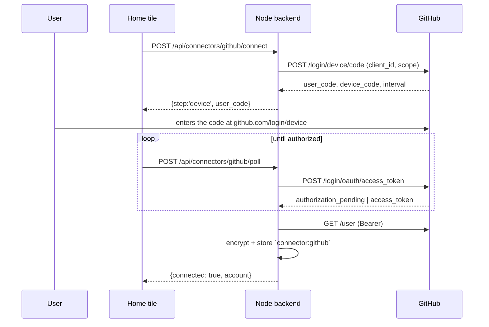

# Module: connectors

External accounts the node holds credentials for — GitHub, Google, an API-key
provider — surfaced as a row of tiles above the ask bar on the home page. One
connector owns three things: **how you connect it**, **the credential** once you
have (held server-side, encrypted, never handed to the browser), and **the agent
tools it unlocks**.

**Status: GitHub + Google implemented.** Backend in `backend/modules/connectors/`,
contract in `backend/sdk/types.py`, frontend in `packages/ui/src/home/` +
`packages/core/src/connectors/api.ts`.

## Why this is not the games sign-in

The games module has had "Sign in with GitHub/Google" for a while, and it cannot
be reused here — it is **identity-only by construction**:

- its OAuth client runs in a **separate process** (`backend/games_server/`,
  deployed to Fly), which holds the client secrets;
- it asks for minimal scopes (`read:user`, `email profile`) with
  `access_type=online`;
- `_finish_github` / `_finish_google` take only the *profile dict* and **discard
  the provider access token**, keeping just enough to mint the game server's own
  player JWT. The `accounts` table has no token column.

Nothing in that path can search GitHub. Connectors are a separate, token-retaining
OAuth client that runs on **this node** — which is also why the credential can stay
local.

## The contract

A connector is contributed through the backend plugin SDK, so a built-in module and
a third-party backend plugin register identically (see
[backend-plugin-sdk](../architecture/backend-plugin-sdk.mdx)):

```python
host.add_connector(Connector(
    id="github",            # MUST equal the agent-tool namespace — see below
    label="GitHub",
    kind="oauth",           # oauth | api-key | custom
    icon="github",          # slug the frontend resolves; unknown -> letter avatar
    blurb="Search code and repositories…",   # one line; doubles as the agent group blurb
    scopes=[ConnectorScope(id="repo", label="Read your repositories", description="…")],
    guide=guide_loader("github"),            # SKILL.md-style agent guide
    status=_status, begin=_begin, poll=_poll, disconnect=_disconnect,
))
```

`Connector.id` **must** equal the prefix of the agent tools it enables
(`github` → `github.searchCode`). The orchestrator derives a tool's group from its
name prefix, so a mismatch silently splits a connector's tools off from its blurb
and guide. A test locks the invariant (`test_connectors.py`).

### One machine, three kinds

`begin` → optionally `submit` → optionally `poll`. A single step shape covers every
kind, which is the point — `custom` is just *a form step that may return another form
step*, so Clubhouse's phone → SMS → connected flow needs no new concepts.

| kind | `begin` returns | then |
| --- | --- | --- |
| `oauth` (device) | `{step:'device', user_code, verification_uri, interval}` | `poll` until `{connected}` |
| `oauth` (redirect) | `{step:'redirect', authorize_url}` | `poll` until `{connected}` |
| `api-key` | `{step:'form', fields:[…]}` | `submit` → `{connected}` |
| `custom` | `{step:'form', fields:[…]}` | `submit` → another form step → `{connected}` |

### Routes

Mounted at `/api/connectors`:

| Route | Purpose |
| --- | --- |
| `GET /` | Every connector + live status — the home tile row |
| `POST /{id}/connect` | Start a flow; returns the first step |
| `POST /{id}/submit` | Answer a `form` step |
| `POST /{id}/poll` | Check an in-flight flow (`{pending: true}` until done) |
| `DELETE /{id}` | Drop the credential (idempotent) |
| `GET /{id}/callback` | A provider's redirect target |

None of these ever return a token. The browser learns *that* an account is
connected, its display name, and which scopes were granted.

## Credential custody

Credentials live in the shared secrets store
(`backend/modules/database/secrets_store.py`) as one Fernet-encrypted record per
connector under `connector:<id>`, holding `access_token`, `refresh_token`,
`expires_at`, `scopes`, and a display-only `account`.

**What the encryption is and isn't worth — stated plainly.** The master key lives on
the same machine as the database, so this is **not** a defense against code running
as you: anything that can read the DB can read the key. What it does defend is the
realistic accident — the data dir being copied somewhere it shouldn't (a cloud-synced
folder, a backup, a screen share). That is exactly why the key is kept **out of
`$HORRIBLE_DATA_DIR`**: co-locating it with the database it decrypts would defeat the
only threat the design covers.

Key resolution: `SECRETS_MASTER_KEY` → `SECRETS_KEY_PATH` → `~/.horrible/secrets.key`
(generated once, owner-only). `SECRETS_KEY_PATH` exists so tests and multi-node dev
setups can isolate the key the way they isolate the data dir.

A record that exists but won't decrypt raises `SecretDecryptError` rather than reading
as absent, and surfaces as `ConnectorStatus.error` — "connected but broken" is a
different thing from "never connected", and collapsing them makes a rotated key look
like an unconfigured integration.

### Client credentials

A **client id is public** by design, so it may be a setting or a shipped default. A
**client secret must never be a setting** — `GET /api/settings` returns the whole bag
to the browser (see [settings](settings.mdx)). Secrets come from the environment or
the secrets store only.

## GitHub

**Device flow**, because GitHub OAuth Apps don't support PKCE — an
authorization-code flow would force shipping a client secret in an app that runs on
the user's machine, which is not a secret. The device flow needs no secret and no
redirect URI, so it also works headless and under Tauri unchanged.



Scopes: `read:user` (identify the account) and `repo` (search code, read files, list
issues — private repos included). GitHub has **no read-only `repo` scope** for OAuth
Apps, so the grant also permits writes; the agent still routes writes through the
permission gate. Configure with `GITHUB_CLIENT_ID` or the
`connectors.github.clientId` setting.

GitHub OAuth App user tokens **don't expire by default**, so `ensure_fresh` is a
no-op for this connector.

## Google

**Loopback authorization-code + PKCE**, not the device flow: Google's limited-input
device flow only permits a small allowlist of scopes (`email`/`profile`/`openid` +
YouTube), and `drive.readonly` isn't among them. Register the client as a **Desktop
app** — Google treats that secret as non-confidential and wildcards the loopback port,
so the redirect URI doesn't have to track our dev port.

Scope: `drive.readonly` only. The account is labelled from Drive's own `about.get`,
which reports the signed-in user under that same scope — so no extra `openid`/`email`
scope is needed just to show who's connected.

Configure with `GOOGLE_CLIENT_ID` + `GOOGLE_CLIENT_SECRET`, or the
`connectors.google.clientId` setting plus a `google_client_secret` **secret** (never a
setting — see above).

:::warning v1 Google is bring-your-own-client
You point this at **your own Google Cloud project**. That isn't a shortcut, it's the
design:

- `drive.readonly` is a Google **restricted** scope. A *published* app using it needs
  Google verification **plus an annual third-party CASA security assessment**.
- An app in **Testing** is capped at 100 hand-added test users, and — the sharper edge
  — **its refresh tokens expire after 7 days**, so you'd reconnect weekly.

With your own project you are your own sole test user, the data never leaves your
machine, and CASA doesn't apply. A credential that comes back without a refresh token
is reported as a *broken* connection rather than a working one, because it would
otherwise stop working an hour later with no explanation.
:::

`google` tool group: `driveSearch`, `driveRead`, and `syncDrive` (side-effecting — it
writes into a library, so it goes through the permission gate).

### Drive → library sync

`POST /api/connectors/google/sync` (`{library?, full?}`) queues a background task that
walks the Drive, extracts text, and files each document into a library as a `note`
source — so Drive content becomes semantically searchable next to everything else.
`GET /api/connectors/google/sync` reports whether a library has ever synced and how
many files it tracks. The agent can trigger the same thing with `google.syncDrive`.

| Type | Handling |
| --- | --- |
| Google Doc | exported as `text/plain` |
| PDF | parsed with **pypdf** — chosen over PyMuPDF, which is AGPL-3.0 and would make a parser choice into a licensing one |
| `.txt` / `.md` / `.csv` / JSON / HTML | downloaded |
| Sheets, Slides, images | skipped — flattening a spreadsheet to text embeds badly |

**Incremental by default.** The first run does a paginated full crawl and records a
change token (taken *before* the crawl, so edits made during it aren't missed);
later runs read only Drive's `changes` feed. Deleted and trashed files are removed from
the library, so it doesn't fill up with documents that no longer exist.

**One Drive file maps to one source.** A `google_drive_files` table in `app.db` maps
file → source, so a re-sync *replaces* rather than duplicating, and an unchanged file
is skipped without being re-fetched. Sync state (`google_drive_sync`) is per-library
and lives in `app.db` rather than settings — a page token is machine state, not a user
preference.

A file that can't be read (a scanned PDF with no text layer, a password-protected one)
is logged and skipped, never filed as an empty source: a blank source is worse than a
missing one, because it looks like a successful sync.

This module descends from a `backend/modules/integrations/google_sync.py` that was
deleted with the broken OAuth it depended on. It differs in four ways, each of which
was a known gap called out in the original's own comments: PDFs were skipped, there was
no pagination or sync state (only the 20 most recent files), the library was hardcoded,
and it re-filed a duplicate source on every run.

## Agent tools + guides

Connector tools are **backend** `AgentTool`s (`backend/sdk`), not frontend-declared
ones: the token is held server-side and the tools must work with no tab attached — a
cron run, the `dash` REPL, `agent.ask_peer`. See
[agent-tools](../architecture/agent-tools.mdx).

`github` group: `searchCode`, `searchRepos`, `listRepos`, `readFile`, `listIssues`.
`google` group: `driveSearch`, `driveRead`, `syncDrive`.

Each connector ships a **guide** — a SKILL.md-style markdown file in
`backend/modules/connectors/guides/<id>.md`, disclosed progressively so it costs
nothing on turns that never touch the connector. A guide carries what a tool
description can't: search-qualifier syntax, which argument combinations are useless,
and the provider's own sharp edges (GitHub code search only indexes the default
branch; a bare common word returns nothing without a scope).

The blurb and the guide are two tiers of the same disclosure: `list_tool_groups` shows
the one-line `blurb`, and loading the group delivers the full `guide`.

## The home tile row

`packages/ui/src/home/IntegrationRow.tsx`, between the greeting and the ask bar.
Reuses the `.provider-option` / `.provider-dot` vocabulary so it reads as native to
the page.

- **connected** — full-colour mark, account in the tooltip
- **unconnected** — `grayscale(1)`, 55% opacity, `+` badge
- **error** — full colour with an amber dot; the popover explains
- **backend down** — renders **nothing**. Home already has one backend-down message
  and a second would be noise.

Clicking a tile opens a popover (outside-click + `Escape` to close) showing the
granted scopes and a Disconnect, or the connect flow when unconnected.

## Testing

- `backend/tests/test_connectors.py` — the tile projection, all three kinds, the
  naming invariant, "a token is never in the payload".
- `backend/tests/test_connectors_oauth.py` — state/PKCE rejection, the device flow,
  refresh (including that concurrent callers refresh exactly once).
- `backend/tests/test_connectors_google.py` — the PKCE authorize URL, code exchange,
  refresh, and that a client secret never resolves from settings.
- `backend/tests/test_google_sync.py` — pagination, incremental runs, no duplicate
  sources, removal handling, the configurable library.
- `backend/tests/test_drive_pdf.py` — PDF extraction against real PDF bytes, including
  the scanned-document case.
- `backend/tests/test_secrets_store.py` — key resolution and the decrypt-failure
  contract.
- `packages/core/src/connectors/__tests__/api.test.ts` — the polling loop.
