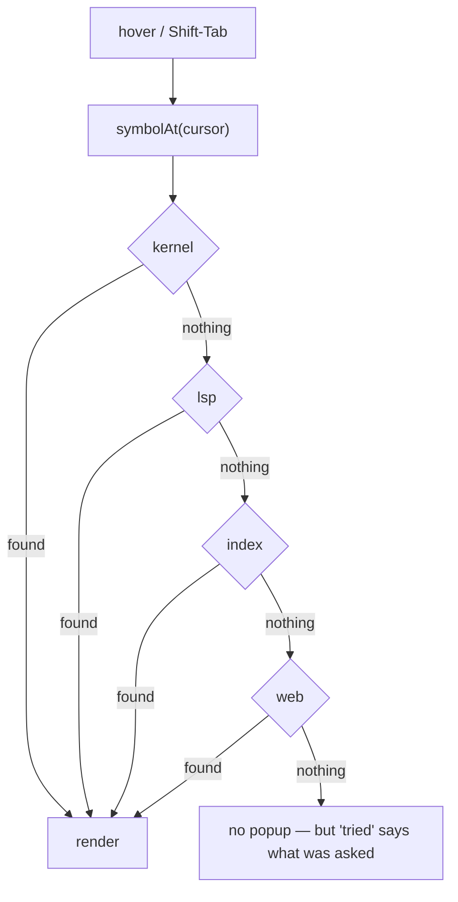

# Documentation popup

Hover a symbol, or press <kbd>Shift</kbd>+<kbd>Tab</kbd>, and get its
documentation — in the editor **and** in notebook cells, which previously had no
completion, hover, or docs of any kind.

## Four sources, ordered by what they know

The module is a **chain**. Each source knows something the others do not, and the
order is a statement about which to believe when they disagree.

| source   | knows                                                | cost           |
| -------- | ---------------------------------------------------- | -------------- |
| `kernel` | the **live** notebook namespace — what `df` really is | a kernel RTT   |
| `lsp`    | the open project, statically                          | a pipe RTT     |
| `index`  | installed packages + stdlib, offline                  | a SQLite query |
| `web`    | prose no docstring contains                           | seconds + an API call |

The chain **stops at the first source that answers**. Three renderings of the same
function is not three times the information.

`kernel` is first because it is the only source that can be *specific*: it asks
the namespace the user is actually working in, so `df.merge` resolves against the
DataFrame that exists rather than against every `merge` ever indexed. It is also
the only one that returns nothing outside a notebook, which is why it is first
rather than only.

`lsp` is resolved **in the frontend** — the LSP client lives there and the backend
is a dumb JSON-RPC pipe. The other three are one `POST /api/docs/lookup`.
Consecutive backend sources are batched into a single request, so the common case
is one round trip.

The editor's existing LSP hover now falls through to the rest of the chain instead
of showing nothing: the language server knows a project's own code and nothing
about a package that is not installed in the interpreter it was started with,
which is most of what people hover.

## Settings

| key                  | default                   | notes |
| -------------------- | ------------------------- | ----- |
| `docs.sources`       | `kernel,lsp,index,web`    | Comma-separated, **in priority order**. Remove a name to disable it. |
| `docs.hover`         | `true`                    | Off keeps the popup on the explicit shortcut only. |
| `docs.webOnHover`    | `false`                   | See below. |
| `docs.hoverDelayMs`  | `400`                     | Advanced. |

`docs.sources` is **one ordered string, not four toggles**: enabling a source and
ranking it are the same decision, and two settings that must agree is a way to end
up with `web` enabled but never reached. An unknown name is dropped rather than
failing the whole setting — it is a hand-edited string, and one typo should cost
that one source.

### Why `web` is off for hover

`web` is the only source that leaves the machine. A measured lookup for
`pandas.DataFrame.merge` took **~7.6 s** and spent a billable search-API call — on
whatever symbol the pointer happened to rest on. So hover drops it unless
`docs.webOnHover` is set; <kbd>Shift</kbd>+<kbd>Tab</kbd> always uses it, because
there the user asked. This is a separate switch rather than a second ordered list,
so it can never disagree with `docs.sources` about priority.

`web` is built on the [search](search.mdx) module rather than on a per-package URL
scheme: `docs.python.org/3/library/<mod>.html` works for the stdlib and for
nothing else, and guessing a readthedocs URL for an arbitrary package is a 404
generator. The result URL rides the same SSRF-guarded reader every other fetched
page does.

## The kernel source, and the threading trap

`inspect_request` is Jupyter's Shift-Tab. Getting it is easy; getting it *safely*
is the work, because all zmq traffic belongs to the session's single worker
thread.

- A lookup is queued as an `_Inspect` carrying its own reply queue, and the worker
  sends it — **including mid-execution**, alongside the widget `comm` drain. A
  docstring you can only read while nothing is running is a docstring you cannot
  read while debugging, which is when you want it.
- Shell replies are routed by **parent msg_id**, not assumed to belong to the read
  that found them. Without that, the execute path's `_await_reply` silently
  swallowed any inspect reply that arrived during a cell run, and the lookup sat
  until its timeout.
- The caller waits on a plain `queue.Queue` through `asyncio.to_thread`. That is
  safe precisely because it touches **no zmq socket** — the rule is that a kernel
  *call* must not run on an executor thread, not that nothing may.
- A dead kernel releases every waiter at once rather than leaving one hanging
  lookup per keypress. The timeout is 3 s: it backs a tooltip, and the caller has
  other sources to fall through to.

IPython renders `inspect_reply` **for a terminal**, so the text arrives full of
ANSI escapes (`\x1b[0;31m`) and a leading `Signature:` line. Both are handled
server-side — stripped, and lifted into the popup's header respectively — rather
than left to render as a literal `[0;31m` in a tooltip.

## Symbol resolution

`symbolAt` takes the **dotted** path, so `pd.DataFrame` resolves as one name: the
index needs the prefix to choose between same-named symbols in different modules.
A trailing dot is trimmed (hovering after `df.` asks about `df`) and so is a
leading one (a continuation line's `.merge` is `merge`).

The index ranks candidates by how much of that prefix the row's module path
accounts for **component by component**. Substring matching looks equivalent and
is not: `pandas.DataFrame.merge` has the prefix `pandas.DataFrame`, which appears
nowhere in the real module `pandas.core.frame` — a substring test scores the right
row zero and returns whichever unrelated `merge` sorted first.

## Rendering

`renderMarkdown` was lifted out of the editor's `lsp.ts` into
`core/src/docs/markdown.ts`. A notebook cell needs the same rendering and has no
language server; importing the editor module to get it would have pulled an LSP
client into a component that will never have one.

Every user-supplied span is HTML-escaped **before** any tag is added. That is the
whole security argument, and it matters more here than for LSP hover alone: a
docstring comes from an installed package, and a `web` body comes from an
arbitrary page.

The popup footer names **which source answered**. That is not decoration — the
same symbol reads differently from a live kernel than from a search result, and a
user who disagrees with the answer needs to know which source to reorder.

## Contributions

- **Settings:** `docs.sources`, `docs.hover`, `docs.webOnHover`,
  `docs.hoverDelayMs`.
- **Backend routes:** `POST /api/docs/lookup`, `POST /api/docs/complete`.
- **Keybinding:** <kbd>Shift</kbd>+<kbd>Tab</kbd> in a notebook cell, registered
  at `Prec.high` so it beats `indentLess` — and it only claims the key when there
  is a symbol under the cursor, so dedent still works everywhere else.
- **Pane:** `docs.reference` ("Python reference", 📚; singleton, `embedded`) — the
  default **Python reference** section of the Docs window (`docviewer.browse`, whose
  other section is **Doc sets**). It was a launcher entry of its own until the pane
  consolidation; `openPanel('docs.reference')` now reveals the section. See below. The popup itself is not a pane: it belongs to whatever is being
  hovered.
- **Commands:** `docs.openReference` (`/pydoc`), `docs.searchReference` (opens the
  reference on the selected text).

## Kernel completion in notebook cells

`POST /api/docs/complete` sends Jupyter's `complete_request` to the notebook's live
kernel. It rides the **same side-queue** as `inspect_request` (`_Inspect` grew a
`kind`): one shell socket, one owner thread, replies routed by msg_id — so it also
answers while a cell is running. Its timeout is shorter (1.5 s) because it sits on
the keystroke path.

`editor/kernelCompletion.ts` is an **extra source** in `buildCompletion`, merged
after the language server's: the server wins any label it offers (it carries types
and docs), and the kernel adds what only runtime knows — `model.` on a loaded
`AutoModelForCausalLM` lists its real submodules, `df.` a real frame's columns.
It is wired into both cell paths: the LSP-backed `cellExtension` and the bare stack
a cell gets when no language server is running.

Two details are load-bearing:

- **No kernel is `unavailable`, never an empty answer.** An empty `kernel` reply
  would read as "this object has no attributes".
- **The kernel's anchor is re-expressed.** The merged list has one `from` (the
  identifier start every source uses), while the kernel reports its own
  `cursor_start` — jedi anchors after the dot, IPython's fallback at the start of
  the dotted expression. `anchorMatches` peels the typed prefix off each match and
  drops any whose typed part disagrees with the document, rather than inserting it
  at the wrong offset.

## The Python reference pane

Hover answers "what is this" and never "what is there": nobody hovers their way to
`torch.nn.utils.clip_grad_norm_` without knowing it exists. `docs.reference` is the
way in — the **standard library**, every **installed package** at its installed
version, and the **dashboard SDKs** (`dash`, `backend.sdk`, `horrible_train`),
browsed as corpus → package → module → member, with search across everything
(`torch.nn.Lin` scopes by module).

It reads the same `code_symbols` rows completion reads, so it needs no index of its
own — see [symdex](./symdex.mdx) for the routes. The page shows:

- the **whole docstring**, read on demand from the defining file by AST, because the
  index keeps only the first paragraph. Docstrings are RST or numpy-style, so they
  are kept as written (pre-wrapped), not run through the markdown renderer;
- a re-exported name **followed to its definition** — the most common search hit is
  a package's `__all__` re-export, which has no docstring of its own;
- an **import line** to copy (none for a `dash` handle, which is a REPL global);
- an **upstream link pinned to the installed version**, labelled with what kind of
  link it is: an exact anchor (docs.python.org), a versioned search (PyTorch, NumPy,
  pandas) or the release's docs (Hugging Face, PyPI). A link to "latest" would show
  arguments the installed version does not have.

The hover popup gains **Open in reference**, through a seam in core
`docs/reference-query.ts` so core infrastructure never imports a module.

## Not done yet
- **Non-Python languages.** `lang` is threaded through and defaults to `python`;
  the index is queried per language, but nothing else has been exercised.
- **No cache across lookups.** The LSP client caches hover per document version;
  the chain does not, so a repeated `web` lookup pays again.
