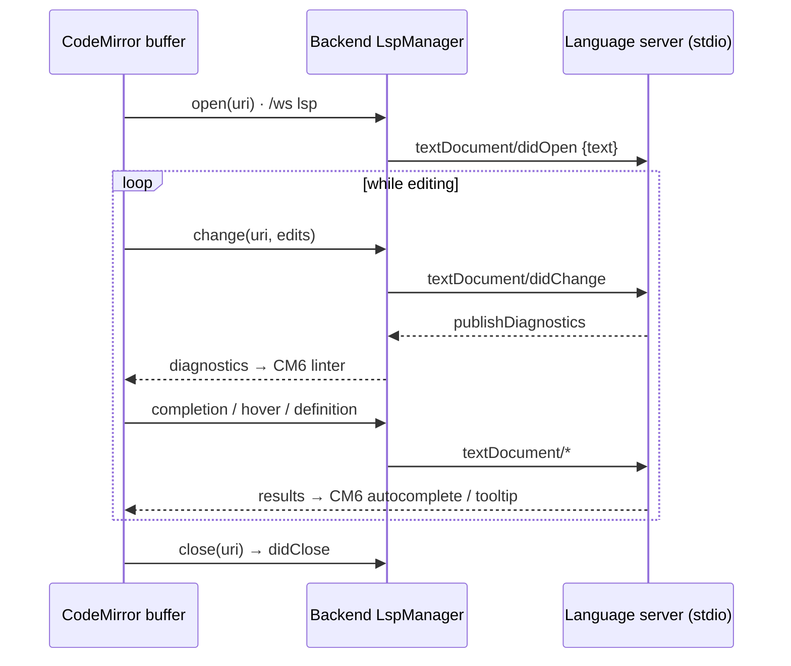

# Module: editor / notes buffers

The emacs-like editing core: markdown/text buffers with command-palette-driven
editing. Also the rendering target other modules use to open text (file explorer
opens files into editor buffers).

**Status: buffer panel + source model implemented (C1).** The `editor.buffer`
panel (CodeMirror 6) and the URI source model ship; `openBuffer(source)` opens (or
focuses) a buffer for a `note:`/`workspace-file:` source, loading via the backend
and saving back (notes carry the revision for conflict detection). The public
command surface and the keybinding-service keymap (C3), agent tools (C4), and the
`editor.recentNotes` dashboard widget (C5) all ship.

**Engine: [CodeMirror 6](https://codemirror.dev).** Lean, extensible, and
emacs-friendly — code-aware (syntax highlighting, markdown) without pulling in a
full IDE. No language-server/IntelliSense in v1; that is a later addition. The CM6
keymap is exposed through the shell keybinding service so bindings stay rebindable
— editing key handlers are never hardcoded in the component.

## Contributions to the layout shell

- **Panels:** `editor.buffer` (one panel instance per open buffer, default:
  center tab group). Buffer tabs are workspace tabs — the shell owns tab UX, the
  editor owns content. The pane receives its `source` via pane params
  (`usePaneParams`); the instance id is derived from the source so reopening the
  same file/note focuses the existing buffer (generic windowing support added with
  `openPanel(id, { instanceId, params })`).
- **Commands (C3):** `editor.newNote` (create + open a note), `editor.save`,
  `editor.saveAll`. `mod+s` is a default **keybinding → `editor.save`** routed
  through the shell keybinding service — the buffer has no hardcoded save handler,
  so the key stays rebindable. (`editor.open` quick-open is still to come.)
- **Services for other modules:** `editor.openBuffer(source)` is the public way
  any module shows editable text. Sources are URIs (`note:`, `workspace-file:`,
  `osfile:` on desktop) so the buffer layer doesn't care where content lives.
- **Dashboard widgets:** `editor.recentNotes` — the most-recently-updated notes
  (`GET /notes`); click a row to open it as a `note:` buffer, with a "New note"
  affordance. Refreshes on window focus so notes created/saved elsewhere appear.

## Backend surface

`backend/modules/notes/` — **note storage implemented**: CRUD + search over
backend-owned notes (`GET/POST /notes`, `GET/PUT/DELETE /notes/{id}`,
`GET /notes/search`). Notes are identical everywhere; the editor opens them as
`note:<id>` buffers. **Autosave and conflict handling** share one path: a save
sends the `base_revision` the editor loaded, and a stale save returns `409` with
the current note (`{message, current}`) so the client reconciles. Workspace-file
read/write is the [file explorer](file-explorer.mdx)'s `GET /files/read` /
`PUT /files/write` (`workspace-file:` buffers), so the editor's buffer layer is
URI-agnostic.

## Agent integration

**Status: implemented (C4).** Declared on the `editor.buffer` panel; a live buffer
controller registry (keyed by source URI) lets the type-level tools act on a
specific open buffer. Verified live: the agent replaced an open buffer's content
via `editor.applyEdit`. The editor exposes
[agent tools & `getAgentContext`](../architecture/agent-tools.mdx):

- **Read (ungated):** the active buffer's uri, full text, selection, dirty state,
  and live LSP **diagnostics** via the pane's `getAgentContext()` snapshot; plus the
  `editor.getDiagnostics(uri)` and `editor.findReferences(...)` read tools (the
  latter backed by LSP `references`).
- **Gated:** `editor.proposeEdit(uri, content)`, `editor.applyEdit(uri, content)`,
  `editor.rename(...)` (LSP symbol rename, applied across files), and
  `editor.save(uri)`, matched by the same filesystem `Edit`/`files.write` rules
  the tree uses. All auto-allow under the `acceptEdits` mode (Claude Code parity).
  See the [permission system](../architecture/agent-tools.mdx#the-permission-system).

Because sources are URIs, the agent (like any module) shows editable text through
the single `editor.openBuffer(source)` seam regardless of where the content lives.

### Accept/decline proposed edits

For any code change (format, rewrite, fix) the agent is steered to
`editor.proposeEdit` rather than `editor.applyEdit`: instead of replacing the
content outright, the buffer enters a **diff/review state** (a `@codemirror/merge`
`unifiedMergeView`, original vs proposed, with per-chunk accept/reject in the
gutter) and shows an **Accept / Decline** bar. Accept keeps the proposed content
and marks the buffer dirty; Decline restores the pre-proposal text. The tool is in
`EDIT_SAFE_TOOLS` because the in-editor review — not the permission gate — is the
real safety boundary. Buffer controllers gain a `propose(content)` method
(`buffers.ts`), driven from `BufferView.tsx`.

### Inline autosuggest

Opt-in, off by default — the `editor.autosuggest` setting. When on, after a typing
pause the buffer requests a short fill-in completion (`POST /api/agent/complete`,
the local model via `providers.generate`) and renders it as ghost text at the
cursor; **Tab** accepts, **Esc** dismisses. In-flight requests are debounced and
cancelled on further typing; suggestions are suppressed while an edit proposal is
under review. The CodeMirror extension is `autosuggest.ts`, toggled live via a
compartment in `BufferView.tsx`.

## Language intelligence (LSP) & deeper agent editing

**Status: spine implemented (diagnostics, completion, hover, go-to-definition); the
rest is design.** The road from "buffer over a URI source" to a real code editor. The organizing idea is **three
stacked intelligence layers**, each with a different latency and authority — they
coexist (they don't replace one another), the way VS Code runs IntelliSense and
Copilot side by side:

| Layer       | Source                          | Provides                                                              | Latency        |
| ----------- | ------------------------------- | -------------------------------------------------------------------- | -------------- |
| **L1 local** | CodeMirror in the browser       | syntax, brackets, search/replace, multi-cursor, indentation          | instant        |
| **L2 LSP**   | backend language-server process | diagnostics, completion list, hover, go-to-def, references, rename, format | ~10–100 ms |
| **L3 LLM**   | backend local model             | inline ghost text + agent edits, **grounded by L2**                  | ~0.1–n s       |

L3 ships (the ghost-text autosuggest above + the agent edit tools). L1 is mostly
CodeMirror's `basicSetup`. **L2 (LSP) now covers** the transport plus
**diagnostics**, **completion**, **hover**, **go-to-definition**, **rename**, and
**references** — with formatting layering onto the same pipe next. L2 also now
**grounds L3**: the ghost-text prompt and the agent both read LSP state (see below).

### Where the LSP runs: the backend, over a `/ws` `lsp` channel (implemented)

Same rule as the agent orchestrator and the terminal PTY (see
[windowing](../architecture/windowing.mdx) and [terminal](terminal.mdx)): the
browser can't spawn `pylsp`/`typescript-language-server`, both layouts must share
one path, and with a remote backend the server must run **where the files are**.

The key design choice: the **backend is a dumb JSON-RPC pipe**, and the **frontend
is the LSP client**. `LspManager` (`backend/modules/lsp/manager.py`, mirroring
`terminal/manager.py`) spawns a server per buffer session — chosen from a fixed
`languageId → command` registry so the channel can't run arbitrary processes — and
translates LSP's `Content-Length` framing ↔ discrete `lsp`-channel messages
(`start`/`rpc`/`stop` ↔ `started`/`rpc`/`exit`/`error`). It never parses LSP
semantics, so every future capability flows through the one pipe with **no backend
change**. The server is spawned with a blocking `subprocess.Popen` and its stdio is
pumped on a per-session daemon thread (reads relayed to the socket via
`run_coroutine_threadsafe`), **not** `asyncio.create_subprocess_exec` — that asyncio
API needs the `ProactorEventLoop`, but uvicorn runs the app on the `SelectorEventLoop`
under `--reload`/`--workers>1`, where it raises `NotImplementedError`. The thread
approach is loop-agnostic, so servers spawn automatically regardless of how the
backend was launched (the terminal PTY is already loop-agnostic the same way — a PTY
library with blocking reads offloaded via `asyncio.to_thread`). The frontend client lives in `editor/lsp.ts` (a CodeMirror extension wired
through a compartment in `BufferView.tsx`): it renders `publishDiagnostics` via
`@codemirror/lint`, serves `textDocument/completion` as a `@codemirror/autocomplete`
source, shows `textDocument/hover` in a CodeMirror hover tooltip, binds **F12**
to `textDocument/definition` (same-file jumps move the cursor; cross-file jumps open
the target via the editor's `openBuffer` and reveal it in the tree), and binds **F2**
to `textDocument/rename`. Request-shaped
methods use JSON-RPC id correlation; same-file detection normalizes `file://` URIs
(servers vary in drive-letter case). Servers spawn only when present on `PATH` (else the editor
silently degrades); the registry currently maps `python → pylsp` (needs `pyflakes`/
`pycodestyle` installed to emit diagnostics), `typescript`/`javascript →
typescript-language-server`, and `rust → rust-analyzer`.

A small **by-URI registry** (`editor/lsp-registry.ts`, keyed by the buffer's
`workspace-file:` source URI — the same key the [agent edit tools](#agent-integration)
use) is the seam the agent reaches LSP through without touching CodeMirror: the live
client records its latest **diagnostics** there and registers a handle exposing
**rename**, **find-references**, and ghost-text **grounding**. A rename's
`WorkspaceEdit` is applied across files — the live buffer is edited in place, other
open buffers update through their controller, and closed files are loaded, edited,
and saved.

The buffer — not the file on disk — is the source of truth while open, so the
**document-sync lifecycle** matters:

`workspace-file:` URIs map directly to real paths the server roots on; `note:` and
`osfile:` get no LSP (only `workspace-file:` buffers with a known language do). Sync
is **full-text `didChange`** (debounced) for now — simple and correct; incremental is
a later optimization. LSP capabilities map onto CodeMirror:
completion → autocomplete source, `publishDiagnostics` → linter, hover → tooltip,
definition → a jump that opens a `workspace-file:` buffer and reveals it in the tree.

### Range edits replace full-content edits

`editor.proposeEdit`/`applyEdit` today take the **whole new buffer**. That doesn't
scale to real files: it blows a local model's context and forces it to reproduce
code verbatim. The plan is anchored, search/replace-style edits
(`proposeEdit(uri, edits: {find, replace}[])`, full-content kept as a fallback). The
existing accept/decline `unifiedMergeView` renders them per-chunk unchanged — only
the tool payload narrows from "whole doc" to surgical edits. This is what lets the
agent edit a large file with a small local model.

### LSP-grounded ghost text

**Status: implemented.** The ghost-text prompt was `prefix<CURSOR>suffix`; it is now
enriched with **L2 context** — the LSP's completion candidates in scope and the
hover type/signature at the cursor — so the local model suggests code that actually
resolves instead of hallucinating symbols. Before each `/agent/complete` request the
buffer pulls `grounding(offset)` from its LSP client (a parallel
`completion`+`hover` round-trip), and `CompleteRequest` carries the `completions`
list and `hover` text into the prompt (`_grounding` in `routes.py`). Only code
buffers with a server get grounded; notes fall back to the plain prompt. The split
stays clean: **LSP drives the dropdown completion list, the LLM drives multi-token
inline ghost text**, now grounded. (A dedicated small code model for
`/agent/complete` is worth considering — see [agent chat](agent-chat.mdx).)

### The agent reading & watching the buffer

- **Passive (read) — implemented:** the buffer's LSP **diagnostics** are in
  `getAgentContext` (the buffer snapshot's `diagnostics`) **and** behind a
  `editor.getDiagnostics(uri)` read tool, so the agent sees the errors it causes and
  self-corrects — the highest-leverage agent-editor upgrade. 1-based line/column,
  plain severity.
- **Agent-as-LSP-client tools — implemented:** `editor.rename` and
  `editor.findReferences` backed by LSP `rename`/`references` — correct, scope-aware
  cross-file edits instead of regex. Both take a `symbol` name (first occurrence) or
  an explicit 1-based `line`/`column`. Reads (`getDiagnostics`/`findReferences`)
  ungated; `rename` is gated like `applyEdit` (in `EDIT_SAFE_TOOLS`, so it
  auto-allows under `acceptEdits`) — it is a language-server **symbol** rename, a
  scoped refactor, not a filesystem rename. `editor.format` (LSP `formatting`) is the
  remaining one.
- **Proactive (opt-in) — design:** an `editor.agentWatch` mode where each
  `didChange → publishDiagnostics` with errors pings the orchestrator with the
  diagnostic + surrounding code; it may `proposeEdit` a fix (suggest, never
  auto-apply). Gated, off by default.

## Browser vs desktop

Editing notes and workspace files is identical in both layouts. The difference
is **which files you can reach**:

| Concern              | Browser                                          | Desktop                                  |
| -------------------- | ------------------------------------------------ | ---------------------------------------- |
| Notes                | full                                             | full                                     |
| Workspace files      | full — read/write through the backend FS API     | full — same path                         |
| Arbitrary OS files   | no (`fs.nativeDialogs` absent; File System Access API deliberately not used for v1) | native open/save dialogs via Tauri; opened as `osfile:` buffers |
| Drag a file onto app | imports content as a new note                    | opens the file as a buffer               |

Remember the layout-shell rule: with a remote backend in the browser,
"workspace files" are files on the backend host.
