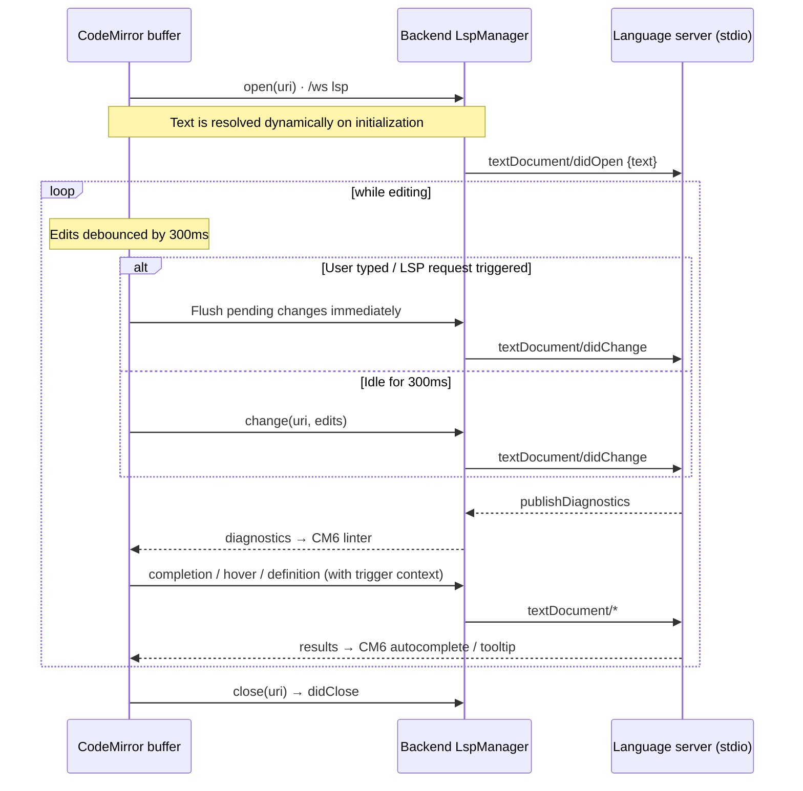

# Module: editor / notes buffers

The emacs-like editing core: markdown/text buffers with command-palette-driven
editing. Also the rendering target other modules use to open text (file explorer
opens files into editor buffers).

**Status: buffer panel + source model implemented (C1).** The `editor.buffer`
panel (CodeMirror 6) and the URI source model ship; `openBuffer(source)` opens (or
focuses) a buffer for a `note:`/`workspace-file:` source, loading via the backend
and saving back (notes carry the revision for conflict detection). The public
command surface and the keybinding-service keymap (C3), agent tools (C4), and the
`editor.recentNotes` dashboard widget (C5) all ship.

**Engine: [CodeMirror 6](https://codemirror.dev).** Lean, extensible, and
emacs-friendly — code-aware (syntax highlighting, markdown) without pulling in a
full IDE. IntelliSense **ships**: the layered completion stack below (LSP spine +
DB symbol index + curated imports) plus hover, diagnostics, go-to-definition,
rename, and references. The CM6 keymap is exposed through the shell keybinding
service so bindings stay rebindable — editing key handlers are never hardcoded in
the component.

## Contributions to the layout shell

- **Panels:** `editor.buffer` (one panel instance per open buffer, default:
  center tab group). Buffer tabs are workspace tabs — the shell owns tab UX, the
  editor owns content. The pane receives its `source` via pane params
  (`usePaneParams`); the instance id is derived from the source so reopening the
  same file/note focuses the existing buffer (generic windowing support added with
  `openPanel(id, { instanceId, params })`).
- **Commands (C3):** `editor.newNote` (create + open a note, `/new`),
  `editor.save` (`/save`), `editor.saveAs` (`/save-as`), `editor.saveAll`
  (`/save-all`), `editor.visualizeBuffer` (open the active buffer in the
  visualizer, inferring the engine from its language). The `/…` names are the
  **minibuffer** slash forms (see
  [windowing.mdx](../architecture/windowing.mdx#the-minibuffer)) — and because
  Save As is a `dialogs.prompt()`, it asks for the path *in the minibuffer*
  rather than a modal. `editor.saveAs` reaches the live CodeMirror view through
  a module-level `setActiveSaveAs` published by the focused `BufferView`, the
  same pattern the browser uses for its URL-bar focuser. `mod+s` is a default
  **keybinding → `editor.save`** routed through the shell keybinding service — the
  buffer has no hardcoded save handler, so the key stays rebindable. (`editor.open`
  quick-open is still to come.) App-level keys route through the shell service;
  **editor-internal keys are CodeMirror keymaps scoped to the view** (they act on
  cursor/selection state, so a global command can't express them): **Tab** accepts an
  open completion popup, else indents (**Shift-Tab** dedents); **F12** go-to-definition
  and **F2** rename (see the LSP section); **Tab**/**Esc** accept/dismiss inline
  autosuggest at higher precedence. Binding Tab is deliberate — `basicSetup` leaves it
  unbound for accessibility, which made it escape to the browser's focus traversal
  instead of indenting.
- **Services for other modules:** `editor.openBuffer(source, { language? })` is the
  public way any module shows editable text. Sources are URIs (`note:`,
  `workspace-file:`, `gdrive:`, `github:`, `osfile:` on desktop) so the buffer layer
  doesn't care where
  content lives; an optional `language` param highlights extensionless sources (notes).
  Reopening a source **focuses** its existing buffer rather than duplicating it (the
  pane's instance id is derived from the source URI), and opening from a **blank,
  unmodified** buffer **reuses that pane in place** — a placeholder editor holds
  nothing worth preserving, so notes opened from the Recent-notes region land in the
  editor you are looking at instead of splitting off a second one. Reuse goes through
  the frame engine's `retargetPane` (see
  [windowing](../architecture/windowing.mdx)), which keeps the pane's area, tab
  position, and region strips.
  For richer cross-module use, the editor also registers an **`editor` service** on the
  registry (`registry.getService('editor')`, from `service.ts`) — `openBufferFromContent`
  (materialize content as a note or `scratch/` file), `getBufferContent` (live, or the
  persisted bytes via `loadSource` when the tab is unmounted), `peekBufferContent` (sync,
  live-only), `setBufferContent`, `getActiveBufferSource`, and `listBuffers`. The
  visualizer uses this to bridge templates ⇄ buffers (see
  [visualizer › Editor integration](visualizer.mdx#editor-integration)).
- **Dashboard widgets:** `editor.recentNotes` — the most-recently-updated notes
  (`GET /notes`); click a row to open it as a `note:` buffer, with a "New note"
  affordance. Refreshes on window focus so notes created/saved elsewhere appear.

## Backend surface

`backend/modules/notes/` — **note storage implemented**: CRUD + search over
backend-owned notes (`GET/POST /notes`, `GET/PUT/DELETE /notes/{id}`,
`GET /notes/search`). Notes are identical everywhere; the editor opens them as
`note:<id>` buffers. **Autosave and conflict handling** share one path: a save
sends the `base_revision` the editor loaded, and a stale save returns `409` with
the current note (`{message, current}`) so the client reconciles. Workspace-file
read/write is the [file explorer](file-explorer.mdx)'s `GET /files/read` /
`PUT /files/write` (`workspace-file:` buffers), so the editor's buffer layer is
URI-agnostic.

### Read-only sources

Some sources can be read but not written back. `loadSource` sets `readOnly` on the
result and `BufferView` reconfigures a CodeMirror `Compartment` to
`EditorState.readOnly`, replacing the Save button with a **Read-only** badge — so the
absence of Save reads as a property of the source rather than a missing control.
`saveSource` also throws for them, as a backstop against a caller going around the
editor.

Enforcing it in the editor rather than at each call site is the point: a read-only
buffer can never go dirty, so the close guard, the dirty marker, and the autosave path
all no-op without needing to know about any particular provider.

| Scheme | Backed by | Notes |
| --- | --- | --- |
| `gdrive:/<fileId>` | `GET /files/read` via the Drive [virtual root](file-explorer.mdx#virtual-roots) | Docs exported to text, PDFs extracted; the title arrives with the content, since the path is an id |
| `github:<owner>/<repo>@<ref>/<path>` | `GET /connectors/github/…/file` | opened from the [GitHub viewer](github.mdx) |

Both inherit tabs, splits, find, and CodeMirror syntax highlighting, which is why
neither the Drive mount nor the GitHub viewer ships a file viewer of its own.

### Unsaved-changes guard on close

Closing a buffer with unsaved edits prompts before discarding them, VS Code-style.
The mechanism is a generic **pane close guard** in the frame engine
(`layout/close-guards.ts`): a pane registers `registerCloseGuard(instanceId, fn)`,
and every close path — the area-menu **Close pane**, the dock/floating **✕**, and
`LayoutController.closePane` (so agent-driven closes are covered too) — routes
through `closePaneGuarded`, which runs the guard and only dispatches `REMOVE_PANE`
when it resolves `true`. `BufferView` registers a guard that, when the buffer is
dirty, shows a `dialogs.choice(...)` prompt mirroring VS Code's exactly — _"Do you
want to save the changes you made to_ `{title}`_?"_ / _"Your changes will be lost
if you don't save."_ — with **Save** (default) / **Don't Save** / **Cancel**. The save
must succeed for the close to proceed; a failed or cancelled save keeps the buffer
open. Like VS Code there's no separate "Save As…" button: a **sourceless (untitled)
buffer has nowhere to write, so its Save falls through to the Save As flow** —
`saveAs()` prompts for a destination (a `workspace-file:` path, or a new `note:`
for note/untitled buffers) and writes there without re-pointing the closing buffer.
`dialogs.choice` is the general multi-button dialog kind (alongside
`prompt`/`confirm`); the `<Dialogs />` component renders it.

Closing the whole tab/window is guarded separately: dirty buffers flag themselves
via `setPaneDirty`, and a `beforeunload` handler triggers the browser's native
unsaved-changes prompt when `anyPaneDirty()` — the async choice dialog can't run
during unload. (A native Tauri window-close confirmation can gate on the same flag.)

## Agent integration

**Status: implemented (C4).** Declared on the `editor.buffer` panel; a live buffer
controller registry (keyed by source URI) lets the type-level tools act on a
specific open buffer. Verified live: the agent replaced an open buffer's content
via `editor.applyEdit`. The editor exposes
[agent tools & `getAgentContext`](../architecture/agent-tools.mdx):

- **Read (ungated):** the active buffer's uri, full text, selection, dirty state,
  and live LSP **diagnostics** via the pane's `getAgentContext()` snapshot; plus the
  `editor.getDiagnostics(uri)` and `editor.findReferences(...)` read tools (the
  latter backed by LSP `references`).
- **Gated:** `editor.proposeEdit(uri, content)`, `editor.applyEdit(uri, content)`,
  `editor.rename(...)` (LSP symbol rename, applied across files), and
  `editor.save(uri)`, matched by the same filesystem `Edit`/`files.write` rules
  the tree uses. All auto-allow under the `acceptEdits` mode (Claude Code parity).
  See the [permission system](../architecture/agent-tools.mdx#the-permission-system).

Because sources are URIs, the agent (like any module) shows editable text through
the single `editor.openBuffer(source)` seam regardless of where the content lives.

### Accept/decline proposed edits

For any code change (format, rewrite, fix) the agent is steered to
`editor.proposeEdit` rather than `editor.applyEdit`: instead of replacing the
content outright, the buffer enters a **diff/review state** (a `@codemirror/merge`
`unifiedMergeView`, original vs proposed, with per-chunk accept/reject in the
gutter) and shows an **Accept / Decline** bar. Accept keeps the proposed content
and marks the buffer dirty; Decline restores the pre-proposal text. The tool is in
`EDIT_SAFE_TOOLS` because the in-editor review — not the permission gate — is the
real safety boundary. Buffer controllers gain a `propose(content)` method
(`buffers.ts`), driven from `BufferView.tsx`.

### Inline autosuggest

Opt-in, off by default — the `editor.autosuggest` setting. When on, after a typing
pause the buffer shows ghost text at the cursor; **Tab** accepts, **Esc**
dismisses. **The suggestion is a prefix lookup into the DB symbol index** (the tail
of the single best-matching symbol for the token under the cursor — see
[Completion is a database lookup](#completion-is-a-database-lookup)), **not a
model** — so there's no round-trip latency and no hallucinated multi-line guesses.
In-flight requests are debounced and cancelled on further typing; suggestions are
suppressed while an edit proposal is under review. The CodeMirror extension is
`autosuggest.ts` (ghost-text rendering + Tab/Esc), its `fetch` wired to
`dbGhostFetch` in `symbolCompletion.ts`; toggled live via a compartment in
`BufferView.tsx`. (The old model path — `POST /api/agent/complete` via
`providers.generate` — is no longer in the completion loop; the model is reserved
for the agent/orchestrator's deliberate edits.)

## Language intelligence (LSP) & deeper agent editing

**Status: spine implemented (diagnostics, completion, hover, go-to-definition); the
rest is design.** The road from "buffer over a URI source" to a real code editor. The organizing idea is **three
stacked intelligence layers**, each with a different latency and authority — they
coexist (they don't replace one another), the way VS Code runs IntelliSense and
Copilot side by side:

| Layer       | Source                          | Provides                                                              | Latency        |
| ----------- | ------------------------------- | -------------------------------------------------------------------- | -------------- |
| **L1 local** | CodeMirror in the browser       | syntax, brackets, search/replace, multi-cursor, indentation          | instant        |
| **L1.5 DB**  | backend symbol index (SQLite)   | prefix completions (dropdown + ghost text) from a `code_symbols` table | sub-ms (indexed SQL) |
| **L2 LSP**   | backend language-server process | diagnostics, type-aware/member completion, hover, go-to-def, references, rename, format | ~10–100 ms |
| **L3 LLM**   | backend local model             | agent/orchestrator edits (read, rename, alter, format selection) — **not** completion | ~0.1–n s       |

L1 is mostly CodeMirror's `basicSetup`. **L1.5** is the DB symbol lookup that backs
both completion surfaces (see [below](#completion-is-a-database-lookup)) —
**enriched by [symdex](symdex.mdx)**: the package-symbol harvest projects each
indexed API's signature and first docstring paragraph into `code_symbols`
(`doc` column, source `pkg:<dist>`), so suggestions for framework symbols show a
doc panel (`info` on the completion item) from the same single SQLite request —
no embedding lookup ever sits on the keystroke path. **L2 (LSP) covers** the
transport plus **diagnostics**, **type-aware completion**, **hover**,
**go-to-definition**, **rename**, and **references** — with formatting layering
onto the same pipe next. **L3 (the model) is no longer in the completion loop**:
it drives the agent/orchestrator's deliberate edits, not typeahead.

### Where the LSP runs: the backend, over a `/ws` `lsp` channel (implemented)

Same rule as the agent orchestrator and the terminal PTY (see
[windowing](../architecture/windowing.mdx) and [terminal](terminal.mdx)): the
browser can't spawn `pylsp`/`typescript-language-server`, both layouts must share
one path, and with a remote backend the server must run **where the files are**.

The key design choice: the **backend is a dumb JSON-RPC pipe**, and the **frontend
is the LSP client**. `LspManager` (`backend/modules/lsp/manager.py`, mirroring
`terminal/manager.py`) spawns one server per **session** — chosen from a fixed
`languageId → command` registry so the channel can't run arbitrary processes — and
translates LSP's `Content-Length` framing ↔ discrete `lsp`-channel messages
(`start`/`rpc`/`stop` ↔ `started`/`rpc`/`exit`/`error`). It never parses LSP
semantics, so every future capability flows through the one pipe with **no backend
change**. The server is spawned with a blocking `subprocess.Popen` and its stdio is
pumped on a per-session daemon thread (reads relayed to the socket via
`run_coroutine_threadsafe`), **not** `asyncio.create_subprocess_exec` — that asyncio
API needs the `ProactorEventLoop`, but uvicorn runs the app on the `SelectorEventLoop`
under `--reload`/`--workers>1`, where it raises `NotImplementedError`. The thread
approach is loop-agnostic, so servers spawn automatically regardless of how the
backend was launched (the terminal PTY is already loop-agnostic the same way — a PTY
library with blocking reads offloaded via `asyncio.to_thread`). The frontend client lives in `editor/lsp.ts` (a CodeMirror extension wired
through a compartment in `BufferView.tsx`): it renders `publishDiagnostics` via
`@codemirror/lint`, serves `textDocument/completion` as a `@codemirror/autocomplete`
source, shows `textDocument/hover` in a CodeMirror hover tooltip, binds **F12**
to `textDocument/definition` (same-file jumps move the cursor; cross-file jumps open
the target via the editor's `openBuffer` and reveal it in the tree), and binds **F2**
to `textDocument/rename`. Request-shaped
methods use JSON-RPC id correlation; same-file detection normalizes `file://` URIs
(servers vary in drive-letter case).

**IntelliSense depth (implemented).** Completion is a full IDE experience, not a bare
name list: each item carries a **documentation pane** fetched lazily via
`completionItem/resolve` when it's focused, and **function/snippet items expand their
placeholders** (`insertTextFormat: 2` → CodeMirror `snippetCompletion`). The list
**auto-opens on the server's trigger characters** (e.g. `.` for members — captured
from the initialize response's `completionProvider.triggerCharacters`), matching VS
Code rather than waiting for the next word character. Both the doc pane and the hover
tooltip **render markdown** (code blocks, bold, lists) through a small self-contained
`renderMarkdown` helper — HTML-escaped first, so a docstring can't inject markup.
Completion, resolve, and hover results are **cached per document version** and cleared
on every debounced `didChange`, so re-opening a dropdown or re-hovering the same spot
doesn't re-hit the server.

Servers spawn only when present on `PATH` (else the editor silently degrades); each
language maps to an **ordered list of candidate servers** — the first whose executable
resolves wins. Python prefers **`basedpyright`** (`basedpyright-langserver --stdio`;
MIT-licensed pyright fork with Pylance-grade completions, hover docstrings, and inlay
hints — install with `uv add --dev basedpyright`) and falls back to **`pylsp`** (needs
`pyflakes`/`pycodestyle` for diagnostics) when basedpyright isn't installed. Pylance
itself is not an option — its licence restricts it to official Microsoft VS Code
builds. `typescript`/`javascript → typescript-language-server`, and `rust →
rust-analyzer`.

**Which interpreter Python resolves against.** stdlib (`os.`, …) resolves from
basedpyright's bundled typeshed, but third-party imports (`torch`, `numpy`, …) only
complete when the server is pointed at a real interpreter whose site-packages holds
them. The client tells basedpyright which one by **answering `workspace/configuration`**
(it advertises `workspace.configuration` and replies with `python.pythonPath` +
`analysis` knobs; other server→client requests get a `null` ack so nothing stalls). The
path is resolved per file: the backend (`backend/modules/lsp/pyenv.py`,
`resolve_python_interpreter`) walks up from the file for a `.venv`/`venv` (the app's venv
convention, shared with training), else the **system default** interpreter (the `py`
launcher on Windows, `python3`/`python` elsewhere — never the backend's own venv), and
sends it on the `started` event. The **`editor.pythonPath`** setting overrides it. The
interpreter is resolved when a buffer opens; changing the setting (or adding a venv)
takes effect on reopen.

**One shared server per interpreter+project.** The frontend LSP client is **pooled**:
buffers with the same `${languageId}::${projectRoot}::${interpreter}` key share a single
`LspSession` (`editor/lsp.ts`) — one `start`/`sessionId`, so the backend spawns **one
basedpyright indexed once for the whole project** rather than one per file. The session
owns the transport (a single JSON-RPC id space, `workspace/configuration` answering) and
a document registry, routing each `publishDiagnostics` to the owning buffer by URI; the
per-buffer plugin is a thin adapter (its own version/caches, diagnostics rendering, and
the completion/hover/rename logic) that delegates requests to the session. Sessions are
**refcounted with a 60 s idle grace period**, so switching tabs — which unmounts one
buffer and mounts another — reuses the already-indexed server instead of respawning it;
the server stops once no buffer has reused it. The project root and interpreter come from
`GET /api/editor/python-env` (below), so files anywhere under a project pool together.

**Framework auto-imports.** basedpyright only auto-imports **stdlib and workspace
symbols** — it never indexes installed third-party libraries (a documented limitation,
unlike Pylance), so `torch`/`numpy`/`pandas`/… symbols aren't offered in a file until
you've imported them. The editor ships a curated **framework-import completion source**
(`editor/pythonImports.ts`) to fill the gap: typing a known symbol or alias (`np`, `pd`,
`plt`, `nn`, `DataFrame`, `Tensor`, `AutoModelForCausalLM`, `LLM`, …) offers it in any
`.py` buffer, and accepting **inserts the symbol and prepends the matching `import`**
(deduped, skipped when already imported). It merges into the same completion popup as
the LSP and DB-symbol results but ranks below them (`boost: -99`), works even when no
language server is running, and is toggled by the **`editor.frameworkImports`** setting
(on by default).

Those suggestions are **gated to installed packages and annotated with the version**: a
backend service (`backend/modules/lsp/pyenv.py`, `GET /api/editor/python-env`) resolves
the interpreter, project root, and the installed pip **versions** of the tracked
framework packages — cached per interpreter, so it's computed once and shared by every
buffer. Only installed packages are suggested, and the popup shows the version
(`numpy 2.2.6`). The **Indexed packages** settings section
(`editor/IndexedPackages.tsx`) lists those packages × versions for the active
interpreter and persists a **version snapshot** (`editor.indexedPackages`), flagging when
the installed versions drift from it — so it's clear which library versions intellisense
is running against.

### Completion is a database lookup

Typeahead completion — **both** the dropdown popup and the inline ghost text — is a
**fast prefix lookup into a symbol database, never a model**. The model (the
agent/orchestrator) is reserved for deliberate edits (read editors, rename, alter
code, format the selection); it is not in the completion loop, so completion has no
model latency.

- **The index.** A `code_symbols` table (`symbol, lang, kind, detail, module,
  source, freq, doc, imp`) in the built-in `.data/app.db` SQLite file — the same file
  the library catalog uses, so the `app` database connection can browse it. Indexed on
  `(lang, symbol)` so `symbol LIKE 'req%'` is sub-millisecond
  (`backend/modules/lsp/symbol_store.py`).
- **What's indexed.** Three corpora, all `ast`-parsed and never imported:
  1. Python **builtins + keywords**, seeded once.
  2. The **whole Python standard library** and the **installed framework packages**,
     harvested by [symdex](symdex.mdx) into sources `std:<module>` / `pkg:<dist>` with
     a real signature and first docstring paragraph. This is what makes `pathlib.Path`,
     `json.dumps`, `torch.Tensor`, `trl.SFTTrainer`, … complete with documentation
     offline. Built once in the background (see [Triggers](symdex.mdx#triggers--status)).
  3. Each **open buffer's** own symbols — defs, classes, params, assigned names,
     imported names (`backend/modules/lsp/symbol_index.py`). The client pushes a buffer
     to `POST /api/editor/symbols/index` on open and on a debounced idle after edits;
     each push **replaces** that source's rows so its symbols never go stale. Rows for a
     file that no longer exists are purged at startup, so a deleted buffer's symbols
     don't linger.
- **The lookup.** `GET /api/editor/complete?lang=&prefix=&limit=` runs the ranked
  prefix query. Ranking is **tiered** — your own buffers and the builtins first, then
  importable indexed symbols, then indexed *methods* (which a bare-prefix query is
  almost never after) — and within a tier prefers the **shallowest import path**, so
  `json.dumps` beats `xmlrpc.client.dumps` and `numpy.array` beats
  `numpy.core.multiarray.array`. Rows are grouped by `(symbol, module)`, so the `Path`
  in `pathlib` and the `Path` in `fastapi.params` stay separate suggestions instead of
  blending into one.
- **Accepting inserts the import.** An indexed row carries `imp`, the module the symbol
  is importable from (empty for methods, which aren't). Accepting such a completion
  inserts the symbol **and** its `from <module> import <name>` line, deduped and placed
  after the docstring and existing imports — the same `applyImport` mechanism the
  curated framework source uses, now driven by the real index.
- **One merged source, deduped against the server.** The LSP source and the offline
  sources are composed into a single `@codemirror/autocomplete` source
  (`mergedSource` in `lsp.ts`) rather than registered in parallel. basedpyright ships
  typeshed, so once warm it already offers stdlib auto-imports; the merge lets the
  **server win any label it provides** and the indexed sources fill in only what it
  didn't, instead of listing every stdlib symbol twice.

**Division of labor:** L1.5 (DB) drives identifier-prefix completion + ghost text;
**L2 (LSP) drives type-aware / member completion**; the framework-import source
adds not-yet-imported library symbols; the **model does none of it**.

### The cold start

Spawning a language server, running `initialize`, and indexing a project takes
seconds. Completion requests that arrive in that window used to return nothing, with
no retry — so a freshly-opened buffer felt like it had no intellisense at all. Two
things close that gap:

- A completion request **waits** for a still-warming server, bounded by
  `editor.completionWarmupMs` (2000ms default, 0 to never wait). The offline sources
  have already resolved, so this only delays the *server's* contribution.
- When the session finishes initializing, the client **re-opens the completion list**
  if the buffer is focused and the cursor is mid-word (`session.onReady` in `lsp.ts`),
  so a popup dismissed during the cold start comes back with the full results.

### Intellisense settings

Declared in the editor manifest and edited on the [settings](settings.mdx) page. All
of them are captured when a buffer opens (the LSP extension lives in a compartment
reconfigured on load), so a change takes effect for **buffers opened after it**.

| Setting | Default | What it does |
| --- | --- | --- |
| `editor.indexedSymbols` | `true` | Merge the indexed stdlib/package symbols into the popup, with signatures, docstrings, and automatic import insertion. |
| `editor.completionWarmupMs` | `2000` | How long a completion request waits for a still-starting language server before falling back to the instant indexed results. `0` never waits. |
| `editor.changeDebounceMs` | `300` | Wait after you stop typing before pushing the buffer to the server. Lower = fresher completions and diagnostics, more traffic. |
| `editor.diagnostics` | `true` | Render server errors/warnings in the gutter. The agent's `editor.getDiagnostics` still sees them when this is off. |
| `editor.hover` | `true` | Show the server's type/documentation tooltip on hover. |
| `editor.pythonPath` | `''` | Interpreter basedpyright analyzes against. Empty auto-detects a project `.venv` or system Python. |
| `editor.frameworkImports` | `true` | The curated framework-import suggestions (see above). |
| `editor.autosuggest` | `false` | Inline ghost-text completions from the local model. |

A small **by-URI registry** (`editor/lsp-registry.ts`, keyed by the buffer's
`workspace-file:` source URI — the same key the [agent edit tools](#agent-integration)
use) is the seam the agent reaches LSP through without touching CodeMirror: the live
client records its latest **diagnostics** there and registers a handle exposing
**rename**, **find-references**, and ghost-text **grounding**. A rename's
`WorkspaceEdit` is applied across files — the live buffer is edited in place, other
open buffers update through their controller, and closed files are loaded, edited,
and saved.

The buffer — not the file on disk — is the source of truth while open, so the
**document-sync lifecycle** matters. To optimize WebSocket traffic, document updates (`didChange`) are debounced by 300ms. However, to prevent position mismatch errors, any LSP request (hover, completion, definition, rename, references, grounding) will synchronously **flush pending changes** to the server beforehand. Furthermore, to avoid race conditions when the server is spawning, `didOpen` fetches the document's content dynamically at the moment of initialization rather than caching a stale version.

`workspace-file:` URIs map directly to real paths the server roots on; `note:` and
`osfile:` get no LSP (only `workspace-file:` buffers with a known language do). Sync
is **full-text `didChange`** (debounced 300ms or flushed on demand) — simple and correct; incremental is
a later optimization. LSP capabilities map onto CodeMirror:
completion → autocomplete source, `publishDiagnostics` → linter, hover → tooltip,
definition → a jump that opens a `workspace-file:` buffer and reveals it in the tree.
Additionally, autocomplete requests include a completion context containing the trigger kind and trigger character (e.g. `.`) to help the language server filter candidates accurately.

### Range edits replace full-content edits

`editor.proposeEdit`/`applyEdit` today take the **whole new buffer**. That doesn't
scale to real files: it blows a local model's context and forces it to reproduce
code verbatim. The plan is anchored, search/replace-style edits
(`proposeEdit(uri, edits: {find, replace}[])`, full-content kept as a fallback). The
existing accept/decline `unifiedMergeView` renders them per-chunk unchanged — only
the tool payload narrows from "whole doc" to surgical edits. This is what lets the
agent edit a large file with a small local model.

### Ghost text (superseded: was LSP-grounded model, now a DB lookup)

**Status: reworked.** Ghost text used to be a **model** completion
(`/agent/complete` via `providers.generate`), grounded with LSP context to reduce
hallucination. It was **too slow** — a full model round-trip per suggestion. It is
now a **prefix lookup into the DB symbol index** (`dbGhostFetch` in
`symbolCompletion.ts` → `GET /api/editor/complete`): the tail of the single
best-matching symbol for the token at the cursor, or nothing when there's no
confident match. No model, no round-trip. See [Completion is a database
lookup](#completion-is-a-database-lookup). The split is now: **L1.5 (DB) drives
identifier completion + ghost text, L2 (LSP) drives type-aware/member completion,
and the model drives only the agent/orchestrator's deliberate edits** (below). The
`/agent/complete` endpoint + `_grounding` remain in the agent module but are no
longer wired to the editor.

### The agent reading & watching the buffer

- **Passive (read) — implemented:** the buffer's LSP **diagnostics** are in
  `getAgentContext` (the buffer snapshot's `diagnostics`) **and** behind a
  `editor.getDiagnostics(uri)` read tool, so the agent sees the errors it causes and
  self-corrects — the highest-leverage agent-editor upgrade. 1-based line/column,
  plain severity.
- **Agent-as-LSP-client tools — implemented:** `editor.rename` and
  `editor.findReferences` backed by LSP `rename`/`references` — correct, scope-aware
  cross-file edits instead of regex. Both take a `symbol` name (first occurrence) or
  an explicit 1-based `line`/`column`. Reads (`getDiagnostics`/`findReferences`)
  ungated; `rename` is gated like `applyEdit` (in `EDIT_SAFE_TOOLS`, so it
  auto-allows under `acceptEdits`) — it is a language-server **symbol** rename, a
  scoped refactor, not a filesystem rename. `editor.format` (LSP `formatting`) is the
  remaining one.
- **Proactive (opt-in) — design:** an `editor.agentWatch` mode where each
  `didChange → publishDiagnostics` with errors pings the orchestrator with the
  diagnostic + surrounding code; it may `proposeEdit` a fix (suggest, never
  auto-apply). Gated, off by default.

## Browser vs desktop

Editing notes and workspace files is identical in both layouts. The difference
is **which files you can reach**:

| Concern              | Browser                                          | Desktop                                  |
| -------------------- | ------------------------------------------------ | ---------------------------------------- |
| Notes                | full                                             | full                                     |
| Workspace files      | full — read/write through the backend FS API     | full — same path                         |
| Arbitrary OS files   | no (`fs.nativeDialogs` absent; File System Access API deliberately not used for v1) | native open/save dialogs via Tauri; opened as `osfile:` buffers |
| Drag a file onto app | imports content as a new note                    | opens the file as a buffer               |

Remember the layout-shell rule: with a remote backend in the browser,
"workspace files" are files on the backend host.
