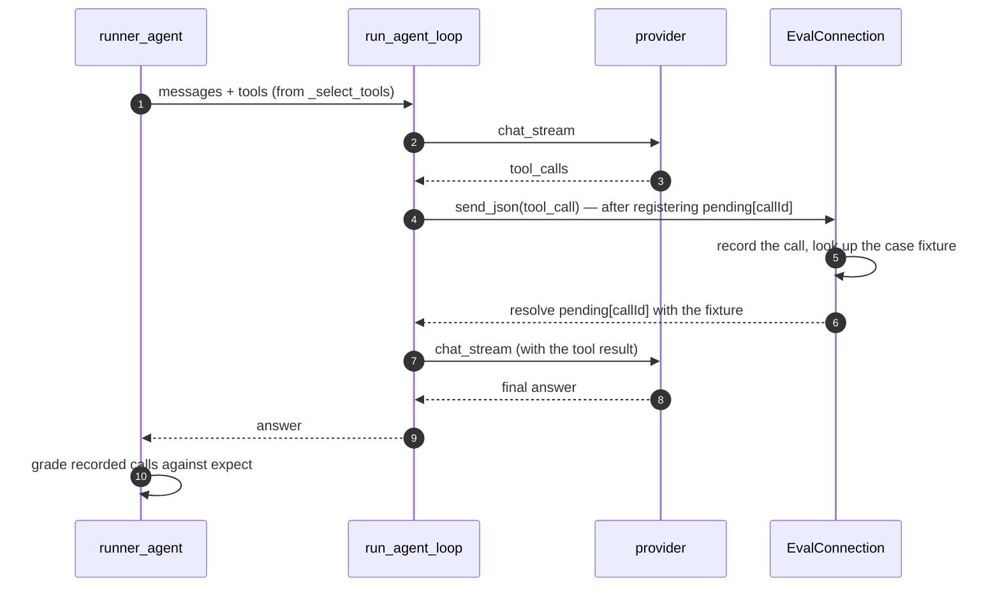

# Module: evals — measuring tool calling, and the fine-tune loop

**Status: implemented, and it has already found things** (see
[The first thing it measured](#the-first-thing-it-measured)). Both runners — the
in-node one for tool calling and the project-venv one for Hugging Face benchmarks —
the graders, the store, the sweep orchestration, the SFT exporter, the REST
surface, the agent tools and the `evals.hub` pane are all in. What is left is
listed under [Still outstanding](#still-outstanding).

The module exists because of a gap that had been open for a long time: progressive
disclosure and `TOOL_BUDGET = 38` are mitigations for a small model drowning in
tools, and **nobody had ever measured whether they help**. There was no evaluation
surface anywhere in the app — not for tool calling, not for an agent, not for a
fine-tune — and no path from "this model fails these tools" to a fine-tune that
fixes it.

## The design decision the module stands on

A case runs through **the real `run_agent_loop`** — the same function a chat turn
and a flow's Agent node run through — with a stubbed browser on the end of it.

There is no second tool-calling loop and no hand-built prompt. What is under test
is not "can this model emit JSON", it is **can it pick the right tool out of the
catalog this app actually shows it**, and that catalog is assembled by
`_select_tools` from progressive disclosure, the group guides, the preload
heuristics and the budget. A harness that built its own tool list would be
measuring a catalog nobody ever ships.

### The seam

`_call_frontend_tool` registers a future in `conn.pending[callId]` and *then*
awaits `conn.send_json`. So an object whose `send_json` resolves that future is a
complete stand-in for a browser — no monkeypatching of orchestrator internals, and
nothing to keep in sync as the orchestrator changes.



### Tools are simulated, never executed

A case supplies `fixtures`: what each tool returns. Running the real tool would
make a suite **destructive** (`files.delete` is in the catalog), **unrepeatable**
(the result would depend on what happened to be open), and slow. What is graded is
the *choice*; the fixture is what lets a multi-step case continue past it.

A tool with no fixture returns a bland `{"ok": true}` rather than an error —
otherwise the model's next move is a reaction to a broken tool, and the case ends
up measuring error handling.

### The permission mode is forced

A gated tool prompts, and a prompt in a headless run either hangs or is denied.
Either way the case would be scoring **the local machine's saved permission
rules** rather than the model. So a run forces `AUTONOMOUS`, auto-approves, and
records that a gate fired. An eval whose result depends on who ran it is not an
eval.

## Grades: why there are six and not one

A single "did it call the right tool" check is wrong in both directions at once. It
fails a model that called the right tool with a harmless extra argument, and it
passes a model that fired a tool at a question that wanted an answer. Both are the
*normal* behaviour of a small model.

| Grade | Passes when |
| --- | --- |
| `exact` | name and arguments identical |
| `name_only` | the right tool; arguments unchecked |
| `subset` | every expected argument present and equal, extras tolerated (**default**) |
| `sequence` | the expected calls in order, as a **subsequence** — a model that looked something up first was careful, not wrong |
| `no_call` | no tool at all |
| `judge` | an LLM grades the answer against a rubric |

**`no_call` is first-class.** The dominant failure of a 2B model with 38 tools in
front of it is reaching for one when the question wanted an answer, and a suite of
positives only would score that model highly while it made the app unusable. Around
a third of the starter cases are negatives for exactly this reason.

Arguments are compared after a light normalisation — whitespace, case, and
`1` / `1.0` / `"1"` — because a model that formatted an argument differently picked
the right tool and the right argument, and being strict there measures JSON
formatting rather than tool selection. Two deliberate exceptions: `True` is **not**
`1` (`bool` is a subclass of `int` in Python and `True == 1.0`, so booleans are
tagged before the number branch), and an explicit `null` is **not** a missing key.

## Exposure is a property of the case

`expose` is on the case, not the run, because "can this model pick `open_pane` out
of 38 tools" and "out of 6" are different questions and a suite is allowed to ask
both. It is also what makes results comparable: if exposure came from whatever the
node's settings happened to be, two runs of the same suite would not be measuring
the same thing.

| Mode | The model sees |
| --- | --- |
| `progressive` | the shipped path — a small core plus `list_tool_groups`/`load_tools`, `preload` as a head start |
| `all` | every group at once, still capped by `TOOL_BUDGET`. The comparison that says whether disclosure earns its keep |
| `explicit` | only the named groups, and it cannot load its way out — for isolating one capability |

## Bundled suites are data, not code

The starter cases began life as Python constructors in a `seed.py`, copied into
every new suite. That was wrong, and for a reason worth naming: it gave the module
**two authoring formats** — `.jsonl` for you, Python for us — and the one we used
was neither reviewable as data nor editable in the app that exists to edit it. It
is the same mistake `hassault` explicitly refuses when it keeps its maps as
`hd_*.json` brush files rather than committed `.cgz` binaries.

A bundled suite is now a plain `.jsonl` in `backend/modules/evals/suites/`, in
exactly the format you author in, and it **resolves beside your own** — the
`mapsource.py` rule: bundled content is an addition, never a prerequisite, and the
two catalogs cannot shadow each other. A bundled id is prefixed `bundled:`; a user
id is 12 hex characters from `uuid4`, so the two spaces cannot collide however you
name yours.

They are **read-only**. Writing would edit a file inside the repo — you would lose
it on the next pull and it would show as a dirty working tree in the meantime —
so a write returns **409** and names the way through: fork it. `fork_suite` copies
the *cases* rather than the file, so a fork is normalised through the same parser
everything else uses and a suite with a broken line does not carry it forward.

A bundled id arrives from a URL, so `bundled:../../secrets` must not become a path.
`path_for` resolves through a catalog of known slugs rather than joining the id
onto the directory — the same reasoning that makes `is_managed` gate deletion in
the llama.cpp module.

Creating a suite no longer seeds anything: a new suite is empty and yours. The
starter is there to fork, read, or run as-is.

### What is in it

`suites/starter.jsonl` — the failures a small model running *this* dashboard has,
which are not the ones a generic tool-calling benchmark covers: the layout floor,
negatives (including one preloaded with the *tempting* group), discovery through
`load_tools`, multi-step cases where the second argument can only come from the
first tool's result, and a context case where the answer is already in the
workspace snapshot. Blank lines and `#` comments are skipped by the loader, so the
file keeps its section headers and a long prose header explaining itself.

It names real tools. If a tool is renamed the cases fail loudly, which is correct —
a suite that silently kept grading against a tool nobody ships would be worse than
no suite.

## The first thing it measured

Two results from the first sweeps this module ever ran, against
`llama-3.2-3b-instruct` on the starter suite. Both are the module justifying
itself, in opposite directions.

### It failed the case author before it failed the model

The first run scored **5/12**, and three of the failures were the suite being
wrong:

```
FAIL layout-open-terminal   expected open_pane; called show(target=Terminal)
FAIL layout-open-named-pane expected open_pane(id=settings); called show(target=settings)
FAIL multistep-uses-the-tool-result  called close_pane(id=e1) but expected close_pane(instanceId=e1)
```

The layout core's own `show` description says, in as many words, that you do **not**
need `open_pane` to reach something and that `show` is the verb for any
"show/open/go to X" request. And `close_pane` takes `id`, not `instanceId`. The
model had done exactly the right thing three times and been marked wrong for it.

Corrected, the same model on the same suite scores **8/12**. The lesson is worth
stating as a rule, because it will happen to everyone who writes a case: **an
expectation that contradicts a tool's own description grades the case author, not
the model.** Read the tool declaration before writing what you expect of it.

### Progressive disclosure did not work for this model

The four remaining failures are real, and they cluster:

| Case | Tools offered | What happened |
| --- | --- | --- |
| `discovery-github-repos` | 12 | called nothing at all |
| `discovery-library-search` | 12 | `show(target="notes about vector databases")`, then `files.list(path="library/notes")` |
| `negative-greeting` | 12 | called `show` twice, over 9 rounds, at "hey, are you there?" |
| `negative-ambiguous-reference` | 30 | `show(target="People")` at "close it" |

Both **discovery** cases failed — the two whose capability was reachable only by
calling `load_tools`. This model never called it. It has, in practice, **no access
to the library or GitHub at all**, no matter how well it calls the tools it can
already see. Note the second row especially: rather than loading the group, it
tried to reach the library by *guessing at the filesystem*.

That is precisely the question the module was built to ask — progressive
disclosure and `TOOL_BUDGET` were mitigations nobody had measured — and the answer
for a 3B model is that the mitigation has a floor it does not clear. Whether the
fix is a better `load_tools` description, keyword preloading, or a fine-tune is now
a question with a number attached to it.

## Storage: a suite is source, a result is data

Cases live in `$HORRIBLE_DATA_DIR/evals/suites/<id>.jsonl` — you edit them in the
editor, diff them and commit them. Runs and results live in `app.db`
(`eval_suites`, `eval_runs`, `eval_results`), so the [database](database.mdx)
console's built-in `app` connection and `dash` can query them with no new API:
"which cases does every model fail" is a `GROUP BY`, not a feature request.

A malformed suite is still **listable and openable** — the case count is taken
leniently — because one bad line must not take out the suite list and leave no way
to reach the file and fix it. The parse error, with its line number, is reported by
`GET /suites/{id}/cases` on a **200**, since the pane needs to render the suite
*with* the error rather than show a toast over nothing.

A duplicate case id is refused outright: results are keyed by `(run, case)`, so the
second one would overwrite the first and the suite would silently be one case
shorter than it looks.

## Sweeps

A sweep runs **detached under its own semaphore, not on the shared task queue**.
That queue is serial, and parking every library ingest behind a 200-case × 6-model
sweep would make the eval module something you avoid running — the same reasoning
as karaoke downloads. The limit is per *target*, not per case: most local setups
have one model server, so more concurrency would not finish sooner, it would just
make every per-case duration a measurement of queueing.

Progress **broadcasts** on the `evals` `/ws` channel rather than being replied to a
request. A sweep outlives the pane that started it, so closing and reopening the
pane does not lose the run, and the agent's tools see the same state with no pane
open.

Two failures that are deliberately distinguished:

- A target that **cannot be resolved** fails as a *run*, not as N failed cases.
  "Your endpoint is wrong" and "this model gets everything wrong" look identical on
  a scoreboard otherwise.
- A **provider error mid-sweep** is a failed row carrying the error, not a dead
  sweep: one unreachable model must not abandon a sweep across five others. An
  errored case is forced to `passed=False` whatever the grader made of an empty
  call list — most obviously for `no_call`, which an exception would otherwise
  score as a pass.

Aggregates go to [localtrack](localtrack.mdx) (one run per sweep) so the existing
charts do the plotting, wrapped in swallows throughout: localtrack is a *reporting*
destination and a tracking failure must never cost a run the results already in
`app.db`.

### Sweeping a local GGUF: the server is borrowed, then given back

`GET /api/evals/targets` offers the node's configured agent provider **and every
GGUF in the [llama.cpp](llamacpp.mdx) catalog**, managed origin first — because
after a fine-tune the file you want to score is the one this node just wrote. It
used to offer llama.cpp *installs*: builds, emitted with an empty `model`, so the
one target that mattered on the machine was the one you could not pick.

A target therefore names a **file**, not just a model id (`RunTarget.model_path`).
`llama-server` holds one model at a time — `spawn` refuses while a server is
running — so "score my fine-tune against its base" cannot be two models answering
in parallel; it is one, then the other, with a load in between. `evals/llama_target.py`
does that borrowing, and three rules there are bugs if dropped:

- **One llama.cpp target at a time.** Targets otherwise run concurrently, which for
  every other provider is free parallelism. Here two of them would race over a
  single process and each would score the other's weights. The lock is held for the
  whole target, not just the load.
- **Put back what was evicted**, from the recorded `SpawnSpec` rather than from
  defaults. The evicted server may be the user's chat provider, and restoring from
  defaults would quietly reset `gpu_layers`, drop `extra_args` and shrink
  `context_size` — leaving their machine slower with nothing said.
- **A load that fails, fails the run.** `wait_ready` returns False rather than
  raising when a model is too large to load, and a target that scored zero because
  no server ever came up must not sit on the scoreboard next to a model that
  genuinely got everything wrong.

A GGUF the server already has loaded is used in place: no stop, no reload, and no
restore afterwards, because nothing was taken. The endpoint is read **after** the
spawn — the port is chosen then, and `_resolve_target` now asks `_endpoint_for`
rather than falling back to `:8080`, which is nothing but a closed port whenever
llama-server took an ephemeral one.

Each target also carries its `architecture` from the GGUF header. That is *shown*
in the picker, never filtered on: it is what marks the `nomic-bert` embedder or a
TTS model living in the same directory, while a header that could not be parsed is
no evidence at all — hiding a model on that basis would present a guess as a
measurement.

### A sweep needs a browser attached

The frontend tool catalog only exists on a live connection — panes push their
`agentTools` onto the socket and there is no server-side copy. A sweep with nothing
connected would grade every model against backend tools only and score them all at
zero on anything UI-shaped, so it **refuses with that reason** instead. When
several windows are connected, the *richest* manifest wins, so a second window
still registering its panes cannot hand the sweep a shorter catalog than the one
you are looking at.

## Contributions to the layout shell

| Kind | Id | Notes |
| --- | --- | --- |
| Panel | `evals.hub` | "Evals"; singleton, role `document` |
| Section | `evals.hub` → `suites` | Default, key <kbd>s</kbd> |
| Section | `evals.hub` → `run` | Key <kbd>r</kbd> |
| Section | `evals.hub` → `results` | Key <kbd>e</kbd> |
| Layout | `evals` | "Evals" 🎯 workspace in the top tab strip |
| Command | `evals.open` | Evals: Open |

One pane with three sections rather than three panes: Suites, Run and Results are
three views of the same object, and splitting them would mean three openers and
three copies of "which suite are we talking about".

The Suites section carries a **case editor** — id, prompt, grade, exposure,
expected calls — plus Fork, Edit and Delete. It is deliberately shallow: anything
richer (fixtures, history, workspace context) is a JSON field, because building a
form for arbitrary tool arguments would be building a worse editor than the one
already in the app. A `no_call` case hides the expected-calls field entirely rather
than leaving it there inviting input that would be ignored.

None of the three authoring paths is privileged: the form, the agent's
`evals.addCase`, and opening the `.jsonl` in the code editor all write the same
file, which is what keeps a suite reviewable and diffable.

## The rows are a shared component, not four hand-drawn lists

Every section of this pane is a list of records with an identity, some figures and
a verdict — cases, sweep targets, runs, results — and all four had independently
converged on the same undesigned shape: one font weight throughout, colour carried
on the whole perimeter, and numbers set as prose. They also referenced theme tokens
that **do not exist** (`--bg-primary`, `--text-primary`, `--border-dim`, `--ok`), so
every one of them silently fell through to a hardcoded fallback and ignored the
theme entirely.

They now compose `DataList` / `DataRow` / `PickRow` from
`packages/core/src/DataList.tsx`, which splits a row into three separable jobs:

- **Identity** (`hd-row-title`) — uppercase, heavy tracking. What the row is.
- **Telemetry** (`hd-row-meta`) — monospace, muted, divided by hairlines. Every id,
  count, duration and percentage. Never the title's treatment, so a row scans as
  label-then-figures at a glance.
- **Verdict** (`data-kind`) — a 2px rail down the leading edge and a matching corner
  notch. An accent *edge*, not an accent perimeter: the row stays a row instead of
  becoming a card.

The type contract is the design. There is no `color` or `style` prop — a caller that
could pick a colour directly is a caller that will eventually pick one that means
nothing — and `meta` takes an **array** rather than a pre-joined string, because the
hairline dividers cannot be drawn between cells that were concatenated first.

Three details that are decisions rather than styling:

- **The Models picker is a grid of tiles, not a column of checkboxes.** Those items
  are peers being chosen between for one sweep, and the stacked-label form is
  exactly the shape that reads as an unstyled form. `PickRow` keeps the native
  `<input type="checkbox">` — hidden, but still doing the focus, announcement and
  space-bar work — and draws the square beside it. Replacing the input with a
  `role="checkbox"` div is the version that looks the same and loses the keyboard.
- **A case row is `kind="info"` with no mark.** A case has no verdict: it has not
  been run. A tick there would claim something that was never tested.
- **A run has three states, not two.** `runKind` returns `info` while a sweep is
  still going — drawing it as a failure is how a sweep at 3/50 comes to look broken
  thirty seconds after it was started.

The entrance stagger is capped (`STAGGER_CAP`, 12). The delay is per item, so
without a cap a suite with two hundred results is still arriving four seconds after
it rendered. `RollingNumber` is **seeded at its final value** with a timeout that
snaps to it: `requestAnimationFrame` does not fire in a backgrounded tab, and a
counter reading `0` for a figure that is `62` is worse than no animation at all.

## Backend surface

`backend/modules/evals/`, mounted at `/api/evals`.

| Route | Purpose |
| --- | --- |
| `GET /api/evals/suites` | Every suite, with case counts |
| `POST /api/evals/suites` | Create one, empty |
| `POST /api/evals/suites/{id}/fork` | Copy a suite into a new one you own |
| `GET /api/evals/suites/{id}/cases` | The parsed cases, or a line-numbered parse error on a 200 |
| `PUT /api/evals/suites/{id}/cases` | Rewrite the file (the case editor and the authoring tools). **409** for a bundled one |
| `DELETE /api/evals/suites/{id}` | Forget a suite. The **file survives** unless `remove_file=true`. **409** for a bundled one |
| `GET /api/evals/runs` | Recent runs, optionally by suite |
| `GET /api/evals/runs/{id}` | One run and every case result |
| `POST /api/evals/runs` | Start a sweep. Returns **immediately** |
| `GET /api/evals/leaderboard` | A suite's runs: ranking, case matrix, universal failures |
| `GET /api/evals/leaderboard/diff` | What one run fixed and broke relative to another |
| `GET /api/evals/datasets/splits` | The (config, split) pairs a Hub dataset offers |
| `POST /api/evals/datasets/peek` | Columns and a few real rows, without downloading it |
| `POST /api/evals/datasets/compare-preview` | What a case would compare, for one row, plus everything wrong with it |
| `GET /api/evals/datasets/presets` | Known-good benchmark blocks for datasets whose answer column is a trap |
| `POST /api/evals/exports` | Turn a run's results into an SFT dataset on disk |
| `GET /api/evals/exports/preview` | The first few examples, without writing a file |
| `GET /api/evals/targets` | Models this node could sweep — the agent provider plus every catalog GGUF — so the launcher is a picker not a form |

## Agent tools

Group `evals` — name prefix and declared `group=` identical, since an omitted
`group=` charges the schema to every round of every agent.

| Tool | Purpose |
| --- | --- |
| `evals.listSuites` | What suites exist, with case counts, `source` and `readOnly` |
| `evals.createSuite` | A new, empty suite to add cases to |
| `evals.fork` | Copy a suite — how a bundled one becomes editable |
| `evals.addCase` | Append one case. Refuses a duplicate id |
| `evals.removeCase` | Delete one case by id |
| `evals.run` | Start a sweep; returns immediately |
| `evals.export` | Turn a run's results into a fine-tuning dataset |
| `evals.results` | Recent runs, or one run's **failing** cases and why each failed |

Everything that writes is `side_effect=True` and so goes through the permission
gate — a read-only tool skips it entirely, which would mean an agent editing your
suites with no prompt.

`evals.results` returns **failures only** — a scoreboard of 200 passing rows is
the one thing an agent's context does not need.

### Why the agent may author cases

An earlier version withheld the authoring tools on the grounds that the thing under
test should not write its own exam. That was too broad. Drafting twenty cases from
a set of tool descriptions is exactly the tedious work worth delegating; what
matters is that a case is a *claim about correct behaviour* and that you review the
claim — and since a suite is a `.jsonl` in your data dir, reviewing means reading a
diff.

Two guards make that safe rather than merely convenient, both aimed at the failure
mode an authoring agent actually has, which is enthusiasm rather than malice:

- **A bundled suite cannot be written to at all.** The refusal names `fork` so the
  model can proceed instead of retrying.
- **`addCase` refuses a duplicate id** rather than replacing the case. Results are
  keyed by `(run, case)`, so silently overwriting a case somebody wrote is the one
  unrecoverable thing an authoring tool can do.

`listSuites` reports `source` and `readOnly` for the same reason: it saves the
model a failed write and a wasted round. `addCase` also accepts the case as a JSON
*string* as well as an object, because small models routinely stringify an
object-typed argument and a retry round costs more than a `json.loads`.

## Runner B: benchmarks in a project venv

Evaluation splits into things that must run **inside the node** and things that
must run **in a Python venv**, and pretending either covers both is where this
would go wrong. Runner A measures this node's tool calling and has to run
in-process. Runner B (`runner_project.py`) runs anything needing `datasets`,
`evaluate` or an `lm-eval`-style harness — torch-class dependencies that must never
become core deps — inside a [training](training.mdx) project's venv, installed
through `envs.install` (`uv pip install --python`) because **a uv venv has no pip
at all**.

Both write to the same `eval_runs` / `eval_results` tables, so a suite that mixes
tool-calling cases with a benchmark still adds up to one scoreboard. A case routes
to Runner B by carrying a `benchmark` block; the venv is prepared once per sweep
and **only if a benchmark is actually present**, so a pure tool-calling sweep never
waits for `datasets` to resolve. If the environment cannot be prepared, the
benchmark cases fail with that reason and the tool-calling half of the suite still
runs — losing it because `uv` is missing would be a poor trade.

### That project is working storage, and says so

`ensure_project` goes **straight to `projects.create_project`**, not through the
training create *route* — so it gets a directory and a venv, but no scaffolded
`main.ipynb` (the route is what asks a provider for starter cells), and the venv
holds only `requirements_for(cases)`: no `ipykernel`, no `horrible_train`.

That is correct for a benchmark runner and wrong for a notebook. Since the project
lands under the training projects root, the [training](training.mdx) pane listed it
as an ordinary project with an **Open notebook** button whose only possible outcome
was an error — and the error it produced was a bare `FileNotFoundError`, whose
`str()` is *only the path*, rendered beside a kernel badge still reading "starting".

So these projects carry `ProjectModel.owner = "evals"`. The training pane **marks
them rather than hiding them** — the same call the bundled suites above make — and
disables the authoring actions with the reason in their tooltip. Delete stays
enabled: a project quietly missing from the list is a directory eating disk that you
can neither see nor remove. Projects created before `owner` existed are stamped on
the next sweep, so the dead button does not survive for anyone who already ran one.

### A script, not a notebook

The design note said "a scaffolded notebook". A script is what shipped, and the
reason is worth recording rather than quietly changing: a sweep is a **batch job**,
and the notebook path is built around an interactive kernel session tied to a
websocket connection (`TrainingKernelManager._open` takes a `conn`). Driving that
headlessly to run twelve rows would mean owning a session lifecycle for no gain.

The readability the notebook was chosen for is kept. The script lands in the
project as `evals/<case-id>.py` — one file per case, so a suite of five benchmarks
leaves five readable scripts rather than one overwritten four times — and it is an
ordinary file you can open, edit and run yourself. `envs`' blocking `Popen` on a
thread is reused as-is, already the Windows-safe spawn pattern.

Three properties the generated harness has to have, and they pull against each
other: it must be **readable** (it is how you learn what the libraries do), it must
have **no dependency it does not need** (the model is called over plain `urllib`,
not `httpx` or the `openai` client, so a benchmark needing only `datasets` installs
only `datasets`; `evaluate` is imported lazily and only for metrics the harness
does not implement itself), and it must be **machine-readable on the way out** — it
prints one JSON object on a sentinel line, because parsing a score out of prose is
how a harness starts reporting numbers nobody can reproduce.

The job is embedded as a JSON literal rather than interpolated field by field: a
dataset id or a template containing a quote would otherwise end the string and
produce a script that fails to parse.

### Answer extraction, and the 0.000 that was not the model's fault

The first real benchmark — six rows of GSM8K against a local 3B — scored **0.000**.
The model was fine. GSM8K stores the *worked solution* in its answer column and
marks the final answer with a separator:

```text
Janet sells 16 - 3 - 4 = 9 duck eggs a day.
She makes 9 * 2 = $18 every day at the farmer's market.
#### 18
```

Grading against that column as-is asks whether the model reproduced the dataset's
own prose, which no model does. So a benchmark carries `target_regex` and
`prediction_regex` — applied to the reference and the reply respectively, first
capturing group wins. With a `####` pattern and a last-figure pattern, **the same
model on the same rows scored 1.000**.

A pattern that does not match leaves the value untouched rather than returning
empty: degrading to "compare the whole thing" is recoverable and visible in the
samples, whereas silently comparing against an empty string scores zero and looks
like a model failure. The samples record both the raw reply and what was actually
compared, for the same reason — a regex that matched the wrong thing is otherwise
invisible, and it is the single most likely cause of a surprising zero.

`normalise` also strips thousands separators and a trailing currency symbol, so
`$70,000.` and `70000` are the same answer. No dataset agrees on which to store.

### Unknown fields are an error

Pydantic ignores an unknown key by default, which for hand-authored JSONL is the
worst available behaviour: `target_regexp` instead of `target_regex` silently does
nothing, the run scores zero, and the obvious conclusion is that the feature is
broken rather than that the key is misspelled.

This was not hypothetical — it is how the regexes above were lost the first time. A
case written against a newer schema than the running backend had two fields dropped
on the way in, and the only symptom was a benchmark scoring 0.000 *again*, for a
completely different reason. Every case model now sets `extra="forbid"`, so an
unknown field is a 422 naming the field. The cost is that an older backend refuses
a suite written for a newer one; that is the right trade, since a loud refusal
beats a silent misgrade and `SuiteFormatError` already reports the line number.

## Authoring a benchmark, without authoring the zero

The case editor's benchmark half exists to stop you writing the case that scores
zero. Every benchmark this module got wrong was wrong the same way — the template
named a column the dataset does not have, or the answer column held the worked
solution rather than the answer — and both look exactly like a bad model until ten
minutes of run time have been spent.

So the form is built around the dataset rather than around the schema.

**Peek.** `first-rows` from Hugging Face's datasets-server returns the columns and a
few real rows without downloading a byte. The answer-column field becomes a picker,
the template gets `+{column}` buttons, and the config the Hub resolves is adopted —
`gsm8k` has no default config, and omitting it fails in a way that reads as "the
dataset is broken". A gated or unreachable dataset degrades to free-text fields
with a note rather than blocking the form.

**Presets.** GSM8K, MMLU, HellaSwag and TruthfulQA ship as known-good blocks,
because each has a trap: GSM8K's `####` separator, MMLU and HellaSwag storing the
answer as an *index* into a list column. A preset is cheaper than a paragraph nobody
reads at the moment they need it, and `backend/modules/evals/presets.py` is that
paragraph anyway for the ones that are not covered.

**The comparison preview.** The point of the whole form: for a real row, it shows
the rendered prompt, the raw reference, what each side reduces to after extraction
and normalisation, and whether that row would score. Below it, every problem it can
see — a template naming a missing column, a regex that did not match, or the one
that matters most:

> ⚠ no target_regex, so the whole answer column is the reference — and it looks
> like the worked solution rather than the answer. Try `target_regex = ####\s*(.+)`

That warning is the module's own history. The first real benchmark scored **0.000**
with no regex at all, so there was no failed match to complain about — an earlier
version of this check missed it for exactly that reason, and it now fires on the
shape of the reference instead. It stays quiet when the answer column really does
hold just the answer, because a warning people learn to ignore is worse than none.

### The preview cannot flatter the case

`extract` and `normalise` are **imported from the harness, not reimplemented**. They
are real functions in `harness.py` and are inlined into the generated script via
`inspect.getsource`, so the preview, the script, and the score all run the same
code. A TypeScript reimplementation in the form would have been the obvious way to
make the preview instant, and the thing it could quietly disagree about is *what the
score means* — which is the one disagreement this module cannot afford. The preview
is a backend call for that reason alone.

### Validation before the run, not during it

`Save case` refuses a benchmark with no dataset, no answer column, or a prompt
template containing no `{column}` at all — the last because every row would then get
the identical prompt, which is a ten-minute run that tells you nothing. Switching a
case between `tool_call` and `hf_benchmark` keeps both drafts, and saving clears the
half that does not apply so a stale `benchmark` block can never ride along on a
tool-calling case.

## The fine-tune flywheel

`export.py` turns results into a supervised fine-tuning dataset — the half that
makes a failing scoreboard actionable. Everything downstream already exists: a
training project, the recipe form's `SFTConfig`/`LoraConfig`, `convert.py` → GGUF
into [llama.cpp](llamacpp.mdx)'s managed dir, serve, re-run the identical suite,
compare.

### It exports the ideal trajectory, not the model's

The obvious design — record what the model did and train on it — is wrong in both
directions. For a case the model **failed**, its trajectory is the mistake you are
trying to remove. For one it **passed**, its trajectory and the ideal one are the
same thing anyway. So an example is built from the *case*: the prompt it was given,
the tools it was shown, and the call `expect` says was correct.

That has a consequence worth stating plainly: **a case is a claim about correct
behaviour, and exporting turns that claim into training data.** A wrong expectation
does not merely mis-score a model — it teaches one. This is why "read the tool
declaration before writing what you expect of it" matters beyond the scoreboard.

Two modes, and they are different jobs. `correct` exports what a run got right —
distillation: run a strong model, train a small one on it. `repair` synthesises the
ideal trajectory for what it got wrong — targeted correction. `both` is the usual
choice once there is a reference run to draw answers from.

The trajectory includes the **tool results** the fixtures would have produced. An
example that stops at the call teaches a model to call and never to use what came
back, which is what a model looping on one tool looks like.

### The two traps, as code

**One system message.** The runner assembles several (the agent prompt, the skills
catalog, the group guides) because that is the production shape and the provider
seam flattens them. A chat template does not — a strict Jinja template raises on a
second system message — so `_flatten_system` merges them before anything is
written.

**Nothing is pre-rendered.** Examples are written as `messages` + `tools`, never as
a rendered string. The tokenizer's own `apply_chat_template(messages, tools=…)` is
what the serving path uses, and rendering here would bake in *this* model's template
and silently mistrain anything else — the exact failure `--jinja` exists to avoid at
serving time.

### What it refuses to invent

A `no_call` case expects **prose**, and the case does not contain the prose. So
repairing one needs a `reference_run_id` — a stronger model's run of the same
suite, whose answer is borrowed. Without one those cases are reported as skipped,
never invented: a fabricated answer is training data that teaches a model to say
something nobody checked. A case this model already answers correctly needs no
stronger model; its own answer is reused.

Every skip names the case and the reason. An exporter that quietly drops a third of
a suite produces a dataset whose coverage nobody can account for.

Exports land in `$HORRIBLE_DATA_DIR/evals/exports/`. A relative `out` path is
resolved and then checked to be inside that directory — an export name arrives in
an HTTP body, and `joinpath` would happily follow `../..`.

## Compare: three questions, not one

A per-run pass rate is a number you cannot act on, so the Compare section answers
three different questions. Answering only the first is what makes a leaderboard
decorative.

**Who is ahead.** The ranking, with a bar rather than a bare percentage — the gap
between 42% and 67% is the thing being read, and a column of numbers does not show
it. Average rounds rides alongside, because a model that passes by taking four
rounds where another took one has not passed the same way.

**What changed.** The fine-tune question, and deliberately not derived from the
totals: a run that went 8/12 → 9/12 by fixing three and breaking two is a different
event from one that fixed one and broke none, and the totals cannot tell them apart.
So the diff names the cases in each group — **four** groups, not two, because two
of them are not about the model at all. A case whose content hash changed is
`changed`, and a case where either run hit a provider error is `errored`. Both would
otherwise land in fixed/broke and read as the model getting better or worse. That
second one is not hypothetical: the first two-run sweep after this shipped had LM
Studio return a 500 on two cases, and the diff called one of them a regression until
`errored` existed. The corrected reading — no fixes, no regressions, two errors —
is what a reproducibility run at temperature 0 should say.

**What nothing passes.** The one this module keeps needing. Three separate times a
case here was wrong rather than the model — an expectation contradicting the tool's
own description, a GSM8K reference containing the whole worked solution — and the
signature is every run failing the same case. It gets its own callout saying so,
because a universal failure is a prompt to go and read the case, not to go and get
a better model. It needs at least two runs before it fires: one run failing a case
is not evidence of anything.

The case matrix renders **three states, not two**. A run that did not attempt a case
has not failed it, and drawing both as a cross would invent regressions out of a
`case_ids` filter.

### Comparability is not free

Two runs are only comparable if they asked the same questions, and two things break
that invisibly if you compare on totals:

**Different case sets.** A run started with a case filter attempted fewer cases;
5/5 beats 8/12 on percentage and means nothing. Every comparison is computed over
the **intersection of cases both runs attempted**, and the pane says how many were
left out rather than quietly dropping them.

**The suite changed underneath.** This is the subtle one, and it is a mistake this
module has already made. Case ids survive an edit, so `layout-open-terminal` before
and after someone corrected its expectation is the same id and a *different
question*. Comparing them shows a model "fixing" a case that was actually fixed by
editing the exam.

So a result now carries a **`case_hash`** — a hash of everything that decides
whether an answer is right (prompt, history, context, exposure, expectation,
fixtures, benchmark block), excluding `note` and `tags` because rewording why a case
exists does not change what it asks. It is the `spec_id` precedent from the hitbox
module: a content hash cannot be forgotten the way a hand-maintained revision can.
Where two runs disagree about a case's hash, the diff reports it as **changed**
rather than as a fix or a regression, and the matrix marks the row.

Rows written before the column existed have an empty hash, which is reported as
**"cannot tell"** — never as agreement. The column is added to existing databases
with an explicit `ALTER`, because `CREATE TABLE IF NOT EXISTS` does nothing to a
table that already exists and skipping that is how a new field silently never
appears on anyone's machine but the one it was written on.

### Why this reads `eval_results` and not localtrack

The design note said "cross-run comparison over localtrack". It reads the results
tables instead, and the reason is a real limit rather than a preference: localtrack
stores metrics keyed by step, which can express "this sweep averaged 0.67" but not
"model A passes `discovery-github-repos` and model B does not". The per-case verdict
is the entire point of the matrix and the diff. localtrack keeps its job — the
time-series across many sweeps, where the shape of a fine-tune's progress shows up.

## What it found: three bugs, and none of them the model

The first sweep of the starter suite against a local llama-3.2-3b scored **6/13**,
with every positive tool-calling case failing and every negative passing. The
obvious reading — "this model cannot use progressive disclosure" — was wrong three
times over. The investigation is worth recording because each layer hid the one
below it.

### 1. `no_call` scored silence as success

Every one of the 13 cases had returned an **empty answer**. The six that "passed"
were `no_call` cases, and the grade only asked whether a tool had been called. A
model that says nothing does not call a tool, so silence scored as a clean
negative — and six confident passes made the seven failures look like a specific
weakness rather than a total failure.

`no_call` now requires an actual answer. Saying nothing is not answering, and a
grade that cannot tell the difference converts a dead provider into a respectable
scoreboard.

### 2. A provider error was swallowed mid-stream

With the empty answers visible, the next question was why. The telemetry chokepoint
had the outbound request recorded: **HTTP 200**, 4899 bytes of response — the model
had answered. The body was:

```text
event: error
data: {"error":{"message":"Engine protocol predict stream returned an error:
       {\"code\":500,\"message\":\"The model produced output that does not match
       the expected peg-native format\"}"}}
```

LM Studio's constrained decoder had rejected the model's tool-call output, and it
reports that *inside* an already-200 SSE stream. `raise_for_status` has long since
passed by then, and the openai-dialect stream loop did:

```python
choice = (json.loads(data).get("choices") or [{}])[0]
```

A frame carrying `error` instead of `choices` became an empty choice. The turn
returned a blank answer with no tool calls — **indistinguishable from a model that
chose to say nothing**, which is the worst shape a failure can take in a harness
whose entire job is to attribute behaviour.

`providers.py` now raises `ProviderStreamError` on such a frame. This was never an
evals bug: it silently degraded every chat turn against any OpenAI-dialect provider
that reports errors this way.

### 3. `load_tools` threw away the model's answer

With errors surfacing, the real finding appeared: **the model does call
`load_tools`.** It had been calling it all along. Measured directly, it returned:

```json
{"groups": "[\"github\"]"}
{"groups": "['files', 'editor']"}
```

An *array* parameter handed back as a string — the second not even valid JSON.
Small models do this constantly. The dispatcher did:

```python
if isinstance(requested, str):
    requested = [requested]
```

which made the requested group name literally `["github"]`, matched nothing, and
returned `loaded: []` with the whole thing under `unknown`. The model asked for the
right group, was told it got nothing, and the capability never appeared.

`_coerce_group_list` now reads any of the shapes a model actually produces — a real
list, a JSON array in a string, a Python-style list with single quotes, a bracketed
comma list, a bare name. `_coerce_args` does the same job one level up for the
arguments payload as a whole; this slipped past it because the payload *was* valid
JSON, it just had a string where an array belonged.

After the fix a discovery case reports `groups loaded: ['files']` — the first time
progressive disclosure has been observed working on this model.

### What is left, and is not ours

LM Studio's constrained decoder still 500s intermittently on this model, and it is
prompt-dependent: the identical tool set and question succeed on one phrasing and
fail on another. That is an engine-side limitation. What changed is that it is now
**reported as a provider error on the result row** rather than scored as a model
that declined to act.

The lesson generalises past this bug. Every layer here failed *safely* — an empty
answer, an empty choice, an empty group list — and safe failures compose into a
plausible number. A harness has to be built so that the absence of a thing is
distinguishable from the thing being absent on purpose.

## Still outstanding

`judge` grading is declared and refuses rather than scoring (it needs a provider,
and the grader is deliberately pure). The results pane does not yet render the
[interpretability](interpretability.mdx) recorder's snapshot for a case's `turn_id`
— the row carries the id, so the exact prompt and tool schemas that went out are
reachable, just not shown.

## Browser vs desktop

Identical. The sweep runs on the backend and the pane is ordinary React; nothing
here touches a platform capability.

## See also

- [Agent tools](../architecture/agent-tools.mdx) — progressive disclosure, groups, `TOOL_BUDGET`
- [Agent chat](agent-chat.mdx) — the orchestrator loop a case runs through
- [localtrack](localtrack.mdx) — where sweep aggregates land
- [training](training.mdx) — projects, venvs, recipes, GGUF conversion
- [llama.cpp](llamacpp.mdx) — serving a converted fine-tune to re-run a suite against
