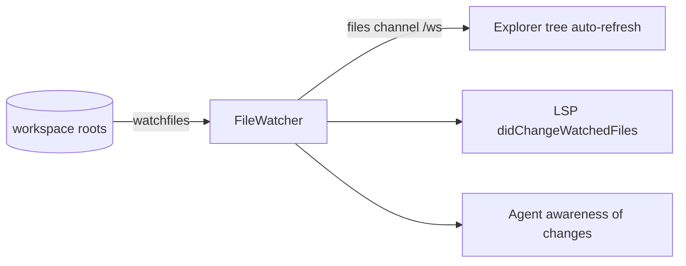

# Module: file explorer

Tree view over the workspace for browsing, opening, and organizing files.

**Status: VS Code-style explorer implemented.** The `files.tree` panel lists the
backend's workspace roots, lazy-loads directories on expand, and opens files as
`workspace-file:` editor buffers. The view is a **flattened, virtualized row list**
(state in the shared store, so it survives a pane remount) with file icons,
**multi-selection** (ctrl/shift-click), **keyboard navigation** (arrows, type-ahead,
Enter, F2), **inline rename**, a **right-click context menu**, and **git decorations**
(M/A/D/U badges + colors, folder change indicators, branch). Disk changes arrive
**live** over the `files` watch channel (no manual refresh). Remaining VS Code
parity — an "Open Editors" section, auto-reveal, and drag-and-drop — is tracked in
[Remaining parity](#remaining-parity).

## Contributions to the layout shell

- **Panels:** `files.tree` (singleton, `embedded`). It is the **Files** section of
  [Explorer](explorer.mdx) rather than a left-dock strip of its own — five near-identical
  browsers had become five rail glyphs. Still registered, so `show("files.tree")` and
  `openPaneInArea` work unchanged.
- **Commands:** `files.open`, `files.newFile`, `files.newFolder`, `files.rename`,
  `files.delete`, `files.refresh`, `files.collapseAll`, `files.openTerminalHere`,
  `files.revealActiveBuffer`; `files.revealInOS` (desktop only — registered only
  when `shell.revealInOS` capability is present, so the palette never shows dead
  commands) is B6.
- **Interactions with other modules (B5):** opening a file calls the editor's
  public `openBuffer('workspace-file:...')` service; **"open terminal here"** calls
  the terminal's `openTerminal({ cwd })` rooted at the selected directory; the
  agent reads the tree selection via the panel's `getAgentContext` (B4). These go
  through each module's public exports — never another module's internals.

## Backend surface

`backend/modules/files/` — **implemented (HTTP surface).** All paths are **rooted
at configured workspace roots**: every request resolves the target (collapsing
`..`, following symlinks) and rejects anything that lands outside a root with
`403`. A **relative path is anchored to a root** first (a leading segment matching a
root's name selects that root, else the first root) — so an agent that passes a bare
`notes.txt` (it doesn't know absolute root paths) writes into the workspace instead
of being rejected; the boundary check runs *after* anchoring, so a relative `../`
escape is still `403`. The path-traversal boundary lives here, not in the UI, so a
remote backend can never be coaxed into serving paths outside its roots. Roots are configured in
the [settings module](settings.mdx) (`files.roots`; browser: paste a backend-host
path; desktop: a native folder picker via `fs.nativeDialogs`), with an env
override `HORRIBLE_WORKSPACE_ROOTS` for dev/test.

**Out of the box:** when neither setting nor env is configured, the backend **sets
up a default workspace** — a single root at **`~/Projects`**, created if it doesn't
exist. That's deliberately a *user* workspace rather than the backend's launch
directory, which under both the dev command and the Tauri desktop spawn is this
app's own repo checkout — not what a user wants their file explorer rooted at. This
is cross-platform (`Path.home()`) and means the file explorer and every `files.*`
agent/flow tool work immediately with no setup. `HORRIBLE_NO_DEFAULT_ROOT=1`
restores the fail-closed boundary (empty roots → `400`, nothing created) for
hardened/remote deployments. Explicit `files.roots`/env config always takes
precedence over the default.

| Route                  | Purpose                                          |
| ---------------------- | ------------------------------------------------ |
| `GET /files/roots`      | the configured workspace roots                   |
| `GET /files/list`       | a directory's entries (dirs first)               |
| `GET /files/read`       | a UTF-8 file's content (capped; binary → `415`)  |
| `GET /files/git-status` | working-tree status of a root (`git status --porcelain=v2`; `is_repo:false` if not a repo) |
| `POST /files/create`    | new file or directory                            |
| `PUT /files/write`      | overwrite/create file content                    |
| `POST /files/rename`    | rename/move within roots                         |
| `POST /files/delete`    | delete (`recursive` required for non-empty dirs) |

Live **watch events** ship: a backend `watchfiles` watcher
(`backend/modules/files/watcher.py`) broadcasts changes on the `files` `/ws`
channel, and the tree re-lists the affected directories on them (see
[Live watch](#live-file-watch-ws-channel) below). Clients still re-list after their
own mutations as a belt-and-braces fallback.

## Virtual roots

A **provider** claims a URI scheme and answers the read half of the files API for paths
under it, so a non-filesystem source can browse like a directory. Google Drive is the
first: connecting Google makes a "Google Drive" root appear in the tree, Colab-style,
and its files open as read-only editor buffers. The tree and the editor learn nothing
about Drive — only about the scheme.

`backend/modules/files/providers.py` is the registry; it contains **no** provider
implementations, so providers register from their own package
(`connectors/providers/drive_fs.py`) and the dependency runs connectors → files, never
the reverse.

**The traversal boundary is untouched.** `_resolve` is not modified and not reused;
each route detects a scheme and dispatches *before* calling it. That ordering is
load-bearing — `_resolve` anchors relative paths to a root, so letting `gdrive:/abc`
reach it would produce `<root>/gdrive:/abc` and a 403 that describes the wrong problem.

Two rules that are easy to get wrong, and are pinned by tests:

- **The scheme needs two or more characters** (`^[a-z][a-z0-9+.-]+:/`). `C:/Users/x`
  is a Windows path, not a URI; a one-character scheme would route every file on a
  Windows root into a provider. `packages/core/src/modules/files/api.ts` mirrors the
  regex for the same reason.
- **A virtual root never enters `_roots()`.** That list feeds the traversal check and
  the filesystem watcher, neither of which can mean anything for a remote id graph.
  Virtual roots are appended to the `/roots` *response* only — which is also why
  `watcher.py` needs no guard.

Providers are read-only in v1, so the write routes reject them rather than failing
oddly further down:

| Route | Virtual path |
| --- | --- |
| `/roots`, `/list`, `/read` | dispatched to the provider |
| `/create`, `/write`, `/rename`, `/delete` | **403** "this location is read-only" (`/rename` checks *both* ends) |
| `/git-status` | `is_repo: false` — a clean answer, not an error, since the tree asks this of every root on each refresh |

`GET /files/list` takes `fresh=1` to bypass a provider's cache; the tree's Refresh
button passes it, watch-driven reloads don't. The UI gates the mutating affordances on
the same `isVirtualPath` check: no F2, no Delete, and a context menu reduced to Open and
Copy Path.

## Agent integration

**Status: implemented (B4).** Declared on the `files.tree` panel, so they reach the
capability manifest. Verified live: the agent wrote a file through gated
`files.write`, which prompted with the rendered `{path}` specifier and wrote on
approval. The tree exposes [agent tools & `getAgentContext`](../architecture/agent-tools.mdx):

- **Read (ungated):** `files.list(path)`, `files.read(path)`, and
  `files.gitStatus(path)` (branch + each changed path's status); the tree's roots,
  the active selection, the full **multi-selection** (`selectedPaths`), and a git
  summary (`{branch, changeCount}`) are exposed through the pane's
  `getAgentContext()` snapshot.
- **Gated (side-effecting):** `files.create`, `files.write`, `files.rename`,
  `files.delete`. These are matched by filesystem permission rules using
  gitignore-style anchors against the workspace roots — e.g. `allow
  files.write(/src/**)`, `deny files.delete(**)`. `files.create` and mkdir-style
  operations auto-allow under the `acceptEdits` mode; delete/rename still prompt.
  See the [permission system](../architecture/agent-tools.mdx#the-permission-system).

The agent transfers *out* of the tree the same way a user does (it invokes the
commands, never another module's internals): opening a file is
`editor.openBuffer('workspace-file:...')`; "open terminal here" is
`terminal.new({ cwd })`.

## Live watch & a VS Code-like explorer

**Status: Phase 1 (watch channel) and Phase 2 (the explorer UX) implemented.**

### Live file-watch `/ws` channel

The deferred "watch events" are the foundation everything else wants. A backend
watcher (`watchfiles`, `backend/modules/files/watcher.py`) over the configured
roots emits change events on a `files` `/ws` channel; the frontend store
(`initFilesWatch`, `store.ts`) applies them (debounced) instead of manual
re-listing. A single process-wide `FileWatcher` broadcasts to per-connection
`push_file_events` tasks, mirroring telemetry's recorder/stream split. The one
channel feeds **three** consumers:

Events carry the change type and the affected path's parent dir, so the tree
re-lists only the directories that changed. Roots are read when the watch starts;
a roots change (settings) restarts it.

### Explorer UX

The store (`store.ts`) owns the whole tree model — roots, per-directory expansion,
the children cache, the multi-selection, and the inline-rename target — and exposes
a **flattened, render-ready row list** (`visibleRows()`). `FileTree.tsx` is a thin
consumer that virtualizes those rows and wires the interactions:

| Feature                 | How                                                                         |
| ----------------------- | -------------------------------------------------------------------------- |
| **Flattened row model** | `visibleRows()` walks roots → expanded children into a flat `Row[]`, which makes keyboard nav, multi-select, and virtualization fall out cheaply |
| **File icons**          | `icons.ts` maps extension → a colored category tag (`.file-icon`/`.ic-*` in `styles.css`); folders use an open/closed glyph |
| **Inline rename (F2)**  | the active row becomes an `<input>`; Enter commits via `renameEntry`, Esc cancels |
| **Context menu**        | right-click a **row** → Open / New File / New Folder / Rename / Delete / Copy Path / Open Terminal Here, contributed as a `files.node` provider (see [Context menus](../architecture/context-menus.mdx)) |
| **Background menu**     | right-click the **empty space below the last row** → New File / New Folder / Open Terminal Here / Refresh / Collapse All, as a `files.background` provider |
| **Multi-select**        | Ctrl/Cmd-click toggles, Shift-click selects a range along the visible order; the set drives multi-delete |
| **Keyboard nav**        | ↑/↓ move the active row, ←/→ collapse/expand, Enter opens, F2 renames, Delete removes, and printable keys type-ahead-jump |
| **Virtualized tree**    | `@tanstack/react-virtual` over the flat rows, so large directories stay smooth |

The palette commands (`files.rename`, `files.delete`) and the context menu share
this behavior — rename starts the same inline edit, delete removes the whole
selection. They now share the **implementation** too: `deleteSelection` lives in
`modules/files/actions.ts`, not in a `FileTree` closure, because a menu provider
has no component to read it from. That collapsed a second copy of the
confirm-and-delete loop which had drifted by one behaviour — the palette's ignored
the active row when nothing was multi-selected, so the two disagreed about what
"the selection" meant.

The tree no longer renders a menu of its own. It reports the row as a target
(`{kind: 'files.node', path, nodeKind, name}`) and the items come from providers —
which is how the **notebook** module contributes *Open as Notebook* on a `.ipynb`
without the files module knowing anything about notebooks. A right-click outside
the current selection retargets it first: acting on a row the user cannot see
highlighted is how *Delete* hits the wrong thing.

Right-clicking the empty space below the last row reports `files.background`
instead — a **separate kind**, not `files.node` with a null path. There is no row
to act on, so every row-scoped verb is absent and the create verbs fall back to the
first writable root; reusing the node kind would have meant a menu whose every
second item was permanently grey. The background handler sits on the scroll
container and bails on `defaultPrevented`, so a right-click that landed on a row
never opens both menus. **Collapse All** keeps the cached listings — it is a view
operation, and re-expanding a folder should be instant; *Refresh* is the verb for
invalidating.

### Git decorations

A backend git source (`git.py`, parsing `git status --porcelain=v2 --branch` via
`GET /files/git-status`) maps each changed path to a collapsed status; the store
(`reloadGit` in `store.ts`) fetches per repo root on mount and on every watch event,
and derives which **directories contain changes**. `FileTree.tsx` paints a colored
name + letter badge per file (M/A/D/U/R/!), a change indicator on folders, and the
branch in the toolbar. The same source is the ungated `files.gitStatus` agent read
tool — "what's changed?". A non-git root simply renders undecorated (`is_repo:false`).

### Remaining parity

- **"Open Editors" section** at the top, listing open buffers (the editor tracks
  them via `listBufferUris()`).
- **Auto-reveal active file** — make `files.revealActiveBuffer` fire automatically on
  buffer focus, with a toggle.
- **Drag-and-drop** to move within the tree (and external drop = upload/native move).
- **Type-to-filter** box reusing the pane-type-menu filter pattern.

### Richer agent context

The tree's `getAgentContext` reports `{roots, selection, selectedPaths, git:{branch,
changeCount}}`, and `files.gitStatus` exposes the full working-tree status; with the
items above it grows to include the open editors — so the agent reasons about the
project the way a developer does.

## Browser vs desktop

The tree itself is identical — it always shows the backend's workspace roots.
Desktop adds OS integration around the edges:

| Concern                  | Browser                                  | Desktop                                   |
| ------------------------ | ---------------------------------------- | ----------------------------------------- |
| Browse/CRUD workspace roots | full, via backend FS API              | full, same path                           |
| Add a new workspace root | type/paste a backend-host path           | native folder picker (`fs.nativeDialogs`) |
| Reveal in Explorer/Finder | not available (command not registered)  | yes, via Tauri shell API                  |
| Drag file out of the app | no                                       | yes (native drag out)                     |
| Drag file in             | uploads into the selected folder via backend | moves/copies natively, tree refreshes via watch events |

As with the terminal: in the browser against a remote backend, this tree shows
the **backend host's** files.
