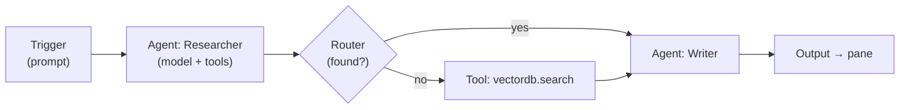

# Module: flow canvas — visual multi-agent orchestration

**Status: Phase 0 + 1 implemented, Phase 2 in progress** (Tool nodes shipped). Module
name `flow`. A node-graph **canvas** — n8n / ComfyUI style — where you drag, drop,
and wire elements to compose **multi-agent orchestrations** that actually run:
trigger → agents → tools → logic → output, executed on the backend with live
per-node streaming on the canvas.

What ships today: the **Orchestration** workflow layout (library · canvas); a
`@xyflow/react` canvas (`packages/core/src/modules/flow/canvas/FlowCanvas.tsx`,
the only file importing the engine) with a draggable node palette, a node
inspector, and a Run button; the spine node types **Prompt trigger**, **Agent**, **Output**, plus **Tool**
(Phase 2); per-flow persistence over `/api/flows`; and the backend **graph
executor** (`backend/modules/flow/executor.py`) that topo-walks the DAG, runs each
node, and streams `flow`-channel telemetry that lights up nodes/edges live. An
**Agent node is one `run_agent_loop`** — the orchestrator loop extracted in Phase 0
(`backend/modules/agent/orchestrator.py`) and shared with the chat turn. A **Tool
node is one manifest tool call**: its picker is populated from `serializeManifest()`
(every pane's `agentTools` + agent commands), and it executes through the **same
permission gate + frontend relay** an agent's tool call uses — so any pane's
capability is draggable onto the canvas with no extra plumbing. The relay handler is
now **always-on** (`initAgentRelay`), shared by chat turns and flow runs. Verified
end to end: a Prompt → Agent → Output flow runs against the local model, and a
Prompt → Tool → Output flow relays a real tool result downstream.

The headline bet: this is **not a new agent runtime**. A flow is a graph *over the
seams that already exist* — the [agent orchestrator](agent-chat.mdx) loop, the
[agent tool surface + permission gate](../architecture/agent-tools.mdx), the
provider layer, the `/ws` socket, and the opaque-blob persistence pattern from the
[workspace store](../architecture/windowing.mdx#persistence). An **Agent node is
one orchestrator turn**; a **Tool node is one gated manifest tool call**. The canvas
is the new part; the execution borrows everything.

## Why it fits the architecture

| Flow needs… | Reuses existing… |
| --- | --- |
| Run an LLM step with tools | the orchestrator tool-calling loop (`run_agent_turn`, refactored reusable) |
| Call one tool deterministically | the frontend tool catalog + `executeTool` relay (`tool-exec.ts`) |
| Gate side effects | the permission engine + approval round-trip (`_gate`) |
| Talk to a model | `providers.chat_stream` (Ollama / LM Studio / vLLM) |
| Persist a flow | the workspace-store pattern (server stores the graph **opaquely**) |
| Stream progress to the UI | the shared `/ws` socket, new `flow` channel |
| Surface in the UI | a registry **Panel** hosted by the dockable workspace |

So the build is mostly: a **canvas panel**, a **node registry**, and a **graph
executor** that schedules nodes and delegates each node's work to machinery that
already runs.

## The elements you drag (node taxonomy)

Nodes resolve against a frontend-owned **node registry** (mirroring how agent tools
are frontend-owned and pushed in the [manifest](../architecture/agent-tools.mdx#capability-manifest-protocol)),
so a plugin can contribute node types with no backend change.

- **Triggers** (entry points): Manual / Run-button, Prompt input, Schedule (cron),
  Webhook, File-change, WS event.
- **Agent node**: model + system prompt + a chosen subset of the live tool catalog +
  a permission mode. Internally one orchestrator turn. Input = context/messages,
  output = final answer + any structured fields it produced. This is the multi-agent
  primitive — wire several, each with its own role/tools/model.
- **Tool node**: a single deterministic call to one existing agent tool or command
  (`files.read`, `terminal.exec`, `vectordb.search`, `open_pane`, `visualizer.*`…).
  No LLM. Goes through the same gate. The inspector renders the tool's JSON-schema
  params as fields, and an **"Upstream output fills"** selector maps the previous
  node's output onto one chosen param (defaulting to a param named `input`, else the
  sole required one, else the first) — so a `files.read` node wires the upstream
  value into `path`, not a stray `input`. The mapped field is shown disabled
  (`← from previous node`); `config.inputArg` carries the choice and the executor
  injects the payload there (`backend/modules/flow/executor.py`).
- **Logic nodes**: **If** ✅ (a `non_empty`/`contains`/`equals` condition on the
  input, with `true`/`false` output handles — the executor activates only the chosen
  handle's edges and **prunes** the untaken branch, emitting `node_skipped` so the
  canvas dims it). Still to come: Router/Switch (N-way), Map / Loop (fan-out a
  subgraph over a list), Merge / Join, Filter, Delay.
- **Transform node**: field mapping via template / JSONPath (n8n's "Set"). **No
  arbitrary code eval in v1** — same stance as the permissions doc's
  [no-sandboxing note](../architecture/agent-tools.mdx#out-of-scope-for-v1).
- **Human-in-the-loop node**: pause and ask the user — reuses the
  `approval_request` / approval UI surface.
- **Data nodes**: vectordb upsert/search, read a pane's `getAgentContext`, write to a
  pane / file / notification.
- **Sub-flow node**: embed another flow as a single node (composition).
- **Output / sink nodes**: render to a pane, write a file, send a notification,
  return to the caller.

## Data model

```ts
interface Flow {
  id: string;
  name: string;
  nodes: FlowNode[];   // { id, type, position:{x,y}, config }
  edges: FlowEdge[];   // { from:{node,port}, to:{node,port} }
}
```

Persisted server-side as an **opaque blob** under `/api/flows` (the backend never
interprets the graph shape — exactly how the workspace store treats layouts). Run
records (per-node I/O, timings) persist alongside, like [chat
sessions](agent-chat.mdx#sessions-persistence), for replay and debugging.

## Execution engine (backend)

`backend/modules/flow/executor.py` — an event-driven graph scheduler:



- **Schedule:** a node fires when all its inputs are satisfied; independent branches
  run in parallel (`asyncio.gather`); a Router prunes the untaken branch; a Map node
  spawns one sub-execution per item. Cycles only via an explicit **Loop** node, so
  the base graph stays a DAG.
- **Per-node delegation:** Agent node → the refactored orchestrator runner; Tool node
  → emit one gated `tool_call` over `/ws` and await the `tool_result`; Logic/Transform
  → pure backend; Trigger → seeds the payload.
- **One tool path, one gate:** every tool/agent action still flows through the
  frontend relay and the permission `_gate`. A flow run carries a permission mode;
  Human-in-the-loop nodes map onto `approval_request`.
- **Live canvas:** the executor streams a new **`flow`** WS channel
  (`node_started`, `node_token`, `node_tool_call`, `node_finished`, `edge_fired`,
  `run_finished`) so nodes glow and edges animate during a run — the n8n execution
  view.

### `flow` channel protocol (sketch)

| Direction | event | data |
| --- | --- | --- |
| client→server | `run` | `{flowId, runId, input?, mode?}` |
| client→server | `stop` | `{runId}` |
| server→client | `node_started` | `{runId, nodeId}` |
| server→client | `node_skipped` | `{runId, nodeId}` — pruned branch |
| server→client | `node_token` | `{runId, nodeId, delta}` (agent nodes) |
| server→client | `node_tool_call` | `{runId, nodeId, name, args}` |
| server→client | `edge_fired` | `{runId, edgeId, from, to}` (taken edges only) |
| server→client | `node_finished` | `{runId, nodeId, ok, output, branch?}` |
| server→client | `run_finished` / `error` | `{runId, …}` |

Tool calls a node makes still ride the **`agent`** channel relay + gate; the `flow`
channel is execution *telemetry* for the canvas.

## Frontend

- **Library:** [`@xyflow/react`](https://reactflow.dev) (React Flow, MIT) — the
  standard React node-graph canvas. **Wrapped in `packages/core`** (one file,
  `canvas/FlowCanvas.tsx`), so the node model stays the API and the engine is
  swappable. It lives in core rather than `packages/ui` because a core module panel
  consumes it and ui already imports core — a ui-hosted wrapper would be a core→ui
  cycle (the `Avatar3D`-in-core precedent).
- **Panels:**
  - `flow.editor` — the canvas, **multi-instance** (a Panel keyed by `flowId` param,
    so you can open several flows at once), `defaultPlacement: center`. With no param
    it loads the active flow (creating a first one if none).
  - `flow.library` — list of saved flows; create/open/delete (left dock, singleton).
  - `flow.runs` — run history + per-node I/O inspector (Phase 2).
- **Node palette:** a draggable sidebar listing the built-in node kinds; drag onto
  the canvas to add. Clicking a node opens an inspector (the trigger's prompt; the
  agent's model + system prompt) with a **Delete node** control; selected nodes also
  delete via Backspace/Delete. Phase 2 adds a richer inspector (tool args, permission
  mode) and derives Tool nodes from the agent manifest.
- **Commands:** `flow.new`, `flow.open`, `flow.openLibrary`. (`flow.run`/`stop` are
  on the canvas toolbar.)

## Build order (phased — "fully working" is incremental)

- **Phase 0 — refactor (no user-visible change).** ✅ Extracted the orchestrator's
  loop from `run_agent_turn` into a reusable `run_agent_loop(conn, messages, tools,
  …, emit) → str` that chat *and* flow Agent nodes share. De-risked everything else.
- **Phase 1 — the spine.** ✅ Module scaffold; `@xyflow/react` wrapped in core; the
  built-in node set; `/api/flows` persistence; three node types — **Trigger(prompt)**,
  **Agent**, **Output(pane)**; a topo-walking executor; the `flow` channel
  highlighting nodes/edges. Verified: drag prompt → agent → output, hit **Run**,
  watch it execute live against the local model.
- **Phase 2 — multi-agent + control flow.** ✅ **Tool node** (manifest-derived,
  gated relay, with upstream→param mapping); ✅ **If node** (conditional branching
  with branch pruning + `node_skipped`). Remaining: Router/Switch (N-way), Map/Loop,
  Merge, Sub-flow; the `flow.runs` history + per-node inspector; typed input/output
  ports.
- **Phase 3 — triggers & polish.** Schedule/Webhook/File-change triggers,
  Human-in-the-loop node, Transform/template node, flow export/import, and the
  meta-move: let the **orchestrator author flows itself** via flow-CRUD agent tools.

## Decisions (settled in Phase 1)

- **Node registry ownership:** the built-in node set is frontend-owned; Phase 2's
  Tool nodes derive from the agent capability manifest (`serializeManifest`), keeping
  the plugin-extensibility story (matches the tool manifest).
- **Transform safety:** templates/JSONPath only; no arbitrary JS eval (no sandbox —
  consistent with the permissions doc).
- **Loops/cycles:** the executor is a DAG (topo sort raises on a cycle); explicit
  Loop nodes come in Phase 2.
- **Where execution runs:** the **backend** (consistent with "backend is the brain");
  the frontend renders the canvas and relays tool calls, nothing more.

## Contributions to the layout shell

- **Panels:** `flow.editor` (center, multi-instance), `flow.library` (left,
  singleton). `flow.runs` is Phase 2.
- **Commands:** `flow.new`, `flow.open`, `flow.openLibrary`. (Run/stop live on the
  canvas toolbar; agent flow-CRUD tools are Phase 3.)
- **Layout preset:** an **Orchestration** workflow layout (library · canvas) on the
  shell rail.

## Backend surface

`backend/modules/flow/` — `/api/flows` CRUD (opaque graph blobs; per-run records are
Phase 2), `executor.py` (the topo-walking scheduler), and the `flow` `/ws` channel
for execution telemetry (`node_started`/`node_token`/`node_finished`/`edge_fired`/
`run_finished`/`error`).
Tool/agent work is delegated, not reimplemented: Agent nodes call the shared
`AgentRunner`; Tool nodes ride the existing `agent`-channel relay and permission
gate. Pydantic models for the flow/run/event schema.

## Browser vs desktop

Identical — a flow runs on the backend and streams over the shared socket, like the
agent. Desktop adds the usual ergonomics: run-complete OS notifications, a global
shortcut to trigger a flow, and (later) Schedule triggers surviving in the tray.
