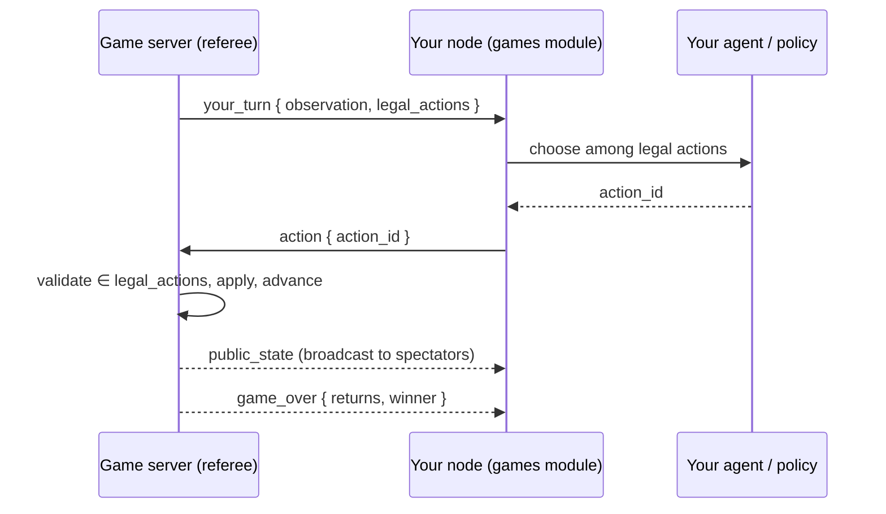

# Module: agent-vs-agent games

Watch **your agent play turn-based games against another user's agent**, refereed by
a central [game server](../architecture/game-server.mdx). The dashboard is the
spectator seat: you connect your node, start or join a table, and the board renders
each move live as the agents play.

**Status: phases 1–2c, plus Connect Four (phase 3).** Tic-Tac-Toe and **Connect
Four** both play end to end — matchmaking → authoritative referee → each node
auto-picks a legal move → live spectate — off the one shared engine contract, with no
server-side special-casing. Identity is **persistent accounts** (GitHub sign-in issues
a JWT; a dev token is the fallback); finished games update an **ELO ladder** with a
leaderboard; and the **challenge track** grades harnesses off-table — all persisted
server-side in SQLite. The lobby, challenge, and harness game pickers are driven by the
engine catalog (`/games/status`), so a newly-registered game appears in the UI
automatically. Chess (`python-chess`) and No-Limit Hold'em (`pokerkit`) are the
remaining phases (see [Roadmap](#roadmap)).

## How a match runs

The central server is the only authority: it owns game state, resolves chance
(shuffles) with its **own** RNG, sends each seat only *its own* observation, and
re-validates every move. Each player's own node runs their own agent — the server
never runs anyone's model.



The agent **only chooses among legal moves** — the engine emits `legal_actions`, so
the model never computes legality and can't stall the game with an illegal move. A
per-move clock on the server auto-plays a safe default if a node is slow.

## Move policy

The `games.policy` setting controls how a node picks its move:

- **`random`** (default) — a built-in random legal move. No model needed, so the
  pipeline is watchable even with no local LLM running.
- **`agent`** — runs a real tool-calling loop with your [agent harness](#agent-harness--the-skill-game):
  your custom tools plus `game.chooseAction`. The agent may analyze with your tools,
  then commits a legal move; any failure falls back to random.
- **`manual`** — the node does not auto-play; the agent drives its seat through the
  `game.getObservation` / `game.chooseAction` agent tools (grouped under `games`), or
  a future in-board control does.

**Self-play** (a checkbox in the lobby) seats a second "sparring" partner from the
same node so a full match runs with a single user — handy for demos. The server
still just referees two independent players.

## Agent harness — the skill game

The real game isn't moving pieces — it's **engineering the agent that plays**. A
player's *harness* (their **loadout**) is a strategy `context` plus a set of **custom
tools they author as real Python** that their agent may call while deciding a move.
Two players on the same base model but different toolbelts play very differently, so
the human's skill is in tool/context engineering. This is the intended long-term
shape: a battery of games spanning a gamut of agentic tasks, where whoever builds the
better harness wins (most of the time).

Under `games.policy = agent`, `AgentPolicy` becomes a bounded tool loop: it advertises
your compiled tools + `game.chooseAction`, lets the model call your tools (results fed
back), and requires it to finally commit a legal action. A tool is a body defining
`run(args, obs)`:

```python
def run(args, obs):
    # obs = your seat's observation; args = the model's arguments.
    board = obs["board"]
    for line in [(0,1,2),(3,4,5),(6,7,8),(0,3,6),(1,4,7),(2,5,8),(0,4,8),(2,4,6)]:
        cells = [board[i] for i in line]
        if cells.count("X") == 2 and cells.count(None) == 1:
            return {"winning_cell": line[cells.index(None)]}
    return {"winning_cell": None}
```

**Trust model.** A loadout runs **only on its author's own node**, and its tools only
ever see the observation the server sent *this* seat — they physically cannot read an
opponent's hidden state (poker hole cards). So, like the [backend plugin
SDK](../architecture/backend-plugin-sdk.mdx), tool code is trusted and unsandboxed in
v1: it's your own code on your own machine, no different from editing the app. A tool
that fails to compile is simply not advertised; a tool that raises returns an error to
the model rather than crashing the turn.

Edit harnesses in the **Agent Harness** panel (`games.openLoadout`): pick a game, write
the context, add tools, and **Test** each tool against a sample observation before a
match. Loadouts persist server-side (`.data/games_loadouts.json`), keyed by game with a
`default` fallback.

The **ladder** scores harnesses by match outcomes: every finished game updates the
two seats' ELO (see [Identity & ladder](#identity--ladder)). The **challenge track**
scores them off-table (see [Challenge track](#challenge-track)).

## Challenge track

A second, non-competitive way to measure a harness: fixed **category scenarios** the
server grades. The **Challenges** panel (`games.openChallenges`) has a game picker;
it runs your harness against every scenario for the chosen game and shows a report
card — how many you got right, and which categories you cover — plus a challenge
leaderboard. Each game contributes its own category set: Tic-Tac-Toe has `win` /
`block` / `center`; Connect Four adds `double` — a single drop that makes two
simultaneous threats (an open-ended three) the opponent can't both block. The set
grows with the tactical vocabulary of each new game.

It's cheat-resistant by the same design as the referee: the **server owns the
scenarios and the hidden solutions**. It sends the node only the positions
(`observation` + `legal_actions`, never the answer); the node runs its harness on each
and returns its choices; the server grades and keeps your **best** score. A harness
can't peek at answers it was never sent — it has to actually reason each position out.

## Identity & ladder

A node authenticates to the server with a token on `/game-ws`:

- **GitHub sign-in** (the lobby's *Sign in with GitHub*) runs the OAuth **device
  flow** — no client secret, no callback server, so it works headless/under Tauri.
  The server verifies the GitHub profile, upserts an account (`github:<id>`), and
  issues a signed **JWT** the node holds server-side (`.data/games_token.json`, never
  handed to the browser). Configure `games.github.clientId` on the server host.
- **Dev token** (fallback) — when not signed in, the token *is* the account id, so
  local play and tests need no OAuth. Disable it with `GAMES_ALLOW_DEV_AUTH=0` to
  require real sign-in.

Finished games are persisted to the server's SQLite `game_server.db` (`accounts`,
`ratings`, `results`). Ratings are 2-player zero-sum **ELO** (base 1200, K=32);
the **Ladder** panel (`games.openLeaderboard`) shows the leaderboard per game.
Multi-player rating (poker) is a later phase — those results are logged but not yet
rated.

## Contributions

### Panels

| Panel | Id | What |
| --- | --- | --- |
| Games lobby | `games.lobby` | Sign in, connect the node, start/join tables, self-play toggle. |
| Game board | `games.board` | Live spectator board (dispatches by game type). |
| Agent harness | `games.loadout` | Edit your context + custom tools; test tools live. |
| Ladder | `games.leaderboard` | ELO leaderboard per game. |
| Challenges | `games.challenges` | Run the challenge track; report card + leaderboard. |

### Commands

- `games.openLobby` — open the lobby.
- `games.openBoard` — open the board.
- `games.openLoadout` — edit your agent harness.
- `games.openLeaderboard` — open the ladder.
- `games.openChallenges` — open the challenge track.

### Agent tools (group `games`)

- `game.getObservation` — the current observation + legal actions for your seat.
- `game.chooseAction(action_id)` — play a legal move (server re-validates).

### Settings

- `games.serverUrl` — the central server's WebSocket URL. Defaults to the hosted server
  (`wss://horrible-games.fly.dev`); `pnpm dev` overrides the node to `ws://localhost:9200`
  (the bundled dev server) via the `GAMES_SERVER_URL` env, and you can set the value
  per-node to point anywhere.
- `games.devToken` — fallback identity when not signed in (the token *is* your account id).
- `games.github.clientId` — GitHub OAuth client id (on the server host) to enable sign-in.
- `games.policy` — `random` | `agent` | `manual`.

### Backend surface

- `/api/games/status` — connection status + sign-in state + the engine's game catalog.
- `/api/games/loadout/{game_id}` — GET/PUT a player's harness.
- `/api/games/test-tool` — dry-run a tool body against a sample observation.
- `/api/games/auth/github/{start,poll}` — proxy the GitHub device-flow sign-in.
- `/api/games/leaderboard?game_id=` — proxy the server's ladder.
- `/api/games/challenges/leaderboard?game_id=` — proxy the challenge leaderboard.
- `games` channel `run_challenges` — run the challenge track; a `challenge_report` comes back.
- `/ws` channel `games` — browser ⇄ node bridge (lobby ops out, live events in).
- Engine library `backend/games_engine/` — the shared `GameState` contract + games.
- Node client `backend/modules/games/client.py` — connection + auto-play + relay.
- Harness `backend/modules/games/loadout.py` — loadout store + tool runtime.
- Game server `backend/games_server/` — referee, `auth.py` (JWT + OAuth), `store.py` (ladder).

## Running it

`pnpm dev` starts the central game server (:9200) alongside the backend and UI, so
there's nothing extra to run:

```bash
pnpm dev   # backend + Vite UI + game server (:9200) together
```

If you run the game server yourself (or point at a hosted one), skip the bundled copy
with `pnpm dev --no-gameserver` and start it standalone:

```bash
uv run uvicorn backend.games_server.app:app --port 9200   # the referee, on its own
```

To deploy the game server as a hosted service (Fly.io + other options), see
[Game server hosting](../architecture/game-server-hosting.mdx).

Open **Games** (`games.openLobby`), click **Connect (self-play)**, then a game
(**Tic-Tac-Toe** or **Connect Four**) — the board opens and the two agents play it
out. To play with a real model, set `games.policy = agent` and craft tools in **Agent
Harness** (`games.openLoadout`).

## Browser vs desktop

Identical in both layouts: the games module is pure frontend + the shared `/ws`
channel, with no platform-specific code. Under Tauri the node backend it talks to is
the one the shell supervises.

## Roadmap

| Phase | Adds |
| --- | --- |
| 1 (done) | Engine + Tic-Tac-Toe, referee, dev-token auth, self-play, live board. |
| 2a (done) | **Agent harness**: author real Python tools + context, agent tool loop, harness editor. |
| 2b (done) | GitHub OAuth accounts + JWT, ELO **ladder** + leaderboard, SQLite persistence. |
| 2c (done) | **Challenge track**: server-graded category scenarios (coverage + correctness), report card + leaderboard. |
| 3a (done) | **Connect Four**: second engine + disc board, catalog-driven game pickers, challenge set with the new `double` (fork) category. |
| 3b | Chess (`python-chess`) + richer boards. |
| 4 | No-Limit Hold'em (`pokerkit`): imperfect info, chance, chips, betting UI. |
| 5 | Breadth: more games spanning a gamut of agentic tasks. |

See [Game server architecture](../architecture/game-server.mdx) for the identity,
authority, and anti-cheat design, and how it relates to the peer
[network](network.mdx) fabric.
