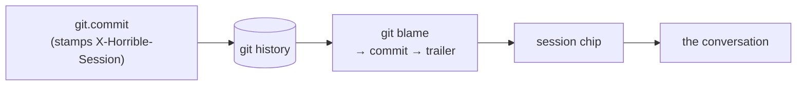

# Git provenance

The `git` module answers a question ordinary git can't: **which agent conversation
wrote this line?** Not blame-by-author — **provenance**: line → commit → the chat
session that produced it. It's the agentic-native git view, and it closes the
code-intelligence arc (Slices 1–2: index, locus bus, semantic search).

## The provenance loop

The wedge is **`git.commit`**: when the agent commits, the backend resolves the active
chat session (`backend/modules/chat` store) and appends trailers
`X-Horrible-Session: <id>` and `X-Horrible-Session-Title: <title>` to the message.
`blame` then reads those trailers back per line, and the pane turns them into a
**session chip** that opens the conversation. No active session ⇒ a plain (human)
commit, no trailer.

Provenance is **session-granular** for now (which conversation); turn-level is a
follow-up. The commit tool is **gated** (`sideEffect`) — the agent commits only when
you ask.

## Contributions

### Panel

| Panel | Id | Role | What |
| --- | --- | --- | --- |
| Provenance | `git.provenance` | singleton, right | **Blame** (follows the code locus; per-line author + session chip → conversation; click a line to jump) and **History** (recent commits, agent-authored flagged, diff on select). |

### Backend routes (`/api/git`)

| Route | What |
| --- | --- |
| `GET /blame?path=` | Per-line blame, each line tagged with its commit's session (provenance). |
| `GET /log?limit=` | Recent commits; a session trailer ⇒ agent-authored. |
| `GET /show?sha=` | A commit's metadata + unified diff. |
| `POST /commit` | Stage + commit, stamping the active session as provenance trailers. |

Runs `git` as a subprocess (like [file-explorer](file-explorer.mdx)'s status); paths
resolve inside a workspace root (`_resolve`/`_roots`), so the same traversal boundary
applies.

### Agent tools (on `git.provenance`)

| Tool | What |
| --- | --- |
| `git.blame` | Per-line authorship + provenance for a file. |
| `git.log` | Recent commits; session id marks agent-authored. |
| `git.commit` | Stage + commit with a provenance trailer (**writes** — gated). |

### `dash.git`

Backend-local facade: `dash.git.blame(path)`, `dash.git.log()`, `dash.git.commit(msg)`.
See [python-sdk](../architecture/python-sdk.mdx).

### Commands

- `git.openProvenance` — open the Provenance pane.

## Opening the conversation

A session chip calls `openChatSession(id)` — a small public helper on the agent module
(`setActiveSession` + open the chat pane, buffered so it works whether the chat is
already mounted or not). The git pane never reaches into the ChatWidget's internals.

## Browser vs desktop

Identical in both layouts; reaches the backend through the same relative `/api`.

## Not yet

- Turn-level (vs session-level) provenance; a gutter heat overlay in the editor.
- Staging/hunk UI — this is a provenance + review surface, not a full source-control UI.
