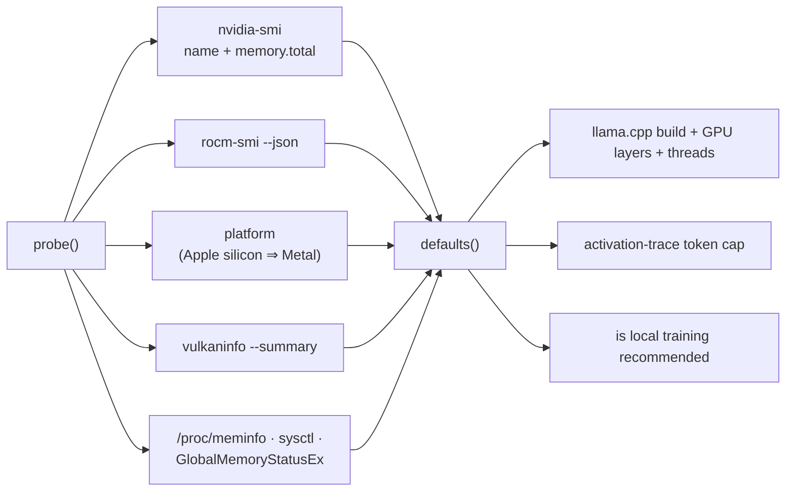

# Hardware

**Status: implemented.** One capability probe, run once per process, deciding the
defaults every heavy surface used to guess at on its own.

Before it, each of those surfaces picked independently and picked the same thing:
`llama-server` spawned with `--n-gpu-layers 0`, `install_server` defaulted to the
`cpu` variant, the tracer capped tokens at a number chosen for a laptop. That is
correct on a machine with no GPU and silently leaves an order of magnitude on the
floor on a machine with one — and nothing in the UI explained why.

- **Backend:** `backend/modules/hardware/` (`probe.py`, `routes.py`, `models.py`)
- **Frontend:** `packages/core/src/modules/hardware/` — no pane; a settings
  section plus three overrides
- **Route:** `GET /api/hardware`, `POST /api/hardware/refresh`

## Three states, not two

The rule the module exists to enforce:

> **Never assume a GPU. Never hide one that exists. Never render "we could not
> ask" as "there is none".**

The third clause is the one that is easy to lose. `nvidia-smi` missing from
`PATH` produces exactly the same empty accelerator list as a machine with no
NVIDIA card, and they are not the same fact. So the probe reports:

| State           | Shape                                | Rendered as                       |
| --------------- | ------------------------------------ | --------------------------------- |
| found it        | `accelerators` non-empty             | the device, its memory, its source |
| looked, nothing | empty + `certain: true`              | "None. This machine runs on the CPU." |
| could not ask   | empty + `certain: false` + a `note`  | "Unknown — the probe could not ask" |

`Profile.certain` is that distinction, and `notes` carries the reason. The
derived defaults are the CPU ones in both of the last two rows — that part is
identical — but the explanation is not, and the explanation is what turns a
puzzling default into a settings change.

## What it probes

Each detector returns accelerators *and* gaps, and never raises. Every tool call
goes through `subprocess.run` with a six-second timeout — **synchronously**,
because asyncio subprocess spawning is broken under `uvicorn --reload` on Windows
(`SelectorEventLoop`), the same reason the LSP and PTY spawns use `Popen` on a
thread. Callers reach the probe through `asyncio.to_thread`.

The result is cached process-wide: the answer does not change while the process
runs, and a `vulkaninfo` in the hot path of every model list would be absurd.
`POST /api/hardware/refresh` re-runs it, which is also how a settings override
takes effect.

### Unified memory is not VRAM

On Apple silicon the GPU's memory *is* the machine's RAM, shared with the CPU.
Reporting it as VRAM would make a 16 GB Mac look like it has a 16 GB card, so it
is reported with `unified: true` and `exact: false`. It still gets full offload —
`gpu_layers: 999` — because on unified memory a layer costs no extra copy.

There is also no `metal` variant to download: upstream's macOS `llama-server`
builds carry Metal already, so the derived `llamaVariant` there is `cpu` with a
reason string saying exactly that.

### Vulkan is de-duplicated and memory-less

`vulkaninfo --summary` reports a device name and no heap size. A device is
recorded with `vramMb: null`, and null memory means **no offload** — offloading
without knowing how much fits is a guess, and the failure mode is an OOM
mid-load. And when a CUDA or ROCm card was already found, the Vulkan entry for
the same physical device is dropped rather than double-counted.

## The derived defaults

`defaults()` turns a profile into the numbers the rest of the app reads, and
every one of them carries a **reason string**. That is not decoration: it is the
only thing that explains a CPU build chosen on a machine whose owner knows they
have a card.

| Default          | Rule                                                                       |
| ---------------- | -------------------------------------------------------------------------- |
| `llamaVariant`   | the device **and the OS** (see below); `cpu` when unknown                    |
| `gpuLayers`      | all, unless VRAM is unknown or below 3500 MB — then 0                        |
| `threads`        | logical CPUs minus one, capped at 16 (leave a core for the app)              |
| `traceTokenCap`  | 64 / 128 / 256 / 512 by **RAM** — the tracer runs on the CPU wheel           |
| `localTraining`  | recommended only at 6 GB+ of accelerator memory                              |

### `gpuLayers` is 0-or-999, and it stays that way

It looks like the place a fractional offload belongs, and it is not. Every caller
of `defaults()` depends on that number meaning "all of it" or "none of it", so
teaching it to return 9 would change what an unrelated caller receives without
changing a single line at that caller.

Fractional budgeting lives one layer up, in `llamacpp/offload.py:layer_plan` and
`llamacpp/speculative.py:spec_plan`, where the question is different: not "does
this machine have a card?" but "do *these two models plus their KV caches* fit in
*this* card at *this* context length?". `spec_plan` — which places a target and a
draft model together — is a good illustration of why it cannot live here:

- it takes headroom as a **caller-supplied parameter**, honouring `layer_plan`'s
  contract of reporting weights and KV only rather than inventing a compute-buffer
  fudge factor, and
- it returns **`None` with a reason** when `layerBytes` is incomplete, because a
  guessed split that OOMs on load is worse than a refusal that says why.

So the probe answers "is there a usable accelerator, and how much memory does it
report", and the byte arithmetic asks it questions. See
[llama.cpp](llamacpp.mdx#speculative-decoding).

`localTraining` never *blocks* a run. It decides what the app recommends; Kaggle
and Colab push exist precisely because most machines are under that line.

### The variant depends on the OS, not only the card

`_variant_for` maps an accelerator **plus the OS** to a build, because upstream
does not publish the same variants everywhere:

| Card   | Windows | Linux                        | macOS                       |
| ------ | ------- | ---------------------------- | --------------------------- |
| NVIDIA | `cuda`  | `vulkan` — **no Linux CUDA asset exists** | —              |
| AMD    | `hip`   | `hip`                        | —                           |
| Apple  | —       | —                            | `cpu` (macOS builds carry Metal) |

The NVIDIA-on-Linux row is the one that bites. CUDA is Windows-only in the release
artifacts; Linux users are expected to build it, or run the Vulkan build, which
works on NVIDIA. Asking for `cuda` there does not get a suboptimal build — it gets
*no build*, and an error that reads like upstream's fault. The failure only became
reachable when `POST /api/llamacpp/install` moved from a flat `cpu` default to
`auto`, which is precisely what a probe that knows about hardware but not about
what upstream ships would get wrong.

`backend/tests/test_llamacpp.py::test_upstream_publishes_no_linux_cuda_build`
pins the upstream fact, so the special case gets deleted on a failing test rather
than on a hunch.

## Consumers

- **`POST /api/llamacpp/install`** — `variant` defaults to `"auto"`, resolved
  here. It was a flat `"cpu"`.
- **`POST /api/llamacpp/start`** — `gpuLayers` and `threads` are now nullable, and
  `None` means "ask the probe". They are `is None` checks and not falsiness
  checks: an explicit `0` is a request for pure CPU and must survive.
- **`POST /api/llamacpp/trace`** — `tokenCap` likewise.

## Overriding it

Three settings, rendered next to the reading:

| Key                       | Meaning                                                   |
| ------------------------- | --------------------------------------------------------- |
| `hardware.accelerator`    | `auto` \| `none` \| `cuda` \| `rocm` \| `metal` \| `vulkan` |
| `hardware.vramMb`         | memory of the overridden device; `0` leaves it unknown      |
| `hardware.localTraining`  | `auto` \| `on` \| `off`                                     |

An override exists because the user sometimes knows more than the probe does —
vendor tools are not always installed, and a container can hide a card. But an
override **replaces the accelerator list and stamps `overridden: true`**, with
`exact: false` and `detectedBy: "override"`, so nothing downstream can present a
user's assertion as a measurement. Overrides take effect on the next probe;
"Re-probe" in the settings section is the button.

## Tests

`backend/tests/test_hardware_probe.py`. The load-bearing one is
`test_missing_nvidia_smi_is_not_no_gpu` — every other failure in this module is
loud, and that one is the silent kind.
